# Діаграми — Урок 24: Структури Даних — Список як Архітектурне Рішення

---

## 1. Архітектура пам'яті: Масив проти Зв'язного Списку

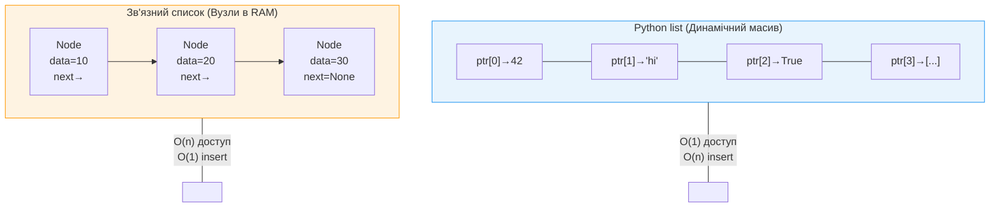

**Де використовується:**
- Масив: читання даних, довільний доступ, ітерація, binary search
- Зв'язний список: часті вставки/видалення на початку, черги, undo-стеки

---

## 2. Алгоритм: Вставка у Зв'язний Список (O(1))

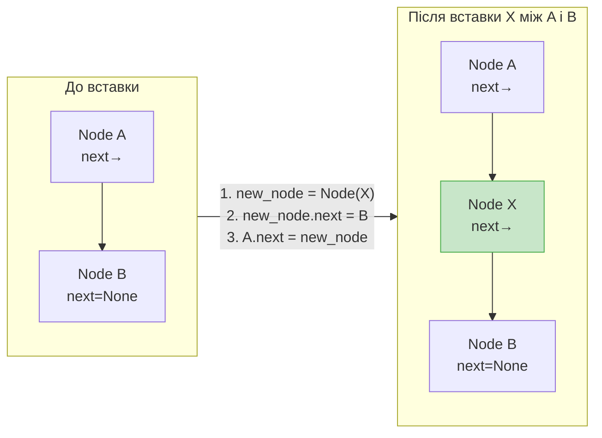

**Де використовується:**
- Планувальники задач (вставка з пріоритетом)
- Текстові редактори (вставка символів у середину)
- Операційні системи (управління процесами)

---

## 3. Алгоритм: Видалення з Зв'язного Списку (O(1) при наявності вказівника)

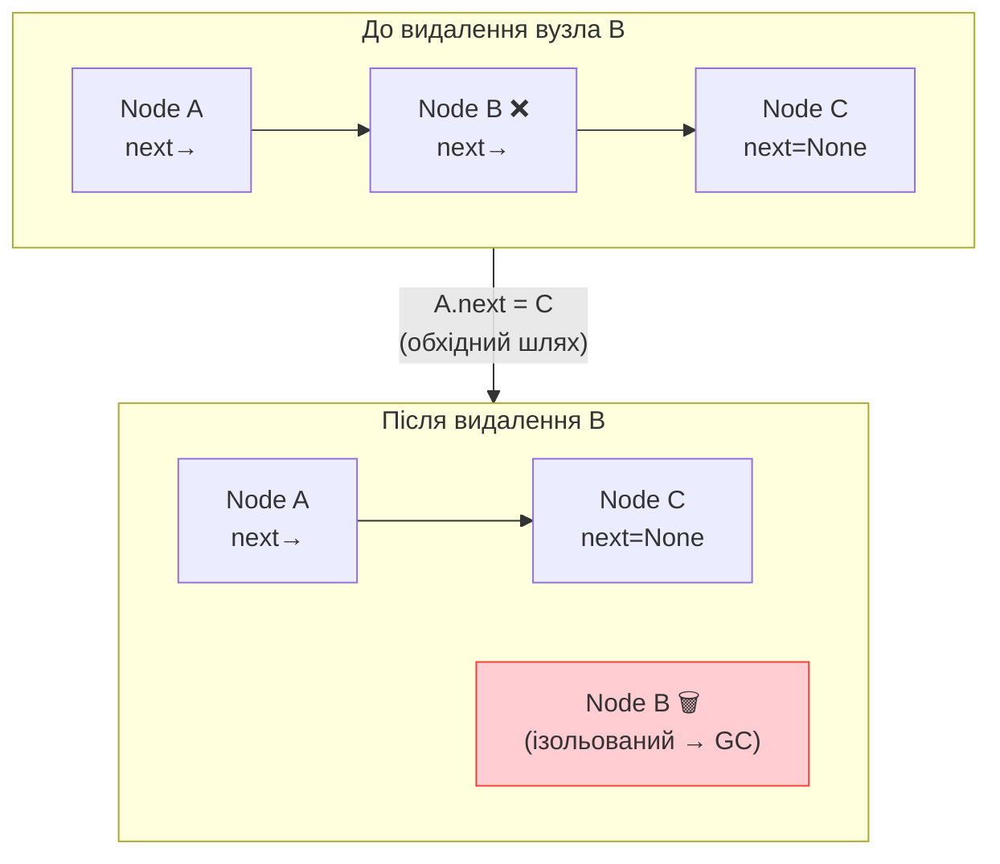

**Де використовується:**
- LRU-кеш (видалення найстарішого елемента)
- Doubly linked list (O(1) без пошуку попередника)
- Черга принтера (скасування завдання)

---

## 4. ADT: Контракт проти Реалізації

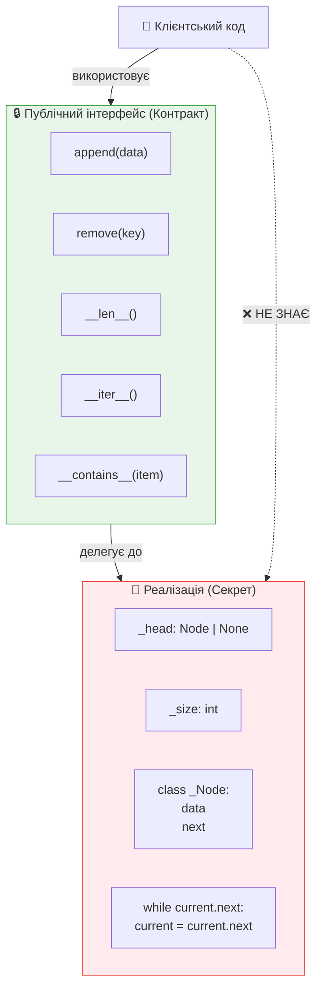

**Принцип:** Змінити реалізацію (масив → дерево → хеш) — клієнтський код не зламається.

---

## 5. Паттерн Ітератор: Механізм `yield`

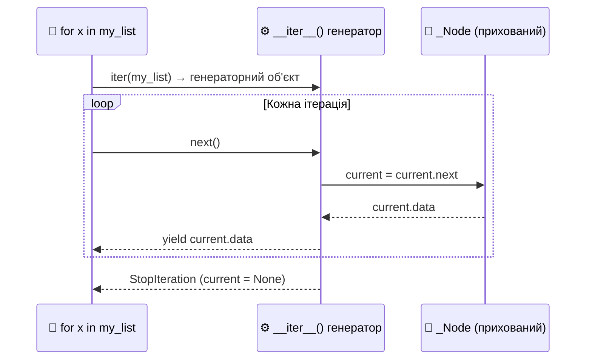

**Де використовується:**
- Обхід будь-якої кастомної структури даних
- Lazy evaluation (генерація елементів по одному)
- Паттерн Observer, pipeline-обробка даних

---

## 6. Node-based Stack: Алгоритм Push/Pop (LIFO)

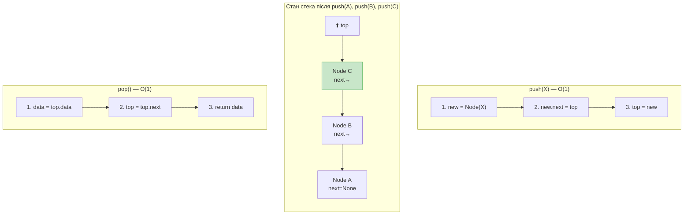

**Де використовується:** рекурсія, DFS, undo/redo, перевірка дужок, call stack

---

## 7. Node-based Queue: Алгоритм Enqueue/Dequeue (FIFO)

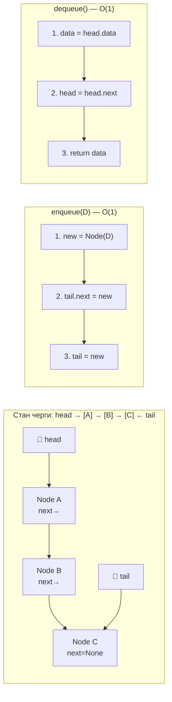

**Де використовується:** HTTP request queue, BFS, принтер, планувальник ОС, Celery tasks

---

## 8. Doubly Linked List: Архітектура з Sentinel-вузлами

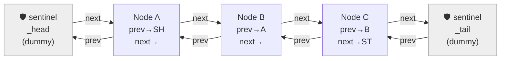

**Sentinel (dummy) усуває граничні випадки:**
- Порожній список: `SH.next = ST`, `ST.prev = SH`
- Вставка/видалення: завжди однаковий код, без `if head is None`

---

## 9. Складність Операцій: Повна Таблиця

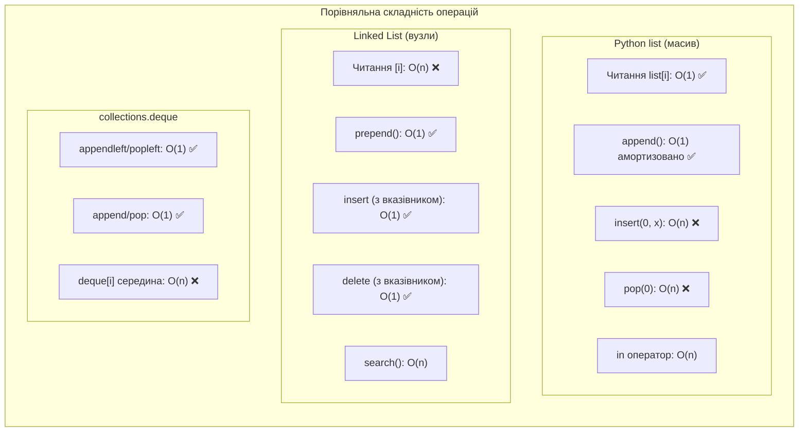

---

## 10. Паттерни ООП у Структурах Даних

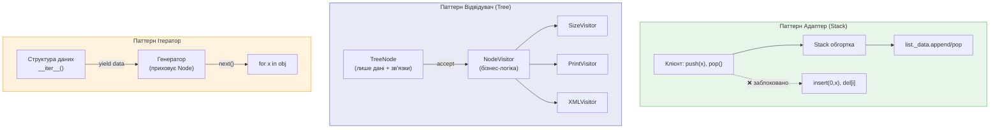

---

## 11. Де Застосовуються Зв'язні Списки: Реальні Приклади

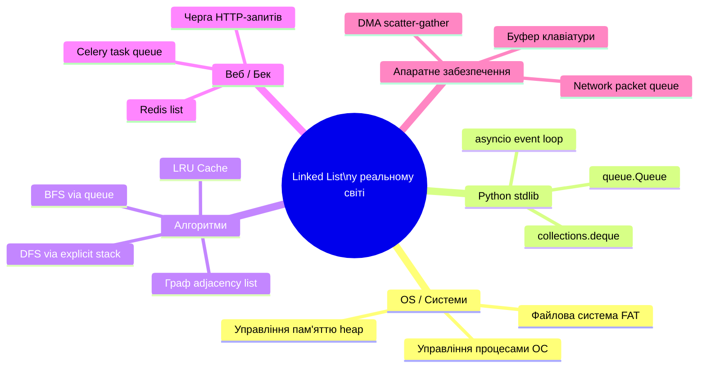

---

## 12. Еволюція Структур: Від Лінійних до Ієрархічних

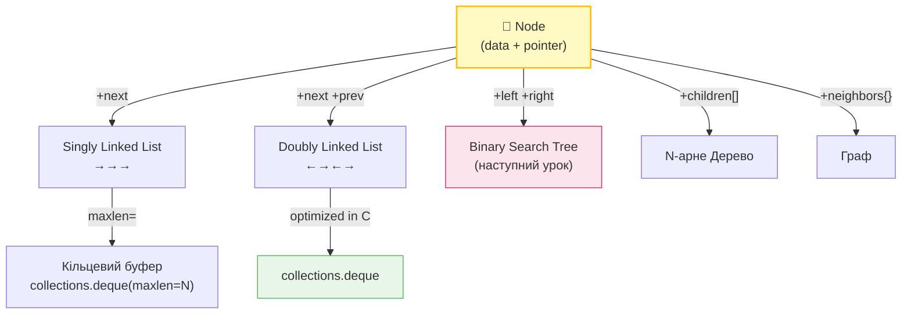

**Головний інсайт:** Розуміння Node → розуміння будь-якої нелінійної структури даних.
Дерева, графи, хеш-таблиці з chaining — всі побудовані на тому самому принципі вузлів і вказівників.

---

*Урок 24 · Module 3 · Python Advanced · Viktor Nikoriak*
