# Діаграми — Урок 27: Алгоритми сортування

---

## 1. Bubble Sort — «бульбашки» спливають вгору

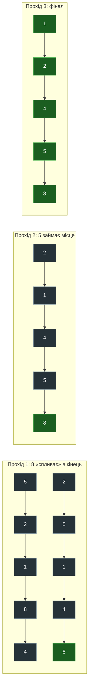

**Головна проблема:** кожен swap = 3 операції запису в пам'ять (через Python tuple unpacking). Для $n=10^4$ до $10^8$ swap → **несумісно з продакшеном**.

---

## 2. Selection Sort — завжди рівно n-1 swap

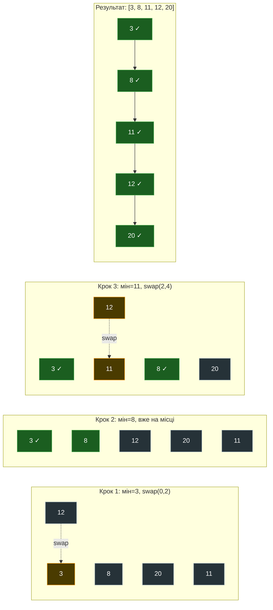

**Переваги:** Мінімум swap — рівно $n-1$ незалежно від вхідних даних. Корисно коли операція **swap дорога** (наприклад, запис великих об'єктів на диск).

---

## 3. Insertion Sort — вставка «картки в руці»

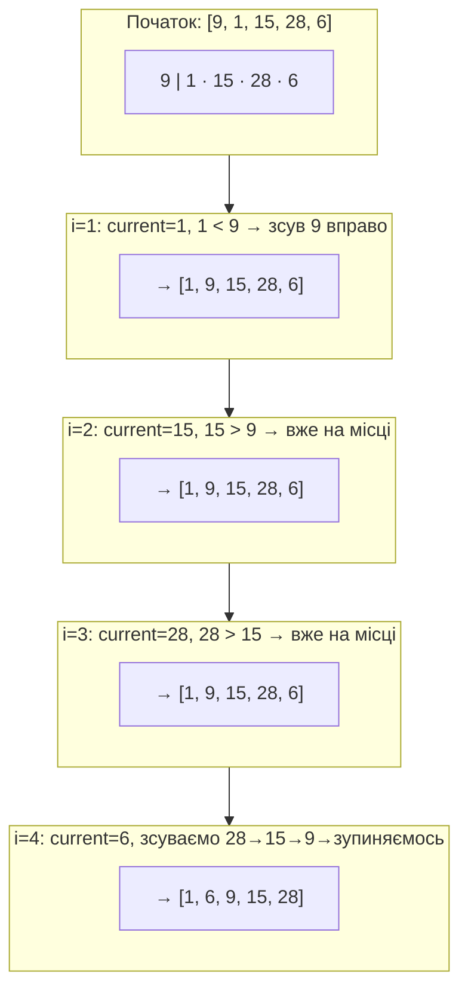

**Головна перевага:** `while` loop переривається миттєво на відсортованих ділянках → $O(n)$ для майже відсортованих даних. Саме тому Timsort використовує його для малих run'ів.

---

## 4. Merge Sort — дерево рекурсії

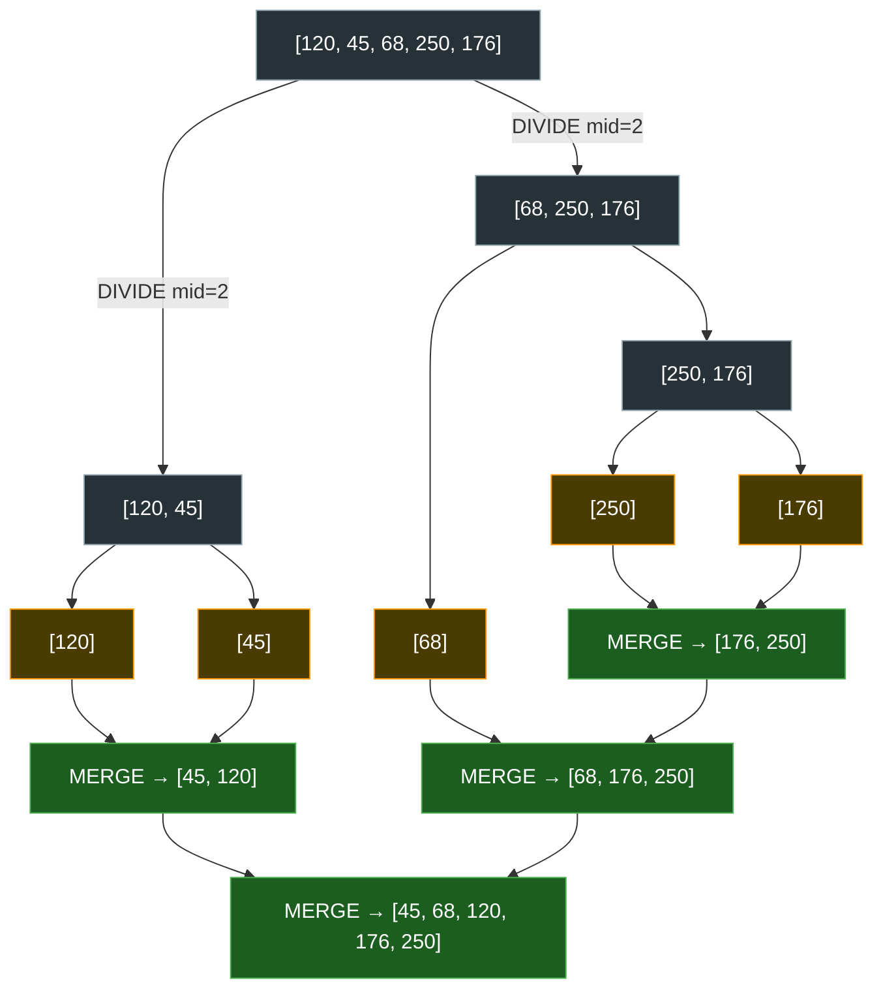

**Складність:** $\log_2 n$ рівнів × $O(n)$ на злиття кожного рівня = $O(n \log n)$.  
**Проблема:** Кожен `MERGE` виділяє новий масив → $O(n)$ пам'яті → cache pressure.

---

## 5. Heap Sort — Max-Heap у плоскому масиві

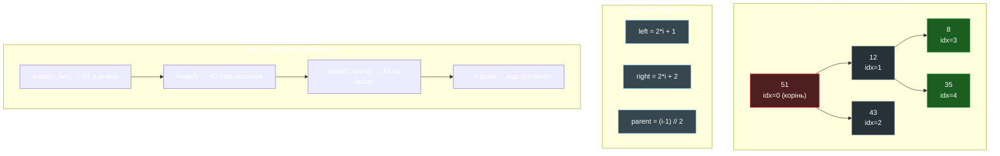

**Чому повільніше Quicksort:** індекси `2i+1` і `2i+2` — це **стрибки** по масиву. Для великих $n$ ці стрибки виходять за межі L1/L2 cache → cache miss → звернення до RAM → 100+ нс затримка.

---

## 6. Quick Sort — партиція та рекурсія

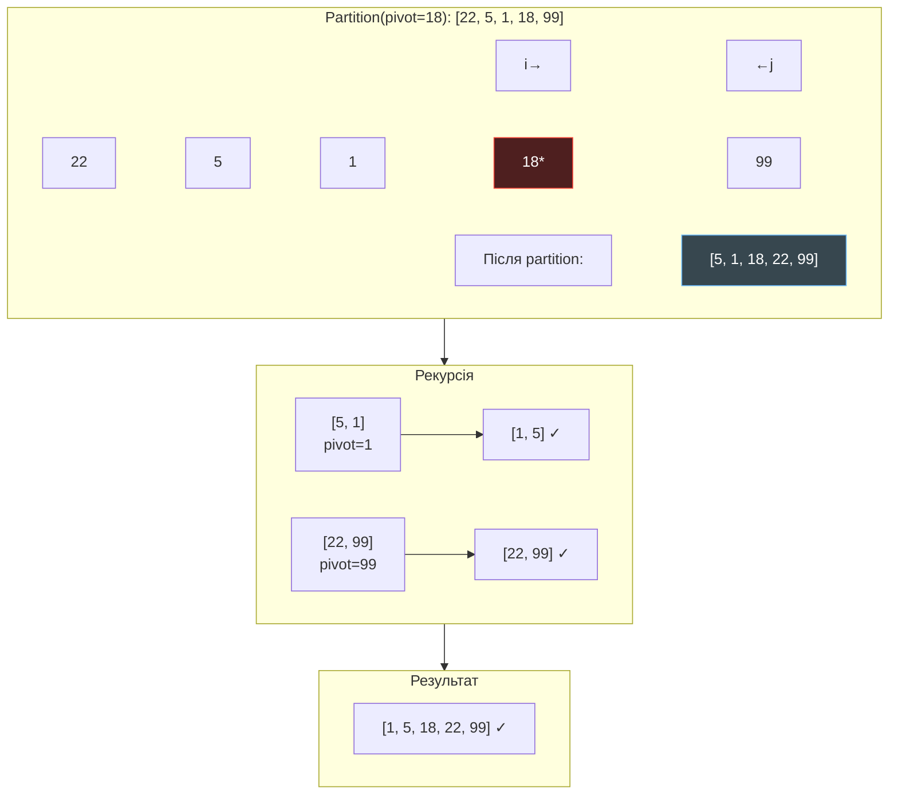

**Чому найшвидший:** партиція сканує масив **лінійно** двома вказівниками → CPU cache line 64 байти = 16 int32 завантажується за 1 RAM-запит, наступні 15 операцій — безкоштовно з кешу!

---

## 7. Timsort — гібридна архітектура

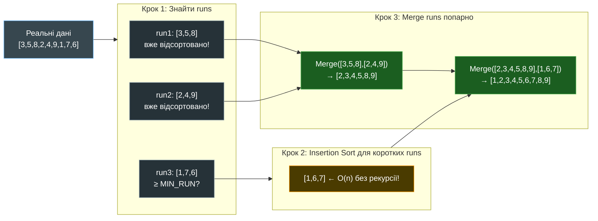

**Стабільний + O(n) для реальних даних** = ідеальний вибір для мови загального призначення.

---

## 8. Ієрархія пам'яті та Cache Locality

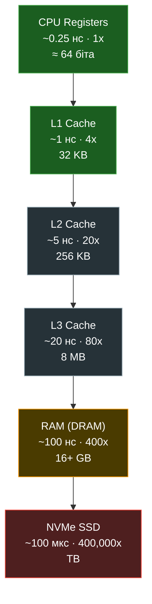

**Висновок:** Алгоритм, що читає **послідовно** (Quicksort partition, Insertion Sort) — майже завжди в L1/L2 кеші. Алгоритм, що «стрибає» (Heap Sort, деякі Merge операції) — постійні cache miss → звернення до RAM → 400x повільніше!

---

## 9. Порівняння Big-O: кількість кроків при різних n

```mermaid
xychart-beta
    title "Кроки алгоритмів залежно від n (логарифмічна шкала)"
    x-axis ["n=10", "n=100", "n=1000", "n=10000"]
    y-axis "Кроки (відносні)" 0 --> 100000000
    bar [100, 10000, 1000000, 100000000]
    bar [33, 664, 9966, 132877]
    bar [10, 100, 1000, 10000]
```

| n | $O(n^2)$ | $O(n \log n)$ | $O(n)$ |
|---|---------|--------------|--------|
| 100 | 10,000 | 664 | 100 |
| 1,000 | 1,000,000 | 9,966 | 1,000 |
| 10,000 | 100,000,000 | 132,877 | 10,000 |
| 1,000,000 | 10¹² | 19,931,568 | 1,000,000 |

При $n=10^6$: $O(n^2)$ = **10¹² операцій** ≈ **кілька днів**. $O(n \log n)$ ≈ **частки секунди**.

---

## 10. Алгоритм вибору сортування

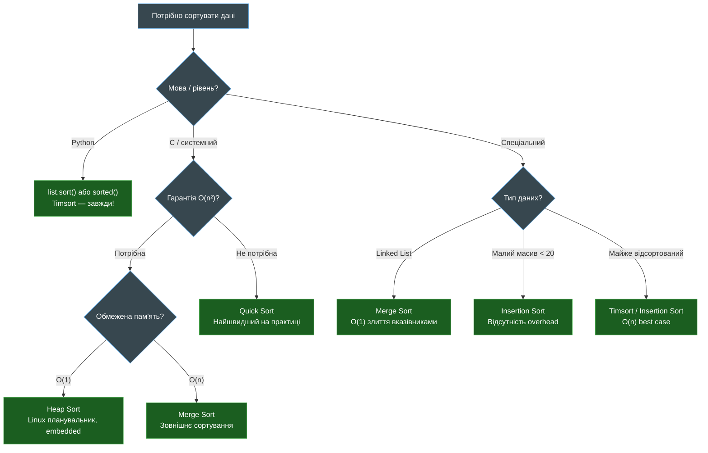

---

## 11. Стабільність vs Нестабільність: практичний вплив

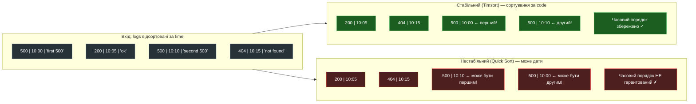

**Правило:** Якщо ви сортуєте об'єкти за **кількома ключами послідовно** — завжди використовуйте стабільний алгоритм або `key=` з tuple.
