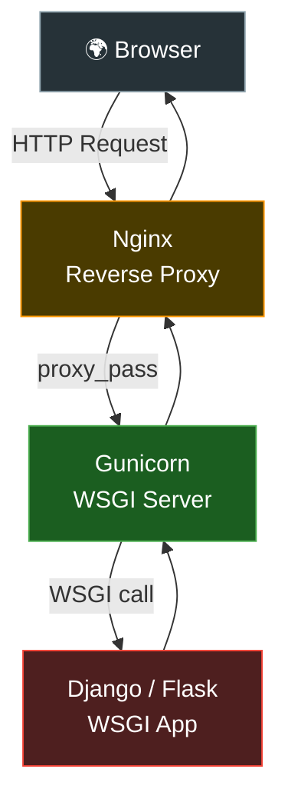
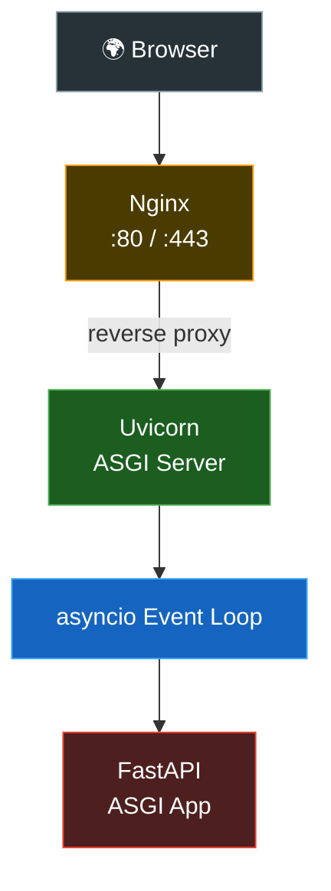
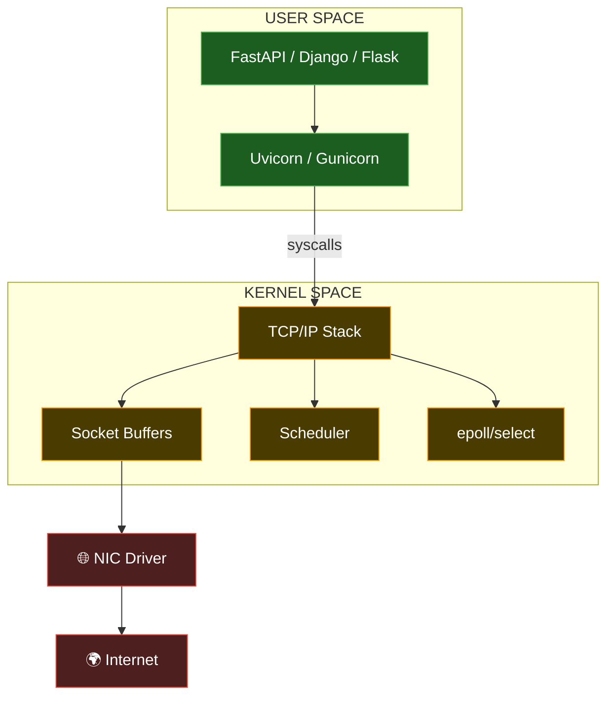
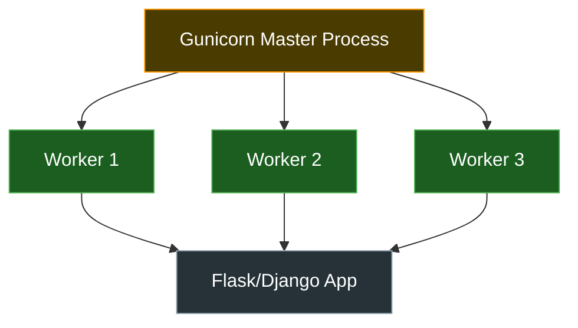
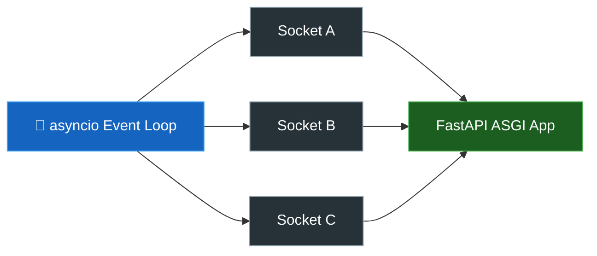
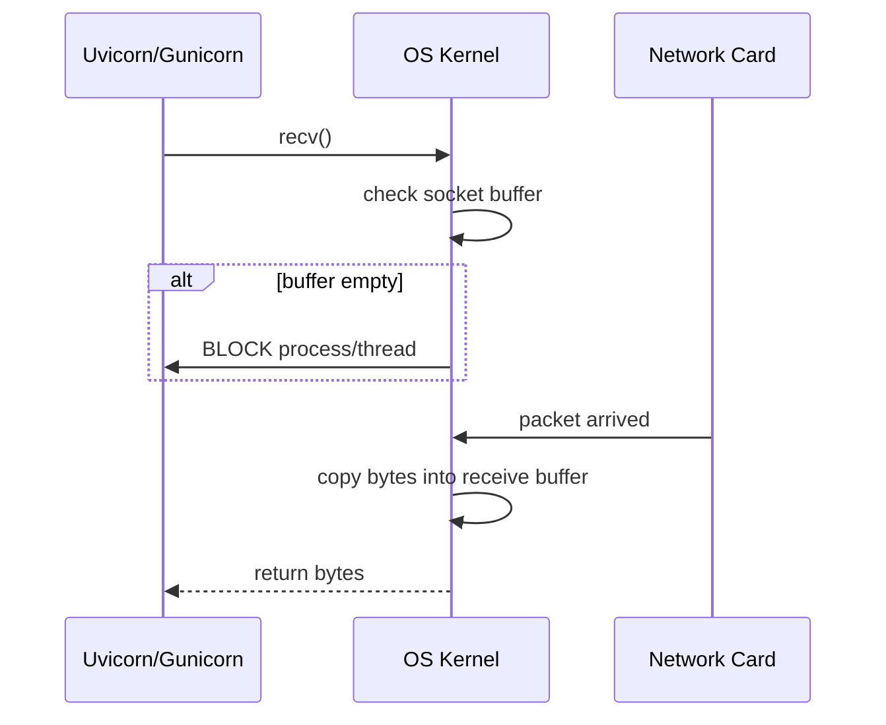
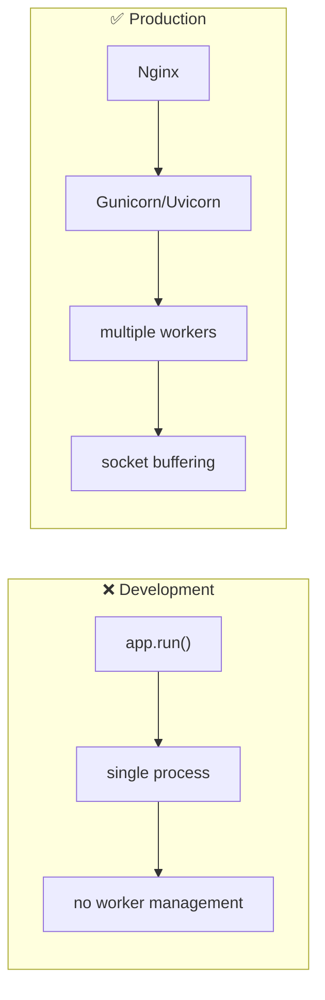
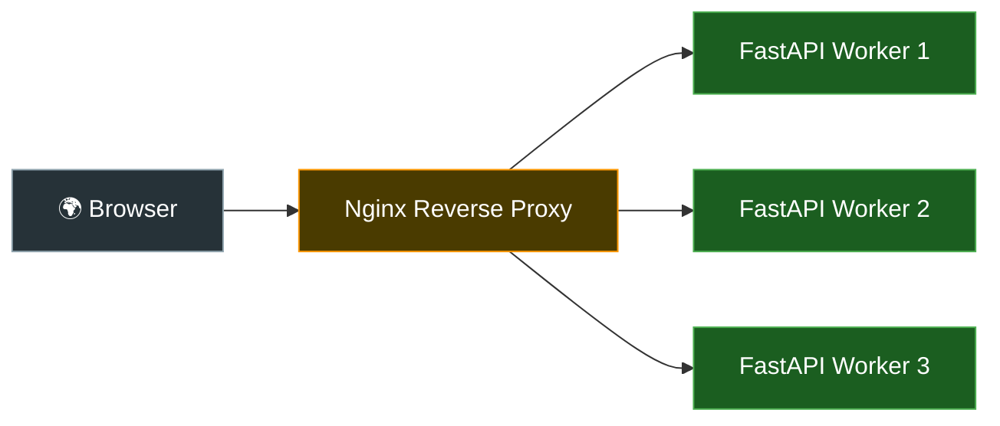
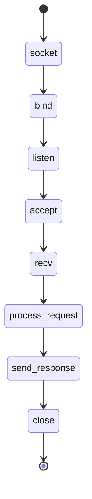

# Python Web Servers, Kernel та Production Networking

---

# Головна ідея

Більшість початківців думають:

```python
from fastapi import FastAPI
```

або:

```python
from flask import Flask
```

це вже:

```text
web server
```

Але це НЕ так.

---

# Framework ≠ Server

FastAPI, Flask, Django —
це:

```text
application frameworks
```

Вони:
- описують routes,
- business logic,
- request handlers,
- middleware.

Але вони НЕ:
- відкривають TCP sockets напряму,
- НЕ роблять accept(),
- НЕ керують epoll/select,
- НЕ працюють із kernel networking stack напряму.

---

# Хто реально працює з мережею?

Реальний networking робить:

- Gunicorn
- Uvicorn
- Hypercorn
- uWSGI
- Daphne

Саме вони:
- відкривають sockets,
- bind() на port,
- listen(),
- accept(),
- recv(),
- send().

---

# Архітектурно

```text
Python App
    ↓
WSGI / ASGI
    ↓
Python Server
    ↓
OS Kernel
    ↓
TCP/IP Stack
    ↓
Network
```

---

# Що таке WSGI?

WSGI =
```text
Web Server Gateway Interface
```

Старий synchronous стандарт Python web.

---

# WSGI модель

```text
HTTP Request
↓
1 worker/thread/process
↓
Framework handles request
↓
HTTP Response
```

---

# Frameworks які працюють через WSGI

| Framework | Тип |
|---|---|
| Flask | minimal WSGI |
| Django (classic) | full-stack WSGI |

---

# Що таке ASGI?

ASGI =
```text
Asynchronous Server Gateway Interface
```

Новий async стандарт Python.

---

# ASGI підтримує

- asyncio
- WebSocket
- long connections
- streaming
- async I/O
- event loops

---

# Frameworks які працюють через ASGI

| Framework | Тип |
|---|---|
| FastAPI | modern ASGI |
| Starlette | lightweight ASGI |
| Quart | async Flask |
| aiohttp | async HTTP |
| modern Django async | hybrid |

---

# Найважливіший systems-thinking момент

Framework:
```text
визначає application logic
```

Server:
```text
визначає networking model
```

---

# Що реально робить Gunicorn?

Gunicorn:
- socket()
- bind()
- listen()
- fork workers
- accept()
- recv()
- передає request у Flask/Django app

---

# Gunicorn lifecycle

```text
socket()
↓
bind()
↓
listen()
↓
fork workers
↓
accept()
↓
recv()
↓
WSGI app
↓
response
```

---

# Що реально робить Uvicorn?

Uvicorn —
це async ASGI server.

Він:
- використовує event loop,
- epoll/select,
- non-blocking sockets,
- asyncio tasks.

---

# Uvicorn lifecycle

```text
socket()
↓
epoll/select
↓
event loop
↓
async tasks
↓
ASGI app
↓
await recv/send
```

---

# Production Architecture

Типова production схема для FastAPI:

```text
                 INTERNET
                      │
══════════════════════╪══════════════════════
                      ▼
               ┌────────────┐
               │   Nginx    │
               │ :80 / :443 │
               └─────┬──────┘
                     │ reverse proxy
                     ▼
          ┌─────────────────────┐
          │     Uvicorn         │
          │   ASGI Server       │
          └─────┬──────┬────────┘
                │      │
         Worker 1   Worker 2
                │      │
                ▼      ▼
             FastAPI App
```

---

# Для Django

```text
Browser
↓
Nginx
↓
Gunicorn
↓
Django
```

---

# Що робить Nginx?

Nginx:
- слухає 80/443,
- TLS/HTTPS,
- reverse proxy,
- buffering,
- static files,
- load balancing,
- keep-alive connections.

---

# Чому НЕ запускати FastAPI/Flask напряму?

Бо:

```python
app.run()

```

це:

```text
development server
```

---

# Development server НЕ вміє нормально

- multiprocessing
- worker management
- graceful shutdown
- production buffering
- efficient concurrency
- load balancing
- advanced socket handling

---

# Повна Mental Model

```text
        USER SPACE
═══════════════════════════════════

 FastAPI / Django / Flask
            │
            ▼
    Uvicorn / Gunicorn
            │
            ▼
════════ syscall boundary ════════

         OS KERNEL
═══════════════════════════════════

 TCP Stack
 Socket Buffers
 Scheduler
 epoll/select
 File Descriptors

═══════════════════════════════════

        NETWORK LAYER
═══════════════════════════════════

 TCP/IP
 Ethernet
 Wi-Fi
 Routers
 Internet
```

---

# Що означає recv() у production server?

Коли Uvicorn або Gunicorn робить:

```python
sock.recv(1024)
```

це означає:

```text
перехід через syscall boundary у kernel
```

---

# Далі kernel:

- перевіряє receive buffer,
- якщо bytes є → повертає data,
- якщо bytes немає → блокує thread/process.

---

# Blocking Model

```text
Python Process
↓
recv()
↓
Kernel checks socket buffer
↓
buffer empty
↓
process asleep
↓
packet arrives
↓
kernel wakeup
↓
recv() returns bytes
```

---

# Найважливіший висновок

Python framework —
це лише application layer.

Реальний networking:
- sockets,
- TCP,
- buffers,
- event loops,
- epoll/select,
- scheduler,
- kernel wakeups

робить:
- Gunicorn,
- Uvicorn,
- kernel networking stack.

# 🔥 1. Flask / Django (WSGI) Architecture



---

# 🔥 2. FastAPI + Uvicorn (ASGI)



---

# 🔥 3. Full Production Networking Stack



---

# 🔥 4. Gunicorn Worker Model



---

# 🔥 5. Uvicorn Event Loop Model



---

# 🔥 6. recv() Through Kernel Boundary



---

# 🔥 7. Development Server vs Production Server



---

# 🔥 8. Reverse Proxy Architecture



---

# 🔥 9. Socket Lifecycle in Production Server



