# Проєктування реляційних баз даних — від архітектури до коду

> **Як побудувати архітектору баз даних:** Ми не заучуємо команди — ми розбираємо фундаментальні принципи,
> які дозволяють будувати масштабовані, надійні та швидкі системи.
> Схема БД — це фундамент всієї інформаційної системи. Якщо вона погана — система страждатиме.

---

## Зміст

1. [Ментальна модель: таблиця і рядок](#1-ментальна-модель-таблиця-і-рядок)
2. [Первинні ключі (Primary Keys)](#2-первинні-ключі-primary-keys)
3. [Зовнішні ключі (Foreign Keys)](#3-зовнішні-ключі-foreign-keys)
4. [Типи зв'язків між таблицями](#4-типи-звязків-між-таблицями)
5. [Обмеження (Constraints)](#5-обмеження-constraints)
6. [Нормалізація (1NF → 2NF → 3NF)](#6-нормалізація-1nf--2nf--3nf)
7. [Денормалізація і Star Schema](#7-денормалізація-і-star-schema)
8. [Типові помилки у дизайні БД](#8-типові-помилки-у-дизайні-бд)
9. [Поганий vs Хороший дизайн — повний приклад](#9-поганий-vs-хороший-дизайн--повний-приклад)
10. [Алгоритм проєктування з нуля](#10-алгоритм-проєктування-з-нуля)
11. [Стратегія індексування (B-Tree, Hash, GIN, Partial)](#11-стратегія-індексування-b-tree-hash-gin-partial)

---

## 1. Ментальна модель: таблиця і рядок

Реляційна база даних організовує дані у **двовимірні таблиці**.
Кожна таблиця представляє **одну конкретну сутність** реального світу.

| Концепція | Пояснення | Приклад |
|-----------|-----------|---------|
| **Таблиця** | Набір однотипних об'єктів (сутність) | `users`, `products`, `orders` |
| **Рядок (запис)** | Один конкретний екземпляр сутності | Один користувач «Джон» |
| **Стовпець (поле)** | Атрибут або характеристика об'єкта | `email`, `name`, `birth_date` |
| **Тип даних** | Строгий формат значення в стовпці | `INTEGER`, `TEXT`, `TIMESTAMP` |

> **Ключова ідея:** Дані в одному стовпці завжди мають строго визначений тип.
> СУБД не дозволить зберегти текст у числовому полі.

```
Таблиця users:
┌─────────┬──────────────────────┬──────────────┐
│ user_id │ email                │ full_name    │
├─────────┼──────────────────────┼──────────────┤
│    1    │ john@example.com     │ John Brown   │  ← рядок (запис)
│    2    │ mary@example.com     │ Mary Smith   │  ← рядок (запис)
│    3    │ alex@example.com     │ Alex Johnson │  ← рядок (запис)
└─────────┴──────────────────────┴──────────────┘
  ↑ стовпець   ↑ стовпець             ↑ стовпець
```

---

## 2. Первинні ключі (Primary Keys)

**Первинний ключ (Primary Key)** — стовпець або набір стовпців, значення яких **абсолютно унікальні** для кожного запису.

### Навіщо вони потрібні

> Уявіть двох клієнтів з іменем «Джон Браун».
> Як базі даних зрозуміти, якому з них належить замовлення?
> Первинний ключ (`id = 1` та `id = 2`) гарантує розрізнення.

### Правила первинного ключа

- **Не може бути NULL** — завжди містить значення
- **Унікальний** — жодних дублікатів
- **Незмінний** — не повинен змінюватись після створення
- **Мінімальний** — не містить зайвих стовпців

### Природний vs Сурогатний ключ

| Тип | Приклад | Коли використовувати |
|-----|---------|----------------------|
| **Природний** | номер паспорта, IBAN | Якщо атрибут гарантовано унікальний і незмінний |
| **Сурогатний** | `id SERIAL` (автоінкремент) | В більшості випадків — безпечний вибір за замовчуванням |

```sql
-- Сурогатний первинний ключ (найпоширеніший підхід)
CREATE TABLE users (
    user_id SERIAL PRIMARY KEY,   -- автоінкремент, унікальний, NOT NULL
    email   VARCHAR(100),
    name    VARCHAR(100)
);
```

---

## 3. Зовнішні ключі (Foreign Keys)

**Зовнішній ключ (Foreign Key)** — стовпець у таблиці, який посилається на **Primary Key іншої таблиці**.

### Як це працює

```
Таблиця orders:                    Таблиця users:
┌──────────┬─────────┬────────┐    ┌─────────┬──────────────┐
│ order_id │ user_id │ total  │    │ user_id │ full_name    │
├──────────┼─────────┼────────┤    ├─────────┼──────────────┤
│    101   │    5    │ 250.00 │───▶│    5    │ John Brown   │
│    102   │    5    │  89.99 │───▶│    5    │ John Brown   │
│    103   │    2    │ 420.00 │───▶│    2    │ Mary Smith   │
└──────────┴─────────┴────────┘    └─────────┴──────────────┘
              ↑ Foreign Key              ↑ Primary Key
```

> `orders.user_id = 5` → замовлення належить користувачу з `users.user_id = 5`

### Посилальна цілісність (Referential Integrity)

Зовнішній ключ — це **захисне обмеження**:

- ❌ Не можна створити замовлення для `user_id = 999`, якщо такого користувача немає
- ❌ Не можна видалити користувача, у якого є активні замовлення (при `ON DELETE RESTRICT`)
- ✅ При `ON DELETE CASCADE` — видалення користувача автоматично видалить всі його замовлення

```sql
CREATE TABLE orders (
    order_id  SERIAL PRIMARY KEY,
    user_id   INT REFERENCES users(user_id) ON DELETE RESTRICT,
    order_date TIMESTAMP DEFAULT CURRENT_TIMESTAMP
);
```

---

## 4. Типи зв'язків між таблицями

### 4.1 Один-до-одного (1:1)

Один запис таблиці А пов'язаний рівно з одним записом таблиці В.

**Коли використовувати:**
- Ізоляція конфіденційних даних (зарплата, паспортні дані)
- Виокремлення великих BLOB-полів з основної таблиці

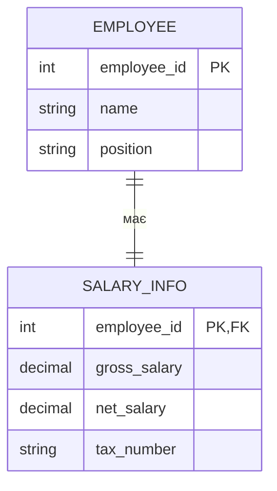

```sql
CREATE TABLE employees (
    employee_id SERIAL PRIMARY KEY,
    name        VARCHAR(100) NOT NULL,
    position    VARCHAR(50)
);

CREATE TABLE salary_info (
    employee_id INT PRIMARY KEY REFERENCES employees(employee_id),
    gross_salary DECIMAL(10,2),
    net_salary   DECIMAL(10,2),
    tax_number   VARCHAR(20) UNIQUE
);
```

---

### 4.2 Один-до-багатьох (1:M)

Найпоширеніший тип. Одне відділення має багато співробітників, але кожен співробітник належить до одного відділення.

> **Правило:** Зовнішній ключ завжди розміщується на стороні **«багато»**.

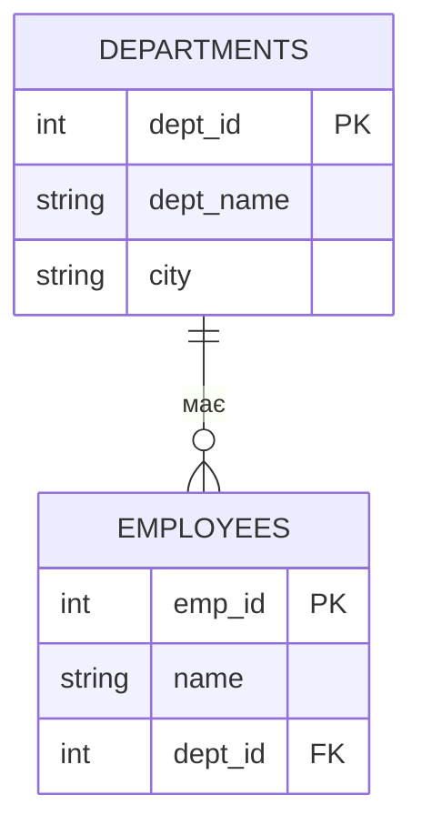

```sql
CREATE TABLE departments (
    dept_id   SERIAL PRIMARY KEY,
    dept_name VARCHAR(100) NOT NULL,
    city      VARCHAR(100)
);

CREATE TABLE employees (
    emp_id  SERIAL PRIMARY KEY,
    name    VARCHAR(100) NOT NULL,
    dept_id INT REFERENCES departments(dept_id)  -- FK на боці "багато"
);
```

---

### 4.3 Багато-до-багатьох (M:N) — зі сполучною таблицею

Студент вивчає багато курсів; курс вивчають багато студентів.

> **Важливо:** Реляційні БД **не можуть** реалізувати M:N прямо.
> Завжди потрібна третя **сполучна таблиця (junction table)**.

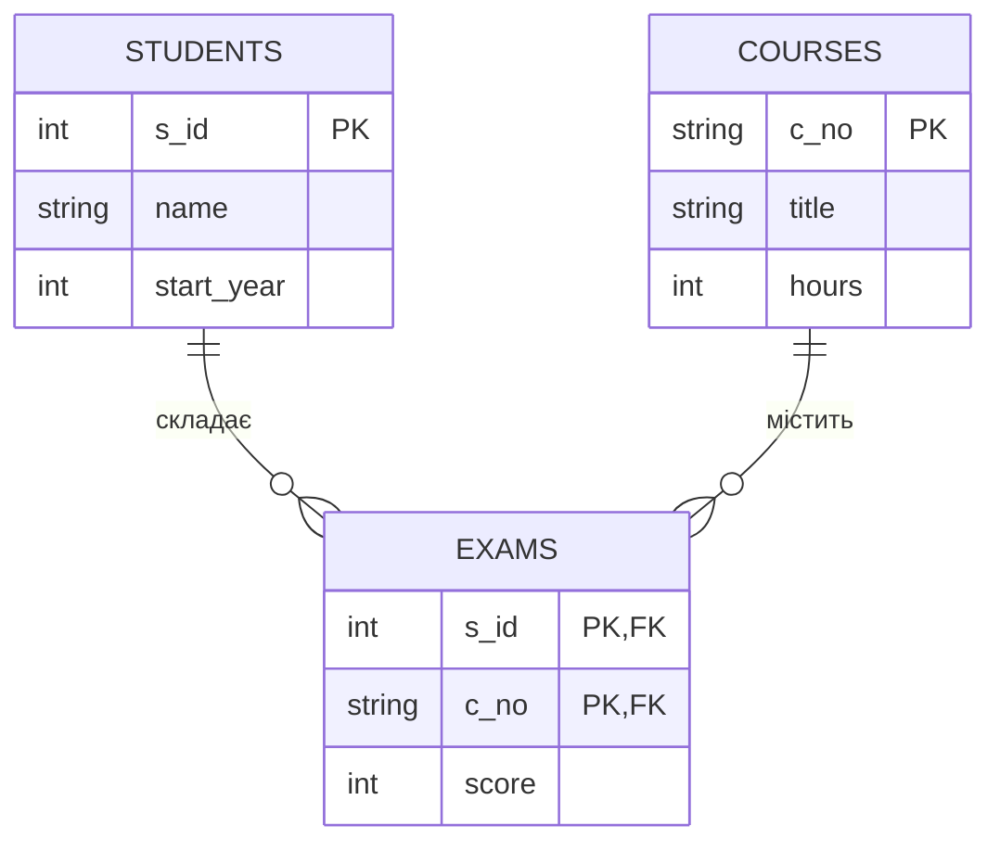

```sql
CREATE TABLE students (
    s_id       SERIAL PRIMARY KEY,
    name       VARCHAR(100) NOT NULL,
    start_year INT
);

CREATE TABLE courses (
    c_no  VARCHAR(20) PRIMARY KEY,
    title VARCHAR(200),
    hours INT
);

-- Сполучна таблиця: розбиває M:N на два зв'язки 1:M
CREATE TABLE exams (
    s_id  INT  REFERENCES students(s_id),
    c_no  TEXT REFERENCES courses(c_no),
    score INT  CHECK (score BETWEEN 0 AND 100),
    CONSTRAINT pk_exams PRIMARY KEY (s_id, c_no)  -- складений PK
);
```

### UML-діаграма класів для M:N

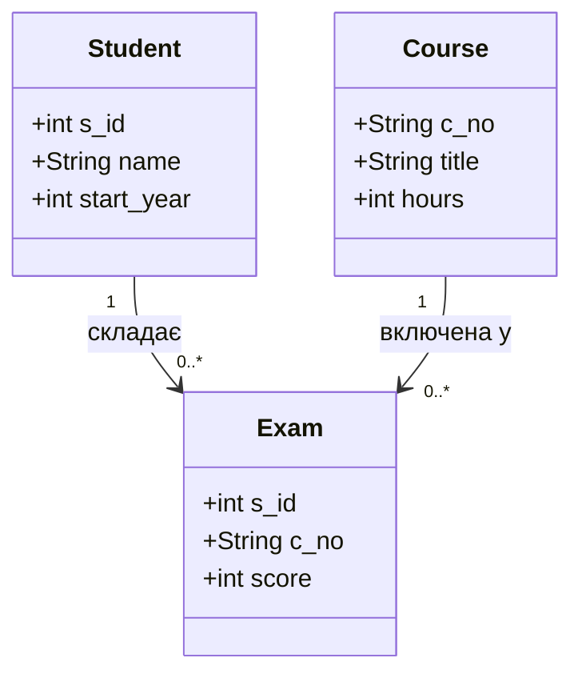

---

## 5. Обмеження (Constraints)

Обмеження — це **бізнес-правила**, вбудовані у схему.
СУБД застосовує їх автоматично при кожному INSERT/UPDATE.

| Обмеження | Призначення | Приклад |
|-----------|-------------|---------|
| `PRIMARY KEY` | Унікальна ідентифікація рядка | `user_id SERIAL PRIMARY KEY` |
| `NOT NULL` | Поле обов'язкове для заповнення | `email VARCHAR(100) NOT NULL` |
| `UNIQUE` | Заборона дублікатів (не PK) | `email VARCHAR(100) UNIQUE` |
| `CHECK` | Перевірка умови перед записом | `CHECK (price > 0)` |
| `FOREIGN KEY` | Посилальна цілісність | `REFERENCES users(user_id)` |
| `DEFAULT` | Значення за замовчуванням | `DEFAULT CURRENT_TIMESTAMP` |

```sql
CREATE TABLE products (
    product_id  SERIAL PRIMARY KEY,
    name        VARCHAR(100) NOT NULL,
    price       DECIMAL(10,2) NOT NULL,
    category    VARCHAR(50) DEFAULT 'general',
    eye_color   CHAR(2),

    -- Іменовані обмеження для зручності в повідомленнях про помилки
    CONSTRAINT chk_price     CHECK (price >= 0),
    CONSTRAINT chk_eye_color CHECK (eye_color IN ('BR', 'BL', 'GR', 'HZ'))
);
```

> **Приклад з банківської системи:**
> `CHECK (balance >= 0)` — навіть якщо в коді є race condition,
> база даних **відхилить** транзакцію, що призведе до від'ємного балансу.

---

## 6. Нормалізація (1NF → 2NF → 3NF)

Нормалізація — усунення **надмірності (дублювання)** для запобігання аномаліям
при INSERT, UPDATE та DELETE.


---

### 6.1 Перша нормальна форма (1NF)

**Правило:** Дані мають бути **атомарними** (неподільними). Жодних списків у комірці.

```
❌ ПОРУШЕННЯ 1NF:
┌────────┬─────────────────────────────┐
│ name   │ hobbies                     │
├────────┼─────────────────────────────┤
│ John   │ "теніс, кіно, музика"       │  ← список у одній комірці
│ Mary   │ "читання, подорожі"         │
└────────┴─────────────────────────────┘

✅ ВИПРАВЛЕННЯ — окрема таблиця:
┌────────┐    ┌─────────┬─────────────┐
│ users  │    │ hobbies              │
├────────┤    ├─────────┬─────────────┤
│ id     │───▶│ user_id │ hobby       │
│ name   │    │    1    │ теніс       │
└────────┘    │    1    │ кіно        │
              │    1    │ музика      │
              │    2    │ читання     │
              └─────────┴─────────────┘
```

---

### 6.2 Друга нормальна форма (2NF)

**Правило:** Кожен неключовий атрибут залежить від **усього** первинного ключа
(не від його частини). Актуально при **складеному PK**.

```
❌ ПОРУШЕННЯ 2NF — таблиця order_items зі складеним PK (order_id, product_id):
┌──────────┬────────────┬──────────┬──────────────┐
│ order_id │ product_id │ quantity │ product_name │  ← product_name залежить
├──────────┼────────────┼──────────┼──────────────┤     тільки від product_id!
│    1     │    101     │    3     │ "Ноутбук"    │
│    1     │    205     │    1     │ "Мишка"      │
└──────────┴────────────┴──────────┴──────────────┘

✅ ВИПРАВЛЕННЯ — product_name виноситься у таблицю products:
order_items: (order_id, product_id, quantity)
products:    (product_id, product_name, price)
```

---

### 6.3 Третя нормальна форма (3NF)

**Правило:** Немає **транзитивних залежностей** — неключові стовпці не залежать від інших неключових стовпців.

```
❌ ПОРУШЕННЯ 3NF:
employees: (emp_id, name, dept_id, dept_name, city)
                                   ↑_________↑
                    dept_name і city залежать від dept_id (неключовий стовпець!)

✅ ВИПРАВЛЕННЯ:
employees:   (emp_id, name, dept_id)
departments: (dept_id, dept_name, city)
```

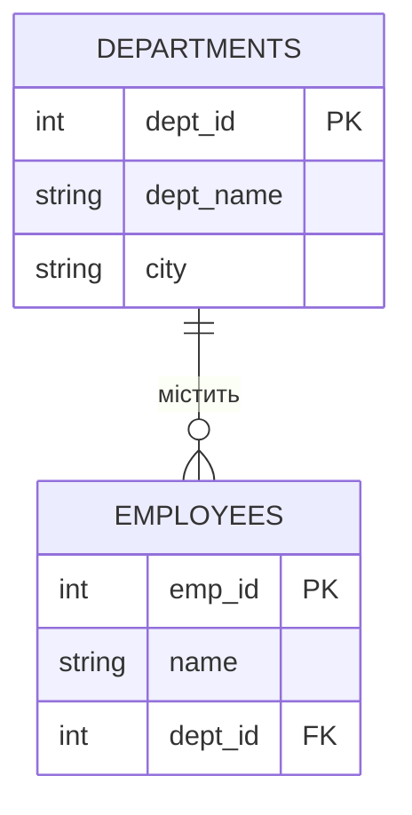

> **Цитата Едгара Кодда:** "Якщо щось є істиною, повторення цього двічі не зробить це більш істинним."

---

## 7. Денормалізація і Star Schema

### Коли нормалізація шкодить

**OLTP** (Online Transaction Processing) — нормалізація ідеальна:
- Інтернет-магазини, банки, транзакції
- Багато записів, мало читань агрегованих даних

**OLAP** (Online Analytical Processing) — нормалізація вбиває продуктивність:
- Аналітичні звіти, Data Warehouse
- Мільйони JOIN-операцій знищують дисковий I/O

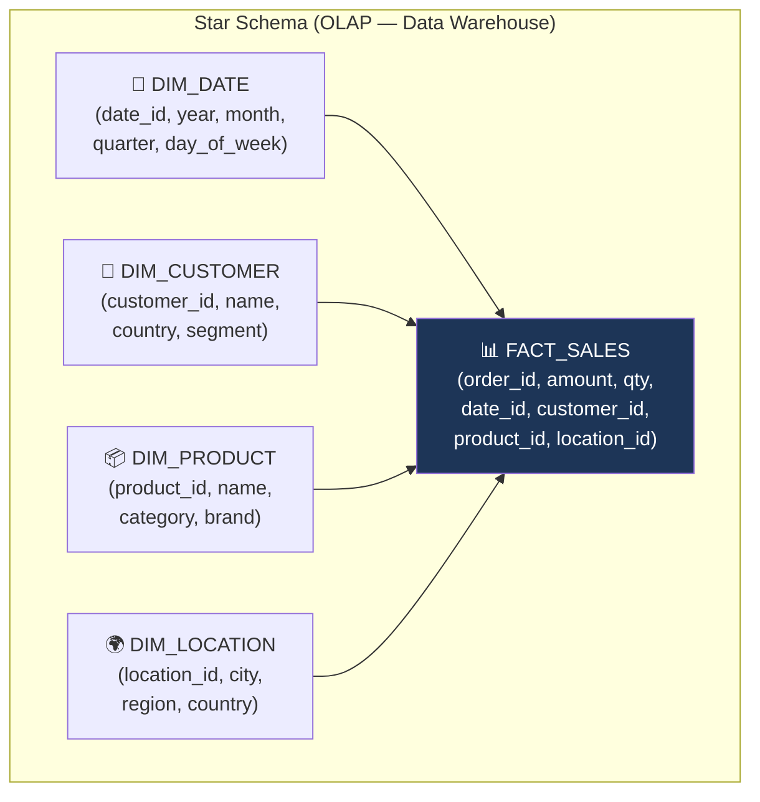

> **Висновок:** У Star Schema дані **навмисно дублюються** у Dimension-таблицях,
> щоб аналітичні запити читали якомога менше таблиць і виконувались за мілісекунди.

---

## 8. Типові помилки у дизайні БД

### Помилка 1: Відсутність первинних ключів

```sql
-- ❌ ПОГАНО: неможливо однозначно ідентифікувати рядок
CREATE TABLE contacts (
    name  VARCHAR(100),
    phone VARCHAR(20)
    -- Якщо є два "Джони Сміти" — UPDATE зачепить обох!
);

-- ✅ ДОБРЕ
CREATE TABLE contacts (
    contact_id SERIAL PRIMARY KEY,
    name       VARCHAR(100) NOT NULL,
    phone      VARCHAR(20)
);
```

---

### Помилка 2: Неатомарні дані (порушення 1NF)

```sql
-- ❌ ПОГАНО: список у одному полі
CREATE TABLE customers (
    id        SERIAL PRIMARY KEY,
    name      VARCHAR(100),
    interests TEXT  -- "книги, спорт, музика" — неможливо нормально шукати
);

-- ✅ ДОБРЕ: окрема таблиця
CREATE TABLE customers (
    id   SERIAL PRIMARY KEY,
    name VARCHAR(100) NOT NULL
);

CREATE TABLE customer_interests (
    customer_id INT REFERENCES customers(id) ON DELETE CASCADE,
    interest    VARCHAR(50) NOT NULL,
    PRIMARY KEY (customer_id, interest)
);
```

---

### Помилка 3: Дублювання даних (порушення 3NF)

```sql
-- ❌ ПОГАНО: назва та місто відділу дублюються в кожному рядку
CREATE TABLE employees_bad (
    emp_id      SERIAL PRIMARY KEY,
    name        VARCHAR(100),
    dept_name   VARCHAR(100),  -- якщо відділ переїде — оновлюй тисячі рядків!
    dept_city   VARCHAR(100)
);

-- ✅ ДОБРЕ: відділ — окрема таблиця
CREATE TABLE departments (
    dept_id   SERIAL PRIMARY KEY,
    dept_name VARCHAR(100) NOT NULL,
    city      VARCHAR(100)
);

CREATE TABLE employees (
    emp_id  SERIAL PRIMARY KEY,
    name    VARCHAR(100) NOT NULL,
    dept_id INT REFERENCES departments(dept_id)
);
```

---

### Помилка 4: Пряма реалізація M:N без сполучної таблиці

```sql
-- ❌ ПОГАНО: student дублюється для кожного курсу
CREATE TABLE students_bad (
    student_id SERIAL PRIMARY KEY,
    name       VARCHAR(100),
    class_id   INT   -- один студент — один курс. А якщо курсів три?
);

-- ✅ ДОБРЕ: сполучна таблиця розбиває M:N на два 1:M
CREATE TABLE students (
    student_id SERIAL PRIMARY KEY,
    name       VARCHAR(100) NOT NULL
);

CREATE TABLE classes (
    class_id SERIAL PRIMARY KEY,
    title    VARCHAR(200) NOT NULL
);

CREATE TABLE registrations (         -- junction table
    student_id INT REFERENCES students(student_id) ON DELETE CASCADE,
    class_id   INT REFERENCES classes(class_id) ON DELETE CASCADE,
    enrolled_at TIMESTAMP DEFAULT CURRENT_TIMESTAMP,
    PRIMARY KEY (student_id, class_id)
);
```

---

## 9. Поганий vs Хороший дизайн — повний приклад

### Сценарій: Інтернет-магазин

#### ❌ Поганий дизайн — одна «широка» таблиця

```sql
CREATE TABLE sales_bad (
    order_id      INT,
    user_name     VARCHAR(100),   -- дублюється 3 рази якщо 3 покупки
    user_email    VARCHAR(100),   -- дублюється 3 рази
    product_1     VARCHAR(100),   -- що якщо 5 товарів?
    product_2     VARCHAR(100),   -- NULL-поля повсюди
    product_3     VARCHAR(100),
    total_price   DECIMAL(10,2)
);
```

**Проблеми:**
- Джон купив 3 товари → його `name` та `email` дубльовані 3 рази
- Хочеш перейменувати товар → оновлюй кожен рядок продажу
- Видалив акаунт Джона → втратив всю його историю покупок
- Що робити з 4-м товаром? Додавати стовпець `product_4`?

---

#### ✅ Хороший дизайн — 4 таблиці з правильними зв'язками

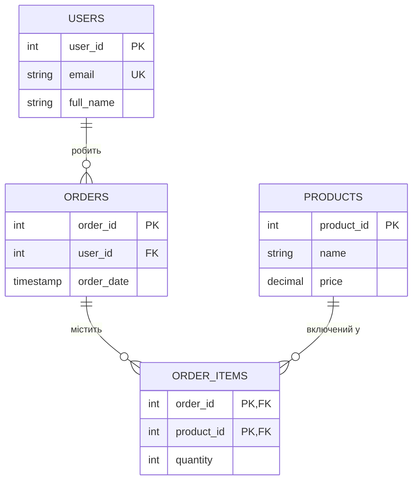

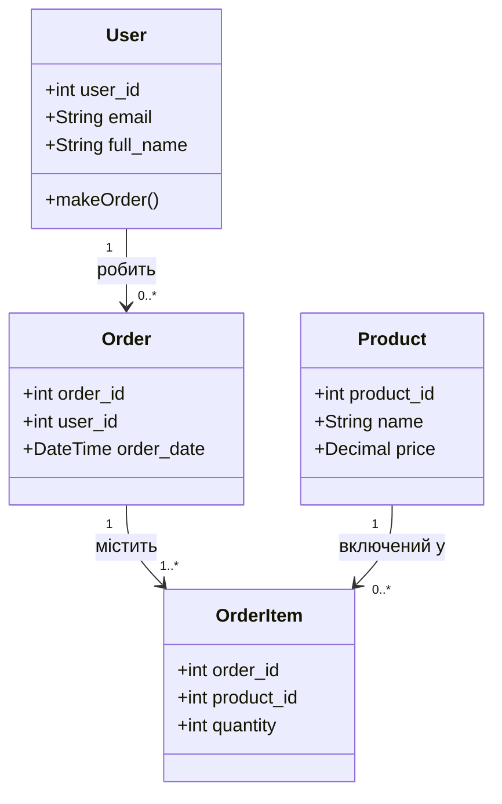

```sql
-- 1. Таблиця Користувачів (сильна сутність)
CREATE TABLE users (
    user_id   SERIAL PRIMARY KEY,
    email     VARCHAR(100) UNIQUE NOT NULL,
    full_name VARCHAR(100) NOT NULL
);

-- 2. Таблиця Товарів (сильна сутність)
CREATE TABLE products (
    product_id SERIAL PRIMARY KEY,
    name       VARCHAR(100) NOT NULL,
    price      DECIMAL(10,2) NOT NULL,
    CONSTRAINT chk_price CHECK (price >= 0)
);

-- 3. Таблиця Замовлень (зв'язок 1:M від users)
CREATE TABLE orders (
    order_id   SERIAL PRIMARY KEY,
    user_id    INT NOT NULL REFERENCES users(user_id) ON DELETE RESTRICT,
    order_date TIMESTAMP DEFAULT CURRENT_TIMESTAMP
);

-- 4. Сполучна таблиця (M:N між orders та products)
CREATE TABLE order_items (
    order_id   INT NOT NULL REFERENCES orders(order_id)   ON DELETE CASCADE,
    product_id INT NOT NULL REFERENCES products(product_id) ON DELETE RESTRICT,
    quantity   INT NOT NULL,
    CONSTRAINT chk_qty     CHECK (quantity > 0),
    PRIMARY KEY (order_id, product_id)
);
```

**Чому це хороша архітектура:**
- Ціна товару зберігається **один раз** у `products` — зміна не ламає нічого
- Замовлень може бути скільки завгодно — просто додаємо рядки в `orders`
- `ON DELETE RESTRICT` захищає від випадкового видалення користувача з замовленнями
- `ON DELETE CASCADE` на `order_items` — видалення замовлення прибирає всі його позиції

---

## 10. Алгоритм проєктування з нуля

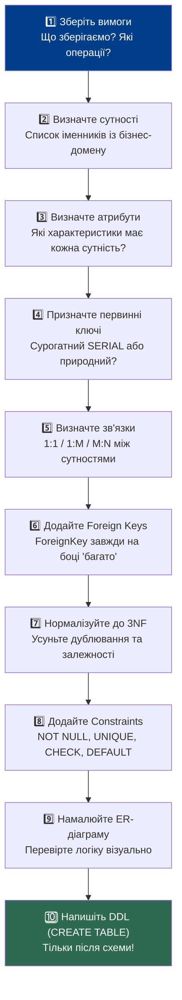

### Золоті правила архітектора БД

| # | Правило |
|---|---------|
| 1 | **Спочатку схема — потім код.** Ніколи не пишіть SQL без ER-діаграми |
| 2 | **Кожна таблиця = одна сутність.** Не змішуйте різні сутності в одній таблиці |
| 3 | **FK завжди на боці «багато»** у зв'язку 1:M |
| 4 | **M:N = завжди junction table.** Без виключень |
| 5 | **Нормалізуйте до 3NF** для OLTP, денормалізуйте для OLAP |
| 6 | **Кожен факт зберігається рівно один раз** (правило Кодда) |
| 7 | **Не NULL за замовчуванням** для обов'язкових полів |
| 8 | **CHECK-обмеження** — останній рубіж захисту від кривих даних |

---

## 11. Стратегія індексування (B-Tree, Hash, GIN, Partial)

### Що таке індекс

**Індекс** — це допоміжна структура даних, яка дозволяє базі знайти рядки **без послідовного сканування (Sequential Scan)** всієї таблиці.

> **Аналогія:** Індекс у книзі. Без нього ви гортаєте всі сторінки щоб знайти тему.
> З індексом — одразу переходите на потрібну сторінку.

```
БЕЗ ІНДЕКСУ — Sequential Scan (O(n)):
┌─────┬──────────┬───────────────────┐
│  1  │ john@... │ John Brown        │  ← читаємо
│  2  │ mary@... │ Mary Smith        │  ← читаємо
│  3  │ alex@... │ Alex Johnson      │  ← читаємо
│ ... │ ...      │ ...               │  ← читаємо всі 1 000 000 рядків
└─────┴──────────┴───────────────────┘

З ІНДЕКСОМ на email — Index Scan (O(log n)):
B-Tree за email → одразу знаходимо позицію → читаємо 1 рядок
```

### Типи індексів у PostgreSQL

| Тип | Структура | Найкраще для | Оператори |
|-----|-----------|--------------|-----------|
| **B-Tree** | Збалансоване дерево | Рівність, діапазони, сортування | `=`, `<`, `>`, `BETWEEN`, `LIKE 'abc%'` |
| **Hash** | Хеш-таблиця | Тільки рівність, дуже швидко | `=` |
| **GIN** | Інвертований індекс | Масиви, JSONB, full-text search | `@>`, `<@`, `@@` |
| **GiST** | Узагальнене дерево | Геометрія, PostGIS, IP-діапазони | `&&`, `<<`, `~=` |
| **BRIN** | Блоковий діапазон | Дуже великі таблиці з монотонними даними | `=`, `<`, `>` |

---

### 11.1 B-Tree індекс (за замовчуванням)

Найпоширеніший тип. PostgreSQL використовує його, якщо тип не вказано.

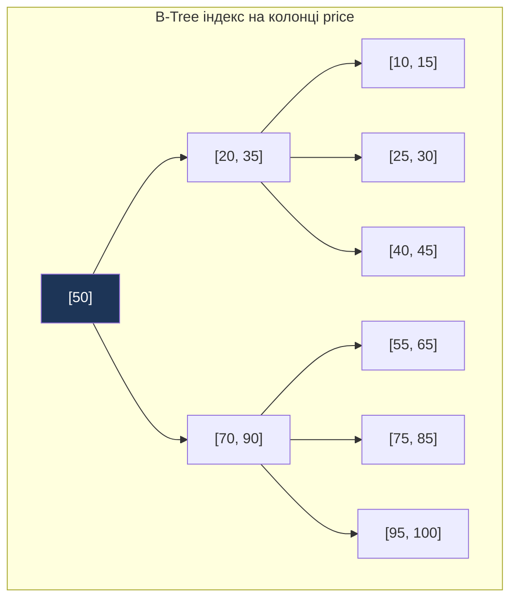

```sql
-- За замовчуванням — B-Tree
CREATE INDEX idx_orders_user_id ON orders(user_id);

-- Явне зазначення типу
CREATE INDEX idx_products_price ON products USING BTREE (price);

-- Складений індекс (порядок має значення!)
CREATE INDEX idx_orders_user_date ON orders(user_id, order_date);
-- Цей індекс допомагає: WHERE user_id = 5 AND order_date > '2024-01-01'
-- Але НЕ допомагає: WHERE order_date > '2024-01-01' (без user_id)
```

---

### 11.2 Hash індекс

Оптимальний **тільки для перевірки рівності** (`=`). Не підтримує діапазони.

```sql
-- Hash — тільки для точного пошуку
CREATE INDEX idx_users_email_hash ON users USING HASH (email);
-- SELECT * FROM users WHERE email = 'john@example.com'  ← дуже швидко
-- SELECT * FROM users WHERE email LIKE 'john%'          ← НЕ використає цей індекс
```

---

### 11.3 GIN індекс (масиви, JSONB, повнотекстовий пошук)

```sql
-- Таблиця з JSONB-полем
CREATE TABLE products (
    product_id SERIAL PRIMARY KEY,
    name       VARCHAR(100),
    attributes JSONB
);

-- GIN індекс для пошуку всередині JSONB
CREATE INDEX idx_products_gin ON products USING GIN (attributes);

-- Тепер цей запит буде швидким:
SELECT * FROM products
WHERE attributes @> '{"color": "red", "size": "XL"}';

-- GIN для full-text search
CREATE INDEX idx_products_fts ON products USING GIN (to_tsvector('english', name));
SELECT * FROM products
WHERE to_tsvector('english', name) @@ to_tsquery('laptop & gaming');
```

---

### 11.4 Штраф за запис (Write Penalty)

> **Головний трейдоф індексів:** кожен індекс прискорює читання,
> але **уповільнює запис**.

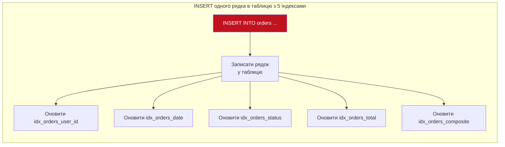

**Практичне правило:** Не індексуйте все підряд. Кожен зайвий індекс — це:
- Додатковий дисковий простір
- Уповільнення кожного INSERT/UPDATE/DELETE
- Навантаження на кеш

---

### 11.5 Частковий індекс (Partial Index)

**Ідея:** Індексуємо **не всі рядки**, а тільки ті, які реально шукаємо.
Результат — менший індекс, швидше сканування, дешевше обслуговування.

```sql
-- Повний індекс — індексує всі замовлення (мільйони рядків)
CREATE INDEX idx_orders_status_full ON orders(status);

-- Частковий індекс — тільки активні замовлення (тисячі рядків)
CREATE INDEX idx_orders_active ON orders(user_id)
WHERE status = 'active';
-- Запит: SELECT * FROM orders WHERE user_id = 5 AND status = 'active'
-- Використає idx_orders_active — крихітний, блискавичний

-- Частковий індекс для NOT NULL значень
CREATE INDEX idx_users_verified ON users(verified_at)
WHERE verified_at IS NOT NULL;
```

---

### 11.6 Коли і що індексувати

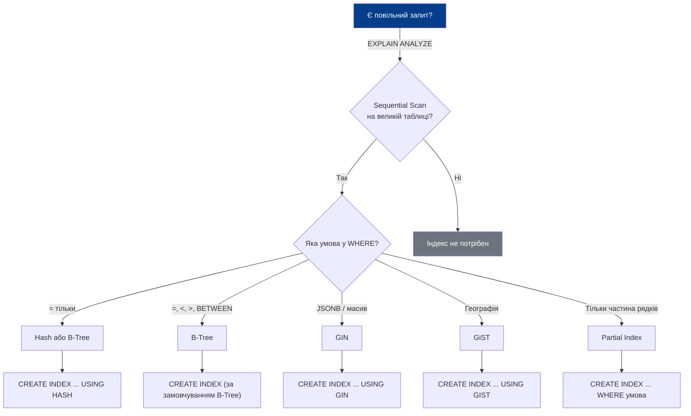

**Що завжди індексувати:**

| Колонка | Чому |
|---------|------|
| Foreign Keys (`user_id`, `order_id`, ...) | JOIN-операції використовують їх постійно |
| Колонки у `WHERE` фільтрах | Найчастіша причина Sequential Scan |
| Колонки у `ORDER BY` | Дозволяє уникнути сортування в пам'яті |
| Колонки у `GROUP BY` | Прискорює агрегацію |

**Що НЕ індексувати:**

| Колонка | Чому |
|---------|------|
| Таблиці з < 1000 рядків | Sequential Scan швидший за Index Scan на малих таблицях |
| Колонки з низькою кардинальністю | (`gender`, `status` з 2–3 значеннями) — індекс майже не допомагає |
| Колонки, що часто оновлюються | Штраф за запис перевищує користь від читання |

---

### 11.7 EXPLAIN ANALYZE — перевірка використання індексів

```sql
-- Подивитись план виконання запиту
EXPLAIN ANALYZE
SELECT * FROM orders
WHERE user_id = 5 AND order_date > '2024-01-01';

-- Що шукати в результаті:
-- "Seq Scan" → немає індексу або планувальник вирішив не використовувати
-- "Index Scan" → використовує індекс (добре для точкових запитів)
-- "Index Only Scan" → читає тільки індекс, не чіпає таблицю (найкраще)
-- "Bitmap Index Scan" → комбінує кілька індексів (добре для діапазонів)
```

```
Приклад виводу EXPLAIN ANALYZE:
Index Scan using idx_orders_user_date on orders
  (cost=0.43..8.45 rows=3 width=32)
  (actual time=0.021..0.025 rows=3 loops=1)
  Index Cond: ((user_id = 5) AND (order_date > '2024-01-01'))
Planning Time: 0.1 ms
Execution Time: 0.05 ms   ← порівняно з 250ms без індексу
```

---

### Оновлені золоті правила (з урахуванням індексів)

| # | Правило |
|---|---------|
| 9 | **Завжди індексуйте Foreign Keys** — без цього JOIN-и будуть повільними |
| 10 | **Partial Index замість повного** коли шукаєте підмножину рядків |
| 11 | **EXPLAIN ANALYZE перед додаванням індексу** — переконайтесь, що він потрібен |
| 12 | **Не більше 5–7 індексів на таблицю** — інакше INSERT стає вузьким місцем |

---

## Швидка шпаргалка

```
Сутність  →  Таблиця
Атрибут   →  Стовпець з типом
Екземпляр →  Рядок

1:1  →  FK у будь-якій таблиці (зазвичай — у «слабкій»)
1:M  →  FK на боці «M» (дочірня таблиця)
M:N  →  Junction table з двома FK як складений PK

NOT NULL  →  поле обов'язкове
UNIQUE    →  без дублікатів (але може бути NULL)
CHECK     →  бізнес-правило на рівні СУБД
REFERENCES →  зовнішній ключ + посилальна цілісність

1NF: атомарні значення, немає груп
2NF: кожен атрибут залежить від ВСЬОГО PK
3NF: немає залежностей між неключовими атрибутами

Індекси:
B-Tree  →  за замовчуванням, діапазони і рівність
Hash    →  тільки = (точний збіг)
GIN     →  JSONB, масиви, full-text search
Partial →  WHERE умова в індексі → менший і швидший

Завжди індексуй: Foreign Keys, часті WHERE-колонки
Не індексуй:     мала таблиця, низька кардинальність, часте UPDATE
```

---

*Документація до Lesson 29 — SQL Basics / Database Architecture Design*
