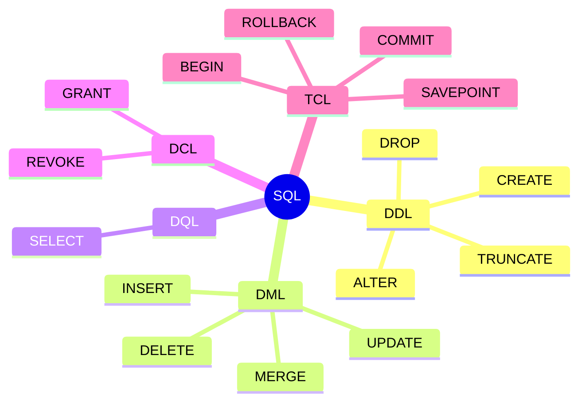
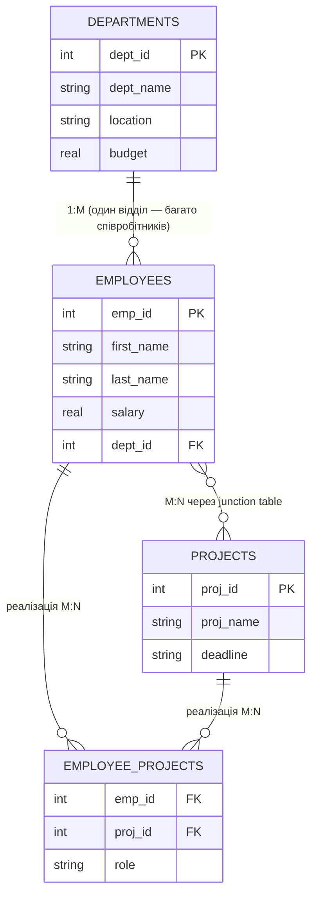
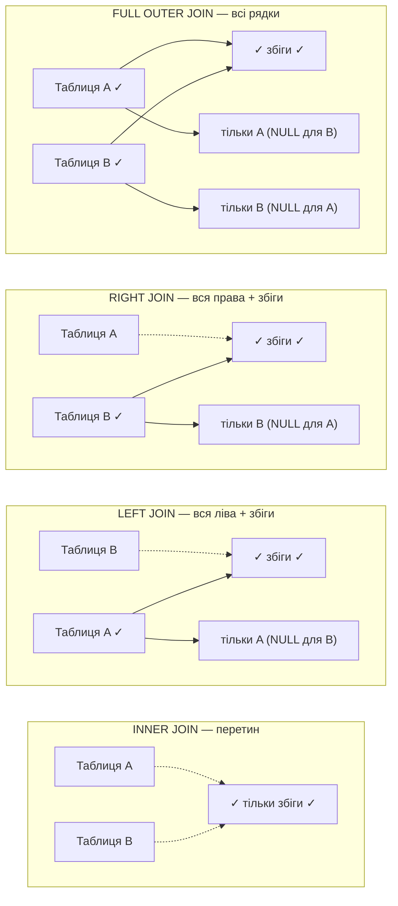
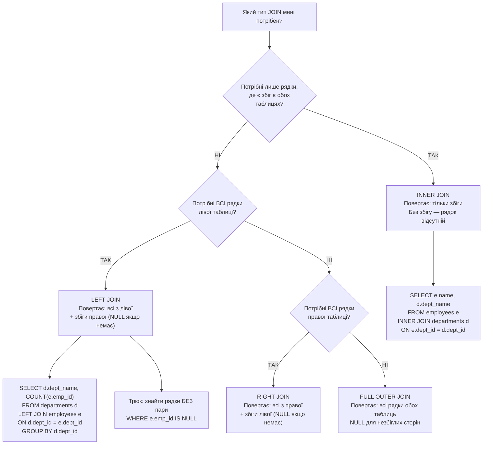
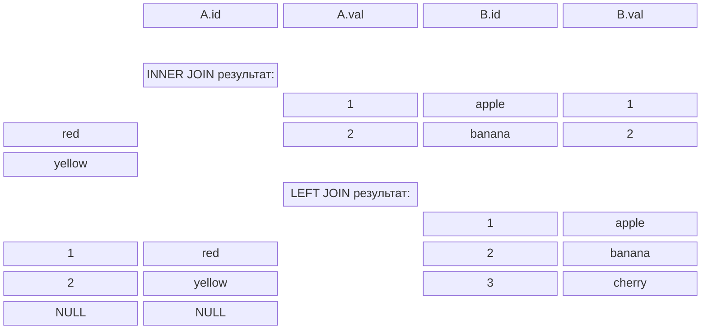
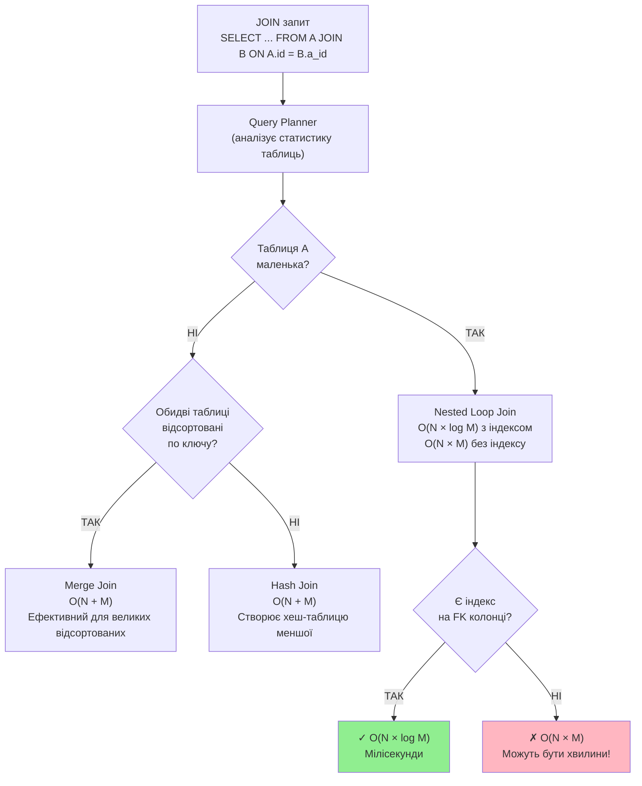
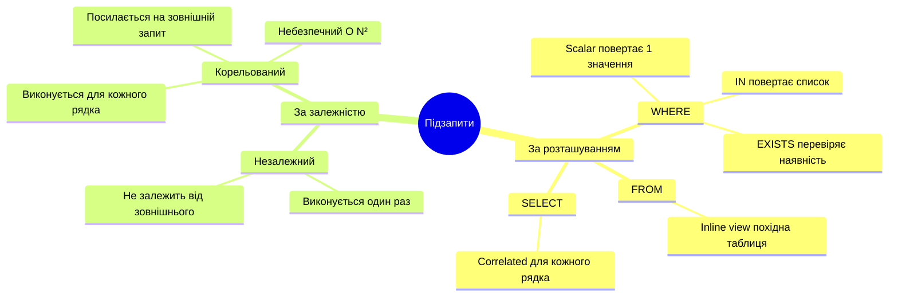
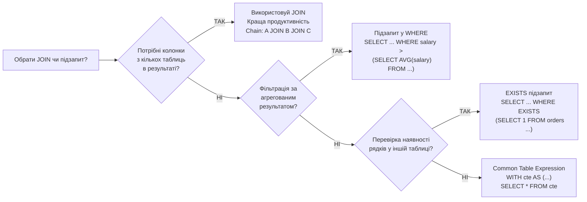
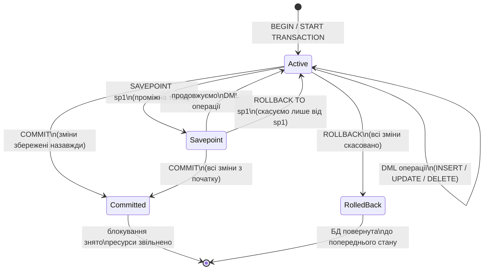
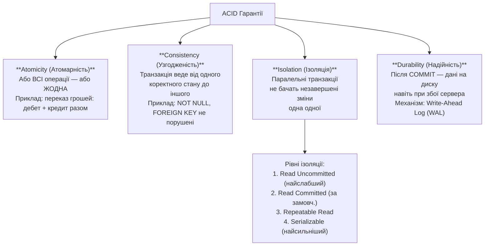

# SQL Joins та Підзапити — Схеми та Документація

> Урок 29 | Модуль 3 | Python Course

---

## 1. Архітектура SQL: П'ять підмов



---

## 2. Таблиця всіх SQL команд

| Категорія | Роль | Команда | Призначення | Ефект на стан БД |
|-----------|------|---------|-------------|------------------|
| **DDL** | Архітектор | `CREATE` | Створює нові об'єкти БД | Додає нову структуру в словник даних |
| | | `ALTER` | Змінює існуючий об'єкт | Мутує схему, не знищуючи об'єкт |
| | | `DROP` | Видаляє об'єкт повністю | Знищує схему та всі дані всередині |
| | | `TRUNCATE` | Швидко очищує таблицю | Миттєво видаляє всі рядки, структура залишається |
| **DML** | Оператор стану | `INSERT` | Додає нові рядки | Розширює поточний стан новими фактами |
| | | `UPDATE` | Змінює існуючі значення | Мутує конкретні значення за умовою |
| | | `DELETE` | Видаляє рядки | Зменшує стан, видаляючи факти за умовою |
| **DQL** | Спостерігач | `SELECT` | Читає та фільтрує дані | Читає стан без його зміни |
| **DCL** | Охоронець | `GRANT` | Надає привілеї | Розширює матрицю доступу |
| | | `REVOKE` | Відкликає привілеї | Звужує матрицю доступу |
| **TCL** | Синхронізатор | `BEGIN` | Відкриває транзакцію | Ізолює зміни від інших сесій |
| | | `COMMIT` | Зберігає зміни | Назавжди записує стан на диск |
| | | `ROLLBACK` | Скасовує зміни | Повертає до попереднього стану |
| | | `SAVEPOINT` | Проміжна точка | Дозволяє частковий відкат |

---

## 3. Типи зв'язків між таблицями



---

## 4. SQL JOIN операції — Діаграма Венна



---

## 5. Детальна схема JOIN типів



---

## 6. Візуалізація результатів JOIN



---

## 7. Алгоритми виконання JOIN (під капотом)



---

## 8. Підзапити (Subqueries)

### Типи підзапитів



### JOIN vs Підзапит — коли що використовувати



---

## 9. Lifecycle транзакції (TCL)



---

## 10. ACID властивості



---

## 11. SQLite vs PostgreSQL — відмінності

| Особливість | SQLite | PostgreSQL |
|-------------|--------|------------|
| Foreign keys | Потрібно `PRAGMA foreign_keys = ON` | Увімкнені за замовч. |
| RIGHT JOIN | Підтримується (v3.39+) | Так |
| FULL OUTER JOIN | ❌ Не підтримується | Так |
| TRUNCATE | ❌ Немає (використовуй `DELETE FROM`) | Так |
| DCL (GRANT/REVOKE) | ❌ Немає (файлова БД) | Так |
| MERGE / Upsert | `INSERT OR REPLACE`, `INSERT OR IGNORE` | `INSERT ... ON CONFLICT DO UPDATE` |
| MVCC | Ні (WAL mode наближений) | Повноцінний MVCC |
| Concurrency | 1 writer / багато readers | Повна підтримка |
| Розмір | Файл до 281 TB | Необмежено |

---

## 12. Шпаргалка: Типові патерни

### Знайти рядки БЕЗ пари (LEFT JOIN + NULL)
```sql
-- Книги, які жодного разу не позичали
SELECT b.title
FROM books b
    LEFT JOIN borrows br ON b.book_id = br.book_id
WHERE br.borrow_id IS NULL;
```

### Агрегація через GROUP BY + HAVING
```sql
-- Автори, у яких більше 2 книг
SELECT author_id, COUNT(*) AS books_count
FROM books
GROUP BY author_id
HAVING COUNT(*) > 2;
```

### Upsert в SQLite
```sql
-- Вставити або оновити якщо вже є (по email)
INSERT INTO members (email, full_name)
VALUES ('test@ua.com', 'Тест Тестов')
ON CONFLICT(email)
DO UPDATE SET full_name = excluded.full_name;
```

### Підзапит vs JOIN (еквіваленти)
```sql
-- Підзапит: співробітники відділу 'IT'
SELECT * FROM employees
WHERE dept_id = (SELECT dept_id FROM departments WHERE dept_name = 'IT');

-- Еквівалент через JOIN:
SELECT e.* FROM employees e
    INNER JOIN departments d ON e.dept_id = d.dept_id
WHERE d.dept_name = 'IT';
```

### Транзакція з обробкою помилок (Python)
```python
try:
    conn.execute("BEGIN")
    conn.execute("UPDATE accounts SET balance = balance - 500 WHERE id = 1")
    conn.execute("UPDATE accounts SET balance = balance + 500 WHERE id = 2")
    conn.commit()
    print("Переказ успішний!")
except Exception as e:
    conn.rollback()
    print(f"Помилка: {e} — ROLLBACK!")
```

---

*Урок 29 | Модуль 3 | Python Course*
