# DuckDB, Apache Parquet та архітектура Data Lake

---

## 1. Що таке DuckDB і яку проблему він вирішує

**DuckDB** — це сучасна вбудована (in-process) реляційна СКБД, розроблена спеціально для **аналітичної обробки даних (OLAP)**.

Раніше для аналізу великих датасетів потрібні були:
- важкі кластери Apache Spark або Hadoop
- окремі сервери сховищ даних (Snowflake, BigQuery, Redshift)

DuckDB вирішує цю проблему, надаючи аналітичну потужність повноцінного сховища даних у вигляді легкої бібліотеки, яка запускається **всередині вашого Python-процесу**, Jupyter Notebook або CLI — без будь-якого сервера.

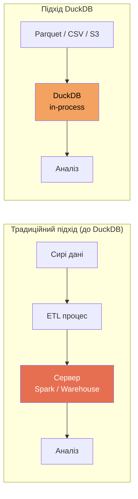

---

## 2. OLTP vs OLAP: DuckDB vs PostgreSQL

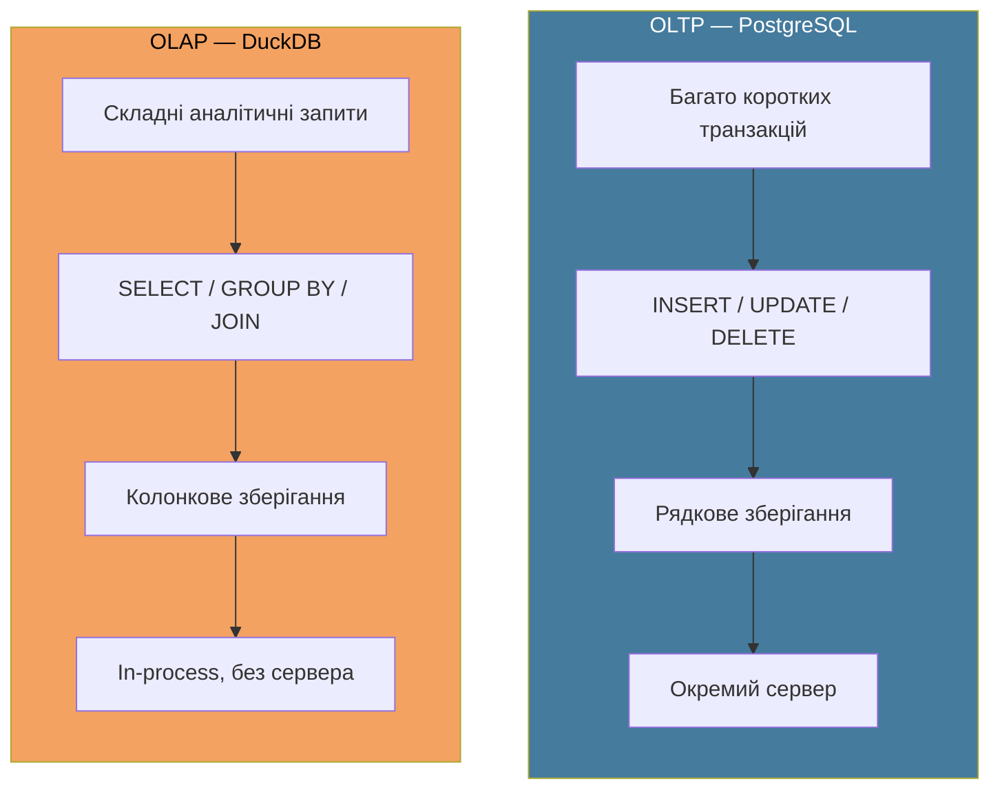

| Характеристика | PostgreSQL (OLTP) | DuckDB (OLAP) |
|---|---|---|
| Оптимізований для | Транзакцій | Аналітики |
| Формат зберігання | Рядковий | Колонковий |
| Запуск | Окремий сервер | В процесі (in-process) |
| Конкурентні запити | Багато | Кілька складних |
| Типовий запит | `INSERT`, `UPDATE` | `GROUP BY`, `JOIN`, аґреґати |

---

## 3. Колонкове зберігання — чому це швидко

Традиційні бази зберігають дані **рядками** — усі поля одного запису разом. Аналітичні системи (як DuckDB та Parquet) зберігають дані **колонками** — усі значення однієї колонки разом.

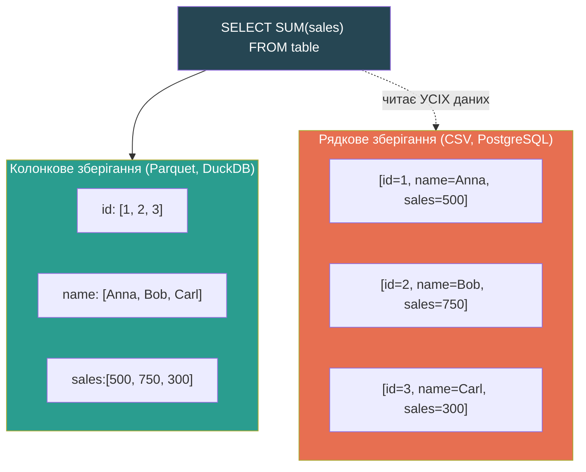

**Перевага:** для запиту `SELECT SUM(sales)` колонкова БД читає лише колонку `sales`, ігноруючи `id` та `name`. При мільйонах рядків — це різниця між секундами та хвилинами.

---

## 4. Архітектура DuckDB — внутрішній пайплайн

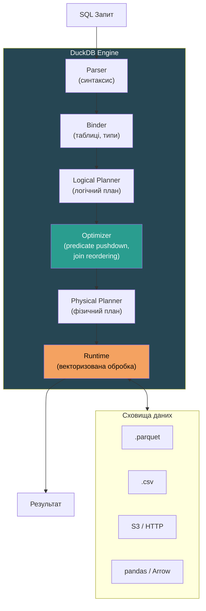

### Ключові компоненти:

| Компонент | Роль |
|---|---|
| **Parser** | Перевіряє SQL на синтаксичні помилки |
| **Binder** | Перевіряє наявність таблиць, колонок і типів |
| **Logical Planner** | Будує логічний план виконання |
| **Optimizer** | Застосовує оптимізації: predicate pushdown, перевпорядкування JOIN |
| **Physical Planner** | Перетворює логічний план на фізичні операції |
| **Runtime** | Векторизована паралельна обробка на всіх ядрах CPU |

---

## 5. Векторизоване виконання (Vectorized Execution)

Замість обробки **одного рядка** за раз DuckDB обробляє **вектори по 2048 значень** одночасно.

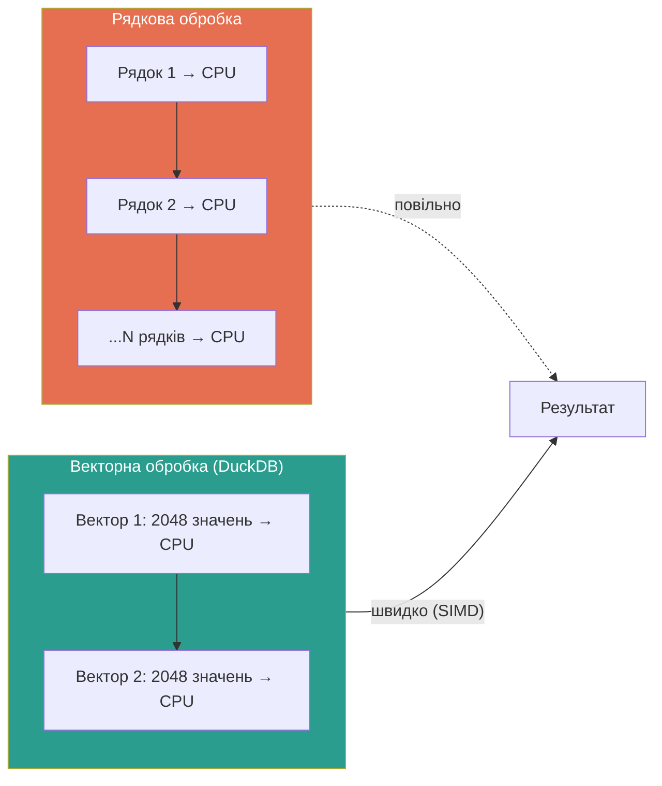

**Переваги векторизації:**
- Вектори вміщуються в кеш CPU → мінімум звернень до RAM
- SIMD-інструкції обробляють кілька значень за один такт процесора
- Менші накладні витрати на виконання порівняно з рядковою моделлю

---

## 6. Пайплайн виконання запиту: SCAN → FILTER → AGGREGATE

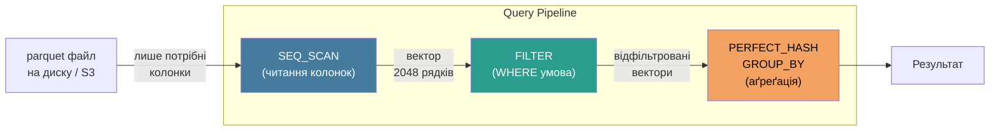

**Пізня матеріалізація (Late Materialization):** DuckDB завантажує повні рядки в пам'ять лише тоді, коли вони дійсно потрібні. До цього момент він оперує лише індексами та метаданими.

---

## 7. Apache Parquet — формат файлів

**Apache Parquet** — це відкритий колонковий формат файлів, розроблений для ефективного зберігання та читання аналітичних даних.

### Ієрархічна структура Parquet файлу

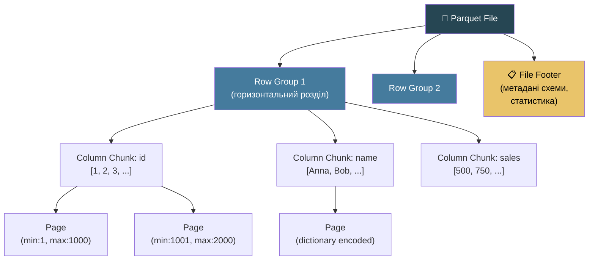

### Ключові концепції Parquet:

| Рівень | Опис |
|---|---|
| **File** | Весь файл з метаданими у футері |
| **Row Group** | Горизонтальний розділ (~1М рядків), одиниця паралельної обробки |
| **Column Chunk** | Усі значення однієї колонки в межах Row Group |
| **Page** | Найменша одиниця (стиснення + кодування) |
| **Footer** | Метадані: схема, статистика min/max на кожну сторінку |

---

## 8. Оптимізації Parquet: Predicate Pushdown і Column Pruning

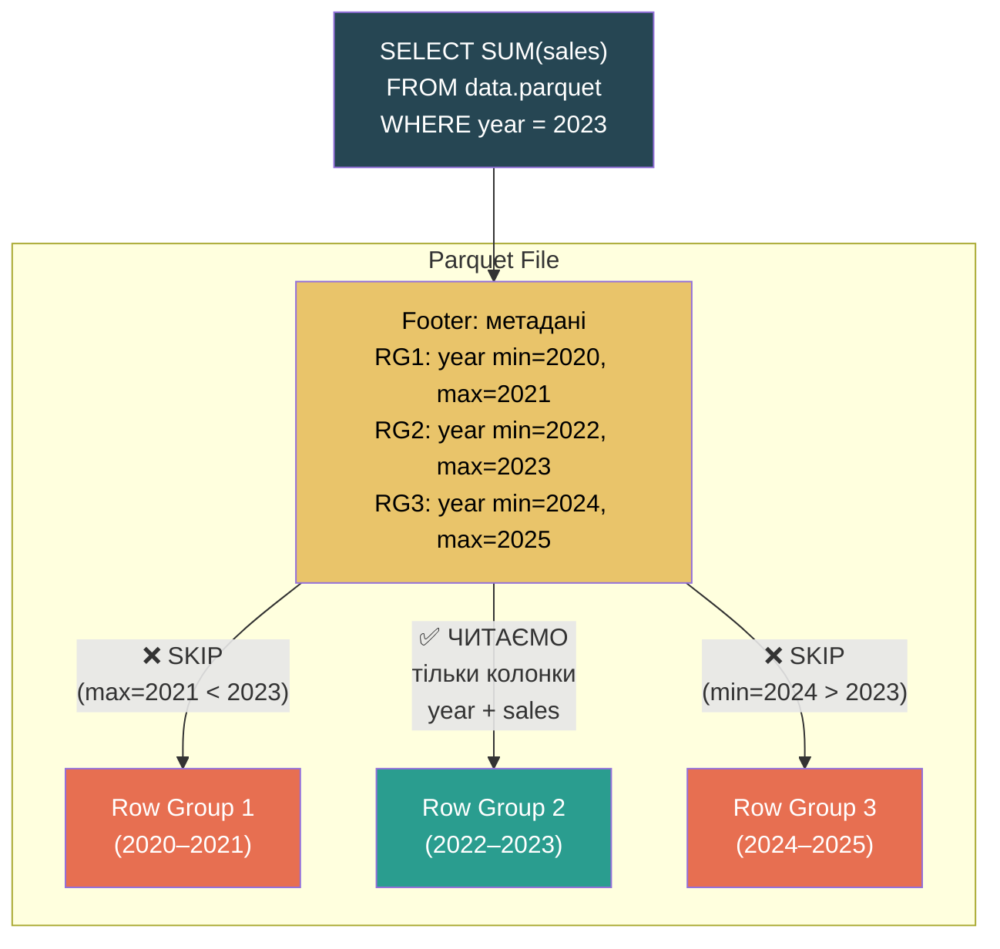

**Column Pruning (Projection Pushdown):** читаємо лише потрібні колонки (`year`, `sales`), ігноруємо решту.

**Predicate Pushdown (Filter Pushdown):** перевіряємо статистику min/max у метаданих Footer і пропускаємо цілі Row Groups без їх читання.

### Кодування та стиснення

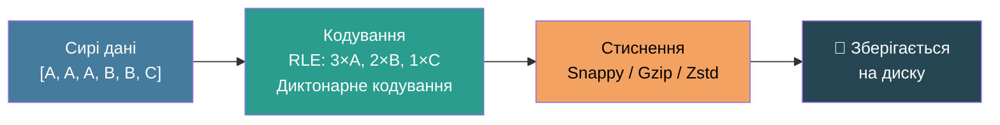

---

## 9. Архітектура Data Lake з DuckDB

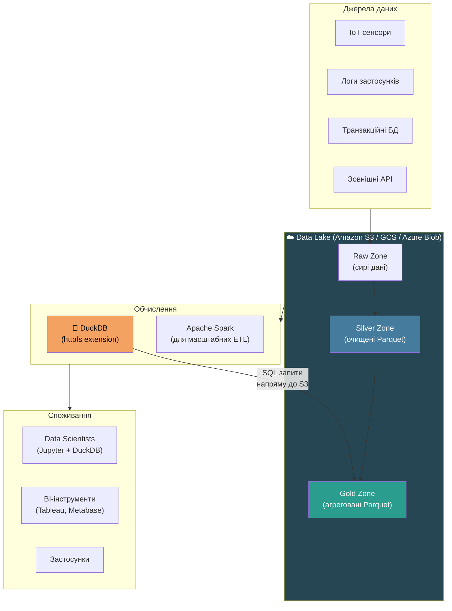

### Як DuckDB взаємодіє з Data Lake

1. **`httpfs` розширення** — дозволяє DuckDB читати файли напряму з S3/HTTP без завантаження
2. **Predicate pushdown** — фільтри застосовуються на рівні Parquet метаданих ще до читання даних
3. **HTTP Range Requests** — завантажуються лише потрібні байти конкретних Column Chunks
4. **Без постійного сервера** — немає витрат на idle-кластер, платиш лише за виконання запиту

---

## 10. Основні SQL-запити DuckDB

### Читання файлів "на льоту"

```sql
-- CSV з автовизначенням схеми
SELECT * FROM read_csv_auto('data.csv');

-- Parquet файл
SELECT * FROM read_parquet('data.parquet');

-- Кілька JSON файлів одночасно
SELECT * FROM read_json_auto(['file1.json', 'file2.json']);

-- Запит напряму до Amazon S3 (потрібне розширення httpfs)
SELECT * FROM 's3://my-bucket/data/sales.parquet';
```

### Створення таблиць та імпорт

```sql
-- Таблиця з CSV
CREATE TABLE sales AS SELECT * FROM read_csv_auto('sales.csv');

-- Завантаження Parquet у таблицю
COPY sales FROM 'data.parquet' (FORMAT PARQUET);
```

### Розвідувальний аналіз (EDA)

```sql
-- Структура таблиці
DESCRIBE sales;

-- Статистика по всіх колонках (min, max, avg, кількість унікальних)
SUMMARIZE sales;
```

### GROUP BY ALL і FILTER у агрегаціях

```sql
-- GROUP BY ALL — автоматично групує за всіма не-агрегованими колонками
SELECT department, region, SUM(amount)
FROM sales
GROUP BY ALL;

-- FILTER всередині агрегату — замість складного CASE WHEN
SELECT
    COUNT(*)                                    AS total_sales,
    SUM(amount) FILTER (WHERE region = 'EU')   AS eu_sales,
    SUM(amount) FILTER (WHERE region = 'US')   AS us_sales
FROM sales;
```

### ASOF JOIN для часових рядів

`ASOF JOIN` з'єднує кожен запис із **найближчим попереднім** записом в іншій таблиці — критично для аналізу нерівномірних часових рядів (біржові котирування, сенсорні дані).

```sql
-- Приєднуємо ціну на момент кожної транзакції
SELECT s.time, s.amount, p.price
FROM sales s
ASOF JOIN prices p ON p.time <= s.time;
```

```mermaid
gantt
    title ASOF JOIN: з'єднання транзакцій із котируваннями
    dateFormat HH:mm
    axisFormat %H:%M

    section Ціни (prices)
    price=100 :milestone, 09:00, 0m
    price=105 :milestone, 09:15, 0m
    price=110 :milestone, 09:45, 0m

    section Транзакції (sales)
    sale→price=100 :09:05, 5m
    sale→price=105 :09:20, 5m
    sale→price=105 :09:35, 5m
    sale→price=110 :09:50, 5m
```

### Віконні функції (Window Functions)

```sql
-- Ковзне середнє за 7 днів
SELECT
    date,
    sales,
    AVG(sales) OVER (
        ORDER BY date
        ROWS BETWEEN 6 PRECEDING AND CURRENT ROW
    ) AS moving_avg_7d
FROM daily_sales;

-- Рейтинг всередині кожного відділу
SELECT
    name,
    department,
    salary,
    DENSE_RANK() OVER (PARTITION BY department ORDER BY salary DESC) AS rank
FROM employees;
```

### Експорт результатів

```sql
-- Експорт у Parquet зі стисненням SNAPPY
COPY (SELECT * FROM sales WHERE year = 2023)
TO 'output_2023.parquet' (FORMAT PARQUET, CODEC 'SNAPPY');

-- Експорт усієї бази
EXPORT DATABASE 'backup_dir' (FORMAT PARQUET);
```

---

## 11. DuckDB в екосистемі Python / Data Science

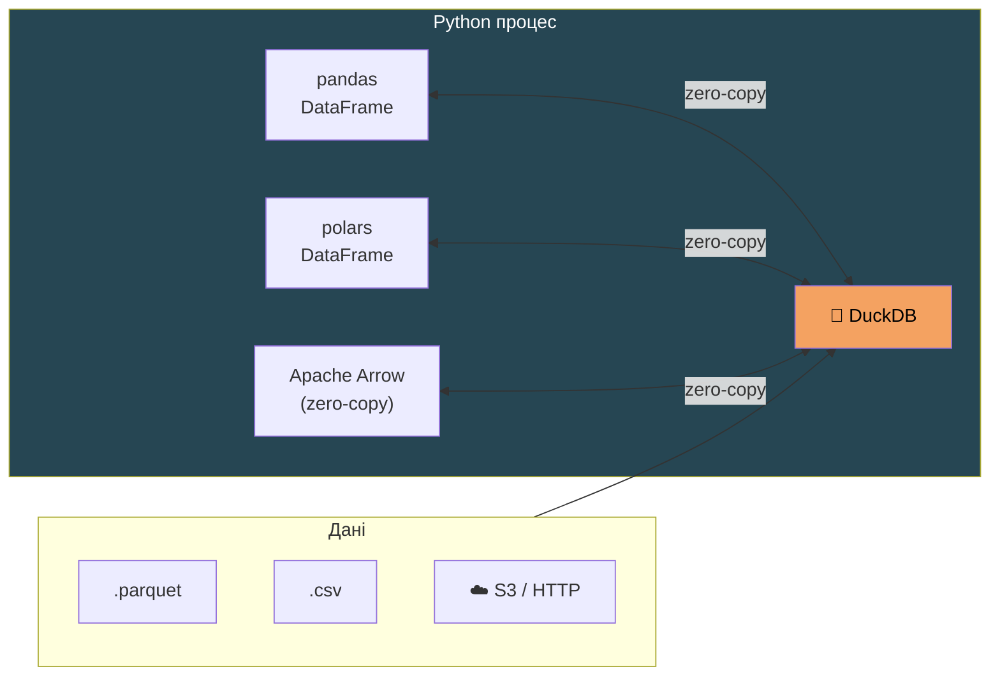

```python
import duckdb
import pandas as pd

# Запит до pandas DataFrame прямо через SQL
df = pd.read_csv('sales.csv')
result = duckdb.query("SELECT region, SUM(amount) FROM df GROUP BY ALL").df()

# Запит до Parquet на S3
duckdb.execute("INSTALL httpfs; LOAD httpfs;")
result = duckdb.query("SELECT * FROM 's3://bucket/data.parquet' LIMIT 100").df()
```

**Для geospatial аналізу** — розширення `spatial`:

```sql
INSTALL spatial; LOAD spatial;

-- Знайти всі точки в радіусі 10 км від Києва
SELECT name, ST_Distance(geom, ST_Point(30.5234, 50.4501)) AS dist_km
FROM cities
WHERE ST_DWithin(geom, ST_Point(30.5234, 50.4501), 0.1);
```

---

## 12. Data Lake: Schema-on-Read vs Schema-on-Write

### Дві парадигми зберігання та обробки даних

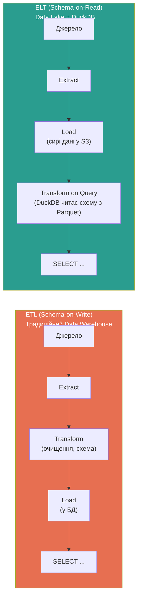

| | Schema-on-Write (ETL) | Schema-on-Read (ELT) |
|---|---|---|
| Коли визначається схема | Перед завантаженням | Під час запиту |
| Де зберігаються дані | В БД (власне сховище) | S3 / Parquet "як є" |
| Гнучкість | Низька (зміна схеми = міграція) | Висока (схему бачимо з метаданих) |
| Інструменти | PostgreSQL, MySQL, Redshift | DuckDB, Spark, Athena |
| Час до першого запиту | Довго (ETL pipeline) | Відразу після інгесту |

**Apache Parquet** є фундаментом Schema-on-Read: кожен `.parquet` файл містить самоописову схему у Footer, тому DuckDB (і Spark, і Athena) можуть читати структуру **без попереднього `CREATE TABLE`**.

---

## 13. DuckDB vs Традиційна БД: практичне порівняння

### Традиційний підхід (Schema-on-Write / ETL)

```sql
-- 1. Спочатку визначаємо схему
CREATE TABLE sales (id INT, amount DECIMAL, date DATE);

-- 2. Завантажуємо дані (копіювання у внутрішнє сховище БД)
COPY sales FROM 'sales_data.csv';

-- 3. Тільки тепер можна виконати аналіз
SELECT SUM(amount) FROM sales WHERE date > '2023-01-01';
```

### DuckDB Data Lake підхід (Schema-on-Read / ELT)

```sql
-- Встановлюємо розширення для роботи з S3
INSTALL httpfs;
LOAD httpfs;

-- Запит напряму до Parquet на S3 — без CREATE TABLE, без копіювання даних.
-- DuckDB автоматично зчитує схему з метаданих Parquet
-- та завантажує тільки колонки amount і date.
SELECT SUM(amount)
FROM 's3://my-data-lake/sales/2023/sales_data.parquet'
WHERE date > '2023-01-01';
```

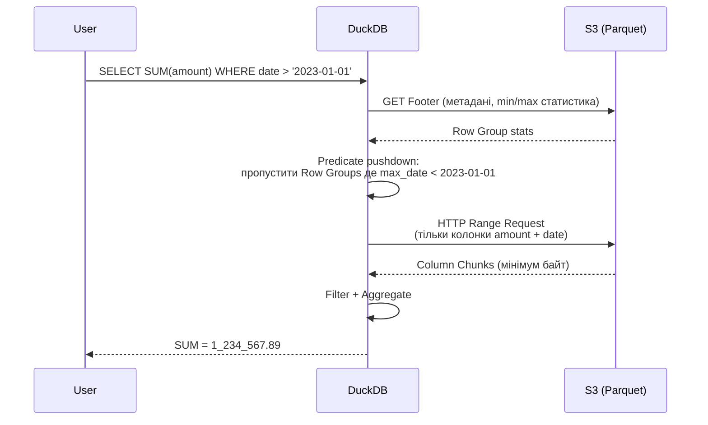

---

## 14. Glob-патерни та Views над Data Lake

Якщо у вас **тисячі Parquet файлів** у Data Lake, DuckDB дозволяє звертатись до них як до єдиної таблиці:

```sql
-- Читання всіх Parquet файлів у директорії рекурсивно
SELECT COUNT(*) FROM 's3://my-data-lake/sales/*/*.parquet';

-- Віртуальний View над усім Data Lake — без копіювання даних
CREATE OR REPLACE VIEW all_sales AS
FROM 's3://my-data-lake/sales/*/*.parquet';

-- Аналітика через View як звичайну таблицю
SELECT
    DATE_TRUNC('month', date) AS month,
    SUM(amount)               AS total_revenue
FROM all_sales
GROUP BY ALL
ORDER BY month;
```

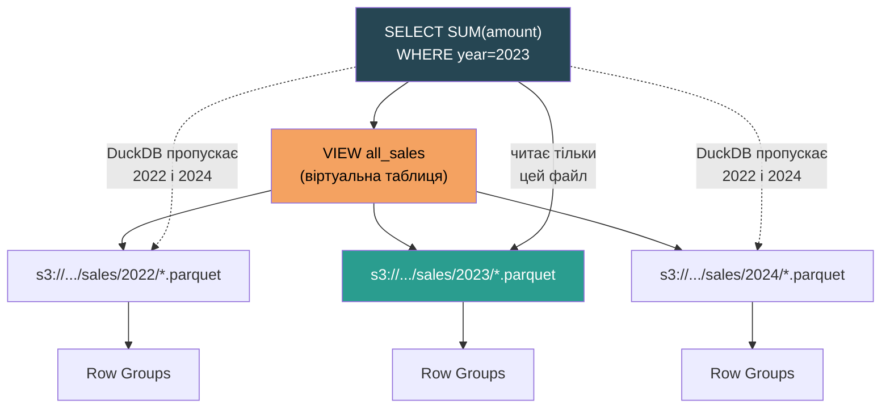

---

## 15. Data Lake — детально

**Data Lake (озеро даних)** — це централізоване сховище, яке приймає та зберігає величезні обсяги даних у їхньому **первісному, незміненому («сирому») форматі**.

На відміну від Data Warehouse (де дані потрібно спочатку очистити і структурувати), Data Lake приймає все:

| Тип даних | Приклади |
|---|---|
| **Структуровані** | Реляційні таблиці, CSV |
| **Напівструктуровані** | JSON, XML, Parquet |
| **Неструктуровані** | Зображення, аудіо, відео, логи |

Ключовий принцип: **schema-on-read** — структура застосовується не під час запису, а лише під час читання та аналізу.

---

## 16. Medallion Architecture (Архітектура Медальйон)

Сучасні Data Lake зазвичай організовані за рівневим принципом — **Medallion Architecture** — де дані поступово очищуються і трансформуються:

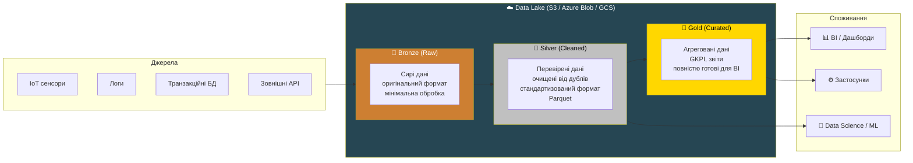

### Характеристики кожного шару:

| Шар | Дані | Трансформація | Хто використовує |
|---|---|---|---|
| **Bronze** | Сирі, незмінені | Мінімальна | Інженери даних |
| **Silver** | Очищені, перевірені | Дедуплікація, типізація | Data Scientists, ML |
| **Gold** | Агреговані, готові | Повна бізнес-логіка | BI, аналітики, кінцеві застосунки |

---

## 17. Data Swamp — «Болото даних»

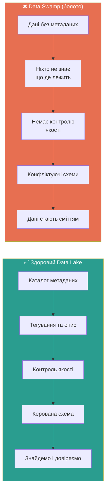

**Причини появи Data Swamp:**
- Відсутність каталогізації та опису датасетів
- Немає управління метаданими
- Нечіткий контроль доступу
- Дані зберігаються без документації про їх походження

**Рішення:** Apache Atlas, AWS Glue Data Catalog, Delta Lake, Apache Iceberg.

---

## 18. Сценарії використання Data Lake

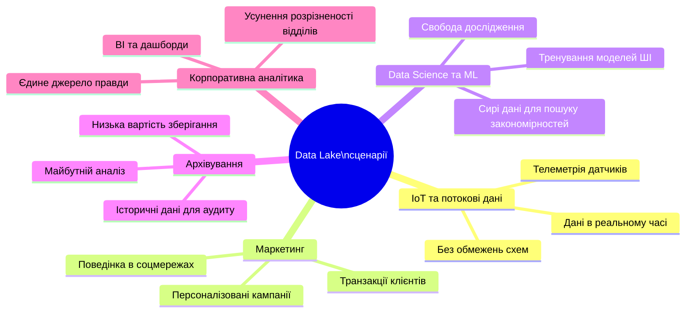

---

## 19. Data Lakehouse — гібридна архітектура

**Data Lakehouse** поєднує гнучкість Data Lake із надійністю Data Warehouse:

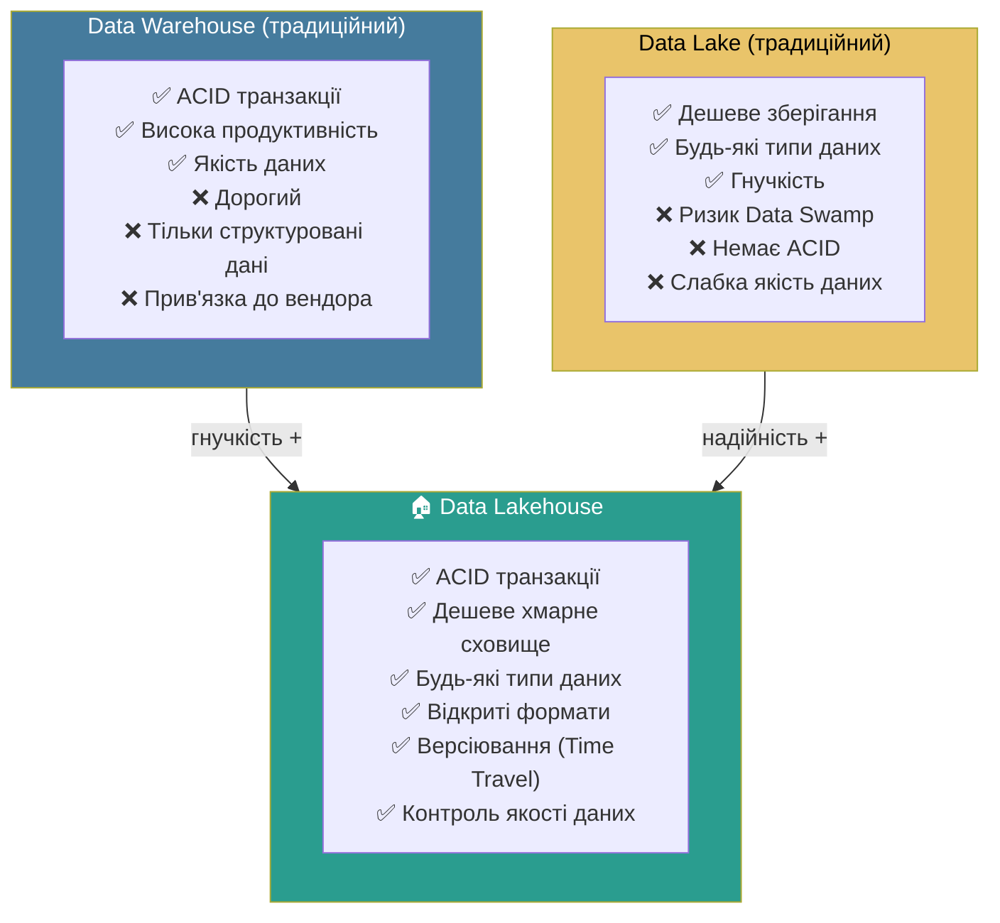

### Як це працює технічно

В основі Lakehouse — дешеве об'єктне сховище (S3/GCS) + **транзакційний шар управління метаданими** поверх Parquet файлів:

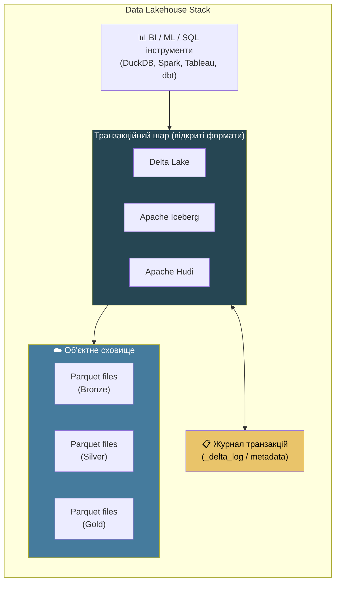

### Що додає транзакційний шар до Parquet:

| Можливість | Опис |
|---|---|
| **ACID транзакції** | Безпечні одночасні читання та записи без пошкодження даних |
| **Time Travel** | Звернення до попередніх версій даних (`VERSION AS OF 5`) |
| **Schema Evolution** | Додавання/зміна колонок без перезапису всіх файлів |
| **Контроль якості** | Запобігає потраплянню "сміттєвих" даних |
| **Z-ordering** | Фізичне кластеризування даних для прискорення запитів |

### Переваги Lakehouse:

```mermaid
graph LR
    subgraph BENEFITS["Переваги Data Lakehouse"]
        B1["Одна система\nдля всіх задач\n(BI + ML + ETL)"]
        B2["Немає дублювання\nданих між\nLake та Warehouse"]
        B3["Відкриті формати —\nбез прив'язки\nдо вендора"]
        B4["Дешеве зберігання +\nшвидкі запити"]
    end

    style BENEFITS fill:#2a9d8f,color:#fff
```

### Порівняння архітектур:

| | Data Warehouse | Data Lake | Data Lakehouse |
|---|---|---|---|
| Зберігання | Пропрієтарне | Object Storage | Object Storage |
| Формат | Внутрішній | Будь-який (CSV, Parquet) | Parquet + транзакційний шар |
| ACID | ✅ | ❌ | ✅ |
| Типи даних | Структуровані | Всі | Всі |
| Вартість | Висока | Низька | Низька |
| Версіювання | Обмежене | ❌ | ✅ (Time Travel) |
| Приклади | Snowflake, BigQuery | S3 + Spark | Delta Lake, Iceberg, Hudi |

---

## 20. Як правильно будувати каталоги Parquet файлів

### Hive-style партиціонування — основа ефективного доступу

DuckDB (як і Spark, Athena, Presto) підтримує **Hive-style partition pruning**: якщо структура директорій відповідає конвенції `key=value`, DuckDB **автоматично пропускає** непотрібні папки ще до читання будь-яких файлів.

```
s3://my-lake/sales/year=2023/month=07/day=15/data.parquet
                  ^^^^^^^^^^^^^^^^^^^^^^^^^^^
                  DuckDB читає це як WHERE умову
```

```mermaid
flowchart TD
    ROOT["s3://my-lake/sales/"]

    ROOT --> Y22["year=2022/"]
    ROOT --> Y23["year=2023/"]
    ROOT --> Y24["year=2024/"]

    Y23 --> M01["month=01/"]
    Y23 --> M07["month=07/"]
    Y23 --> M12["month=12/"]

    M07 --> D14["day=14/\npart-0.parquet\n(128 MB)"]
    M07 --> D15["day=15/\npart-0.parquet\npart-1.parquet"]
    M07 --> D16["day=16/\npart-0.parquet"]

    QUERY["SELECT SUM(amount)\nWHERE year=2023 AND month=7"]

    QUERY -- "❌ SKIP" --> Y22
    QUERY -- "✅ ЧИТАЄМО" --> Y23
    QUERY -- "❌ SKIP" --> Y24
    Y23 -- "❌ SKIP" --> M01
    Y23 -- "✅ ЧИТАЄМО" --> M07
    Y23 -- "❌ SKIP" --> M12

    style Y22 fill:#e76f51,color:#fff
    style Y24 fill:#e76f51,color:#fff
    style M01 fill:#e76f51,color:#fff
    style M12 fill:#e76f51,color:#fff
    style Y23 fill:#2a9d8f,color:#fff
    style M07 fill:#2a9d8f,color:#fff
    style QUERY fill:#264653,color:#fff
```

### Принципи вибору колонок для партиціонування

```mermaid
graph LR
    subgraph GOOD["✅ Хороші кандидати для партицій"]
        G1["Дата / час\nyear= month= day="]
        G2["Регіон / країна\ncountry= region="]
        G3["Тип події\nevent_type="]
        G4["Статус запису\nstatus="]
    end

    subgraph BAD["❌ Погані кандидати"]
        B1["User ID\n(мільйони унікальних значень\n→ мільйони папок)"]
        B2["Сума / ціна\n(неперервні числа)"]
        B3["Email\n(висока кардинальність)"]
        B4["UUID / хеш"]
    end

    style GOOD fill:#2a9d8f,color:#fff
    style BAD fill:#e76f51,color:#fff
```

**Правило:** партиціонуй за колонками з **низькою кардинальністю** (мало унікальних значень), за якими ти **часто фільтруєш** у `WHERE`.

---

### Оптимальний розмір файлів

```mermaid
xychart-beta
    title "Вплив розміру Parquet-файлу на продуктивність"
    x-axis ["1 KB", "1 MB", "10 MB", "128 MB", "512 MB", "1 GB"]
    y-axis "Відносна швидкість запиту" 0 --> 10
    bar [1, 2, 5, 10, 7, 4]
```

| Розмір файлу | Проблема | Рекомендація |
|---|---|---|
| < 1 MB | **Small file problem**: мільйони файлів → overhead на відкриття кожного | ❌ Уникати |
| 10–50 MB | Прийнятно для batch ETL | ✅ |
| **128–256 MB** | Оптимальний баланс: один Row Group на файл, максимальний паралелізм | ✅ Ідеально |
| > 500 MB | Складно перезаписувати, менший паралелізм читання | ⚠️ Обережно |
| > 1 GB | Неможливо ефективно оновити частину файлу | ❌ |

---

### Рекомендована структура директорій для різних сценаріїв

#### Сценарій 1: Логи / події (часто фільтруємо за датою)

```
data-lake/
└── events/
    ├── year=2024/
    │   ├── month=01/
    │   │   ├── day=01/
    │   │   │   ├── part-00000.parquet   ← ~128 MB
    │   │   │   └── part-00001.parquet
    │   │   └── day=02/
    │   └── month=02/
    └── year=2025/
```

```sql
-- DuckDB автоматично прочитає партиційні ключі як колонки
SELECT event_type, COUNT(*)
FROM read_parquet('s3://data-lake/events/**/*.parquet', hive_partitioning=true)
WHERE year=2024 AND month=1
GROUP BY ALL;
```

#### Сценарій 2: Мульти-тенантні дані (фільтр за клієнтом і датою)

```
data-lake/
└── transactions/
    ├── tenant_id=acme/
    │   ├── year=2024/month=01/data.parquet
    │   └── year=2024/month=02/data.parquet
    ├── tenant_id=globex/
    │   └── year=2024/month=01/data.parquet
    └── tenant_id=initech/
```

```sql
SELECT SUM(amount)
FROM read_parquet('s3://data-lake/transactions/**/*.parquet', hive_partitioning=true)
WHERE tenant_id = 'acme' AND year = 2024;
-- DuckDB пропускає всі папки інших tenant_id
```

#### Сценарій 3: IoT / часові ряди (висока частота запису)

```
data-lake/
└── sensors/
    ├── device_type=temperature/
    │   ├── year=2024/month=01/
    │   │   └── hour=00/data.parquet    ← партиції по годинах
    │   └── year=2024/month=01/
    │       └── hour=01/data.parquet
    └── device_type=pressure/
```

---

### Повна архітектура каталогу: Medallion + Hive Partitioning

```mermaid
graph TB
    subgraph S3["☁️ S3 Bucket: company-data-lake/"]
        direction TB

        subgraph BRONZE_DIR["bronze/"]
            B_RAW["orders/\n  source=shopify/\n    year=2024/month=07/\n      raw_001.json.gz\n  source=woocommerce/\n    year=2024/month=07/\n      raw_001.csv.gz"]
        end

        subgraph SILVER_DIR["silver/"]
            S_CLEAN["orders/\n  year=2024/\n    month=07/\n      day=01/part-0.parquet ✅\n      day=02/part-0.parquet ✅\n  (дедупліковані, типізовані,\n   стандартна схема)"]
        end

        subgraph GOLD_DIR["gold/"]
            G_AGG["revenue_by_region/\n  year=2024/month=07/\n    summary.parquet\n\nproduct_rankings/\n  year=2024/month=07/\n    rankings.parquet"]
        end

        BRONZE_DIR --> SILVER_DIR --> GOLD_DIR
    end

    style BRONZE_DIR fill:#cd7f32,color:#fff
    style SILVER_DIR fill:#888,color:#fff
    style GOLD_DIR fill:#b8860b,color:#fff
```

---

### DuckDB: читання партиціонованого каталогу

```sql
-- hive_partitioning=true — DuckDB читає year/month/day як колонки
CREATE OR REPLACE VIEW orders AS
SELECT *
FROM read_parquet(
    's3://company-data-lake/silver/orders/**/*.parquet',
    hive_partitioning = true
);

-- Partition pruning спрацює автоматично
SELECT
    region,
    SUM(amount) AS revenue
FROM orders
WHERE year = 2024 AND month = 7
GROUP BY ALL
ORDER BY revenue DESC;

-- Перевіримо фізичний план — покаже, які партиції скановані
EXPLAIN SELECT SUM(amount) FROM orders WHERE year = 2024 AND month = 7;
```

---

## 21. Medallion Architecture: погляд архітектора

### Детальна схема потоків даних

```mermaid
flowchart TD
    subgraph INGEST["Інгест (Ingestion Layer)"]
        direction LR
        BATCH["Batch\n(щоденний ETL)"]
        STREAM["Streaming\n(Kafka / Kinesis)"]
        CDC["CDC\n(Change Data Capture\nз OLTP БД)"]
    end

    subgraph BRONZE["🥉 Bronze Layer\n(Raw Zone)"]
        B1["Формат: оригінальний\n(JSON, CSV, Avro)"]
        B2["Схема: не змінюється,\nнемає трансформацій"]
        B3["Партиціонування:\nyear= / month= / day=\n+ source="]
        B4["Зберігання: назавжди\n(аудит, відтворення)"]
    end

    subgraph SILVER["🥈 Silver Layer\n(Cleaned Zone)"]
        S1["Формат: Parquet + Snappy"]
        S2["Трансформації:\n• Дедуплікація\n• Типізація колонок\n• Стандартизація назв\n• Обробка NULL\n• Базова валідація"]
        S3["Партиціонування:\nyear= / month= / day=\n(без source=)"]
        S4["Схема: фіксована,\nверсіонується"]
    end

    subgraph GOLD["🥇 Gold Layer\n(Curated Zone)"]
        G1["Формат: Parquet + Zstd\n(максимальне стиснення)"]
        G2["Трансформації:\n• Бізнес-аґреґації\n• JOIN між доменами\n• KPI-розрахунки\n• Денормалізація для BI"]
        G3["Партиціонування:\nПід конкретний use-case"]
        G4["Оновлення: часте\n(щоденно / щогодини)"]
    end

    subgraph CONSUMERS["Споживачі"]
        BI["📊 BI Tools\n(Tableau, Metabase)"]
        DS_ML["🔬 DS / ML\n(Jupyter + DuckDB)"]
        API_C["⚙️ API / App"]
        AUDIT["🔍 Аудит / Compliance\n(тільки Bronze)"]
    end

    INGEST --> BRONZE
    BRONZE --> SILVER
    SILVER --> GOLD
    GOLD --> BI
    GOLD --> API_C
    SILVER --> DS_ML
    BRONZE --> AUDIT

    style BRONZE fill:#cd7f32,color:#fff
    style SILVER fill:#888,color:#fff
    style GOLD fill:#b8860b,color:#fff
    style INGEST fill:#264653,color:#fff
    style CONSUMERS fill:#457b9d,color:#fff
```

---

### Що відбувається на кожному шарі — детально

#### Bronze: правила шару

```mermaid
flowchart LR
    IN["Вхідні дані\n(будь-який формат)"] --> BRONZE_RULE

    subgraph BRONZE_RULE["Bronze правила"]
        direction TB
        R1["✅ Зберігати AS-IS\n(без змін схеми)"]
        R2["✅ Додавати\nметаколонки:\n_ingested_at\n_source_system\n_file_name"]
        R3["✅ Партиціонувати\nза датою інгесту\n(не бізнес-датою!)"]
        R4["❌ НЕ трансформувати\nбізнес-логіку"]
        R5["❌ НЕ видаляти дані\n(тільки append)"]
    end

    style BRONZE_RULE fill:#cd7f32,color:#fff
```

#### Silver: правила шару

```mermaid
flowchart LR
    subgraph SILVER_RULE["Silver правила"]
        direction TB
        R1["✅ Єдина схема\nнезалежно від source"]
        R2["✅ Ідемпотентні\nтрансформації\n(повторний запуск = той самий результат)"]
        R3["✅ Дедуплікація\n(за business key + timestamp)"]
        R4["✅ Партиціонування\nза бізнес-датою\n(не датою інгесту)"]
        R5["❌ НЕ робити\nскладних JOIN\nміж доменами"]
        R6["❌ НЕ агрегувати\nбізнес-метрики"]
    end

    style SILVER_RULE fill:#888,color:#fff
```

#### Gold: правила шару

```mermaid
flowchart LR
    subgraph GOLD_RULE["Gold правила"]
        direction TB
        R1["✅ Денормалізація\n(широкі таблиці для BI)"]
        R2["✅ Конкретні\nuse-case таблиці\n(не 'все в одному')"]
        R3["✅ SLA на свіжість\n(напр. оновлення до 06:00)"]
        R4["✅ Документація\nкожної метрики"]
        R5["❌ НЕ зберігати\nсирі записи"]
        R6["❌ НЕ змішувати\nгранулярності в одній таблиці"]
    end

    style GOLD_RULE fill:#b8860b,color:#fff
```

---

### Масштабованість: від 10 GB до 10 PB

```mermaid
graph TB
    subgraph SMALL["Малий масштаб\n(до ~100 GB)\nDuckDB alone"]
        SM1["DuckDB локально\nчитає Parquet з S3"]
        SM2["Один процес,\nодин аналітик"]
        SM3["Обробка: хвилини"]
    end

    subgraph MEDIUM["Середній масштаб\n(100 GB – 10 TB)\nDuckDB + оркестрація"]
        ME1["dbt + DuckDB\nдля трансформацій"]
        ME2["Airflow / Prefect\nдля оркестрації"]
        ME3["Hive partitioning\nобов'язковий"]
        ME4["Розмір файлів: 128–256 MB"]
    end

    subgraph LARGE["Великий масштаб\n(10 TB – 1 PB)\nSpark / Iceberg"]
        LA1["Apache Spark\nдля ETL"]
        LA2["Apache Iceberg\n/ Delta Lake"]
        LA3["AWS Glue / Databricks"]
        LA4["DuckDB — тільки\nдля аналітиків\n(Gold шар)"]
    end

    subgraph XLARGE["Дуже великий\n(1 PB+)\nкастомна архітектура"]
        XL1["Розподілені кластери"]
        XL2["Data Mesh\n(доменна власність)"]
        XL3["Окремі каталоги\nна домен"]
    end

    SMALL --> MEDIUM --> LARGE --> XLARGE

    style SMALL fill:#2a9d8f,color:#fff
    style MEDIUM fill:#457b9d,color:#fff
    style LARGE fill:#264653,color:#fff
    style XLARGE fill:#1d3557,color:#fff
```

---

## 22. Обмеження та антипатерни

### Критичні обмеження DuckDB

```mermaid
graph TD
    subgraph LIMITS["Обмеження DuckDB"]
        L1["❌ Не для конкурентного запису\n(один writer за раз)"]
        L2["❌ Не заміна OLTP\n(немає рядкових UPDATE/INSERT\nна мільйони транзакцій/сек)"]
        L3["❌ Обмеження RAM для\nдуже великих JOIN\n(spill to disk, але повільно)"]
        L4["❌ Немає вбудованого\nTime Travel без Delta/Iceberg"]
        L5["❌ Single-node\n(немає вбудованого\nрозподіленого виконання)"]
    end

    subgraph SOLUTIONS["Рішення"]
        S1["→ Використовуй append-only\nParquet або Delta Lake"]
        S2["→ Залиши PostgreSQL\nдля OLTP"]
        S3["→ Правильно партиціонуй,\nщоб JOIN менший датасет"]
        S4["→ Delta Lake / Iceberg\nповерх Parquet"]
        S5["→ Для TB+ використовуй\nSpark або MotherDuck"]
    end

    L1 --> S1
    L2 --> S2
    L3 --> S3
    L4 --> S4
    L5 --> S5

    style LIMITS fill:#e76f51,color:#fff
    style SOLUTIONS fill:#2a9d8f,color:#fff
```

---

### Антипатерни партиціонування

```mermaid
flowchart TD
    subgraph ANTI["❌ Антипатерни"]
        A1["Over-partitioning\n(партиції за user_id,\nмільйони папок)"]
        A2["Wrong partition key\n(фільтруємо за region,\nале партиціонуємо за source)"]
        A3["Small files\n(тисячі файлів по 1 KB\nзамість десятків по 128 MB)"]
        A4["Mutable Parquet\n(перезапис файлів\nзамість append)"]
        A5["No sorting\nвсередині файлу\n(повільний predicate pushdown\nна Row Group рівні)"]
    end

    subgraph FIX["✅ Рішення"]
        F1["Партиціонуй за датою\nабо категорією\n(< 10k папок)"]
        F2["Вирівняй partition key\nз WHERE-фільтрами запитів"]
        F3["Компактуй файли:\nCOPY ... TO з GROUP BY\nабо використовуй OPTIMIZE\nв Delta Lake"]
        F4["Тільки append:\nдодавай нові файли,\nне перезаписуй старі"]
        F5["Сортуй дані перед записом:\nORDER BY date, region\nперед COPY TO PARQUET"]
    end

    A1 --> F1
    A2 --> F2
    A3 --> F3
    A4 --> F4
    A5 --> F5

    style ANTI fill:#e76f51,color:#fff
    style FIX fill:#2a9d8f,color:#fff
```

---

### Рецепт: компактування small files через DuckDB

Після тривалого стрімінгу часто накопичуються тисячі дрібних файлів. DuckDB дозволяє їх компактувати без зовнішніх інструментів:

```sql
-- Зчитуємо всі маленькі файли за місяць і записуємо один великий
COPY (
    SELECT *
    FROM read_parquet(
        's3://lake/silver/events/year=2024/month=07/**/*.parquet',
        hive_partitioning = true
    )
    ORDER BY event_time, region   -- сортування для кращого predicate pushdown
)
TO 's3://lake/silver/events/year=2024/month=07/compacted.parquet'
(FORMAT PARQUET, CODEC 'ZSTD', ROW_GROUP_SIZE 131072);
-- ROW_GROUP_SIZE 131072 = 128K рядків на один Row Group
```

---

### Рецепт: повна побудова Silver шару з Bronze

```python
import duckdb

con = duckdb.connect()
con.execute("INSTALL httpfs; LOAD httpfs;")
con.execute("SET s3_region='eu-central-1';")

# Bronze → Silver: читаємо, чистимо, записуємо партиціонований Parquet
con.execute("""
    COPY (
        SELECT
            order_id,
            CAST(customer_id AS VARCHAR)          AS customer_id,
            CAST(amount AS DOUBLE)                AS amount,
            CAST(order_date AS DATE)              AS order_date,
            LOWER(TRIM(region))                   AS region,
            YEAR(order_date)                      AS year,
            MONTH(order_date)                     AS month,
            DAY(order_date)                       AS day,
            NOW()                                 AS _processed_at
        FROM read_parquet(
            's3://lake/bronze/orders/**/*.parquet',
            hive_partitioning = true
        )
        WHERE order_id IS NOT NULL             -- базова валідація
          AND amount > 0
        QUALIFY ROW_NUMBER() OVER (
            PARTITION BY order_id
            ORDER BY _ingested_at DESC
        ) = 1                                  -- дедуплікація: беремо останню версію
        ORDER BY order_date, region
    )
    TO 's3://lake/silver/orders/'
    (
        FORMAT PARQUET,
        CODEC 'SNAPPY',
        PARTITION_BY (year, month, day),       -- Hive-style партиціонування
        OVERWRITE_OR_IGNORE true
    )
""")
```

---

### Рецепт: Gold шар — агрегована аналітика

```sql
-- Gold: щоденна revenue-таблиця для BI дашборду
COPY (
    SELECT
        year,
        month,
        region,
        COUNT(DISTINCT customer_id)  AS unique_customers,
        COUNT(*)                     AS total_orders,
        SUM(amount)                  AS revenue,
        AVG(amount)                  AS avg_order_value,
        PERCENTILE_CONT(0.5)
            WITHIN GROUP (ORDER BY amount) AS median_order_value
    FROM read_parquet(
        's3://lake/silver/orders/**/*.parquet',
        hive_partitioning = true
    )
    GROUP BY ALL
    ORDER BY year, month, region
)
TO 's3://lake/gold/revenue_by_region/'
(
    FORMAT PARQUET,
    CODEC 'ZSTD',           -- ZSTD краще для Gold: рідко читається, максимальне стиснення
    PARTITION_BY (year, month)
);
```

---

### Вибір кодека стиснення залежно від шару

```mermaid
graph LR
    subgraph CODEC["Вибір кодека Parquet"]
        BRONZE_C["🥉 Bronze\nБез стиснення\nабо Snappy\n(швидкий запис,\nчасто перечитуємо)"]
        SILVER_C["🥈 Silver\nSnappy\n(баланс швидкості\nта стиснення)"]
        GOLD_C["🥇 Gold\nZstd (рівень 3-9)\n(максимальне стиснення,\nповільний запис —\nок для batch)"]
    end

    BRONZE_C --> SILVER_C --> GOLD_C

    style BRONZE_C fill:#cd7f32,color:#fff
    style SILVER_C fill:#888,color:#fff
    style GOLD_C fill:#b8860b,color:#fff
```

| Кодек | Стиснення | Швидкість запису | Швидкість читання | Коли використовувати |
|---|---|---|---|---|
| **None** | — | Максимальна | Максимальна | Bronze (сирі дані, великі файли) |
| **Snappy** | Середнє | Висока | Висока | Silver (операційні дані) |
| **Zstd** | Найкраще | Середня | Висока | Gold (архів, рідко пишемо) |
| **Gzip** | Добре | Повільна | Середня | Сумісність із застарілими системами |

---

## Підсумок

```mermaid
mindmap
  root((DuckDB))
    Архітектура
      In-process / без сервера
      Колонкове зберігання
      Векторизоване виконання
      Пізня матеріалізація
    Parquet
      Row Groups
      Column Chunks
      Predicate Pushdown
      Column Pruning
      RLE + Snappy/Zstd
    Data Lake
      Schema-on-Read
      Medallion Architecture
      Bronze / Silver / Gold
      Ризик Data Swamp
    Data Lakehouse
      ACID + Object Storage
      Delta Lake / Iceberg
      Time Travel
      Відкриті формати
    SQL
      read_parquet / read_csv_auto
      GROUP BY ALL
      ASOF JOIN
      Window Functions
      SUMMARIZE / DESCRIBE
    Інтеграція
      pandas zero-copy
      Apache Arrow
      spatial extension
```
