# PostgreSQL — Архітектура, Схеми та Документація

> Урок 30 | Модуль 3 | Python Course  
> Підключення: `host=localhost port=5432 user=student password=python2024 dbname=course_db`

---

## 1. PostgreSQL як система — загальна архітектура

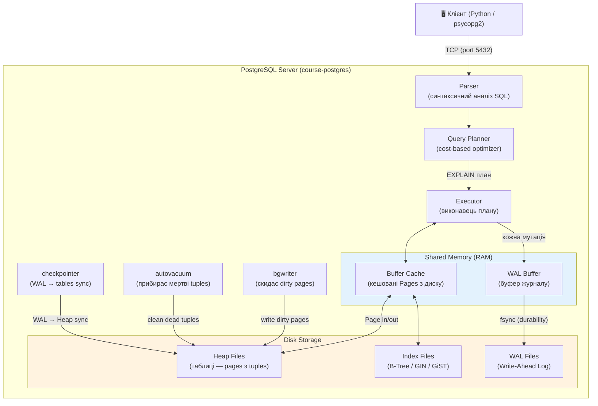

---

## 2. Фізичне зберігання: Heap Files → Pages → Tuples

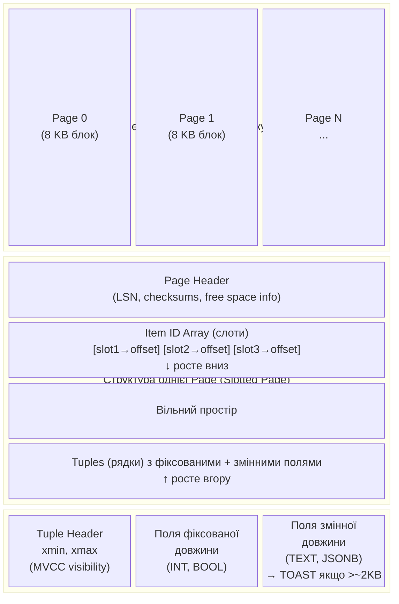

### Ключові механізми зберігання

| Концепція | Деталь |
|-----------|--------|
| **Page (Блок)** | 8 KB за замовчуванням; мінімальна одиниця диск↔RAM I/O |
| **Slotted Pages** | Масив слотів-покажчиків на початку page → рядки ростуть з кінця назустріч |
| **Buffer Cache** | Кешує hot pages в RAM; LRU витіснення; `shared_buffers = 25% RAM` |
| **TOAST** | `The Oversized-Attribute Storage Technique` — великі значення (>~2 KB) виносяться в окрему таблицю з посиланням |
| **Alignment** | Padding між полями для вирівнювання по 4/8 байт (процесорна вимога) |

---

## 3. MVCC — Багатоверсійне управління конкурентністю

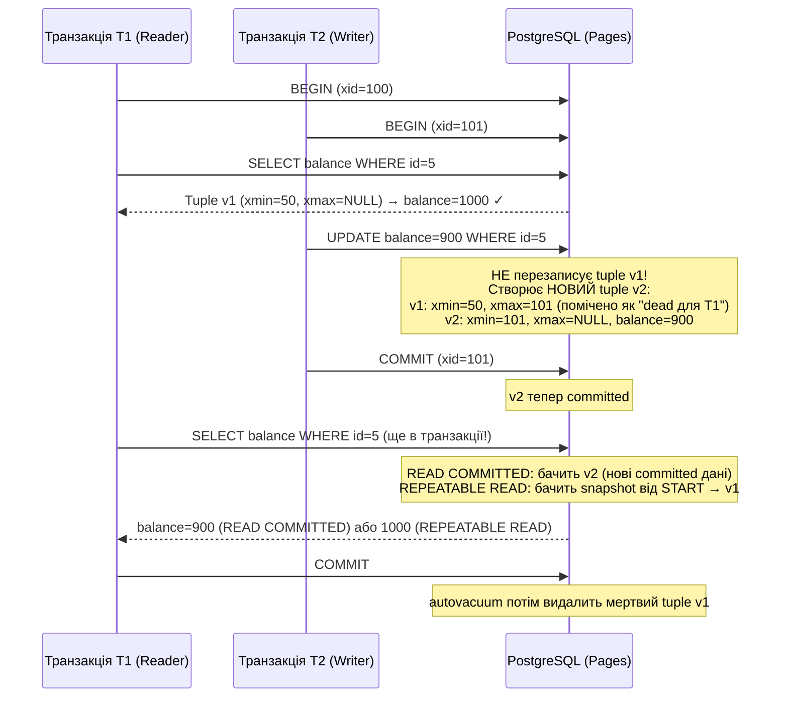

### Правило MVCC

> **Читачі не блокують письменників, письменники не блокують читачів.**
> 
> Блокування на рівні рядків відбувається ТІЛЬКИ коли два процеси намагаються **змінити один рядок одночасно**.

---

## 4. WAL (Write-Ahead Log) — гарантія Durability

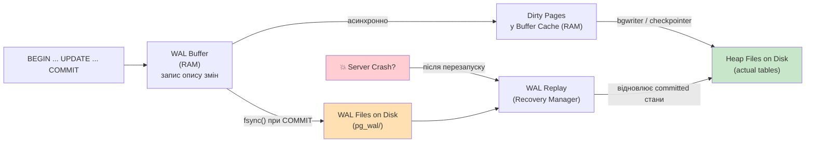

### WAL = гарантія без жертви продуктивністю

| Без WAL | З WAL |
|---------|-------|
| Кожен COMMIT → fsync основних файлів таблиць (повільно) | COMMIT → fsync лише WAL (швидкий sequential I/O) |
| Crash → невідомий стан | Crash → WAL Replay відновлює точний стан |
| Random I/O по таблицях | Sequential I/O в WAL log (набагато швидше) |

---

## 5. Query Planner — вибір плану виконання

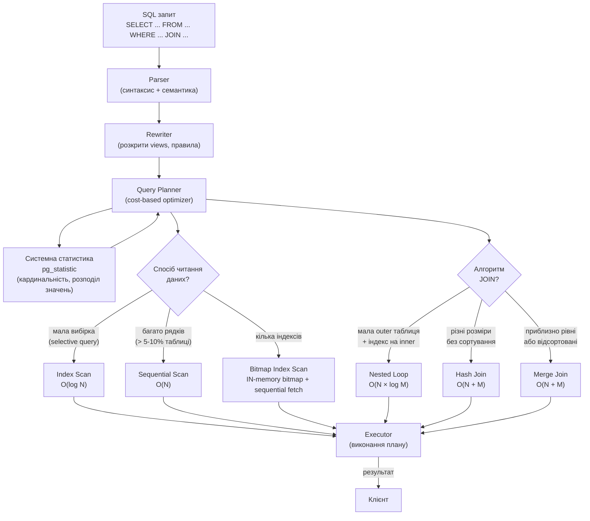

---

## 6. Типи індексів PostgreSQL

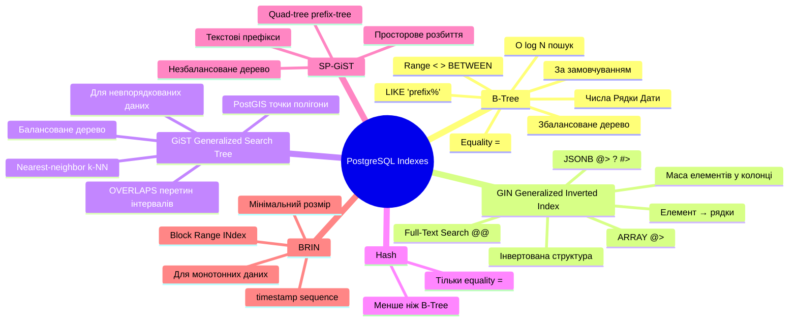

### Коли який індекс використовувати

| Задача | Індекс | SQL приклад |
|--------|--------|-------------|
| Пошук по первинному ключу | B-Tree (автоматично) | `WHERE id = 5` |
| Сортування, BETWEEN | B-Tree | `WHERE age BETWEEN 20 AND 30` |
| JSONB полів | GIN | `WHERE data @> '{"status":"active"}'` |
| Full-Text Search | GIN | `WHERE ts_vec @@ to_tsquery('term')` |
| Масиви | GIN | `WHERE tags @> ARRAY['python']` |
| Геопросторові | GiST (PostGIS) | `WHERE ST_DWithin(point, center, 1000)` |
| Лише equality (= ) | Hash | `WHERE status = 'active'` |
| Великі монотонні таблиці | BRIN | `WHERE created_at > '2024-01-01'` |

### Трейдофи індексів

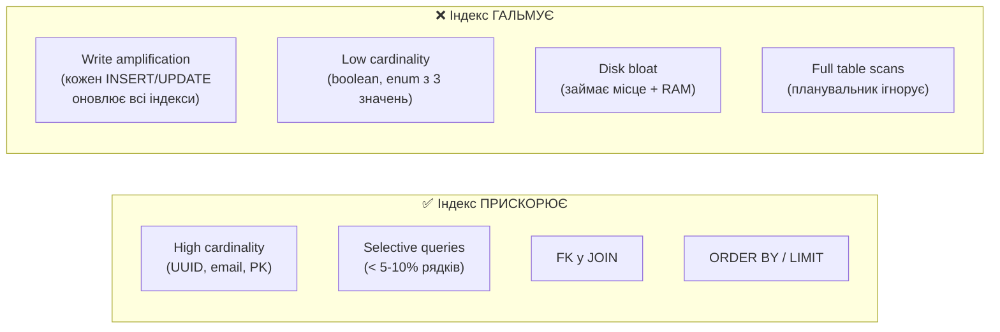

---

## 7. Рівні ізоляції та аномалії

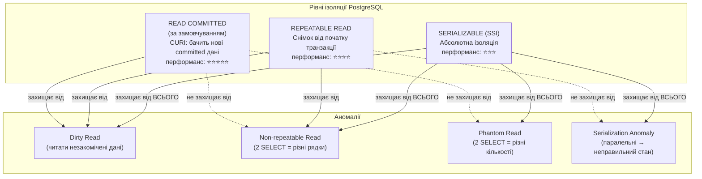

---

## 8. Lifecycle транзакції в psycopg2

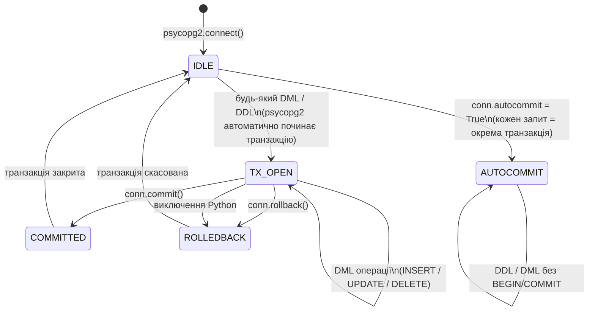

### psycopg2 — ключові відмінності від sqlite3

| | SQLite (sqlite3) | PostgreSQL (psycopg2) |
|--|------------------|-----------------------|
| Параметри | `?` | `%s` |
| Dict результати | `conn.row_factory = Row` | `cursor_factory=RealDictCursor` |
| JSON | `json.dumps()` вручну | `Json()` адаптер |
| Autocommit | Немає | `conn.autocommit = True` |
| Isolation level | Обмежений | `BEGIN ISOLATION LEVEL ...` |
| RETURNING | Немає | `INSERT ... RETURNING id` |

---

## 9. OLTP vs OLAP — PostgreSQL vs Колонкові БД

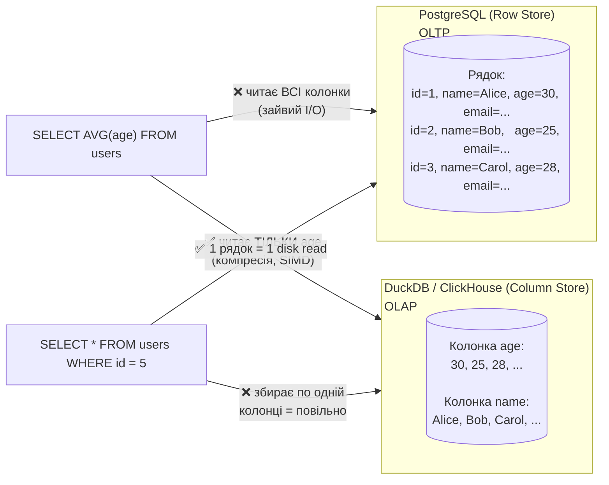

### Коли PostgreSQL, коли DuckDB/ClickHouse?

| Сценарій | PostgreSQL | DuckDB / ClickHouse |
|----------|------------|---------------------|
| CRUD операції | ✅ Ідеально | ❌ |
| Багато паралельних users | ✅ MVCC | ❌ |
| ACL / ролі / безпека | ✅ DCL | ❌ |
| Реплікація / HA | ✅ Streaming | ❌ |
| Агрегати по мільярдах рядків | ❌ Повільно | ✅ 10-100x швидше |
| Аналітичні дашборди | ❌ | ✅ |
| Embedded (без сервера) | ❌ | ✅ DuckDB |

---

## 10. PostgreSQL Extensions Ecosystem

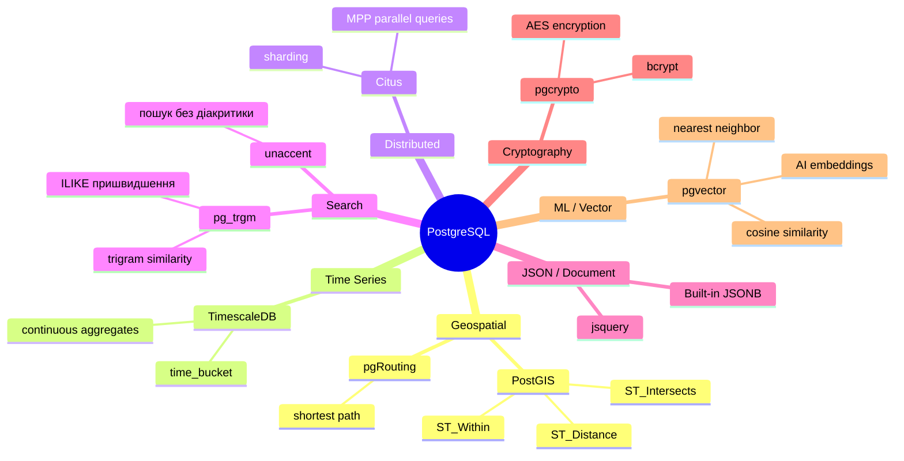

---

## 11. Шпаргалка psycopg2

### Підключення та cursor

```python
import psycopg2
from psycopg2.extras import RealDictCursor, Json

# Підключення
conn = psycopg2.connect(
    host='localhost', port=5432,
    dbname='course_db', user='student', password='python2024'
)

# Cursor для dict-результатів
cursor = conn.cursor(cursor_factory=RealDictCursor)

# Параметр: %s (не ?, не %d — завжди %s у psycopg2)
cursor.execute("SELECT * FROM users WHERE id = %s", (42,))
row = cursor.fetchone()        # один рядок
rows = cursor.fetchall()       # всі рядки
rows = cursor.fetchmany(100)   # N рядків

# Завжди закривай:
cursor.close()
conn.close()
```

### Транзакції

```python
try:
    conn.autocommit = False    # за замовчуванням
    cursor.execute("UPDATE accounts SET balance = balance - 500 WHERE id = 1")
    cursor.execute("UPDATE accounts SET balance = balance + 500 WHERE id = 2")
    conn.commit()
except Exception as e:
    conn.rollback()
    raise
```

### JSONB

```python
from psycopg2.extras import Json

# INSERT з JSONB
cursor.execute(
    "INSERT INTO customers (name, metadata) VALUES (%s, %s)",
    ("Alice", Json({"city": "Kyiv", "tier": "gold"}))
)

# Query JSONB
cursor.execute(
    "SELECT * FROM customers WHERE metadata @> %s",
    (Json({"tier": "gold"}),)
)
```

### RETURNING + UPSERT

```python
# RETURNING — отримати ID після INSERT
cursor.execute(
    "INSERT INTO orders (customer_id) VALUES (%s) RETURNING order_id",
    (customer_id,)
)
order_id = cursor.fetchone()['order_id']

# UPSERT — INSERT або UPDATE при конфлікті
cursor.execute("""
    INSERT INTO customers (email, name)
    VALUES (%s, %s)
    ON CONFLICT (email)
    DO UPDATE SET name = EXCLUDED.name
    RETURNING customer_id
""", (email, name))
```

### EXPLAIN

```python
cursor.execute("EXPLAIN (ANALYZE, FORMAT TEXT) SELECT * FROM products WHERE category = %s",
               ("phones",))
plan = '\n'.join(row[0] for row in cursor.fetchall())
conn.rollback()  # EXPLAIN відкриває транзакцію — закриваємо
print(plan)
```

---

## 12. Команди для роботи з Docker

```bash
# Запустити контейнер
docker compose up -d postgres

# Підключитись через psql всередині контейнера
docker exec -it course-postgres psql -U student -d course_db

# Перевірити статус
docker compose ps

# Переглянути логи
docker compose logs postgres

# Підключення з хоста (через psql)
psql -h localhost -p 5432 -U student -d course_db

# Корисні psql команди:
# \dt           — список таблиць
# \di           — список індексів
# \d tablename  — структура таблиці
# \timing       — увімкнути вимірювання часу запитів
# \x            — expanded output mode (по рядку на поле)
```

---

*Урок 30 | Модуль 3 | Python Course*
