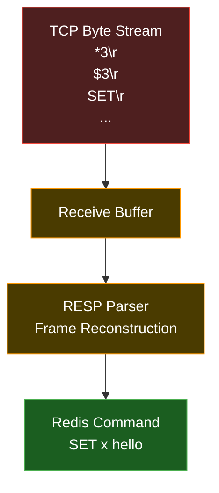
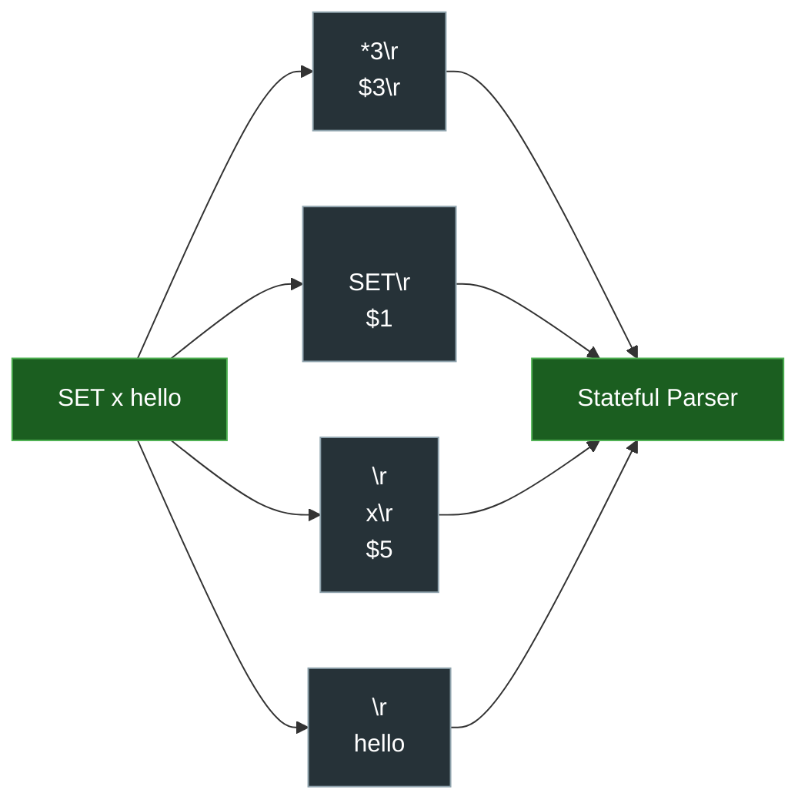
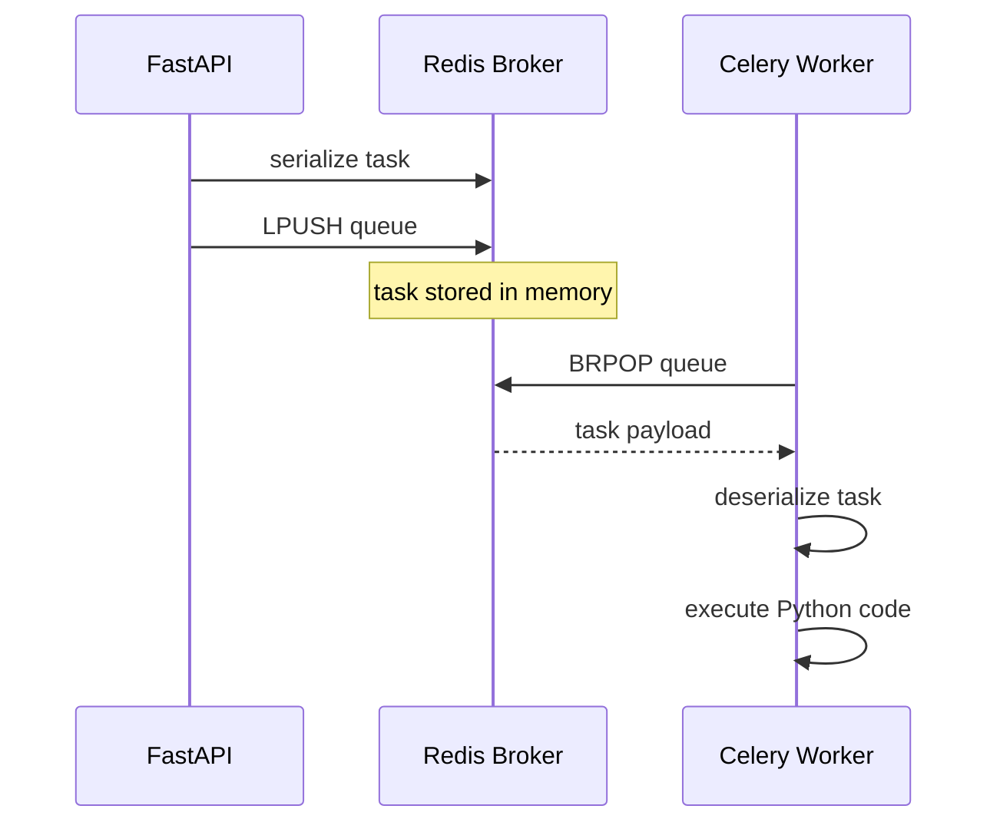
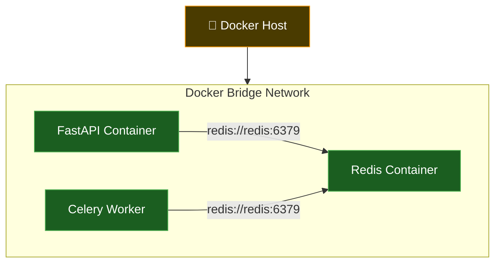
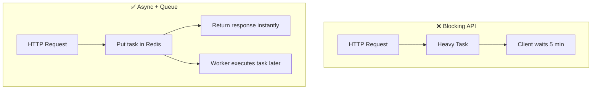
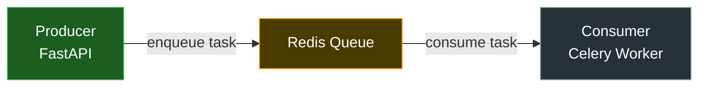

# Redis + Celery + Docker
## Networking, Task Queues та Communication Between Processes

---

# Про що цей документ?

Більшість початківців бачать Redis так:

```text
Redis = database
```

А Celery так:

```text
Celery = background tasks
```

Але в production systems це набагато глибше.

У реальності:

```text
Redis = communication layer between processes
```

А Celery:

```text
distributed task execution system
```

---

# Головний mental model

Уяви систему:

```text
FastAPI
↓
Redis
↓
Celery Worker
```

FastAPI:
- НЕ виконує важку задачу сам.

Він:
- серіалізує task,
- кладе її у Redis queue,
- одразу повертає response клієнту.

Worker:
- слухає Redis queue,
- отримує task,
- виконує код асинхронно.

---

# Архітектура системи

```text
┌─────────────────────┐
│      FastAPI        │
│     Producer        │
└──────────┬──────────┘
           │
           │ TCP + RESP
           ▼
┌─────────────────────┐
│       Redis         │
│  Message Broker     │
│  In-Memory Queue    │
└──────────┬──────────┘
           │
           │ TCP + RESP
           ▼
┌─────────────────────┐
│    Celery Worker    │
│      Consumer       │
└─────────────────────┘
```

---

# Що таке Message Broker?

Message Broker —
це система яка:

- приймає tasks/messages,
- тимчасово їх зберігає,
- дозволяє іншим process їх читати.

Redis тут працює як:

```text
черга повідомлень між process
```

---

# Producer vs Consumer

## Producer

Producer:
- створює task,
- відправляє task у Redis.

Наприклад:

```python
process_image.delay("cat.png")
```

---

## Consumer

Consumer:
- слухає Redis,
- читає task,
- виконує код.

---

# Що реально відбувається?

Коли Python виконує:

```python
process_image.delay("cat.png")
```

це НЕ “магія Celery”.

Під капотом:

```text
Python Process
↓
Celery Client
↓
Redis Client
↓
TCP Socket
↓
OS Send Buffer
↓
Network
↓
Redis Server
```

Redis отримує:
- НЕ Python function,
- НЕ object,
- а byte stream через TCP.

---

# Redis працює поверх TCP

Redis communication:

```text
Client
↓
TCP Socket
↓
Redis Server
```

Redis НЕ бачить:
- Python object,
- task class,
- function reference.

Redis бачить лише:

```text
bytes
```

---

# Redis Protocol (RESP)

Redis використовує власний protocol:

```text
RESP
REdis Serialization Protocol
```

TCP НЕ знає:
- де починається команда,
- де закінчується команда.

Тому Redis створив:
- framing,
- boundaries,
- parsing rules.

---

# Приклад RESP

Команда:

```python
SET x hello
```

перетворюється приблизно у:

```text
*3\r\n
$3\r\n
SET\r\n
$1\r\n
x\r\n
$5\r\n
hello\r\n
```

---

# Чому RESP потрібний?

TCP = byte stream.

TCP може доставити:

```text
*3\r\n$3\r
```

потім:

```text
\nSET\r\n$1\r\nx
```

а потім ще шматок.

Redis мусить:
- збирати stream,
- парсити boundaries,
- відновлювати command structure.

---

# TCP Stream Mental Model

TCP socket —
це не “message channel”.

TCP socket —
це:

```text
труба з bytes
```

Redis protocol —
це вже логіка:
- framing,
- parsing,
- command reconstruction.

---

# Socket Buffers

Дані НЕ йдуть одразу у Redis.

Шлях bytes:

```text
Python Memory
↓
OS Send Buffer
↓
TCP Stack
↓
NIC
↓
Network
↓
Remote NIC
↓
Remote Receive Buffer
↓
Redis Process
```

---

# recv() НЕ читає commands

recv():

```python
sock.recv(1024)
```

означає:

```text
"дай bytes які зараз є у receive buffer"
```

А НЕ:

```text
"дай одне повне повідомлення"
```

---

# Partial Messages Problem

Worker може отримати:
- половину RESP command,
- кілька commands одразу,
- fragmented payload.

Тому production systems:
- buffer incoming bytes,
- parse protocols statefully.

---

# Чому Redis дуже швидкий?

Redis:
- in-memory,
- event-driven,
- мінімум disk I/O,
- single-threaded core,
- efficient socket multiplexing.

Тому:
- queues,
- pub/sub,
- caching,
- task brokering

працюють дуже швидко.

---

# Docker Architecture

Типовий production stack:

```text
┌──────────────────┐
│ fastapi          │
└────────┬─────────┘
         │
         ▼
┌──────────────────┐
│ redis            │
└────────┬─────────┘
         │
         ▼
┌──────────────────┐
│ celery_worker    │
└──────────────────┘
```

---

# Docker Networking

Docker створює:
- internal virtual network,
- DNS між containers.

Тому container може звертатись:

```python
redis://redis:6379
```

де:

```text
redis
```

це hostname container.

---

# Мінімальний docker-compose

```yaml
version: "3.9"

services:

  redis:
    image: redis:7

    ports:
      - "6379:6379"

  worker:
    build: .

    command: celery -A tasks worker --loglevel=info

    depends_on:
      - redis

  api:
    build: .

    command: uvicorn main:app --host 0.0.0.0 --port 8000

    ports:
      - "8000:8000"

    depends_on:
      - redis
```

---

# Мінімальний Celery Task

```python
from celery import Celery

app = Celery(
    "tasks",
    broker="redis://redis:6379/0"
)


@app.task
def process_image(name):

    print("Processing:", name)

    return "done"
```

---

# Як task рухається системою

## Step 1 — API створює task

```python
process_image.delay("cat.png")
```

---

## Step 2 — Celery serializes task

Task перетворюється у:
- JSON,
- metadata,
- payload.

---

## Step 3 — Redis receives bytes

Redis бачить:

```text
byte stream over TCP
```

---

## Step 4 — Worker polling queue

Worker:
- слухає queue,
- читає bytes,
- deserializes task.

---

## Step 5 — Worker executes code

```python
process_image("cat.png")
```

---

# Чому Celery + Redis важливі?

Без queue system:

```text
FastAPI
↓
Heavy task
↓
Client waits 5 minutes
```

---

З Celery:

```text
FastAPI
↓
Put task into queue
↓
Return response immediately

Worker:
    executes task asynchronously
```

---

# Blocking vs Async Architecture

Redis + Celery дозволяють:

- НЕ блокувати API,
- масштабувати workers,
- розділяти responsibility між process,
- будувати distributed systems.

---

# Найважливіший mental shift

Redis —
це НЕ просто “database”.

Redis дуже часто є:

```text
communication bus between independent processes
```

або:

```text
distributed coordination layer
```

---

# Головний висновок

Celery + Redis —
це:

- TCP sockets,
- byte streams,
- queues,
- workers,
- serialization,
- distributed communication,
- asynchronous execution,
- production networking.

І під капотом усе це —
звичайний networking поверх TCP.

---

# Додаткові теми для вивчення

- Redis Pub/Sub
- Redis Streams
- Celery Retry Mechanism
- ACK/NACK semantics
- Dead Letter Queues
- Idempotency
- Worker crashes
- Backpressure
- asyncio + Redis
- RabbitMQ vs Redis
- Kafka vs Redis Streams
- Distributed locks
- Horizontal scaling
- Event-driven architecture


# 🔥 1. Повний Data Flow

```mermaid
flowchart LR

    classDef api fill:#1b5e20,stroke:#4CAF50,color:#fff
    classDef redis fill:#4a3b00,stroke:#ff9800,color:#fff
    classDef worker fill:#263238,stroke:#90a4ae,color:#fff
    classDef tcp fill:#4e1f1f,stroke:#f44336,color:#fff

    Client["🌍 HTTP Client"]
    
    API["⚡ FastAPI\nProducer"]:::api

    TCP1["TCP Socket\nRESP Protocol"]:::tcp

    Redis["📦 Redis\nMessage Broker"]:::redis

    TCP2["TCP Socket\nRESP Protocol"]:::tcp

    Worker["⚙️ Celery Worker\nConsumer"]:::worker

    Client -->|"HTTP Request"| API

    API -->|"serialize task"| TCP1

    TCP1 --> Redis

    Redis -->|"queue task"| TCP2

    TCP2 --> Worker

    Worker -->|"execute code"| Worker
```



---

# 🔥 2. RESP Protocol Parsing



---

# 🔥 3. TCP Stream Mental Model



---

# 🔥 4. OS Buffer Architecture


---

# 🔥 5. Celery Task Lifecycle



---

# 🔥 6. Docker Networking Architecture



---

# 🔥 7. Blocking vs Async Architecture



---

# 🔥 8. Producer / Consumer Model



---

