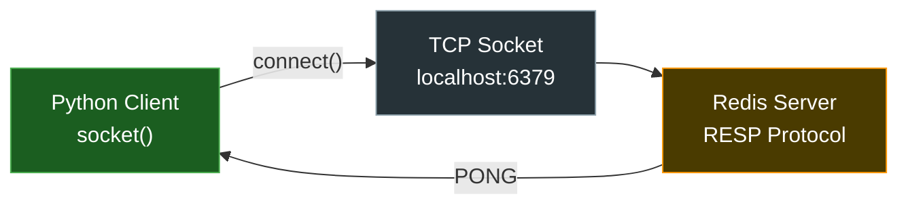
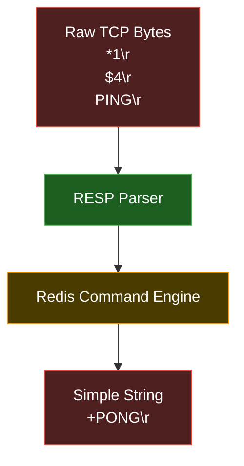
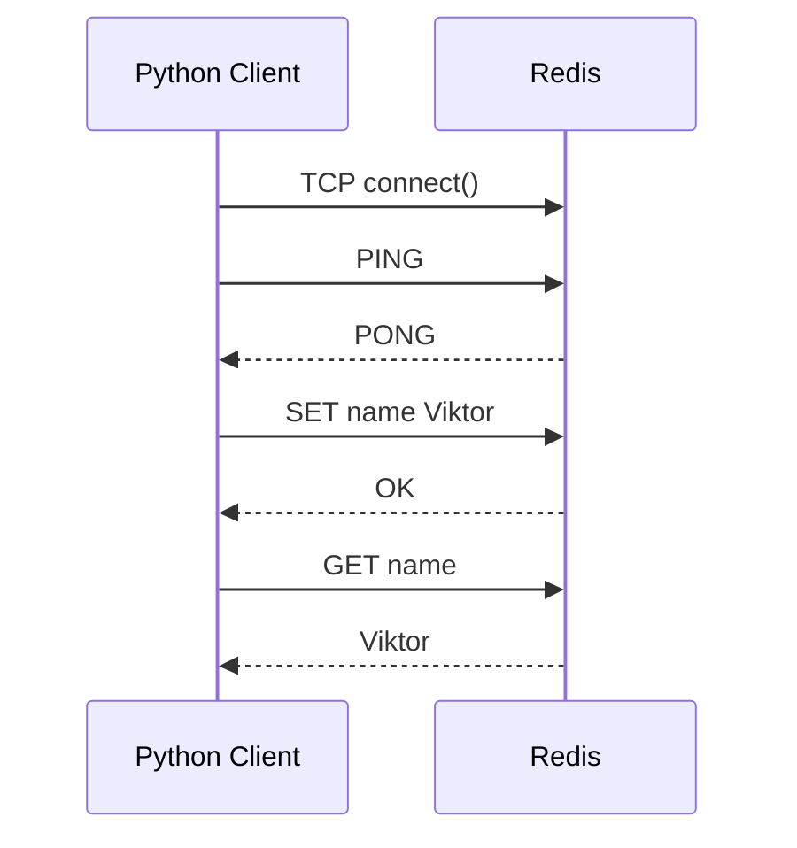
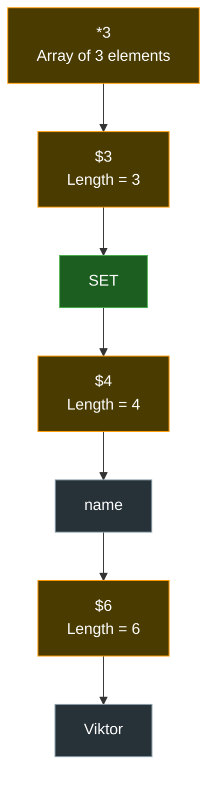
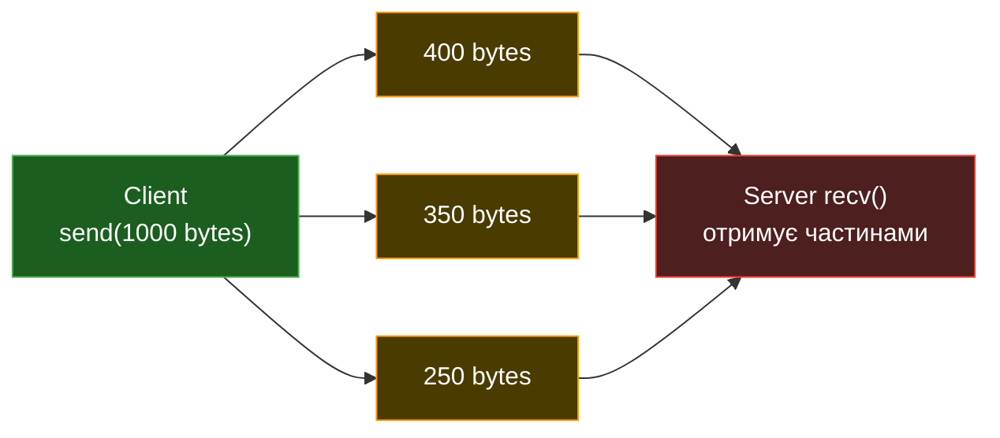
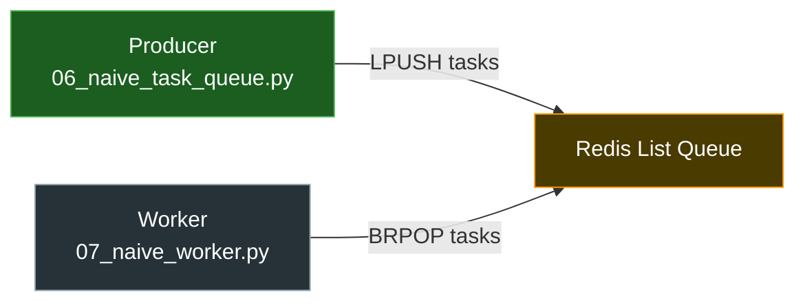
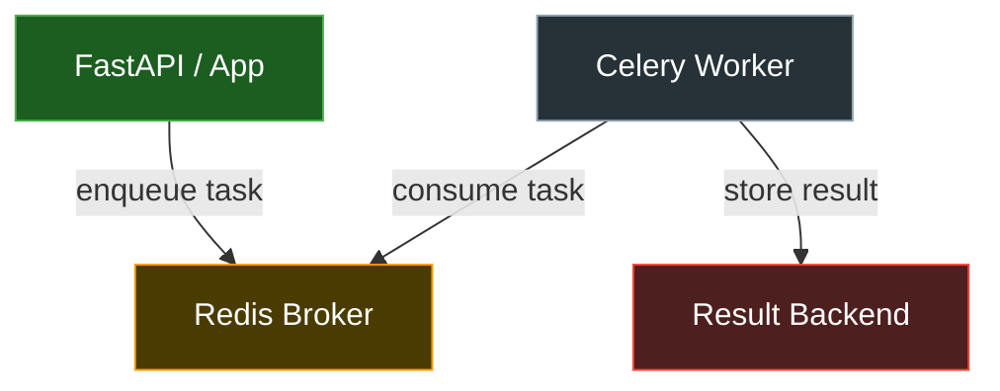
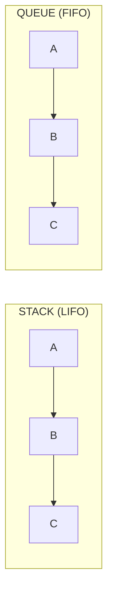

# Redis Socket Lesson

Цей mini-project показує Redis не як "магічну базу", а як реальний TCP server.

Redis у Docker слухає порт:

```yaml
ports:
  - "6379:6379"
```

Тобто Python може підключитися до Redis напряму через socket:

```text
Python Process
↓
TCP socket
↓
OS Send Buffer
↓
Docker port forwarding
↓
Redis container
↓
Redis RESP parser
```

## Перед запуском

Переконайся, що Redis container запущений:

```bash
docker compose up -d redis
```

або:

```bash
docker ps
```

Має бути щось типу:

```text
0.0.0.0:6379->6379/tcp
```

## Файли

### 01_check_redis_socket.py

Перевіряє, що Redis реально слухає TCP port 6379.

### 02_raw_ping.py

Надсилає Redis команду `PING` вручну через RESP protocol.

### 03_raw_set_get.py

Надсилає `SET` і `GET` через raw TCP socket.

### 04_resp_client.py

Маленький навчальний RESP client:
- сам збирає RESP command;
- сам відправляє bytes;
- сам читає Redis response.

### 05_partial_send_demo.py

Показує, що Redis може отримувати команду частинами, бо TCP — byte stream.

## Головна ідея уроку

Коли ми пишемо:

```python
sock.sendall(...)
```

ми не "викликаємо Redis функцію".

Ми відправляємо bytes у TCP stream.

Redis сам:
- читає bytes;
- буферизує їх;
- парсить RESP protocol;
- відновлює команду;
- виконує її у своїй пам'яті.

# 🔥 1. Redis як TCP Socket Server



---

# 🔥 2. RESP Protocol Architecture



---

# 🔥 3. Socket Communication Flow



---

# 🔥 4. Raw RESP Message Structure



---

# 🔥 5. Partial Send Problem (`05_partial_send_demo.py`)



---

# 🔥 6. Naive Task Queue Architecture



---

# 🔥 7. Celery-style Mental Model



---

# 🔥 8. Stack vs Queue (для BFS/Task Queue пояснення)



---

| File                       | Mermaid Diagram      |
| -------------------------- | -------------------- |
| `01_check_redis_socket.py` | Redis TCP Socket     |
| `02_raw_ping.py`           | Socket Communication |
| `03_raw_set_get.py`        | RESP Structure       |
| `04_resp_client.py`        | RESP Parser          |
| `05_partial_send_demo.py`  | Partial Send         |
| `06_naive_task_queue.py`   | Task Queue           |
| `07_naive_worker.py`       | Worker Architecture  |

---