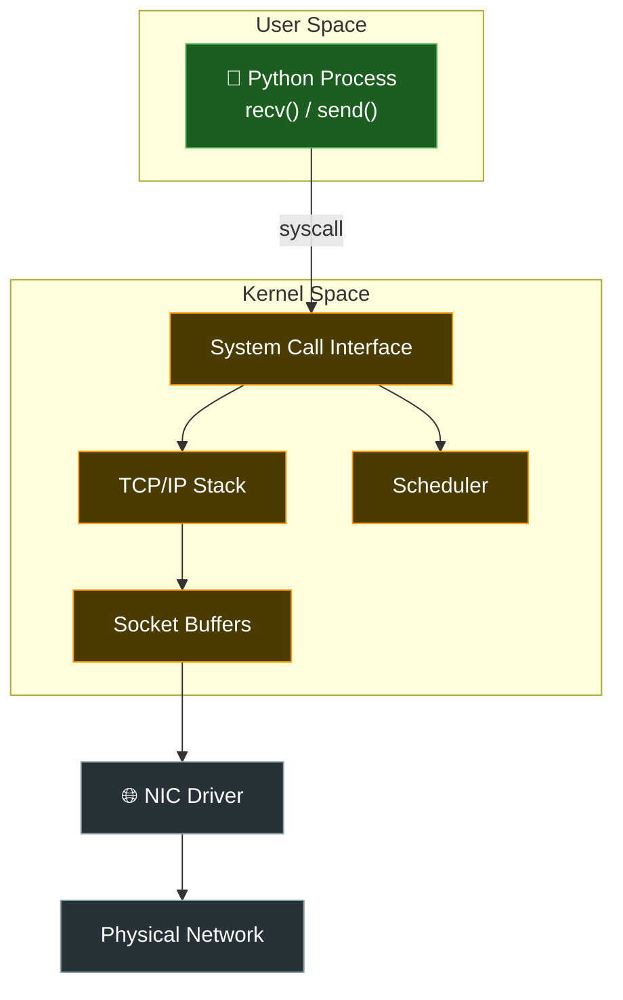
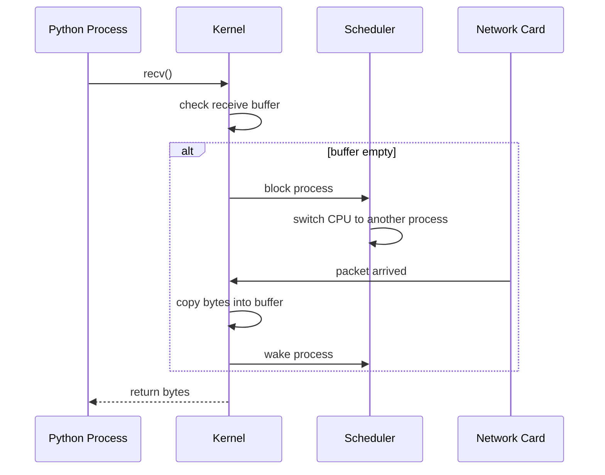
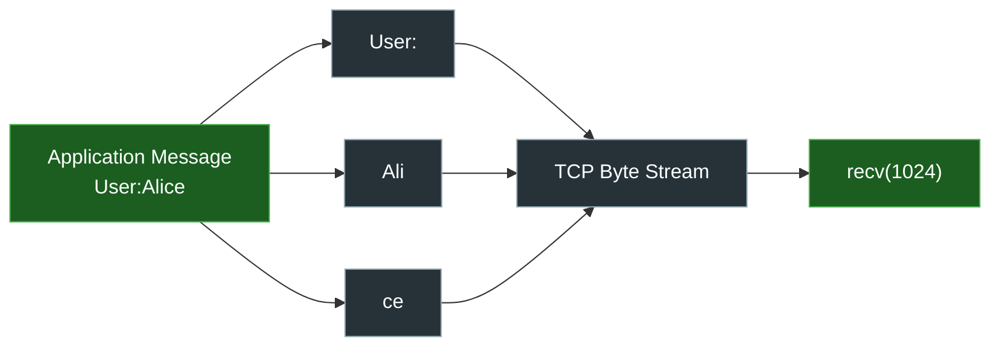
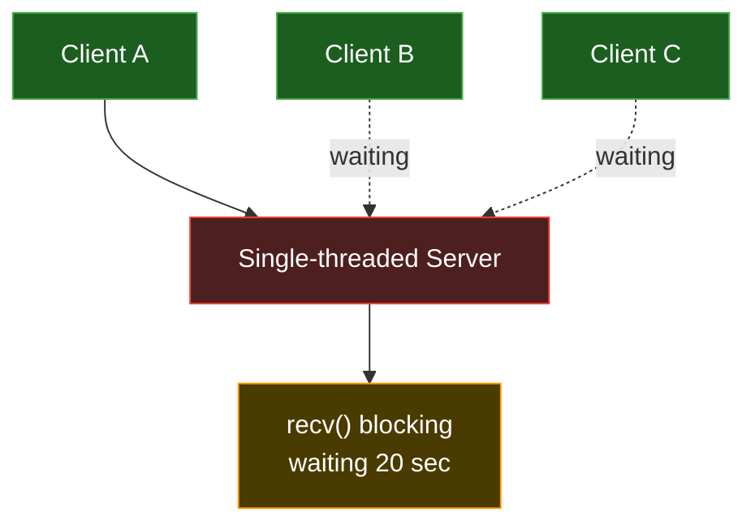
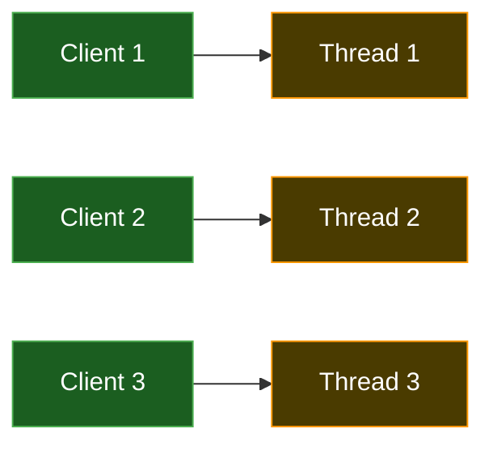
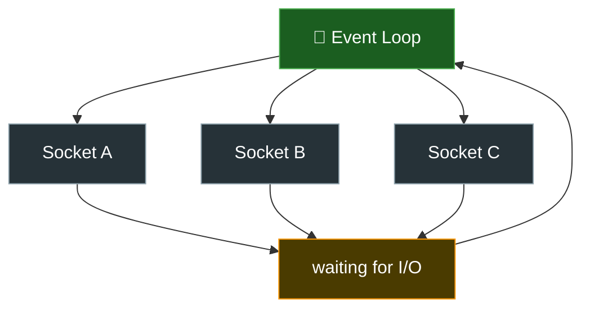
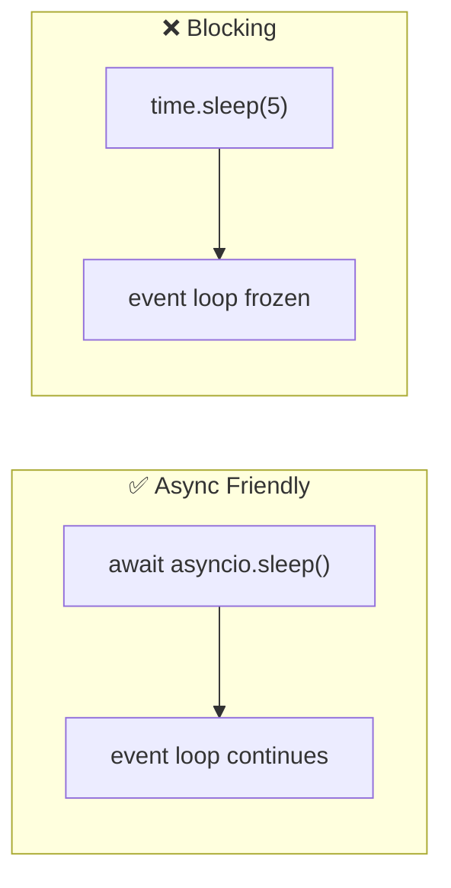
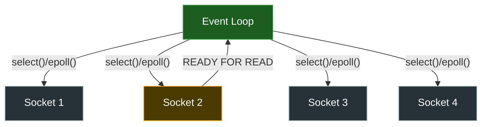
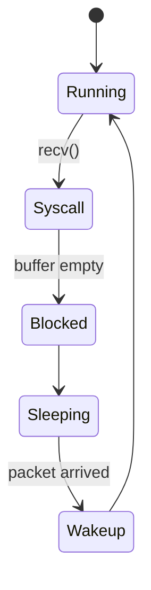
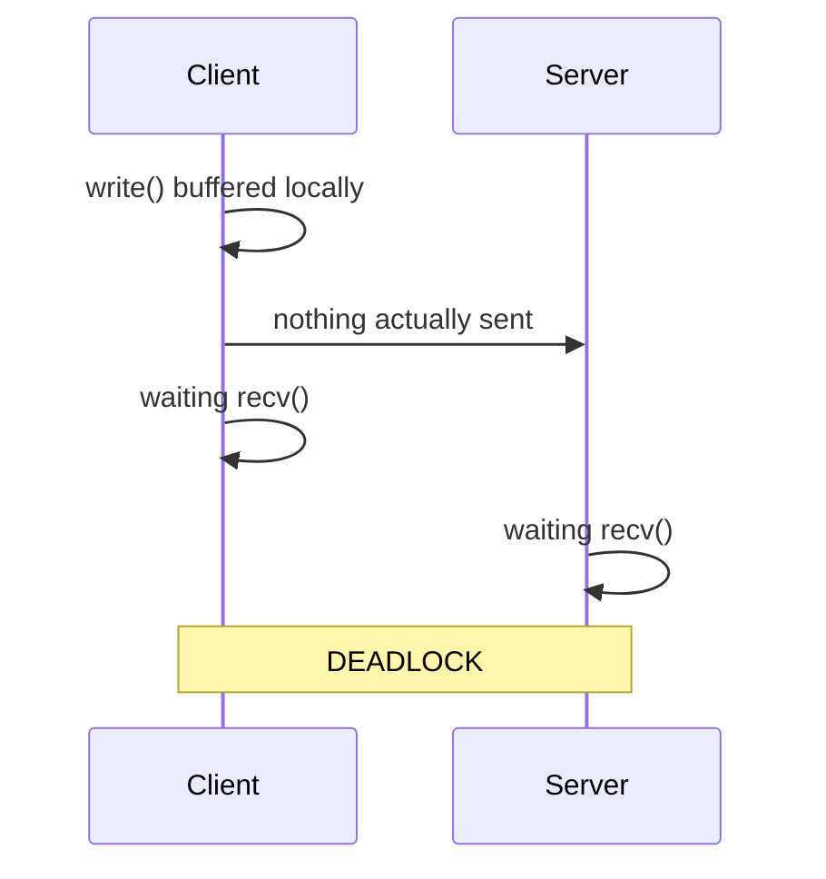

# 1. Python Process vs OS Kernel





Ця схема показує головний mental shift у networking:

> Python НЕ працює з мережею напряму.

---

## Що тут відбувається?

Є:

```text id="1c7uyv"
User Space
```

і:

```text id="7o0x6d"
Kernel Space
```

---

## User Space

Тут працює:

* Python,
* VSCode,
* браузер,
* твої програми.

Python може:

* створювати socket,
* викликати recv(),
* викликати send().

Але Python НЕ може:

* керувати мережею напряму,
* говорити з NIC,
* керувати packets.

---

## System Call Interface


Оце:

```text id="d5rjz0"
syscall
```

це “двері” між:

* Python process,
* OS kernel.

Коли Python робить:

```python id="v0u8pt"
recv()
```

відбувається syscall у kernel.

---

## TCP/IP Stack


Оце справжній networking engine.

TCP stack:

* збирає packets,
* робить retransmission,
* перевіряє checksums,
* керує connection state.

---

## Scheduler

Scheduler вирішує:

```text id="13qk8h"
хто зараз отримає CPU
```

Коли recv() блокується —
scheduler забирає CPU у process.

---

## Socket Buffers

Buffers —
це RAM всередині kernel.

Є:

* send buffer,
* receive buffer.

recv() читає:

* НЕ network,
* а receive buffer.

---

## NIC Driver


```text id="gdr5ff"
NIC = Network Interface Card
```

це мережева карта.

Driver:

* взаємодіє з hardware.

---

# Головна ідея схеми

Python:

* НЕ “читає інтернет”.

Python:

* просить kernel працювати з мережею.

---

# 2. recv() Blocking Execution

Це одна з найважливіших схем.

Вона показує:

```text id="wsy7fh"
чому recv() "зависає"
```

---

## Step 1

Python process:

```python id="vggjlwm"
recv()
```

---

## Step 2

Kernel:

* перевіряє receive buffer.

---

## Step 3 — buffer empty

Даних ще немає.

---

## Step 4

Kernel каже scheduler:

```text id="z1jsd9"
цей process треба приспати
```

---

## Step 5

Scheduler:

* перемикає CPU на інший process.

---

## Step 6

Network card:

* отримує packet.

---

## Step 7

Kernel:

* копіює bytes у receive buffer.

---

## Step 8

Kernel:

* будить Python process.

---

## Step 9

recv():

* повертає bytes.

---

# Головна ідея

recv() —
це НЕ:

```text id="5ev4cw"
цикл очікування
```

Process реально:

* asleep,
* не використовує CPU.

---

# 3. TCP Stream Mental Model


Це схема про:

```text id="o6f03m"
TCP ≠ messages
```

---

## Що тут показано?

Application хоче передати:

```text id="r4p83v"
User:Alice
```

Але TCP:

* розбиває stream,
* буферизує,
* фрагментує.

---

## recv()

recv():

* НЕ читає “повідомлення”,
* читає:

```text id="ndvrq2"
stream bytes
```

---

# Головна ідея

TCP бачить:

* bytes,
* а НЕ application messages.

---

# 4. Blocking Server Problem


Це класична проблема sequential server.

---

## Що тут відбувається?

Server:

* обробляє Client A.

Але:

```python id="y4rjv6"
recv()
```

блокує process.

---

## І що стається?

Client B:

* чекає.

Client C:

* чекає.

---

# Головна проблема

Single-threaded blocking server:

* не може нормально обслуговувати багато clients.

---

# 5. Thread-per-Client Architecture


Це перше класичне рішення.

---

## Ідея

Кожен client:

* отримує окремий thread.

---

## Чому це працює?

Поки:

* Thread A asleep у recv(),

Scheduler:

* запускає Thread B.

---

# Мінус

Багато threads:

* багато RAM,
* context switching,
* synchronization complexity.

---

# 6. Event Loop Architecture


Це вже сучасний networking.

Основа:

* asyncio,
* Node.js,
* Nginx,
* uvicorn.

---

## Ідея

НЕ створювати:

* thread на кожен socket.

А мати:

```text id="b6ozd9"
один event loop
```

який:

* перевіряє багато socket,
* працює лише з готовими sockets.

---

# Waiting for I/O

Більшість sockets:

* просто waiting.

Event loop:

* НЕ блокується на одному socket.

---

# Головна ідея

```text id="bhv8q2"
не чекати —
а переключатись між tasks
```

---

# 7. asyncio vs Blocking Call



Це critical async concept.

---

## GOOD

```python id="0d7oxz"
await asyncio.sleep()
```

Event loop:

* може продовжувати роботу.

---

## BAD

```python id="gc9fd6"
time.sleep(5)
```

Event loop:

* freeze.

---

# Чому?

Бо:

* asyncio cooperative,
* tasks самі віддають control.

time.sleep():

* блокує thread повністю.

---

# 8. select() / epoll() Multiplexing


Це серце modern networking.

---

## Що робить epoll/select?

Event loop питає kernel:

```text id="3vv81o"
які sockets готові?
```

---

## Kernel відповідає

Наприклад:

```text id="d3bn9h"
Socket 2 ready for read
```

---

## І тоді

Event loop:

* обробляє лише active sockets.

---

# Головна ідея

НЕ перевіряти:

* всі sockets постійно.

А отримувати:

* notification від kernel.

---

# 9. Kernel Sleep / Wakeup Lifecycle


Це execution lifecycle process.

---

## Running

Process працює.

---

## Syscall

Process викликає:

```python id="ij9q1t"
recv()
```

---

## Blocked

Kernel:

* не має bytes,
* process blocked.

---

## Sleeping

Process:

* НЕ використовує CPU.

---

## Wakeup

Packet arrives.

Kernel:

* будить process.

---

# Це дуже важливо

Networking —
це:

* sleep/wakeup architecture.

---

# 10. Deadlock Visualization


Це дуже важлива production problem.

---

## Що тут стається?

Client:

* думає що write() already sent data.

Але data:

* ще у local buffer.

---

## Потім

Client:

* чекає recv()

Server:

* теж чекає recv()

---

# І результат

```text id="6qu6u2"
DEADLOCK
```

Ніхто:

* не рухається,
* не відправляє bytes.

---

# Головний висновок усіх схем

Усі ці схеми разом пояснюють:

```text
Networking = coordination between:
- processes
- kernel
- buffers
- scheduler
- hardware
- protocols
```
