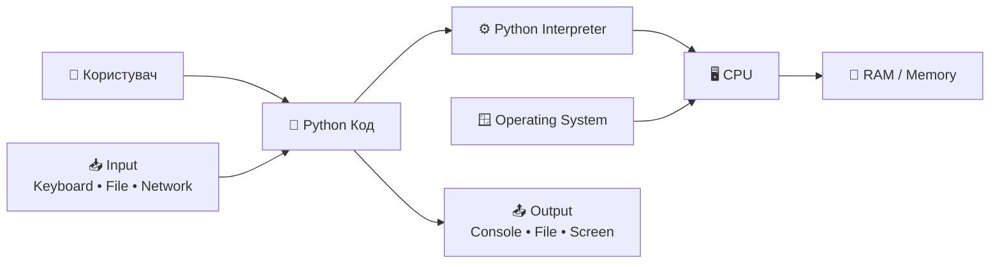
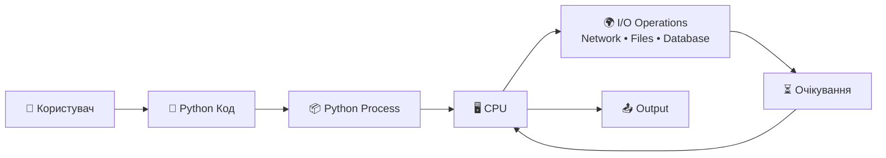

# Урок 32 — Threading & Concurrency: Документація та Архітектурні Схеми

**Модуль 4 · Network & Concurrent Systems**

> Цей файл — довідник та архітектурний компаньйон до `note_lesson_32_threading_concurrency.ipynb`.
> Містить глибокі пояснення, production patterns та детальні схеми виконання.

---

## Зміст

1. [Що таке потік та процес](#1-що-таке-потік-та-процес)
2. [Global Interpreter Lock (GIL)](#2-global-interpreter-lock-gil)
3. [Ментальна модель: Будинок з Воркерами](#3-ментальна-модель-будинок-з-воркерами)
4. [IO-bound: Як потоки "імітують" паралелізм](#4-io-bound-як-потоки-імітують-паралелізм)
5. [Race Conditions: Чому виникають](#5-race-conditions-чому-виникають)
6. [Lock: Як виправити Race Condition](#6-lock-як-виправити-race-condition)
7. [Deadlock: Смертельне обіймання](#7-deadlock-смертельне-обіймання)
8. [Thread-Local Storage](#8-thread-local-storage)
9. [ThreadPoolExecutor: Production Pattern](#9-threadpoolexecutor-production-pattern)
10. [IO-bound vs CPU-bound](#10-io-bound-vs-cpu-bound)
11. [Примітиви синхронізації](#11-примітиви-синхронізації)
12. [Debugging багатопотокового коду](#12-debugging-багатопотокового-коду)
13. [Edge Cases та Пастки](#13-edge-cases-та-пастки)
14. [Production Patterns](#14-production-patterns)
15. [Рефлексійні питання](#15-рефлексійні-питання)

---

## 1. Що таке потік та процес

### Процес (Process)

Процес — це незалежна програма, що виконується в OS. Кожен процес має:

| Ресурс | Опис |
| ------ | ---- |
| **Окремий адресний простір** | Власна пам'ять, ізольована від інших процесів |
| **GIL** | Власний Global Interpreter Lock |
| **Файлові дескриптори** | Власні відкриті файли та сокети |
| **PID** | Унікальний ідентифікатор процесу в OS |

### Потік (Thread)

Потік — це легка одиниця виконання **всередині** процесу. Потоки одного процесу:

| Ресурс | Спільний / Приватний |
| ------ | ------------------- |
| **Heap (змінні, об'єкти)** | 🌐 СПІЛЬНИЙ — всі потоки читають/пишуть |
| **Stack (локальні змінні, call frames)** | 🏠 ПРИВАТНИЙ — кожен потік має свій |
| **GIL** | 🔒 Один на весь процес |
| **Файлові дескриптори** | 🌐 СПІЛЬНІ |

### Ключове правило

> Коли два потоки змінюють одну і ту ж змінну **без синхронізації** — ти отримуєш **Race Condition**.

---
# Потік виконання Python: Input → Interpreter → CPU → Memory → Output




## Як це працює загалом?

### 1. Користувач пише Python код

```python
print("Hello")
````

---

### 2. Python Interpreter читає код

Python не виконується напряму процесором.

Interpreter:

* читає код
* аналізує його
* перетворює у bytecode
* виконує інструкції

---

### 3. CPU виконує інструкції

Процесор:

* рахує числа
* виконує операції
* працює з пам’яттю

---

### 4. Memory зберігає дані

У RAM зберігаються:

* змінні
* списки
* об’єкти
* функції

---

### 5. Operating System керує ресурсами

Операційна система:

* дає програмі пам’ять
* дає доступ до CPU
* працює з файлами та мережею

---

### 6. Програма отримує Input

Input:

* клавіатура
* файл
* API
* база даних
* мережа

---

### 7. Програма повертає Output

Output:

* текст у console
* файл
* графіка
* HTTP response
___

## Чому виникає проблема?

Python process виконує код послідовно.

Проблема починається тоді, коли програма робить I/O:

- HTTP request
- читання файлу
- запит до бази даних

У цей момент CPU майже нічого не робить.

Програма просто чекає:

```text
send request → wait...
````

Тобто:

* CPU простоює
* process заблокований
* інші задачі не виконуються

---

## Приклад

```python
response = requests.get(url)
```

Поки сервер відповідає:

* Python process чекає
* CPU майже нічого не рахує
* програма "завмирає"

---

## Саме тут з’являється threading

Ідея threading:

> поки один потік чекає мережу —
> інший може виконувати роботу.

___

## 2. Global Interpreter Lock (GIL)

### Що таке GIL

GIL (Global Interpreter Lock) — це мютекс всередині CPython інтерпретатора, який дозволяє тільки **одному потоку виконувати Python байткод у будь-який момент часу**.

### Що таке mutex простими словами?

Mutex (mutual exclusion) — це механізм блокування, який дозволяє лише одному потоку одночасно зайти в критичну секцію коду.

Простіше:

> mutex — це “ключ від кімнати”.

Якщо один потік зайшов у кімнату і замкнув двері:

- інші потоки змушені чекати
- поки ключ не звільниться

---

## Аналогія

Уяви:

- є одна ванна кімната
- 5 людей хочуть зайти одночасно

Але двері мають замок.

Поки:
- Thread A всередині —
- Thread B і Thread C чекають зовні

Коли A виходить:
- замок звільняється
- інший потік може зайти

---

## У Python

```python
lock = threading.Lock()

with lock:
    # тільки один потік тут одночасно
    counter += 1
````

Тут `Lock` — це mutex.

---

## Що захищає mutex?

Mutex захищає:

* змінні
* файли
* базу даних
* shared memory
* будь-які спільні ресурси

від одночасного доступу кількох потоків.

---

## Просте визначення

> Mutex — це механізм, який тимчасово дозволяє доступ до ресурсу лише одному потоку.


Думай про GIL як про **"Talking Stick"** (жезл оратора):
- Тільки той, хто тримає жезл, може говорити (виконувати Python байткод)
- Щоб заговорити, потрібно взяти жезл у попереднього оратора
- Жезл передається кожні ~100 байткодів (sys.getswitchinterval())

### Чому GIL існує

GIL захищає внутрішні структури даних CPython від пошкодження при паралельному доступі. Без GIL сам інтерпретатор падав би при конкурентному Python коді.

### GIL та IO Operations

**Критичний факт:** GIL **автоматично відпускається** під час IO-операцій :
(Input/Output operations)
```
socket.recv()   → GIL відпущено
time.sleep()    → GIL відпущено
file.read()     → GIL відпущено
subprocess...   → GIL відпущено
```

Саме тому threading дуже ефективний для IO-bound задач — поки один потік чекає мережу, інші виконують Python код.

### GIL та CPU Operations

Під час CPU-bound операцій (математика, обробка рядків, цикли) GIL **тримається весь час**. Тому threading **не дає** реального прискорення для CPU-bound задач — для них потрібен `multiprocessing`.

---

## 3. Ментальна модель: Будинок з Воркерами

Уяви Python process як великий **будинок**:

```
🏠 Будинок (Process / Shared Heap)
├── 📋 Дошка 1: counter = 0          ← глобальна змінна
├── 📋 Дошка 2: shared_dict = {}     ← словник
├── 📋 Дошка 3: bank_balance = 100   ← ще одна змінна
│
├── 🧵 Воркер A (Thread 1)
│   └── 🗒️ Особистий блокнот (Stack)  ← локальні змінні
│       ├── thread_id = 0
│       └── local_result = ...
│
├── 🧵 Воркер B (Thread 2)
│   └── 🗒️ Особистий блокнот (Stack)
│       ├── thread_id = 1
│       └── local_result = ...
│
└── 🔑 GIL (Talking Stick) — один на весь будинок
```

**Правила будинку:**
1. Воркер може читати та писати на **будь-яку спільну дошку**
2. Але тільки воркер із **Talking Stick (GIL)** може виконувати Python код
3. Кожен воркер має **власний блокнот** — ніхто інший не читає його локальні змінні

### Кухня та Ванна (розширена метафора)

- **Concurrency (Кухня):** Один кухар (CPU core) готує складну страву. Він ріже цибулю, ставить піцу в духовку, потім помішує суп поки піца печеться. Кухар працює **конкурентно** — перемикається між задачами коли заблокований (очікує духовку).
- **Locks (Ванна):** В квартирі кілька мешканців, але тільки одна ванна. Хто хоче душ — замикає двері. Інші чекають в коридорі (blocking). Забудеш замкнути — хаос.

---

## 4. IO-bound: Як потоки "імітують" паралелізм

### Покроковий Timeline IO-операцій

```
[T=0]  Main Thread: створює t1 та t2, викликає .start()
       t1, t2 → State: Runnable

[T=1]  OS Scheduler: дає CPU для t1
[T=2]  t1: захоплює GIL, виконує print("Starting...")
[T=3]  t1: hits time.sleep(2) → КРИТИЧНИЙ МОМЕНТ:
         → t1 відпускає GIL
         → t1 входить у Waiting state
         → OS отримає сигнал через 2 секунди

[T=4]  OS Scheduler: бачить що t1 спить, будить t2
[T=5]  t2: захоплює вільний GIL, виконує print("Starting...")
[T=6]  t2: hits time.sleep(2) → відпускає GIL, теж спить

       ... 2 секунди тиші. GIL нікому не належить.
       ... Обидва потоки чекають IO паралельно! ...

[T=7]  OS будить t1 (Waiting → Runnable)
[T=8]  t1: захоплює GIL, print("Data received!"), завершується (Dead)
[T=9]  t2: захоплює GIL, print("Data received!"), завершується (Dead)
```

**Інтуїція:** Потоки не виконуються в **одну мікросекунду**. Але вони **елегантно передають GIL** коли змушені чекати зовнішній світ. Це робить threading дуже швидким для мережевих/IO-задач.

---

## 5. Race Conditions: Чому виникають

### Атомарність: Помилковий міф

Новачки думають, що `counter += 1` — одна атомарна операція. Це НЕ так.

`counter += 1` компілюється в **чотири** байткодові інструкції:

```python
# Python:
counter += 1

# Байткод (dis.dis):
LOAD_GLOBAL     counter      # 1. Читати значення
LOAD_CONST      1            # 2. Завантажити константу 1
BINARY_OP       +            # 3. Додати
STORE_GLOBAL    counter      # 4. Записати результат
```

OS може переключити контекст між **будь-якими двома** з цих інструкцій.

### Покрокова Колізія (Shared State Mutation)

```
Час | Thread 1 (T1)                   | Thread 2 (T2)          | Змінна counter
----+----------------------------------+------------------------+----------------
 1  | [Отримує GIL]                    | (Runnable, черга)      | 0
 2  | READS counter → бачить 0          |                        | 0
 3  | [OS Context Switch! T1 призупин.] | [Отримує GIL]          | 0
 4  | (Спить з числом 0 у регістрі)    | READS counter → бачить 0 | 0
 5  |                                  | ADDS 1 (0+1=1)          | 0
 6  |                                  | WRITES 1                | 1
 7  |                                  | [T2 завершився]         | 1
 8  | [OS відновлює T1, Отримує GIL]   | (Dead)                  | 1
 9  | ADDS 1 до СТАРОГО 0 (0+1=1)      |                         | 1
10  | WRITES 1 ← ПЕРЕЗАПИСУЄ T2!       |                         | 1 ← ВТРАТА!
```

**Результат:** Дві операції increment виконались, counter підвищився лише на 1. Оновлення Thread 2 **назавжди втрачено**.

### Банківська Аналогія

Уяви banking app: баланс £2,000. Thread A (payroll) депозить £5,000 бонус, Thread B (оплата оренди) знімає £1,000. Обидва читають баланс £2,000. Thread B оновлює до £1,000. Мікросекунду потому Thread A перезаписує балансом £7,000. Ти щойно **втратив знятий платіж за оренду**.

---

## 6. Lock: Як виправити Race Condition

### Механізм Lock

Lock — це булевий прапорець на рівні OS. Коли потік намагається `acquire()` заблокований Lock, OS переводить цей потік у **Waiting state** (0% CPU) і прибирає з черги виконання. OS розбудить потік тільки коли власник Lock викличе `release()`.

### Timeline з Lock

```
Час | Thread 1 (T1)              | Thread 2 (T2)              | Lock     | counter
----+-----------------------------+-----------------------------+----------+--------
 1  | lock.acquire() → ✅ успіх   |                             | T1 тримає| 0
 2  | READS counter (бачить 0)    | lock.acquire() → ❌ блок   | T1 тримає| 0
 3  | [OS Context Switch]         | (Frozen, чекає Lock)       | T1 тримає| 0
 4  | (Frozen)                    | [OS будить T2]              | T1 тримає| 0
 5  |                             | T2 знову просить Lock → ❌  | T1 тримає| 0
 6  |                             | [T2 yields CPU back to OS]  | T1 тримає| 0
 7  | [OS відновлює T1]           | (Frozen)                    | T1 тримає| 0
 8  | ADDS 1, WRITES 1            |                             | T1 тримає| 1
 9  | lock.release() → БУДИТЬ T2  |                             | Unlocked | 1
10  | (Dead)                      | [OS відновлює T2]           | Unlocked | 1
11  |                             | lock.acquire() → ✅ успіх   | T2 тримає| 1
12  |                             | READS counter (бачить 1)    | T2 тримає| 1
13  |                             | ADDS 1, WRITES 2            | T2 тримає| 2
14  |                             | lock.release()              | Unlocked | 2 ✅
```

**Інтуїція:** Lock обходить хаос OS Task Scheduler. Ти кажеш: *"Не важливо коли OS вирішить запустити ці потоки. Тільки потік з цим ключем може торкатися змінної."* Трейдоф: паралельна програма стає тимчасово послідовною на critical section — це bottleneck.

---

## 7. Deadlock: Смертельне обіймання

### Умови Deadlock (Coffman Conditions)

Deadlock виникає коли одночасно виконуються всі 4 умови:

| Умова | Опис |
| ----- | ---- |
| **Mutual Exclusion** | Ресурс може тримати тільки один потік |
| **Hold and Wait** | Потік тримає один ресурс і чекає інший |
| **No Preemption** | OS не може силою забрати ресурс у потоку |
| **Circular Wait** | T1 чекає T2, T2 чекає T1 |

### Дайнінг Філософи

П'ять філософів сидять за круглим столом з п'ятьма виделками між ними. Щоб їсти — потрібні дві виделки (ліва і права). Якщо всі одночасно беруть ліву виделку — ніхто не може взяти праву. Всі чекають вічно. Всі голодують.

### Рішення: Lock Ordering

**Правило:** Всі потоки мають захоплювати кілька locks завжди в **одному і тому ж порядку**.

```python
# ❌ Deadlock: різний порядок
def task_1(): lock_a → lock_b
def task_2(): lock_b → lock_a

# ✅ Safe: однаковий порядок (наприклад, id-based)
def safe_task(lock_x, lock_y):
    first, second = sorted([lock_x, lock_y], key=id)
    with first:
        with second:
            ...
```

---

## 8. Thread-Local Storage

### Проблема: Heap vs Stack

Кожен потік має:
- **Stack (приватний):** локальні змінні функцій — ізольовані, безпечні
- **Heap (спільний):** глобальні змінні, об'єкти — спільні, небезпечні

`threading.local()` дозволяє мати **глобально іменовані** змінні, які фізично **ізольовані на рівні потоку**.

### Identity Crisis Exercise: Корінь проблеми

```python
shared_state = {}  # Heap — спільна пам'ять

def update_state(thread_id):
    shared_state['last_active'] = thread_id  # Всі пишуть в ОДНЕ місце
    time.sleep(0.01)
    # Читає ПОТОЧНЕ значення — яке вже перезаписав інший потік!
    print(f"I am {thread_id}, last_active = {shared_state['last_active']}")
```

**Рішення — threading.local():**

```python
local_data = threading.local()  # Унікальна копія для кожного потоку

def update_state(thread_id):
    local_data.last_active = thread_id  # Пише у власну ізольовану копію
    time.sleep(0.01)
    print(f"I am {thread_id}, last_active = {local_data.last_active}")  # Завжди своє
```

### Production Use Case

`threading.local()` використовується в production для зберігання per-request контексту:
- Database connections per thread (Flask, Django)
- Authentication context
- Request-scoped logging

---

## 9. ThreadPoolExecutor: Production Pattern

### Проблема з ручним управлінням потоками

```python
# ❌ Ручне управління — проблеми зі scaling та помилками
threads = []
for url in urls:
    t = threading.Thread(target=fetch, args=(url,))
    t.start()
    threads.append(t)
for t in threads:
    t.join()
```

### ThreadPoolExecutor (Рекомендований production pattern)

```python
# ✅ Production pattern
from concurrent.futures import ThreadPoolExecutor, as_completed

with ThreadPoolExecutor(max_workers=10) as executor:
    futures = {executor.submit(fetch_url, url): url for url in urls}
    for future in as_completed(futures):
        url = futures[future]
        try:
            result = future.result()
        except Exception as e:
            print(f"Error fetching {url}: {e}")
```

### Переваги ThreadPoolExecutor

| Перевага | Пояснення |
| -------- | --------- |
| **Thread reuse** | Потоки не створюються/знищуються для кожної задачі |
| **Bounded concurrency** | max_workers обмежує кількість потоків |
| **Exception handling** | Виключення захоплюються у Future.result() |
| **Context manager** | `with` гарантує cleanup навіть при помилках |

---

## 10. IO-bound vs CPU-bound

### Порівняльна таблиця

| Критерій | IO-bound | CPU-bound |
| -------- | -------- | --------- |
| **Приклади** | HTTP запити, БД, файли | Математика, ML, encode/decode |
| **Bottleneck** | Час очікування зовнішніх систем | Потужність CPU |
| **GIL** | Відпускається під час IO | Тримається весь час |
| **Рішення** | `threading` або `asyncio` | `multiprocessing` |
| **Production** | FastAPI endpoints, scrapers | Data pipelines, image processing |

### Правило для Вибору

```
Задача блокується на мережі/файлах?  → threading / asyncio
Задача рахує/обробляє дані?          → multiprocessing
Задача і те, і те?                   → asyncio + ProcessPoolExecutor
```

---

## 11. Примітиви синхронізації

| Примітив | Використання | Production приклад |
| -------- | ------------ | ------------------ |
| `Lock` | Базова mutual exclusion | Захист counter, shared dict |
| `RLock` | Reentrant lock (рекурсія) | Thread-safe клас з методами |
| `Semaphore` | Обмеження кількості доступів | Rate limiting до БД (max 5 conns) |
| `Event` | Сигналізація між потоками | "Ініціалізація завершена, починай" |
| `Condition` | Чекання на конкретний стан | Producer/Consumer патерн |
| `Barrier` | Синхронізація N потоків | Фаза 1 завершена, всі чекають |
| `queue.Queue` | Thread-safe черга | Celery-подібний Worker pool |

### queue.Queue — найбезпечніший спосіб обміну даними

```python
import queue

work_queue = queue.Queue()

# Producer thread
def producer():
    for item in data:
        work_queue.put(item)  # Thread-safe, без lock вручну

# Consumer thread
def consumer():
    while True:
        item = work_queue.get(block=True)  # Чекає якщо черга порожня
        process(item)
        work_queue.task_done()
```

---

## 12. Debugging багатопотокового коду

### Ніколи не використовуй print() для debugging

Потоки спільно використовують `sys.stdout`. Результат:

```
# Замість "Hello" і "World" — отримаєш:
HWelolrod\n\n
```

### Правильний спосіб — logging модуль

```python
import logging

logging.basicConfig(
    level=logging.DEBUG,
    format="%(asctime)s [%(threadName)s] %(message)s"
)

logger = logging.getLogger(__name__)

def worker():
    logger.debug("Починаю обробку")  # Atomic, з ім'ям потоку
```

### Debugging Checklist

1. **Single-thread baseline:** Тест в один потік. Якщо баг є — це логічна помилка, не concurrency.
2. **Reproducibility:** Concurrency баги залежать від навантаження. Локально може не відтворюватись.
3. **Heisenbugs:** Race condition, що зникає коли ти додаєш `print()` для дебагу. `print()` виконує IO → сповільнює потік → змінює scheduling → ховає баг.
4. **Thread naming:** Завжди називай потоки `Thread(target=fn, name="worker-1")` для кращих логів.

---

## 13. Edge Cases та Пастки

### Starvation (Голодування)

Low-priority потік ніколи не отримує доступ до Lock, бо high-priority потоки постійно його захоплюють.

### Heisenbugs

Race condition, що "магічно фіксується" коли ти додаєш `print()`. `print()` виконує IO → сповільнює потік → змінює OS scheduling → ховає баг. **Справжній баг все ще є.**

### Orphaned / Daemon Threads

Якщо не викликати `.join()`, main thread може завершитись поки дочірні потоки пишуть у файли або БД → **корупція даних**.

```python
# Daemon threads автоматично вбиваються коли main завершується
t = threading.Thread(target=background_task, daemon=True)

# Non-daemon threads тримають процес живим
t = threading.Thread(target=critical_task)
t.join()  # Завжди join() критичні потоки
```

---

## 14. Production Patterns

### Pattern 1: Thread-Safe Singleton

```python
import threading

class DatabasePool:
    _instance = None
    _lock = threading.Lock()

    @classmethod
    def get_instance(cls):
        if cls._instance is None:
            with cls._lock:  # Double-checked locking
                if cls._instance is None:
                    cls._instance = cls()
        return cls._instance
```

### Pattern 2: Producer/Consumer з Queue

Це архітектурний фундамент Celery, RabbitMQ, Redis queues.

```python
import threading
import queue

def producer(q, items):
    for item in items:
        q.put(item)
    q.put(None)  # Sentinel для завершення

def consumer(q):
    while True:
        item = q.get()
        if item is None:
            break
        process(item)

q = queue.Queue(maxsize=100)
prod_thread = threading.Thread(target=producer, args=(q, data))
cons_thread = threading.Thread(target=consumer, args=(q,))
```

### Pattern 3: Concurrent HTTP requests

```python
from concurrent.futures import ThreadPoolExecutor
import requests

def fetch(url):
    response = requests.get(url, timeout=10)
    response.raise_for_status()
    return response.json()

urls = [...]

with ThreadPoolExecutor(max_workers=20) as executor:
    results = list(executor.map(fetch, urls))
```

---

## 15. Рефлексійні питання

1. **Питання 1:** Якщо GIL не дозволяє двом потокам виконувати Python байткод одночасно — чому ми все одно отримуємо race conditions?

   *Підказка: Подумай про те, що "одночасно" означає на рівні байткоду, а не Python рядків.*

2. **Питання 2:** Якщо `time.sleep()` змушує потік чекати — чи тримає потік Locks, які він захопив під час сну?

   *Підказка: sleep() відпускає GIL, але не відпускає явно захоплені Locks! Це джерело deadlocks.*

3. **Питання 3:** Чому безпечніше передавати дані між потоками через `queue.Queue`, а не через спільний глобальний словник?

   *Підказка: Queue внутрішньо використовує Lock + Condition. Тобі не потрібно управляти цим вручну.*
