# Урок 32 — Threading & Concurrency: Mermaid Схеми

**Модуль 4 · Network & Concurrent Systems**

---

## 1. Процес vs Потік: Архітектура пам'яті

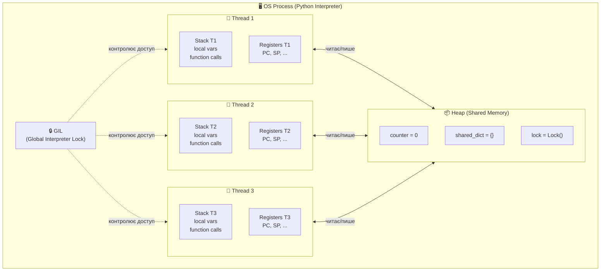
```mermaid
flowchart TD
    subgraph PROCESS["🖥️ OS Process (Python Interpreter)"]
        subgraph HEAP["📦 Heap (Shared Memory)"]
            OBJ1["counter = 0"]
            OBJ2["shared_dict = {}"]
            OBJ3["lock = Lock()"]
        end
        subgraph T1["🧵 Thread 1"]
            S1["Stack T1\nlocal vars\nfunction calls"]
            R1["Registers T1\nPC, SP, ..."]
        end
        subgraph T2["🧵 Thread 2"]
            S2["Stack T2\nlocal vars\nfunction calls"]
            R2["Registers T2\nPC, SP, ..."]
        end
        subgraph T3["🧵 Thread 3"]
            S3["Stack T3\nlocal vars\nfunction calls"]
            R3["Registers T3\nPC, SP, ..."]
        end
        GIL["🔒 GIL\n(Global Interpreter Lock)"]
    end

    T1 <-->|"читає/пише"| HEAP
    T2 <-->|"читає/пише"| HEAP
    T3 <-->|"читає/пише"| HEAP
    GIL -.->|"контролює доступ"| T1
    GIL -.->|"контролює доступ"| T2
    GIL -.->|"контролює доступ"| T3
```

---

## 2. GIL: Як Python виконує потоки

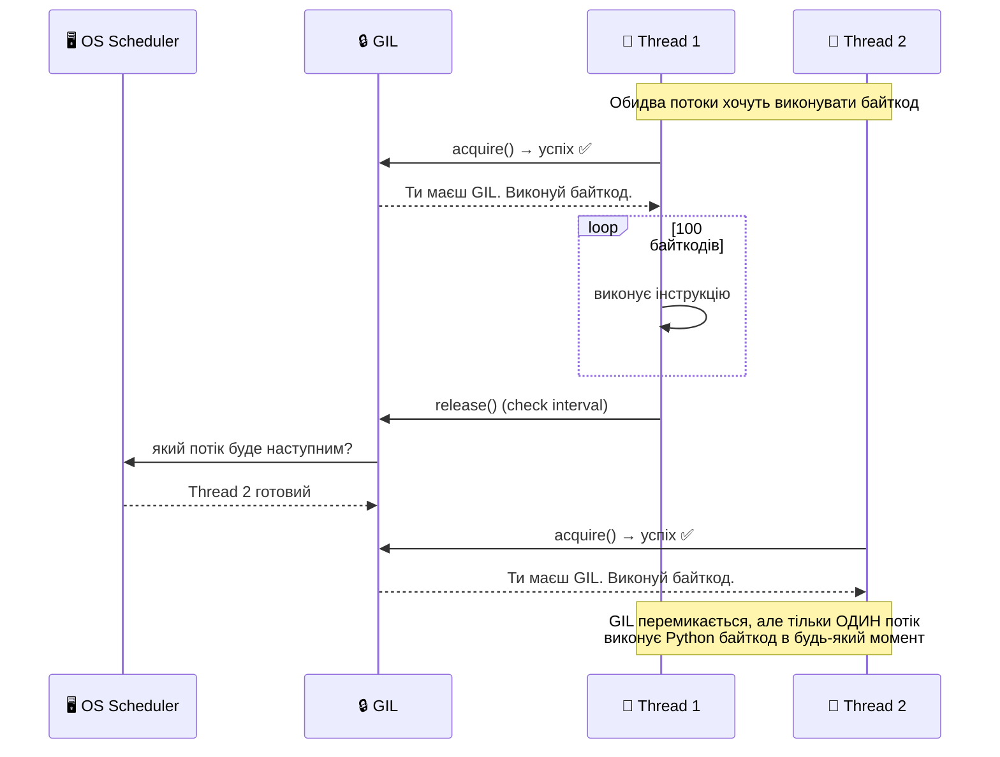
```mermaid
sequenceDiagram
    participant OS as 🖥️ OS Scheduler
    participant GIL as 🔒 GIL
    participant T1 as 🧵 Thread 1
    participant T2 as 🧵 Thread 2

    Note over T1,T2: Обидва потоки хочуть виконувати байткод

    T1->>GIL: acquire() → успіх ✅
    GIL-->>T1: Ти маєш GIL. Виконуй байткод.

    loop 100 байткодів
        T1->>T1: виконує інструкцію
    end

    T1->>GIL: release() (check interval)
    GIL->>OS: який потік буде наступним?
    OS-->>GIL: Thread 2 готовий

    T2->>GIL: acquire() → успіх ✅
    GIL-->>T2: Ти маєш GIL. Виконуй байткод.

    Note over T1,T2: GIL перемикається, але тільки ОДИН потік<br/>виконує Python байткод в будь-який момент
```

---

## 3. GIL та IO: Чому threading допомагає для IO-bound задач

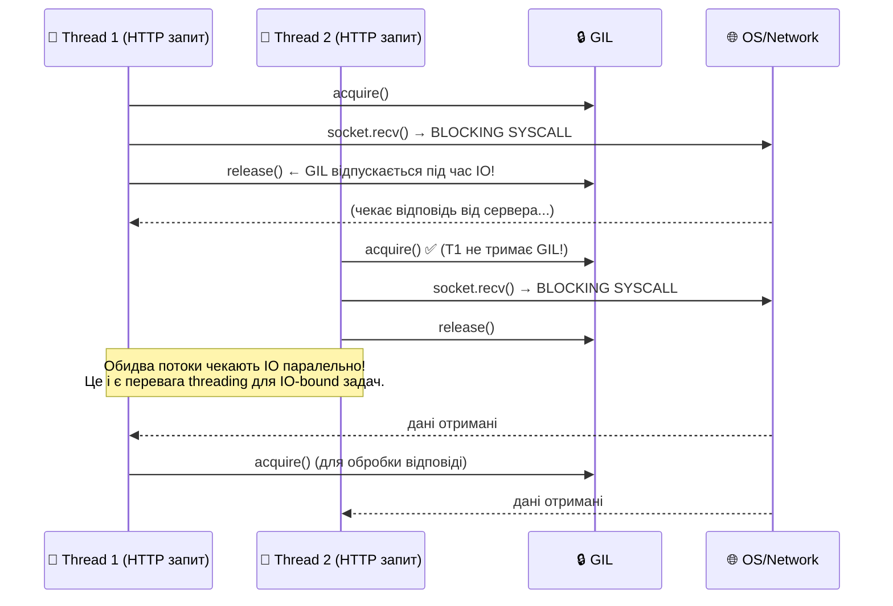
```mermaid
sequenceDiagram
    participant T1 as 🧵 Thread 1 (HTTP запит)
    participant T2 as 🧵 Thread 2 (HTTP запит)
    participant GIL as 🔒 GIL
    participant OS as 🌐 OS/Network

    T1->>GIL: acquire()
    T1->>OS: socket.recv() → BLOCKING SYSCALL
    T1->>GIL: release() ← GIL відпускається під час IO!
    OS-->>T1: (чекає відповідь від сервера...)

    T2->>GIL: acquire() ✅ (T1 не тримає GIL!)
    T2->>OS: socket.recv() → BLOCKING SYSCALL
    T2->>GIL: release()

    Note over T1,T2: Обидва потоки чекають IO паралельно!<br/>Це і є перевага threading для IO-bound задач.

    OS-->>T1: дані отримані
    T1->>GIL: acquire() (для обробки відповіді)
    OS-->>T2: дані отримані
```

---

## 4. Race Condition: Покроковий Timeline

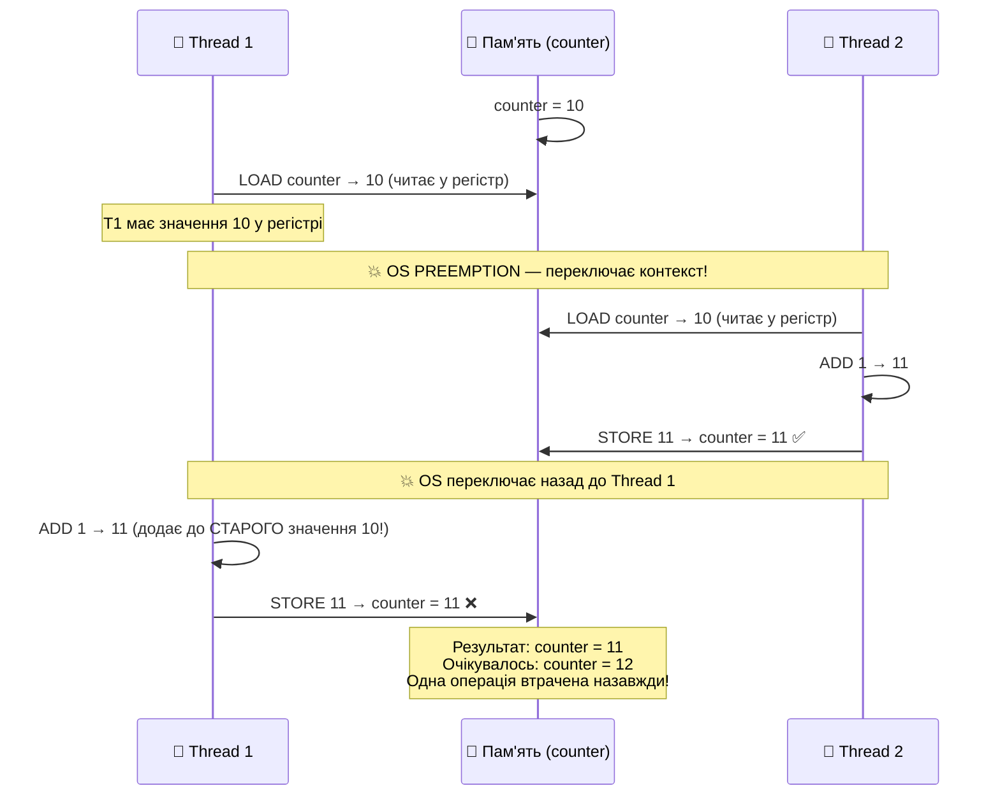
```mermaid
sequenceDiagram
    participant T1 as 🧵 Thread 1
    participant MEM as 💾 Пам'ять (counter)
    participant T2 as 🧵 Thread 2

    MEM->>MEM: counter = 10

    T1->>MEM: LOAD counter → 10 (читає у регістр)
    Note over T1: T1 має значення 10 у регістрі

    Note over T1,T2: 💥 OS PREEMPTION — переключає контекст!

    T2->>MEM: LOAD counter → 10 (читає у регістр)
    T2->>T2: ADD 1 → 11
    T2->>MEM: STORE 11 → counter = 11 ✅

    Note over T1,T2: 💥 OS переключає назад до Thread 1

    T1->>T1: ADD 1 → 11 (додає до СТАРОГО значення 10!)
    T1->>MEM: STORE 11 → counter = 11 ❌

    Note over MEM: Результат: counter = 11<br/>Очікувалось: counter = 12<br/>Одна операція втрачена назавжди!
```

---

## 5. Lock (Mutex): Як синхронізація вирішує Race Condition

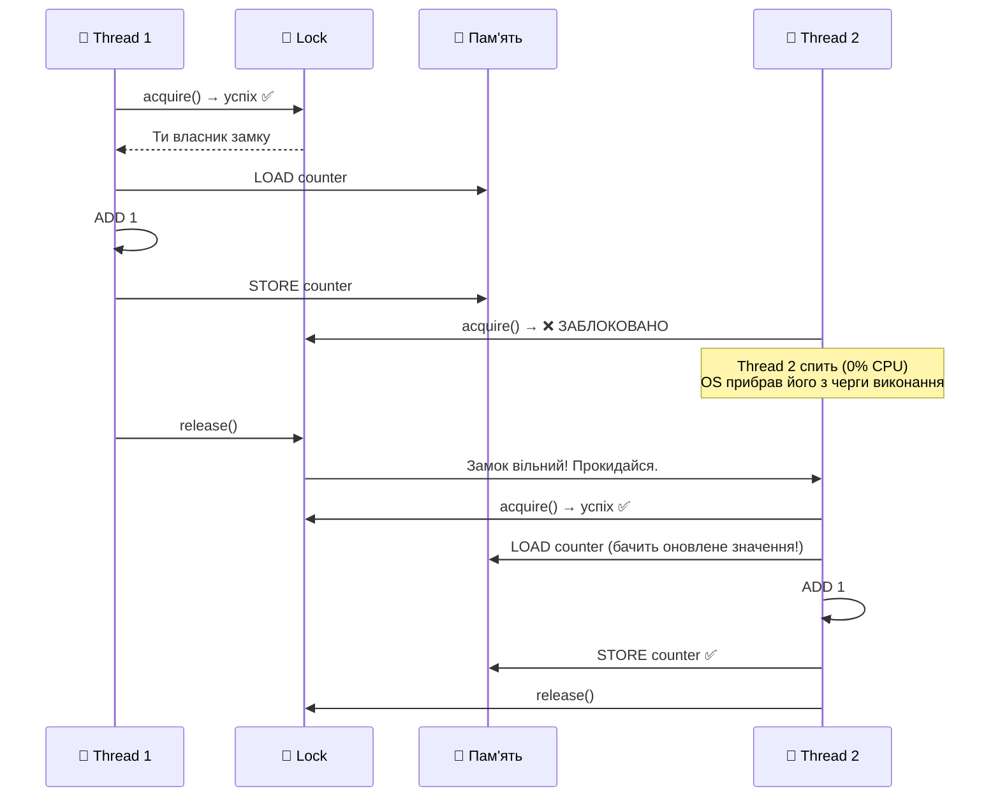
```mermaid
sequenceDiagram
    participant T1 as 🧵 Thread 1
    participant LOCK as 🔐 Lock
    participant MEM as 💾 Пам'ять
    participant T2 as 🧵 Thread 2

    T1->>LOCK: acquire() → успіх ✅
    LOCK-->>T1: Ти власник замку

    T1->>MEM: LOAD counter
    T1->>T1: ADD 1
    T1->>MEM: STORE counter

    T2->>LOCK: acquire() → ❌ ЗАБЛОКОВАНО
    Note over T2: Thread 2 спить (0% CPU)<br/>OS прибрав його з черги виконання

    T1->>LOCK: release()
    LOCK->>T2: Замок вільний! Прокидайся.

    T2->>LOCK: acquire() → успіх ✅
    T2->>MEM: LOAD counter (бачить оновлене значення!)
    T2->>T2: ADD 1
    T2->>MEM: STORE counter ✅
    T2->>LOCK: release()
```

---

## 6. Deadlock: Смертельне Обіймання

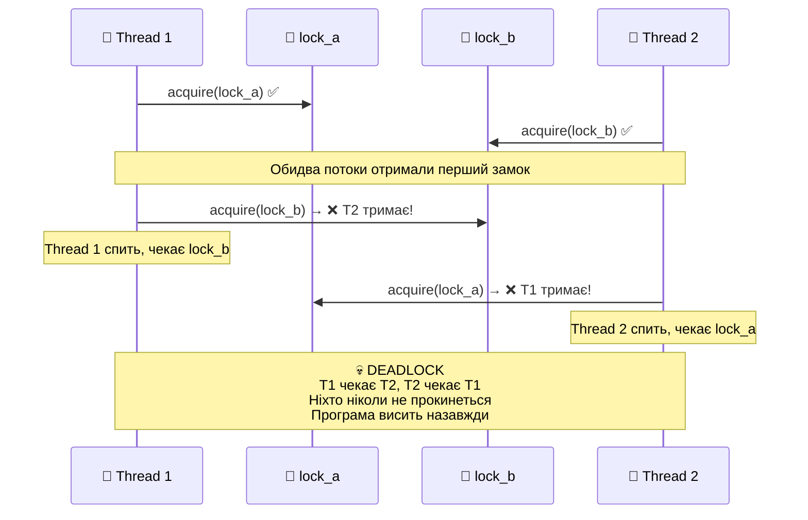
```mermaid
sequenceDiagram
    participant T1 as 🧵 Thread 1
    participant LA as 🔐 lock_a
    participant LB as 🔐 lock_b
    participant T2 as 🧵 Thread 2

    T1->>LA: acquire(lock_a) ✅
    T2->>LB: acquire(lock_b) ✅

    Note over T1,T2: Обидва потоки отримали перший замок

    T1->>LB: acquire(lock_b) → ❌ T2 тримає!
    Note over T1: Thread 1 спить, чекає lock_b

    T2->>LA: acquire(lock_a) → ❌ T1 тримає!
    Note over T2: Thread 2 спить, чекає lock_a

    Note over T1,T2: 💀 DEADLOCK<br/>T1 чекає T2, T2 чекає T1<br/>Ніхто ніколи не прокинеться<br/>Програма висить назавжди
```

---

## 7. ThreadPoolExecutor: Архітектура

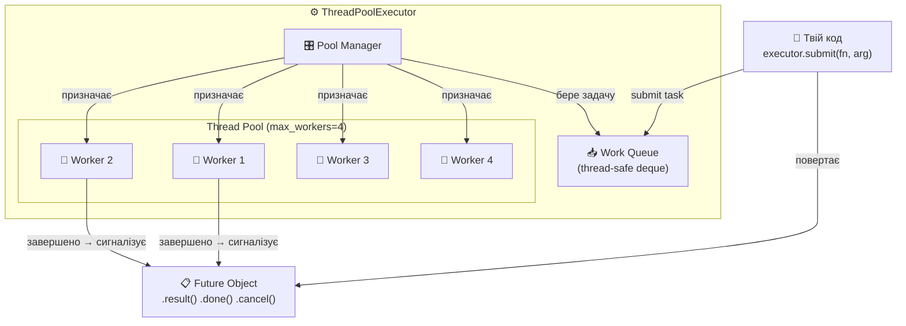
```mermaid
flowchart TD
    USER["👤 Твій код\nexecutor.submit(fn, arg)"]

    subgraph TPE["⚙️ ThreadPoolExecutor"]
        QUEUE["📥 Work Queue\n(thread-safe deque)"]
        subgraph POOL["Thread Pool (max_workers=4)"]
            W1["🧵 Worker 1"]
            W2["🧵 Worker 2"]
            W3["🧵 Worker 3"]
            W4["🧵 Worker 4"]
        end
        MANAGER["🎛️ Pool Manager"]
    end

    FUTURE["📋 Future Object\n.result() .done() .cancel()"]

    USER -->|"submit task"| QUEUE
    USER -->|"повертає"| FUTURE
    MANAGER -->|"бере задачу"| QUEUE
    MANAGER -->|"призначає"| W1
    MANAGER -->|"призначає"| W2
    MANAGER -->|"призначає"| W3
    MANAGER -->|"призначає"| W4
    W1 -->|"завершено → сигналізує"| FUTURE
    W2 -->|"завершено → сигналізує"| FUTURE
```

---

## 8. IO-bound vs CPU-bound: Коли що використовувати

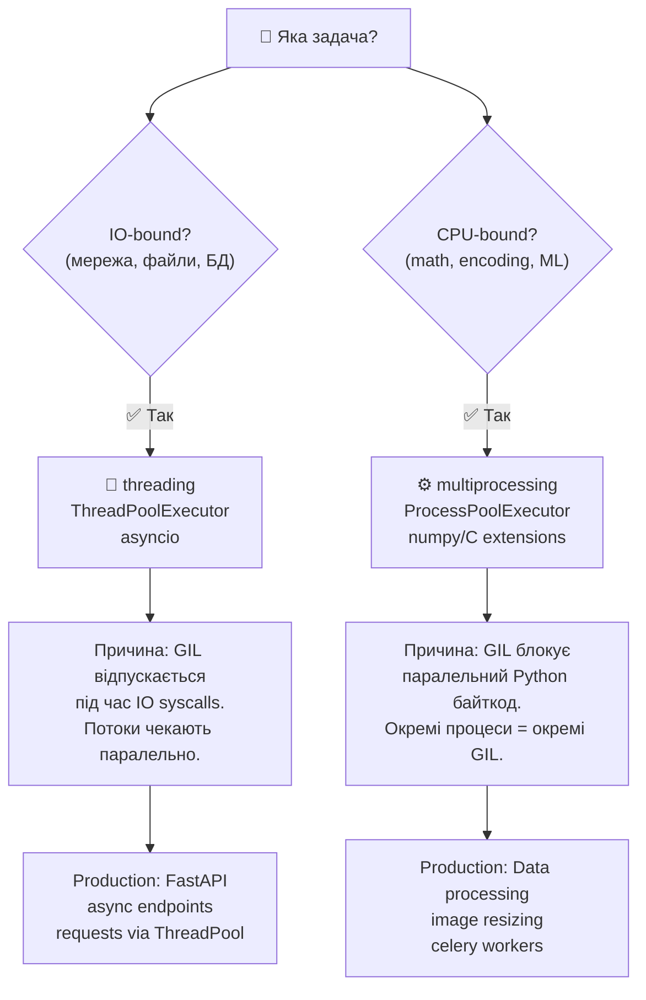
```mermaid
flowchart TD
    START["🤔 Яка задача?"]

    START --> IO_Q{"IO-bound?\n(мережа, файли, БД)"}
    START --> CPU_Q{"CPU-bound?\n(math, encoding, ML)"}

    IO_Q -->|"✅ Так"| THREADING["🧵 threading\nThreadPoolExecutor\nasyncio"]
    CPU_Q -->|"✅ Так"| MULTIPROCESSING["⚙️ multiprocessing\nProcessPoolExecutor\nnumpy/C extensions"]

    THREADING --> IO_WHY["Причина: GIL відпускається\nпід час IO syscalls.\nПотоки чекають паралельно."]
    MULTIPROCESSING --> CPU_WHY["Причина: GIL блокує\nпаралельний Python байткод.\nОкремі процеси = окремі GIL."]

    IO_WHY --> PROD1["Production: FastAPI\nasync endpoints\nrequests via ThreadPool"]
    CPU_WHY --> PROD2["Production: Data processing\nimage resizing\ncelery workers"]
```

---

## 9. Stack vs Heap: Де живуть дані потоків

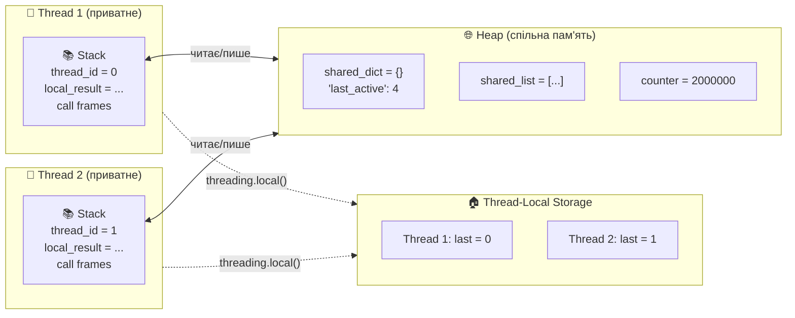
```mermaid
flowchart LR
    subgraph THREAD1["🧵 Thread 1 (приватне)"]
        STACK1["📚 Stack\nthread_id = 0\nlocal_result = ...\ncall frames"]
    end

    subgraph THREAD2["🧵 Thread 2 (приватне)"]
        STACK2["📚 Stack\nthread_id = 1\nlocal_result = ...\ncall frames"]
    end

    subgraph SHARED["🌐 Heap (спільна пам'ять)"]
        DICT["shared_dict = {}\n'last_active': 4"]
        LIST["shared_list = [...]"]
        COUNTER["counter = 2000000"]
    end

    STACK1 <-->|"читає/пише"| SHARED
    STACK2 <-->|"читає/пише"| SHARED

    subgraph TLS["🏠 Thread-Local Storage"]
        TL1["Thread 1: last = 0"]
        TL2["Thread 2: last = 1"]
    end

    THREAD1 -.->|"threading.local()"| TLS
    THREAD2 -.->|"threading.local()"| TLS
```

---

## 10. Sequential vs Concurrent Scraper: Архітектура

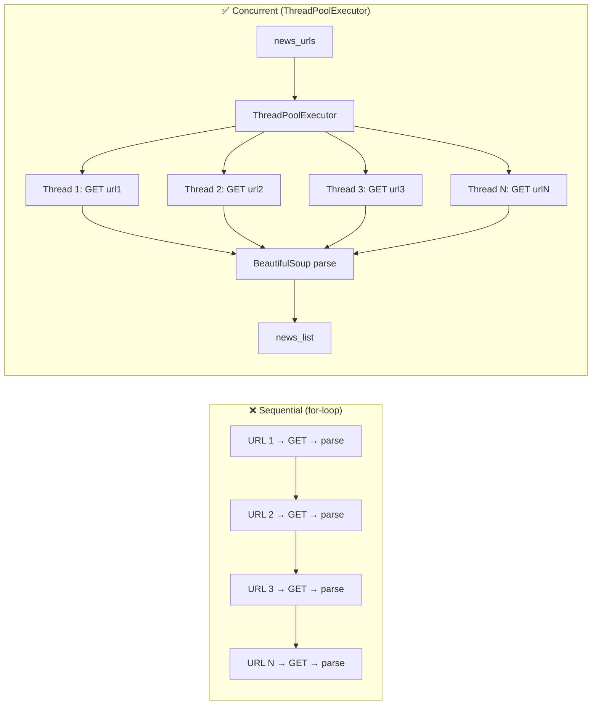
```mermaid
flowchart LR
    subgraph SEQ["❌ Sequential (for-loop)"]
        direction TB
        S1["URL 1 → GET → parse"] --> S2["URL 2 → GET → parse"]
        S2 --> S3["URL 3 → GET → parse"]
        S3 --> S4["URL N → GET → parse"]
    end

    subgraph CONC["✅ Concurrent (ThreadPoolExecutor)"]
        direction TB
        U["news_urls"] --> TPE["ThreadPoolExecutor"]
        TPE --> T1["Thread 1: GET url1"]
        TPE --> T2["Thread 2: GET url2"]
        TPE --> T3["Thread 3: GET url3"]
        TPE --> TN["Thread N: GET urlN"]
        T1 & T2 & T3 & TN --> BS["BeautifulSoup parse"]
        BS --> NL["news_list"]
    end
```

---

## 11. ThreadPoolExecutor: Sequence виконання

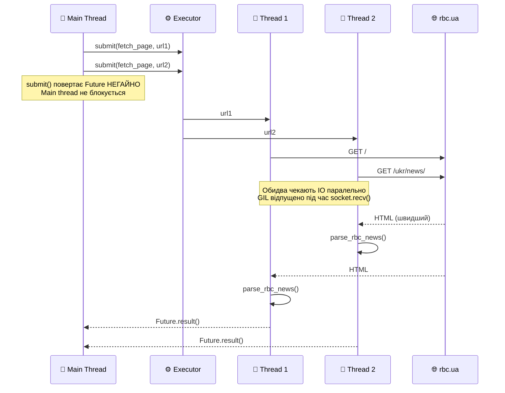
```mermaid
sequenceDiagram
    participant M as 🧵 Main Thread
    participant E as ⚙️ Executor
    participant T1 as 🧵 Thread 1
    participant T2 as 🧵 Thread 2
    participant S as 🌐 rbc.ua

    M->>E: submit(fetch_page, url1)
    M->>E: submit(fetch_page, url2)
    Note over M: submit() повертає Future НЕГАЙНО<br/>Main thread не блокується
    E->>T1: url1
    E->>T2: url2
    T1->>S: GET /
    T2->>S: GET /ukr/news/
    Note over T1,T2: Обидва чекають IO паралельно<br/>GIL відпущено під час socket.recv()
    S-->>T2: HTML (швидший)
    T2->>T2: parse_rbc_news()
    S-->>T1: HTML
    T1->>T1: parse_rbc_news()
    T1-->>M: Future.result()
    T2-->>M: Future.result()
```

---

## 12. as_completed vs executor.map

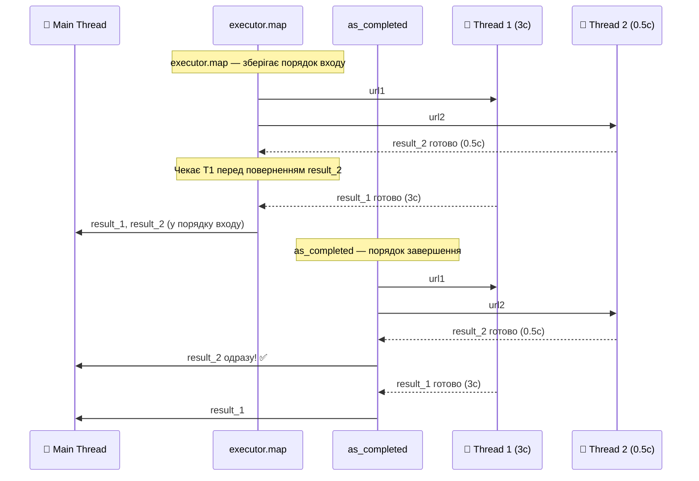
```mermaid
sequenceDiagram
    participant M as 🧵 Main Thread
    participant MAP as executor.map
    participant AC as as_completed
    participant T1 as 🧵 Thread 1 (3с)
    participant T2 as 🧵 Thread 2 (0.5с)

    Note over MAP: executor.map — зберігає порядок входу
    MAP->>T1: url1
    MAP->>T2: url2
    T2-->>MAP: result_2 готово (0.5с)
    Note over MAP: Чекає T1 перед поверненням result_2
    T1-->>MAP: result_1 готово (3с)
    MAP->>M: result_1, result_2 (у порядку входу)

    Note over AC: as_completed — порядок завершення
    AC->>T1: url1
    AC->>T2: url2
    T2-->>AC: result_2 готово (0.5с)
    AC->>M: result_2 одразу! ✅
    T1-->>AC: result_1 готово (3с)
    AC->>M: result_1
```

---

## 13. requests.Session: Thread Safety

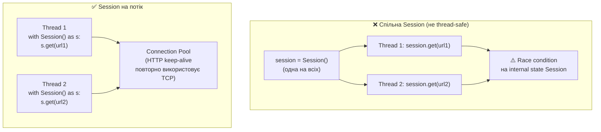
```mermaid
flowchart TD
    subgraph WRONG["❌ Спільна Session (не thread-safe)"]
        SS["session = Session()\n(одна на всіх)"]
        SS --> W1["Thread 1: session.get(url1)"]
        SS --> W2["Thread 2: session.get(url2)"]
        W1 & W2 --> RACE["⚠️ Race condition\nна internal state Session"]
    end

    subgraph RIGHT["✅ Session на потік"]
        R1["Thread 1\nwith Session() as s:\n  s.get(url1)"]
        R2["Thread 2\nwith Session() as s:\n  s.get(url2)"]
        R1 & R2 --> POOL["Connection Pool\n(HTTP keep-alive\nповторно використовує TCP)"]
    end
```

---

## 14. Thread-safe Дедуплікація: seen_urls + Lock

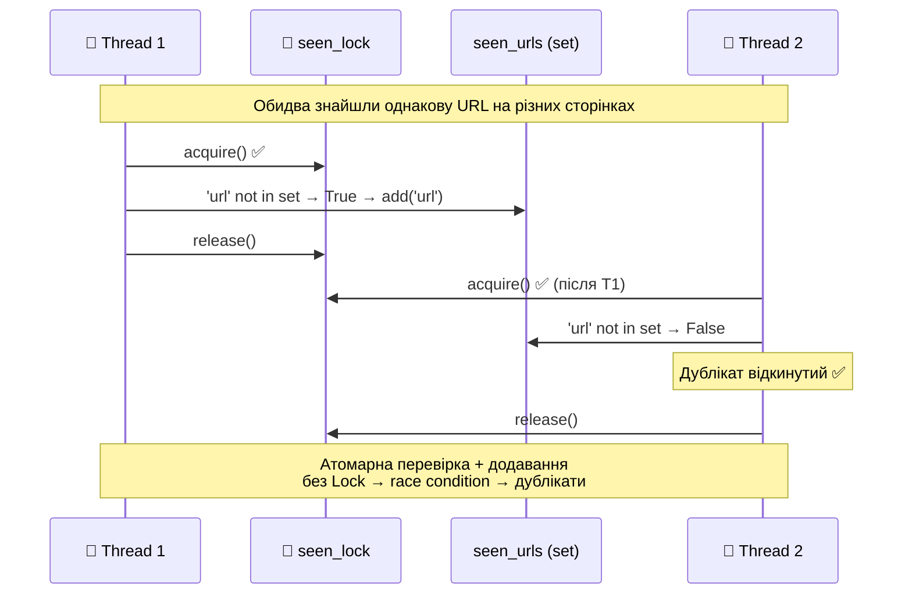
```mermaid
sequenceDiagram
    participant T1 as 🧵 Thread 1
    participant LOCK as 🔐 seen_lock
    participant SET as seen_urls (set)
    participant T2 as 🧵 Thread 2

    Note over T1,T2: Обидва знайшли однакову URL на різних сторінках

    T1->>LOCK: acquire() ✅
    T1->>SET: 'url' not in set → True → add('url')
    T1->>LOCK: release()

    T2->>LOCK: acquire() ✅ (після T1)
    T2->>SET: 'url' not in set → False
    Note over T2: Дублікат відкинутий ✅
    T2->>LOCK: release()

    Note over T1,T2: Атомарна перевірка + додавання<br/>без Lock → race condition → дублікати
```

---

## 15. tqdm + as_completed: Progress Bar для Threading

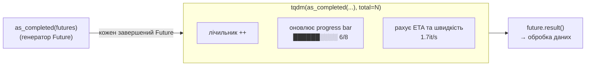
```mermaid
flowchart LR
    FUT["as_completed(futures)\n(генератор Future)"] -->|"кожен завершений Future"| TQDM

    subgraph TQDM["tqdm(as_completed(...), total=N)"]
        COUNT["лічильник ++"]
        BAR["оновлює progress bar\n██████░░░░  6/8"]
        ETA["рахує ETA та швидкість\n1.7it/s"]
    end

    TQDM --> RES["future.result()\n→ обробка даних"]
```

---

## 16. Phase 2: Article Deep Scraper

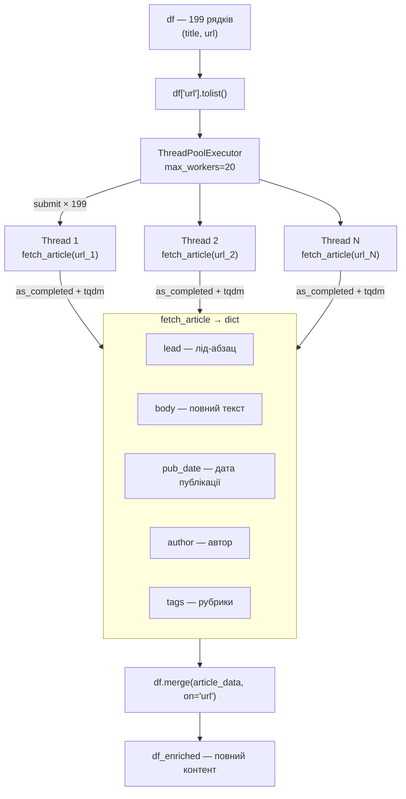
```mermaid
flowchart TD
    DF["df — 199 рядків\n(title, url)"] --> URLS["df['url'].tolist()"]
    URLS --> TPE["ThreadPoolExecutor\nmax_workers=20"]
    TPE -->|"submit × 199"| T1["Thread 1\nfetch_article(url_1)"]
    TPE --> T2["Thread 2\nfetch_article(url_2)"]
    TPE --> TN["Thread N\nfetch_article(url_N)"]

    subgraph RESULT["fetch_article → dict"]
        F1["lead — лід-абзац"]
        F2["body — повний текст"]
        F3["pub_date — дата публікації"]
        F4["author — автор"]
        F5["tags — рубрики"]
    end

    T1 & T2 & TN -->|"as_completed + tqdm"| RESULT
    RESULT --> MERGE["df.merge(article_data, on='url')"]
    MERGE --> DF2["df_enriched — повний контент"]
```

---

## 17. NLP Pipeline: Препроцесинг → Аналіз

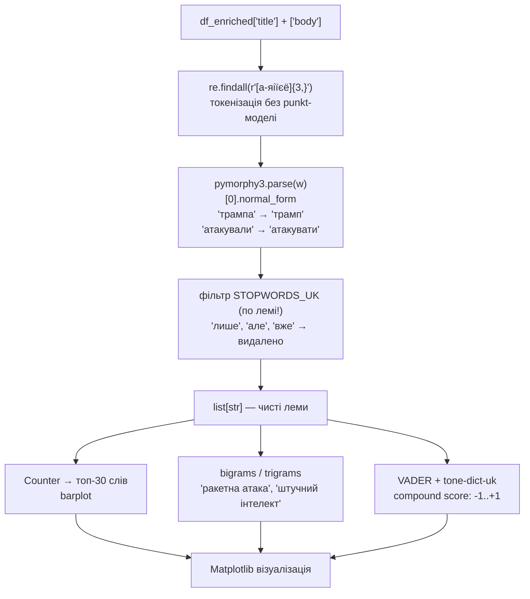
```mermaid
flowchart TD
    TEXT["df_enriched['title'] + ['body']"]
    TEXT --> TOK["re.findall(r'[а-яіїєё]{3,}')\nтокенізація без punkt-моделі"]
    TOK --> LEM["pymorphy3.parse(w)[0].normal_form\n'трампа' → 'трамп'\n'атакували' → 'атакувати'"]
    LEM --> STOP["фільтр STOPWORDS_UK (по лемі!)\n'лише', 'але', 'вже' → видалено"]
    STOP --> TOKENS["list[str] — чисті леми"]

    TOKENS --> FREQ["Counter → топ-30 слів\nbarplot"]
    TOKENS --> NGRAMS["bigrams / trigrams\n'ракетна атака', 'штучний інтелект'"]
    TOKENS --> SENT["VADER + tone-dict-uk\ncompound score: -1..+1"]

    FREQ & NGRAMS & SENT --> VIZ["Matplotlib візуалізація"]
```

---

## 18. Повна Архітектура: 3-Phase Scraper Pipeline

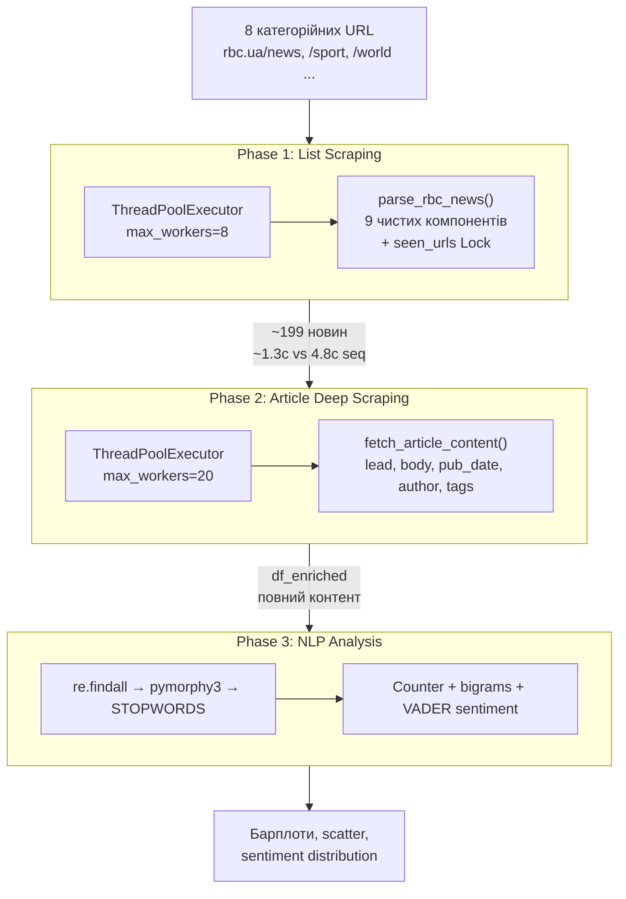
```mermaid
flowchart TD
    START["8 категорійних URL\nrbc.ua/news, /sport, /world ..."]

    subgraph P1["Phase 1: List Scraping"]
        TPE1["ThreadPoolExecutor\nmax_workers=8"]
        PARSE1["parse_rbc_news()\n9 чистих компонентів\n+ seen_urls Lock"]
        TPE1 --> PARSE1
    end

    subgraph P2["Phase 2: Article Deep Scraping"]
        TPE2["ThreadPoolExecutor\nmax_workers=20"]
        PARSE2["fetch_article_content()\nlead, body, pub_date, author, tags"]
        TPE2 --> PARSE2
    end

    subgraph P3["Phase 3: NLP Analysis"]
        PRE["re.findall → pymorphy3 → STOPWORDS"]
        ANA["Counter + bigrams + VADER sentiment"]
        PRE --> ANA
    end

    START --> P1
    P1 -->|"~199 новин\n~1.3с vs 4.8с seq"| P2
    P2 -->|"df_enriched\nповний контент"| P3
    P3 --> VIZ["Барплоти, scatter,\nsentiment distribution"]
```
