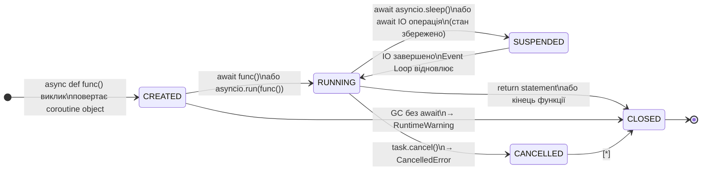
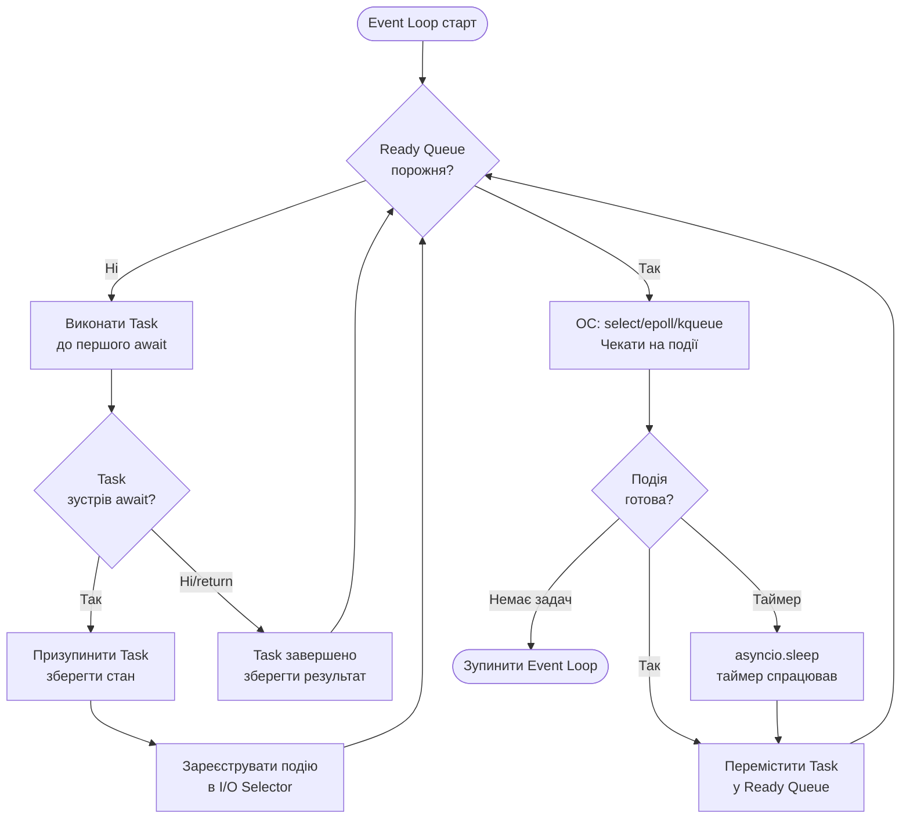
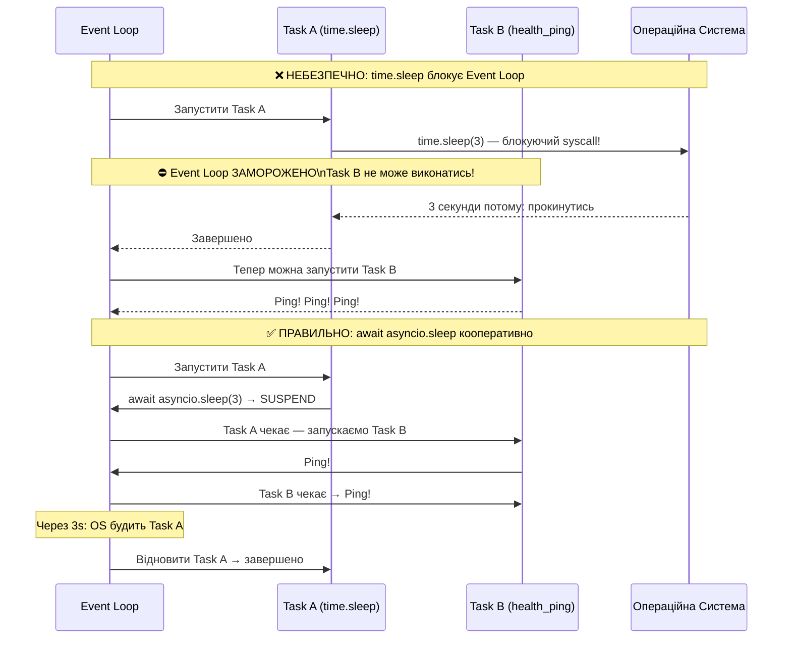
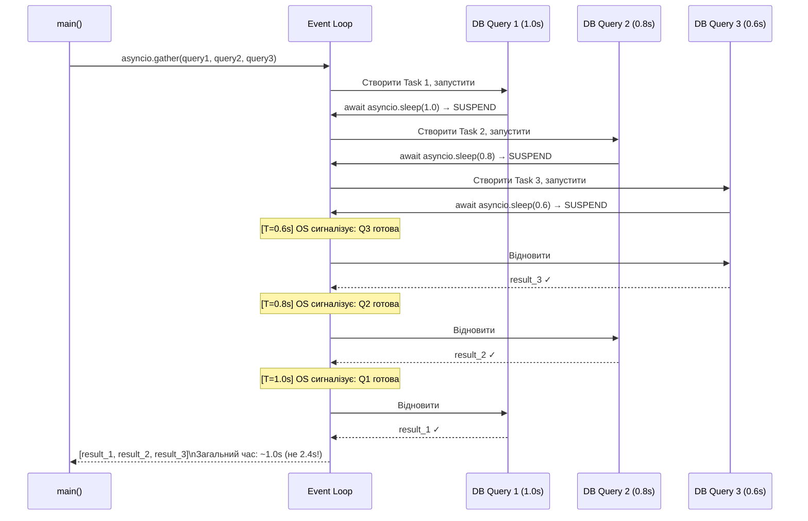
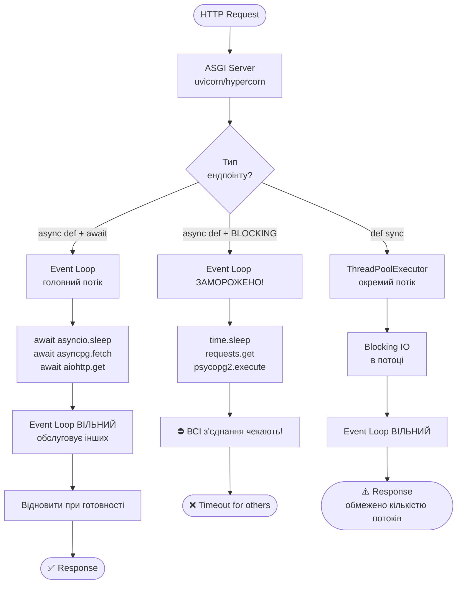
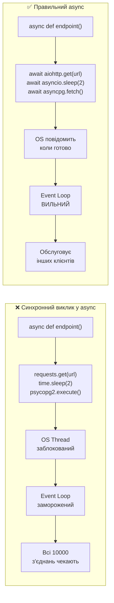
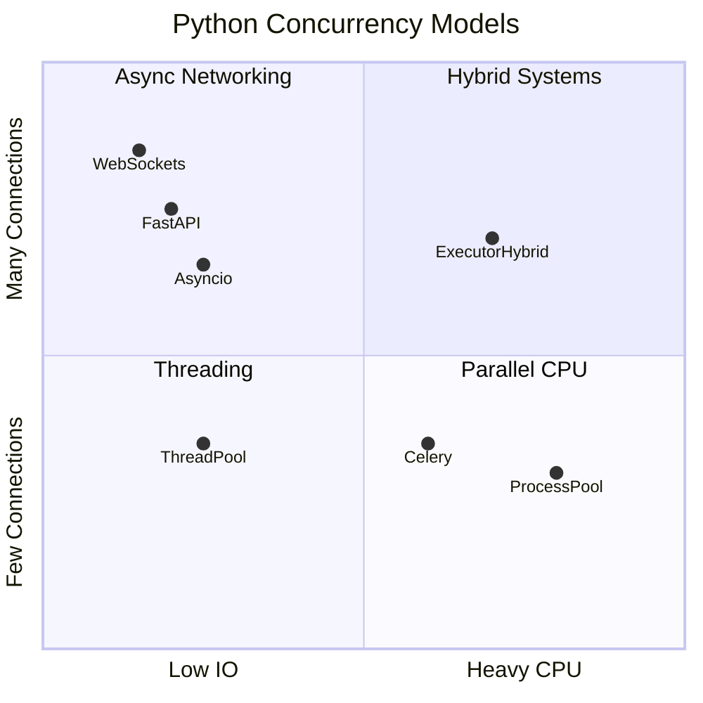
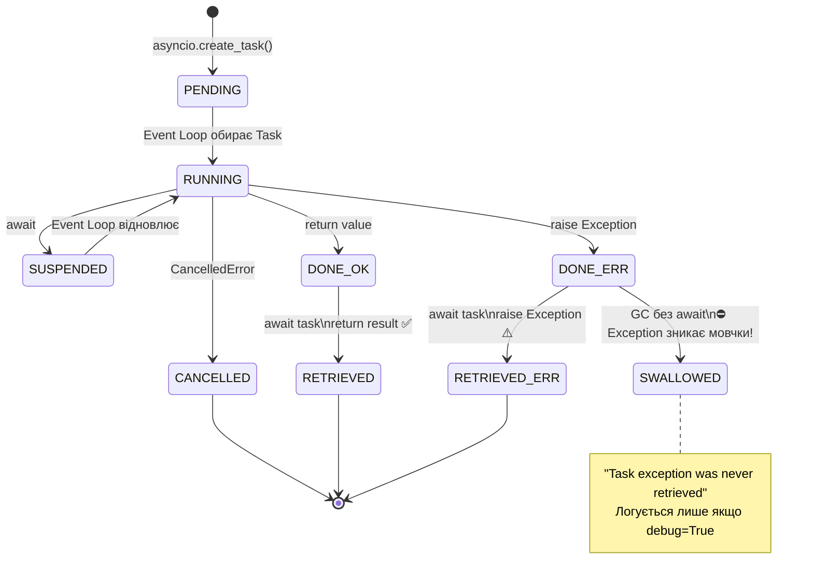
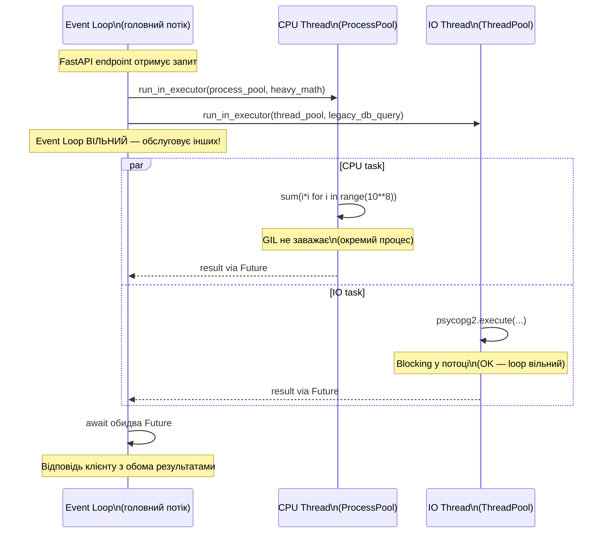
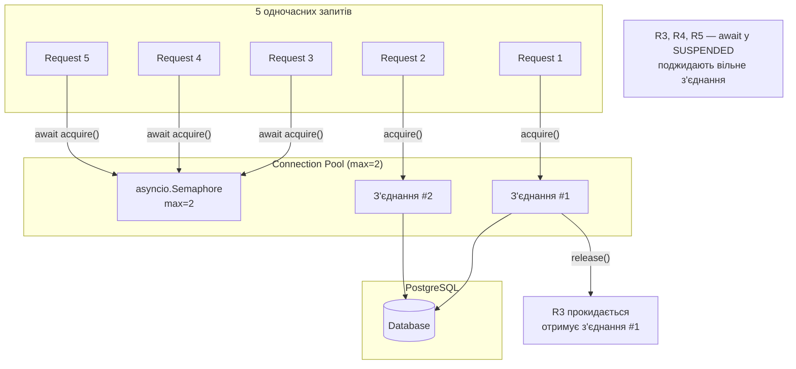

# Урок 34 — Asyncio: Mermaid Діаграми

---

## Діаграма 1: Lifecycle Coroutine об'єкта

---

## Діаграма 2: Event Loop — Алгоритм Планування

---

## Діаграма 3: Sequence — await vs time.sleep

---

## Діаграма 4: asyncio.gather — Concurrent Execution

---

## Діаграма 5: FastAPI — Три типи ендпоінтів

---

## Діаграма 6: Blocking Calls — Ланцюг впливу

---

## Діаграма 7: Threading vs Multiprocessing vs Asyncio

---

## Діаграма 8: Task States та Exception Handling

---

## Діаграма 9: run_in_executor — Міст між світами

---

## Діаграма 10: Async Connection Pool

