# DJANGO FORMS — Від сирих даних до бази даних

> **Де ти зараз у системі знань:**
> `RELATIONAL_DB_FOUNDATIONS` → `DJANGO_ORM_DEEP` → **`DJANGO_FORMS`** ← ти тут
>
> Форми — це міст між браузером і ORM. Вони перетворюють небезпечні HTTP-рядки
> на типізовані Python-об'єкти, готові до запису в базу даних.

---

> 🔬 **QuerySet у формах — у ноутбуку:**
> [`notes_project/hello_app/orm_laboratory.ipynb`](notes_project/hello_app/orm_laboratory.ipynb)
>
> | Концепція форм | Розділ ноутбука |
> |---------------|-----------------|
> | ModelForm + FK choices (queryset для вибору) | `## 2. 🔍 Lazy Methods` → filter() |
> |  → ORM (Trust Boundary) | `## 14. 🧪 Raw SQL` — безпечні параметри |
> | PRG pattern після POST | `README.md` → секція `03 · WRITE flow` |


## 1. Core Mechanism — Що таке Django Form зсередини?

### 🧠 Ментальна модель

Уяви митницю на кордоні між двома країнами:

```
┌─────────────────────────────────────────────────────────────────────────┐
│                     КОРДОН ДОВІРИ (Trust Boundary)                      │
│                                                                         │
│  🌐 Браузер (небезпечна зона)     ║     🔒 Django + БД (безпечна зона) │
│  ─────────────────────────────    ║    ──────────────────────────────   │
│  request.POST["title"] = "..."    ║    form.cleaned_data["title"]       │
│  request.POST["price"] = "abc"    ║    (типізований str, int, Decimal)  │
│  (ЦЕ ПРОСТО РЯДКИ, нічого більше) ║    (перевірені, безпечні об'єкти)   │
│                                   ║                                     │
│                           [  ФОРМА  ]                                   │
│                        митниця на кордоні                               │
└─────────────────────────────────────────────────────────────────────────┘
```

**Форма Django — це клас Python** що визначає:
- Які поля очікуються (структура)
- Як перевірити кожне поле (валідація)
- Як перетворити рядок HTTP на Python-тип (coercion)
- Як відрендерити HTML для браузера (widget)

### 📚 Чому це існує?

HTTP — текстовий протокол. Браузер надсилає *все* як рядки:
```
POST /notes/create/ HTTP/1.1

title=My+Note&priority=2&price=abc
```

Без форми тобі треба:
1. Вручну дістати `request.POST.get("priority")`
2. Вручну перевірити чи це число: `try: int(value) except ...`
3. Вручну перевірити діапазон: `if 1 <= priority <= 4`
4. Вручну екранувати від XSS перед показом
5. Вручну захищати від SQL-ін'єкцій

Форма робить **все це автоматично і безпечно**.

### ❌ Типова помилка

```python
# ❌ НЕБЕЗПЕЧНО: прямо з POST в ORM — ніколи так не роби!
Note.objects.create(
    title=request.POST["title"],   # може містити "<script>alert(1)</script>"
    priority=request.POST["priority"],  # може бути "abc", None, "-999"
)

# ✅ ПРАВИЛЬНО: через форму
form = NoteForm(request.POST)
if form.is_valid():
    Note.objects.create(**form.cleaned_data)
```

---

## 2. Form Lifecycle — Послідовність станів форми

### 📚 Крок 0: Browser Submission → request.POST (QueryDict)

Перш ніж форма Django отримає дані — вони проходять через HTTP шар:

```
Browser → URL encode → HTTP POST body → Django parses → QueryDict

HTML:  <input name="title" value="Моя нотатка">
       <input name="priority" value="2">
       <input name="csrfmiddlewaretoken" value="abc123...">

HTTP body: title=My+Note&priority=2&csrfmiddlewaretoken=abc123...

Django:
request.POST = QueryDict({
    'title': ['Моя нотатка'],       # ← завжди список рядків!
    'priority': ['2'],              # ← рядок "2", не int 2!
    'csrfmiddlewaretoken': ['abc123...'],
})

request.POST['title']     → 'Моя нотатка'   (один рядок)
request.POST.getlist('tags') → ['1', '3', '5']  # M:N: кілька значень
```

**Ключовий факт:** `QueryDict` — незмінний (immutable), всі значення — рядки.
Форма перетворює ці рядки на типізовані Python-об'єкти.

### 🧠 Ментальна модель

Форма проходить через **7 чітких станів**. Як конвеєр на заводі:

```
Browser                    Django View                      Database
   │                            │                               │
   │──── HTTP POST ─────────────►│                               │
   │                            │                               │
   │              form = NoteForm(request.POST)                  │
   │                    │ STATE: bound (зв'язана)                │
   │                            │                               │
   │              form.is_valid()                               │
   │                    │ → запускає validation pipeline        │
   │                            │                               │
   │              ┌─────────────┴──────────────┐               │
   │              │ is_valid=True               │ is_valid=False │
   │              │                             │               │
   │              ▼                             ▼               │
   │     form.cleaned_data             form.errors              │
   │     (типізовані об'єкти)          (словник помилок)        │
   │              │                             │               │
   │              ▼                             ▼               │
   │     services.create_note(...)      render(request,         │
   │              │                     template, {'form':form}) │
   │              ▼                             │               │
   │     return redirect(...)           HTTP 200 з формою ◄─────┘
   │◄─── HTTP 302 ──────────────         (поля з помилками)
```

### 📚 Чому саме така послідовність?

**Чому redirect після успіху (PRG патерн)?**

```
БЕЗ REDIRECT:
  POST /notes/create/ → 200 OK (HTML сторінка)
  User натискає F5 → браузер питає "Повторити POST?" → дублікат нотатки!

З REDIRECT:
  POST /notes/create/ → 302 Redirect → GET /notes/42/ → 200 OK
  User натискає F5 → браузер повторює GET → безпечно, ніякого дубліката
```

**Чому форма відображається знову з помилками?**

Щоб користувач не втратив введені дані! Django зберігає вже введені значення
в `form.initial` і повертає їх у HTML при повторному рендері.

### 🌐 Sequence Diagram: обидва шляхи (success + validation failure)

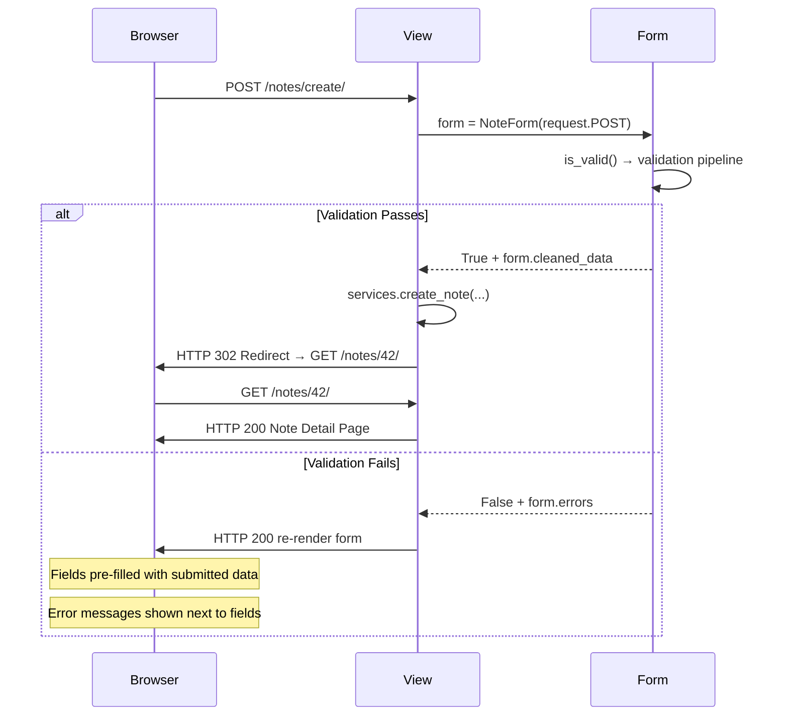

**Чому HTTP 200 при помилках (не 400)?**
Django повертає 200 щоб браузер міг нормально відобразити форму з помилками.
HTTP 400 (Bad Request) був би правильнішим семантично, але на практиці
більшість Django додатків використовують 200 для re-render форми.

### ❌ Типова помилка

```python
# ❌ Неправильно: немає redirect після POST
def note_create(request):
    form = NoteForm(request.POST)
    if form.is_valid():
        note = Note.objects.create(...)
        return render(request, 'note_detail.html', {'note': note})
        # F5 = повторний POST = дублікат!

# ✅ Правильно: PRG (Post/Redirect/Get)
def note_create(request):
    form = NoteForm(request.POST)
    if form.is_valid():
        note = services.create_note(...)
        return redirect('hello_app:note_detail', pk=note.pk)  # ← 302!
```

---

## 3. Mental Models — Три способи думати про форми

### 🧠 Ментальна модель 1: Trust Boundary (Кордон Довіри)

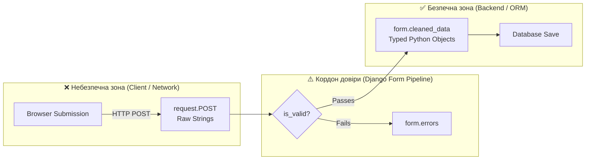

**Все що лівіше `is_valid()` — небезпечні рядки. Все що правіше — безпечні об'єкти.**

### 🧠 Ментальна модель 2: Validation Pipeline (Конвеєр фільтрів)

Форма — це не просто HTML, це ланцюг фільтрів:

```
Сирий рядок
    │
    ▼
[to_python()]     → "2" → int(2)     "abc" → ValidationError!
    │
    ▼
[validate()]      → int(2), min=1, max=4 → OK   int(99) → Error!
    │
    ▼
[run_validators()] → кастомні функції → OK або Error
    │
    ▼
[clean_<field>()]  → твоя бізнес-логіка → OK або Error
    │
    ▼
[clean()]          → крос-валідація між полями
    │
    ▼
cleaned_data["priority"] = 2    ← Python int, гарантовано 1–4
```

### 🧠 Ментальна модель 3: HTML ↔ Python Bridge (Двонаправлений міст)

```
GET запит (відображення форми):
  Model / initial data
        │
        ▼
    Form Field ──► Widget ──► HTML <input value="...">
    (Python)                  (Text для браузера)

POST запит (обробка відповіді):
  HTML <input value="...">
        │
        ▼
    Form Field ──► cleaned_data ──► ORM save()
    (Text→Python)  (Python object)  (SQL INSERT/UPDATE)
```

---

## 4. HTML Forms vs Django Forms

### 📚 Чому серверна валідація є обов'язковою?

HTML5 атрибути типу `required`, `maxlength`, `type="email"` — це зручний UX,
але **не захист**. Будь-хто може обійти браузерну перевірку:

```bash
# Зловмисник обходить HTML5 валідацію через curl:
curl -X POST http://localhost:8000/notes/create/ \
  -d "title=&priority=999&content=<script>alert(1)</script>"

# Браузерний required="required" → не має ефекту при curl
# priority=999 → поза дозволеним діапазоном
# <script> → XSS атака
```

**Серверна валідація Django перехопить це все:**

```python
form = NoteForm(request.POST)  # POST: priority=999, title=""
form.is_valid()  # → False
form.errors
# {
#   'title': ['Це поле обов'язкове.'],
#   'priority': ['Значення 999 не є допустимим вибором.']
# }
# content з <script> безпечно екранований Django шаблонним рушієм
```

### 🌐 Як обробляє Django?

| HTML5 атрибут | Django аналог | Де перевіряється |
|---------------|---------------|------------------|
| `required` | `blank=False` (модель) або `required=True` (поле) | Сервер |
| `maxlength="200"` | `max_length=200` у CharField | Сервер |
| `type="email"` | `EmailField()` | Сервер |
| `min="1" max="4"` | `MinValueValidator(1)` | Сервер |
| Немає аналогу | `clean_<field>()` (бізнес-логіка) | Тільки сервер |

---

## 5. Django Forms Internals — Архітектура зсередини

### 🧠 Ментальна модель: Field vs Widget

Це два незалежні компоненти з різними відповідальностями:

```
CharField (поле)                    TextInput (віджет)
───────────────────────────         ──────────────────────────────
Відповідає за:                      Відповідає за:
  • Тип даних (str)                   • HTML рендеринг
  • max_length валідацію              • attrs (class, placeholder)
  • required перевірку                • <input type="text">
  • to_python() конверсію             • читання value з POST
```

**Одне поле → кілька різних віджетів:**

```python
# CharField може рендеритись як:
CharField(widget=TextInput)    # → <input type="text">
CharField(widget=Textarea)     # → <textarea>
CharField(widget=HiddenInput)  # → <input type="hidden">
CharField(widget=PasswordInput)# → <input type="password">

# Поле одне — дані однакового типу, але HTML різний!
```

### 📚 Чому Field і Widget розділені?

**Принцип Single Responsibility**: поле знає про дані, віджет — про HTML.
Це дозволяє міняти відображення без зміни логіки валідації:

```python
class NoteForm(forms.ModelForm):
    class Meta:
        model = Note
        fields = ['title', 'content']
        widgets = {
            # Міняємо widget — валідація CharField залишається!
            'content': forms.Textarea(attrs={
                'class': 'form-control',
                'rows': 8,
                'placeholder': 'Текст нотатки...',
            }),
        }
```

### 🌐 Error Collection — Як збираються помилки

```python
# Після form.is_valid() == False:
form.errors
# {
#   'title': ['Це поле обов'язкове.'],
#   'priority': ['Значення 5 не є допустимим вибором.'],
#   '__all__': ['Помилка між полями']  # non_field_errors
# }

# У шаблоні:
# {{ form.title.errors }}   → помилки конкретного поля
# {{ form.non_field_errors }} → крос-валідаційні помилки
# {{ form.errors }}          → всі помилки разом
```

---

## 6. ModelForms Internals — Автогенерація з моделі

### 🧠 Ментальна модель: Інтроспекція моделі

`ModelForm` читає модель через `Meta.model` і автоматично генерує поля:

```
Model Field                    →    Form Field
─────────────────────────────       ─────────────────
CharField(max_length=200)      →    CharField(max_length=200)
TextField(blank=True)          →    CharField(widget=Textarea, required=False)
PositiveSmallIntegerField(     →    TypedChoiceField(choices=...,
    choices=PRIORITY_CHOICES)           coerce=int)
ForeignKey(Notebook)           →    ModelChoiceField(queryset=Notebook.objects.all())
ManyToManyField(Tag, blank=T)  →    ModelMultipleChoiceField(queryset=Tag.objects.all())
BooleanField(default=False)    →    BooleanField(widget=CheckboxInput)
```

### 📚 Чому `save(commit=False)` існує?

Класичний сценарій — нотатка вимагає `user`, але `user` не в формі:

```python
class NoteForm(forms.ModelForm):
    class Meta:
        model = Note
        fields = ['title', 'content']  # user НЕ в формі (безпека!)
        # Якби user був у формі — будь-хто міг би підставити чужий user.id

def note_create(request):
    form = NoteForm(request.POST)
    if form.is_valid():
        # commit=False → створює об'єкт Note в пам'яті, але НЕ записує в БД
        note = form.save(commit=False)
        note.user = request.user  # ← додаємо user з сесії (безпечно!)
        note.save()               # ← тепер зберігаємо в БД
        note.tags.set(form.cleaned_data['tags'])  # M:N після save()!
```

### 🌐 Sequence Diagram: повний цикл POST → ModelForm → БД

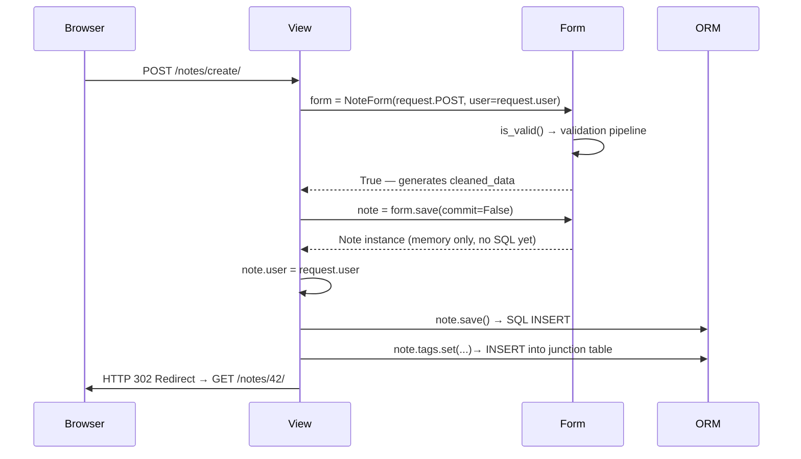

**`save(commit=False)` зупиняє виконання після створення Python-об'єкта.**
SQL `INSERT` відбувається лише коли ти сам викликаєш `note.save()`.
Це дозволяє безпечно додати `user` або будь-які серверні дані до збереження.

### ❌ Типова помилка

```python
# ❌ M:N поля після commit=False вимагають окремого збереження!
note = form.save(commit=False)
note.user = request.user
note.save()
# form.save_m2m() ← ЗАБУВ! Теги не збережено!

# ✅ Правильно: завжди виклик save_m2m() після commit=False з M:N
note = form.save(commit=False)
note.user = request.user
note.save()
form.save_m2m()  # ← зберігає ManyToMany поля

# Або краще: через Services (як у нашому notes_project)
note = services.create_note(
    user=request.user,
    title=form.cleaned_data['title'],
    tag_ids=[t.id for t in form.cleaned_data['tags']],
)
```

---

## 7. Widgets Architecture — Рендеринг HTML

### 🧠 Ментальна модель: Widget як HTML-генератор

Кожен Widget — це об'єкт що знає як перетворити Python-значення на HTML:

```python
# Widget.render(name, value, attrs) → HTML string
TextInput().render('title', 'Моя нотатка', {'class': 'form-control'})
# → '<input type="text" name="title" value="Моя нотатка" class="form-control">'

Textarea().render('content', 'Текст...', {'rows': '8'})
# → '<textarea name="content" rows="8">Текст...</textarea>'

Select().render('priority', 2, {}, choices=[(1,'Низький'),(2,'Середній')])
# → '<select name="priority"><option value="1">Низький</option>
#     <option value="2" selected>Середній</option></select>'
```

### 🌐 Кастомізація attrs

```python
class NoteForm(forms.ModelForm):
    class Meta:
        model = Note
        fields = ['title', 'content', 'priority', 'notebook', 'tags', 'is_pinned']
        widgets = {
            'title': forms.TextInput(attrs={
                'class': 'form-control',           # Bootstrap клас
                'placeholder': 'Назва нотатки...', # підказка
                'autofocus': True,                  # фокус при відкритті
            }),
            'content': forms.Textarea(attrs={
                'class': 'form-control',
                'rows': 8,
            }),
            'priority': forms.Select(attrs={
                'class': 'form-select',             # Bootstrap 5 select
            }),
            'tags': forms.CheckboxSelectMultiple(attrs={
                'class': 'list-unstyled',
            }),
            'is_pinned': forms.CheckboxInput(attrs={
                'class': 'form-check-input',
            }),
            # HTML5 color picker!
            'color': forms.TextInput(attrs={
                'type': 'color',
                'class': 'form-control form-control-color',
            }),
        }
```

### 🌐 Архітектура: Widget CSS Injection

Як backend → CSS клас → HTML рендеринг:

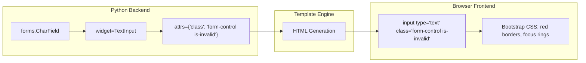

### 🌐 Form Rendering Pipeline

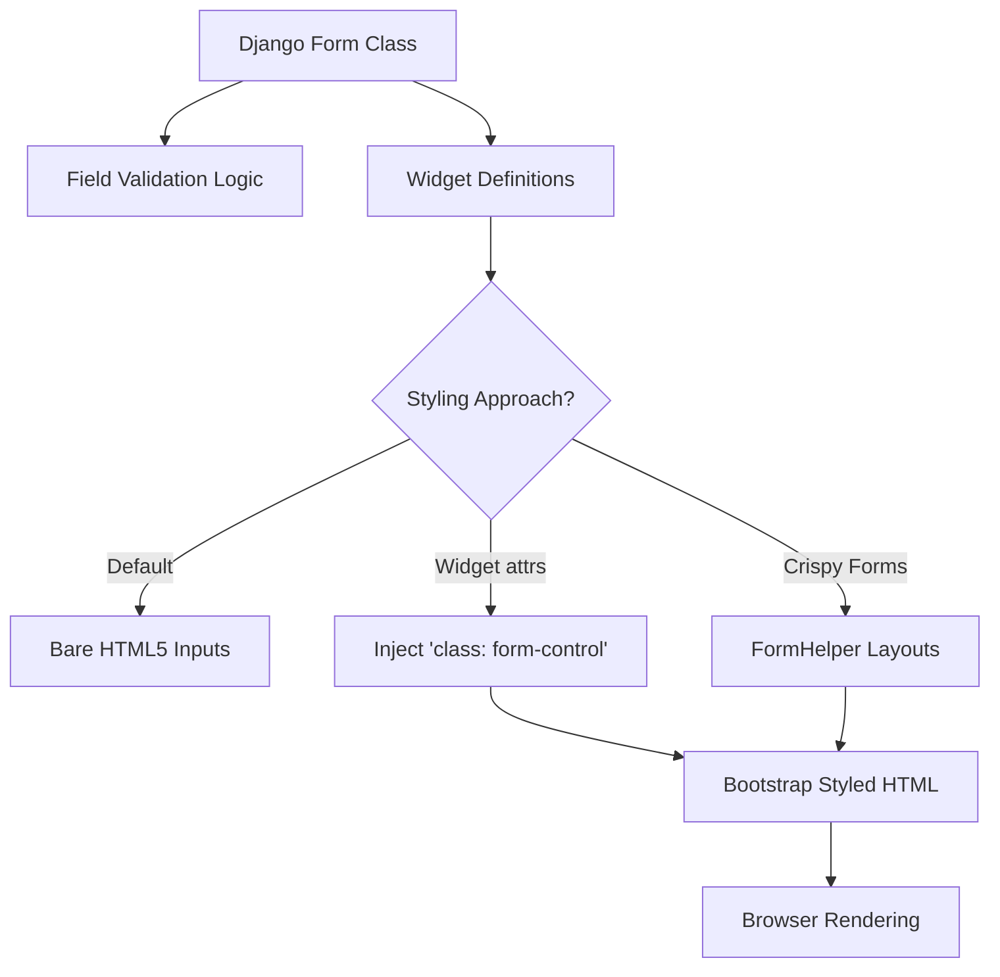

**Bootstrap класи для Django widgets:**

| Bootstrap клас | Де використовується | Django widget |
|----------------|---------------------|---------------|
| `form-control` | TextInput, Textarea, Select | `attrs={'class': 'form-control'}` |
| `form-select` | Select, SelectMultiple | `attrs={'class': 'form-select'}` |
| `form-check-input` | CheckboxInput | `attrs={'class': 'form-check-input'}` |
| `form-control-color` | Color picker | `type="color"` + `form-control-color` |
| `is-invalid` | Поле з помилкою | додається динамічно через Python/template |
| `invalid-feedback` | Контейнер помилки | `<div class="invalid-feedback">{{ field.errors }}</div>` |

### 📚 Enterprise підхід: django-crispy-forms

У великих проектах замість ручного `attrs` використовують `crispy-forms`:

```python
# Без crispy: ручне додавання class до кожного widget
# З crispy: автоматично Bootstrap layout
from crispy_forms.helper import FormHelper
from crispy_forms.layout import Layout, Row, Column, Submit

class NoteForm(forms.ModelForm):
    def __init__(self, *args, **kwargs):
        super().__init__(*args, **kwargs)
        self.helper = FormHelper()
        self.helper.form_method = 'POST'          # ← <form method="post">
        self.helper.layout = Layout(
            Row(Column('title', css_class='col-md-8'),
                Column('priority', css_class='col-md-4')),
            'content',
            Row(Column('notebook'), Column('tags')),
            Submit('submit', 'Зберегти', css_class='btn btn-primary'),
        )
        # У шаблоні просто:   
        # crispy-forms автоматично рендерить весь Bootstrap grid!
```

### 🌐 Crispy Forms Integration Flowchart

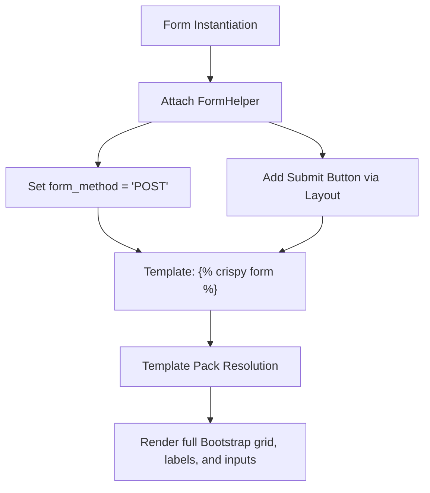

**Чому crispy-forms порушує DRY-принцип без нього:**
```
БЕЗ crispy: 10 форм × 5 полів × 3 атрибути = 150 рядків attrs={'class': ...}
З crispy:   CRISPY_TEMPLATE_PACK = 'bootstrap5' → автоматично для всіх форм
```

---

## 8. Validation System — Конвеєр валідації (детально)

### 🧠 Ментальна модель: 5 рівнів перевірки

```
for field in form.fields:
    │
    ├─ 1. to_python()
    │      "2026-05-24" → datetime.date(2026, 5, 24)
    │      "abc"        → raises ValidationError("Введіть коректну дату")
    │
    ├─ 2. validate()
    │      datetime.date(2026, 5, 24) → перевірка пустоти, BaseValidator
    │
    ├─ 3. run_validators()
    │      MinValueValidator(1)(value)
    │      MaxValueValidator(4)(value)
    │      EmailValidator()(value)    ← для EmailField
    │
    ├─ 4. clean_<fieldname>()         ← твій метод, якщо визначений
    │      def clean_title(self):
    │          value = self.cleaned_data['title']
    │          if 'spam' in value.lower():
    │              raise forms.ValidationError("Спам заборонено!")
    │          return value.strip()   # ← завжди повертай значення!
    │
    └─ ПОЛЕ УСПІШНЕ → cleaned_data['fieldname'] = typed_value

після всіх полів:
    └─ 5. clean()                     ← крос-валідація між полями
           def clean(self):
               title = self.cleaned_data.get('title')
               priority = self.cleaned_data.get('priority')
               # 'is_pinned' може бути відсутнє якщо поле не пройшло!
               # → завжди .get(), ніколи ['key']!
               ...
               return self.cleaned_data
```

### 🌐 Діаграма: Validation Execution Order

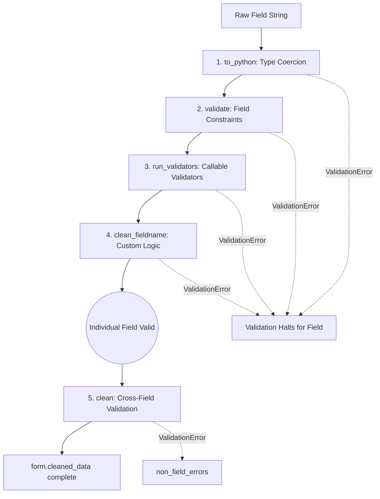

### 🌐 Практичний приклад: clean_<fieldname>

```python
class NoteForm(forms.ModelForm):
    class Meta:
        model = Note
        fields = ['title', 'content', 'priority', 'notebook', 'tags', 'is_pinned']

    def clean_title(self):
        """
        Виконується після to_python() і validate().
        self.cleaned_data['title'] вже str (не сирий рядок з POST).
        """
        title = self.cleaned_data['title']

        # Бізнес-правило: не дозволяємо порожні заголовки після strip()
        title = title.strip()
        if not title:
            raise forms.ValidationError("Заголовок не може бути порожнім або пробілами.")

        # Бізнес-правило: мінімальна довжина
        if len(title) < 3:
            raise forms.ValidationError(
                "Заголовок надто короткий (мінімум %(min)s символів).",
                code='min_length',
                params={'min': 3},
            )

        return title  # ← ЗАВЖДИ повертай значення!

    def clean(self):
        """
        Крос-валідація: виконується після clean_<field> для всіх полів.
        Поля що не пройшли валідацію → відсутні в cleaned_data!
        Тому завжди .get(), ніколи []
        """
        cleaned = super().clean()  # ← запускає батьківський clean()

        priority = cleaned.get('priority')
        is_pinned = cleaned.get('is_pinned')

        # Тільки нотатки з високим пріоритетом можна закріпити
        if is_pinned and priority and priority < Note.PRIORITY_HIGH:
            raise forms.ValidationError(
                "Закріплювати можна лише нотатки з пріоритетом 'Високий' або 'Терміново'.",
                code='pin_priority_mismatch',
            )

        return cleaned
```

### ❌ Типова помилка у clean()

```python
def clean(self):
    # ❌ НЕБЕЗПЕЧНО: KeyError якщо поле не пройшло валідацію!
    priority = self.cleaned_data['priority']    # → KeyError якщо priority помилково!
    is_pinned = self.cleaned_data['is_pinned']  # → KeyError!

    # ✅ ПРАВИЛЬНО: завжди .get()
    priority = self.cleaned_data.get('priority')   # → None якщо відсутнє
    is_pinned = self.cleaned_data.get('is_pinned') # → None якщо відсутнє
    if priority is None or is_pinned is None:
        return self.cleaned_data  # одне з полів вже має помилку, пропускаємо
```

---

## 9. Trust Boundaries (розширено) — Unsafe → Safe Pipeline

### 🧠 Ментальна модель: Карта небезпечних зон

```
┌──────────────────────────────────────────────────────────────────┐
│ НЕБЕЗПЕЧНА ЗОНА — ніколи не довіряй цим даним                   │
│                                                                  │
│   request.POST                  request.GET                      │
│   request.FILES                 request.META                     │
│   request.COOKIES               URL kwargs (pk=... може бути!)  │
│   (усе з мережі — це рядки)                                      │
└──────────────────────────────────────────────────────────────────┘
                          │
                    [Django Form]
                    is_valid() = True
                          │
┌──────────────────────────────────────────────────────────────────┐
│ БЕЗПЕЧНА ЗОНА — очищені, типізовані Python-об'єкти              │
│                                                                  │
│   form.cleaned_data['title']    → str (stripped, validated)     │
│   form.cleaned_data['priority'] → int (1–4, guaranteed)         │
│   form.cleaned_data['tags']     → QuerySet[Tag] (valid objects) │
│   form.cleaned_data['notebook'] → Notebook | None               │
└──────────────────────────────────────────────────────────────────┘
```

### 🌐 Error Propagation Lifecycle

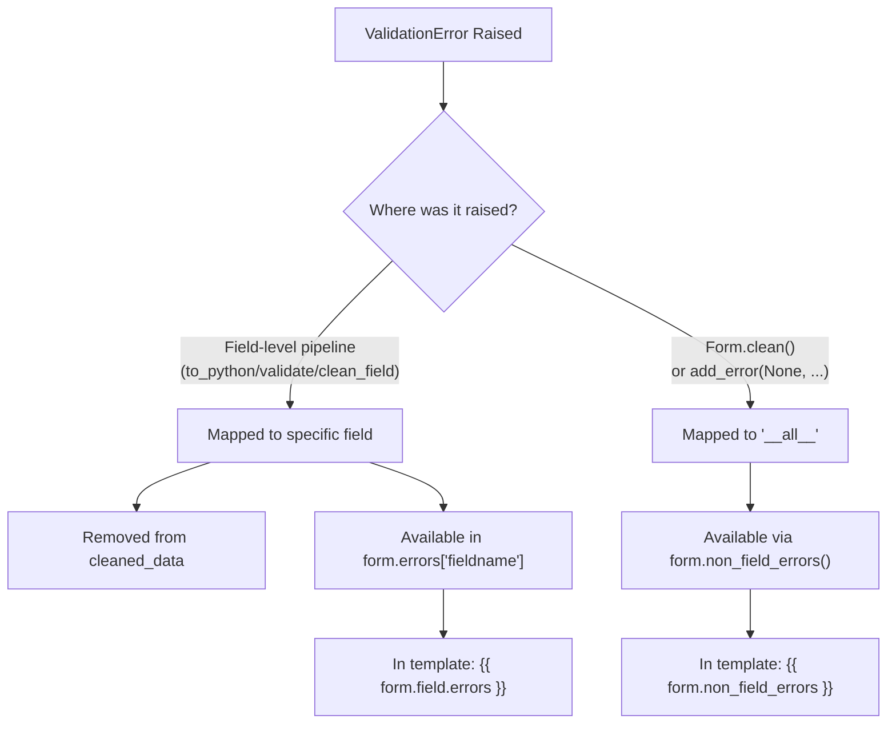

### 📚 add_error() — програматичне додавання помилок

```python
def clean(self):
    cleaned = super().clean()
    title = cleaned.get('title', '')

    # Перевіряємо БД: чи є вже нотатка з таким заголовком у цього юзера?
    # ВАЖЛИВО: self.instance.pk — для edit форм пропускаємо поточний об'єкт
    if Note.objects.filter(
        user=self.user,
        title__iexact=title
    ).exclude(pk=getattr(self.instance, 'pk', None)).exists():
        # Додаємо помилку до конкретного поля (не non_field_errors)
        self.add_error('title', 'У вас вже є нотатка з таким заголовком.')

    return cleaned
```

---

## 10. Form Rendering Pipeline — Шаблони

### 🧠 Ментальна модель: Два напрями рендерингу

```
GET запит (порожня форма або instance):
    NoteForm(instance=note) → initial values → HTML з поточними даними

POST запит з помилками:
    NoteForm(request.POST) → form.errors → HTML з помилками + введеними даними
    (Django автоматично відновлює введені значення!)
```

### 🌐 Рендеринг у шаблоні (3 рівні контролю)

**Рівень 1 — мінімальний (авто-рендер):**
```html
<!-- Автоматично рендерить всі поля -->
{{ form.as_p }}         {# кожне поле в <p> #}
{{ form.as_table }}     {# таблиця <tr><th><td> #}
{{ form.as_div }}       {# кожне поле в <div> #}
```

**Рівень 2 — django-bootstrap5 (рекомендований для курсу):**
```html


<form method="post" novalidate>
    
           {# автоматично Bootstrap 5 стилі #}
    
</form>
```

**Рівень 3 — повний контроль (field by field):**
```html
<form method="post" novalidate>
    

    {# Крос-польові помилки (non_field_errors) #}
    
        <div class="alert alert-danger">
            {{ form.non_field_errors }}
        </div>
    

    {# Поле title вручну #}
    <div class="mb-3">
        <label for="{{ form.title.id_for_label }}" class="form-label">
            {{ form.title.label }}
            <span class="text-danger">*</span>
        </label>
        {{ form.title }}   {# рендерить <input> через Widget #}
        
            <div class="invalid-feedback d-block">
                {{ form.title.errors }}
            </div>
        
        
            <div class="form-text text-muted">{{ form.title.help_text }}</div>
        
    </div>

    {# Поле tags — M:N чекбокси #}
    <div class="mb-3">
        <label class="form-label">{{ form.tags.label }}</label>
        
            <div class="form-check">
                {{ checkbox.tag }}
                <label class="form-check-label" for="{{ checkbox.id_for_label }}">
                    {{ checkbox.choice_label }}
                </label>
            </div>
        
    </div>

    <button type="submit" class="btn btn-primary">Зберегти</button>
</form>
```

---

## 11. CSRF & Security — Захист від атак

### 🧠 Ментальна модель: CSRF атака

```
Сценарій атаки без CSRF захисту:

  1. Аліса залогінена на bank.com (є cookie сесії)
  2. Аліса відвідує evil.com
  3. evil.com містить:
     
  4. Браузер Аліси автоматично надсилає запит до bank.com
     (з cookies! — браузер завжди додає cookies домену)
  5. bank.com думає що це Аліса і переводить гроші!

Django захист:
  1. При кожному GET запиті Django генерує унікальний CSRF token
  2. Token зберігається в сесії + відправляється як hidden поле
  3. При POST Django перевіряє: token у POST == token у сесії?
  4. evil.com не знає token (Same-Origin Policy) → 403 Forbidden!
```

### 🌐 Як Django реалізує CSRF

```html
<!-- У формі ОБОВ'ЯЗКОВО: -->
<form method="post">
    
    <!--
    Django рендерить:
    <input type="hidden" name="csrfmiddlewaretoken"
           value="8XkqABC123...унікальний токен...XYZ">
    -->
    ...
</form>
```

```python
# settings.py — CsrfViewMiddleware перевіряє кожен POST:
MIDDLEWARE = [
    'django.middleware.security.SecurityMiddleware',
    'django.contrib.sessions.middleware.SessionMiddleware',
    'django.middleware.csrf.CsrfViewMiddleware',  # ← перевіряє token
    ...
]

# Якщо token відсутній або неправильний → 403 Forbidden автоматично
# Без жодного коду в View!
```

### ❌ Типова помилка

```html
<!-- ❌ Забув csrf_token → 403 Forbidden при POST -->
<form method="post">
    {{ form.as_p }}
    <button type="submit">Зберегти</button>
</form>

<!-- ✅ Завжди додавай csrf_token в кожну POST форму -->
<form method="post">
    
    {{ form.as_p }}
    <button type="submit">Зберегти</button>
</form>
```

---

## 12. Common Misconceptions — Типові хибні уявлення

### ❌ Міф 1: "request.POST — безпечний"

```python
# ❌ МІНЯЙ: request.POST НІКОЛИ не є безпечним!
Note.objects.create(
    title=request.POST["title"],     # що якщо title = "DROP TABLE notes;"?
    priority=request.POST["priority"] # що якщо priority = "hacked"?
)

# ✅ ПРАВИЛО: завжди через форму → cleaned_data
form = NoteForm(request.POST)
if form.is_valid():
    # Тепер cleaned_data['title'] = str (max 200 chars, validated)
    # cleaned_data['priority'] = int (1-4, guaranteed by choices)
    services.create_note(user=request.user, **form.cleaned_data)
```

### ❌ Міф 2: "Клієнтська валідація достатня"

```
Клієнтська (браузер):  required, maxlength, type=email  → легко обійти
Серверна (Django):     ValidationError, clean(), is_valid() → обов'язкова!

Правило: клієнтська валідація = UX покращення.
         Серверна валідація = безпека та цілісність даних.
```

### ❌ Міф 3: "Форми — тільки для HTML"

```python
# Форми Django можна використовувати без HTTP взагалі!
# Наприклад: валідація даних з CSV файлу

class ImportNoteForm(forms.Form):
    title = forms.CharField(max_length=200)
    priority = forms.IntegerField(min_value=1, max_value=4)

# Валідація рядка з CSV:
for row in csv_reader:
    form = ImportNoteForm(data={'title': row[0], 'priority': row[1]})
    if form.is_valid():
        Note.objects.create(user=admin_user, **form.cleaned_data)
    else:
        log_error(f"Рядок {row}: {form.errors}")
```

### ❌ Міф 4: "cleaned_data існує завжди"

```python
# ❌ cleaned_data не існує до виклику is_valid()!
form = NoteForm(request.POST)
title = form.cleaned_data['title']  # AttributeError: 'NoteForm' has no attribute 'cleaned_data'

# ✅ Завжди перевіряй is_valid() перед cleaned_data
form = NoteForm(request.POST)
if form.is_valid():
    title = form.cleaned_data['title']  # OK!
```

---

## 13. Edge Cases — Граничні випадки

### 🌐 Пустий POST (відсутнє поле)

```python
# POST: {'content': 'Текст'}  # title відсутній взагалі!
form = NoteForm({'content': 'Текст'})
form.is_valid()  # → False
form.errors
# {'title': ['Це поле обов'язкове.']}
# Відсутнє поле = те ж саме що порожнє для required=True полів
```

### 🌐 Double Submit (подвійне відправлення)

```python
# Проблема: користувач натискає Submit двічі підряд
# → два POST запити → два нотатки з однаковим заголовком

# Рішення 1: PRG патерн (redirect після POST)
return redirect('hello_app:note_detail', pk=note.pk)

# Рішення 2: Idempotency key (унікальний UUID від клієнта)
class Note(models.Model):
    idempotency_key = models.UUIDField(unique=True, default=uuid.uuid4)

# Рішення 3: JavaScript disable на кнопці після першого кліку
# <button onclick="this.disabled=true; this.form.submit()">Зберегти</button>
```

### 🌐 File Upload форми

```python
class NoteWithAttachmentForm(forms.ModelForm):
    attachment = forms.FileField(required=False)

    class Meta:
        model = Note
        fields = ['title', 'content']

# View: обов'язково передавати request.FILES разом з request.POST!
def note_create(request):
    if request.method == 'POST':
        form = NoteWithAttachmentForm(request.POST, request.FILES)  # ← FILES!
        # ...

# HTML: обов'язково enctype="multipart/form-data"!
# <form method="post" enctype="multipart/form-data">
```

---

## 14. Debugging Intuition — Як дебажити форми

### 🧠 Ментальна модель: 3 точки огляду

```python
def note_create(request):
    if request.method == 'POST':
        # Точка 1: Що прийшло від браузера?
        print("=== request.POST ===")
        print(request.POST)
        # QueryDict: <QueryDict: {'title': ['Моя нотатка'], 'priority': ['2'],
        #             'csrfmiddlewaretoken': ['abc...']}>

        form = NoteForm(request.POST, user=request.user)

        # Точка 2: Чому форма не valid?
        if not form.is_valid():
            print("=== form.errors ===")
            print(form.errors)
            # <ul class="errorlist"><li>title<ul class="errorlist">
            #   <li>Це поле обов'язкове.</li></ul></li></ul>
            print(form.errors.as_json())
            # {"title": [{"message": "Це поле обов'язкове.", "code": "required"}]}

        # Точка 3: Що в cleaned_data?
        if form.is_valid():
            print("=== form.cleaned_data ===")
            print(form.cleaned_data)
            # {'title': 'Моя нотатка', 'priority': 2, 'tags': <QuerySet []>}
```

### 🌐 Швидкий дебаг у шаблоні

```html
<!-- Тимчасово: показати всі помилки форми у шаблоні -->

    <pre style="background:#fee;padding:1rem;border-radius:4px">
    {{ form.errors }}
    </pre>

```

---

## 15. Visualization — Повні діаграми

### Form Lifecycle (повний цикл)

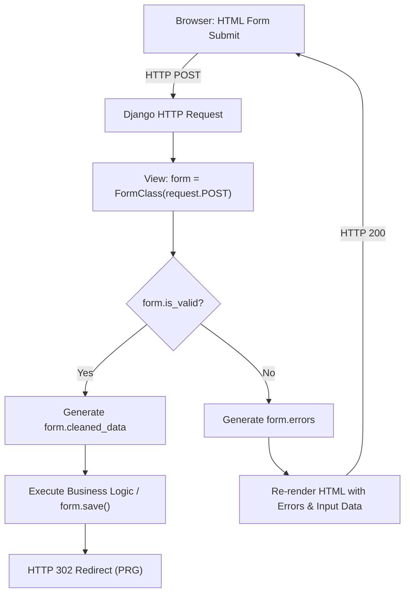

### Validation Pipeline

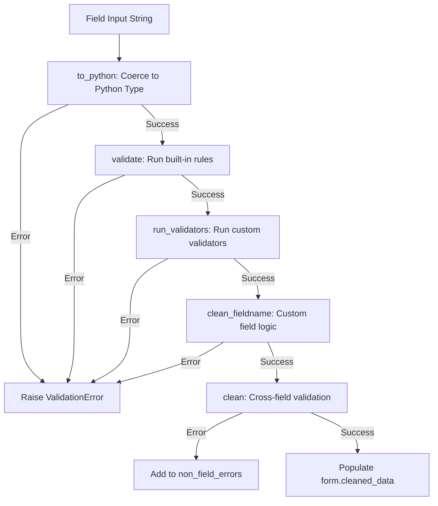

### HTML ↔ Django ↔ ORM (двонаправлений міст)

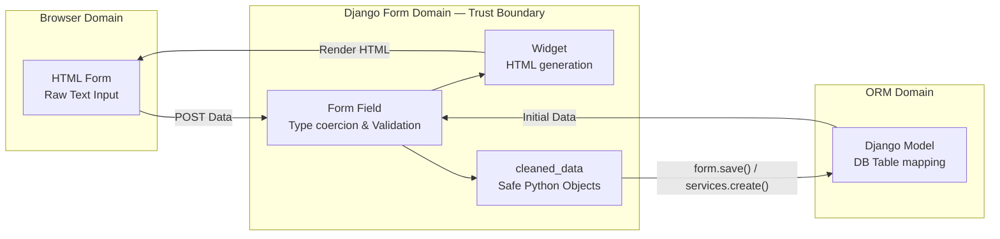

### Trust Zones


---

## 16. Real-World Engineering Relevance

### 📚 Де форми використовуються у production

| Сфера | Приклад | Чому форми критичні |
|-------|---------|---------------------|
| CMS | WordPress-like редактор статей | Складний контент + media files + M:N теги |
| Auth | Login/Registration | Хешування паролів, unique email перевірка |
| E-commerce | Checkout | Крос-валідація: адреса + платіж + купон |
| API | DRF Serializer (= Form для JSON) | Валідація вхідних JSON даних |
| Admin panel | Django Admin | ModelForm для кожної моделі |
| Import | CSV/Excel import | Batch валідація без HTTP |

### 🌐 ModelForm + transaction.atomic() + M:N

Найскладніший реальний сценарій — форма з Many-to-Many у транзакції:

```python
# services.py (наш підхід у notes_project)
def create_note(*, user, title, content='', notebook=None, priority=1, tag_ids=None):
    """
    Атомарна операція: note + M:N теги в одній транзакції.
    Якщо note.tags.set() падає → rollback note.objects.create() теж!
    """
    with transaction.atomic():
        note = Note.objects.create(
            user=user, title=title, content=content,
            notebook=notebook, priority=priority
        )
        if tag_ids:
            # Перевіряємо що теги належать саме цьому юзеру!
            valid_tags = Tag.objects.filter(id__in=tag_ids, user=user)
            note.tags.set(valid_tags)  # INSERT у junction table
    return note

# views.py — view тонкий, тільки HTTP
def note_create(request):
    if request.method == 'POST':
        form = NoteForm(request.POST, user=request.user)
        if form.is_valid():
            tags = form.cleaned_data.get('tags', [])
            note = services.create_note(
                user=request.user,
                title=form.cleaned_data['title'],
                content=form.cleaned_data.get('content', ''),
                priority=form.cleaned_data.get('priority', 1),
                notebook=form.cleaned_data.get('notebook'),
                tag_ids=[t.id for t in tags],
            )
            messages.success(request, f'Нотатку "{note.title}" створено!')
            return redirect('hello_app:note_detail', pk=note.pk)
    else:
        form = NoteForm(user=request.user)
    return render(request, 'hello_app/note_form.html', {'form': form})
```

---

## Самоперевірка

**Передбач результат перед запуском:**

```python
# 1. Що поверне form.is_valid()?
form = NoteForm({'title': '', 'priority': '999'})
# → ___?

# 2. Де буде помилка?
form.errors
# → ___?

# 3. Що виведе цей код?
form2 = NoteForm({'title': 'Нотатка', 'priority': '2'}, user=some_user)
if form2.is_valid():
    print(type(form2.cleaned_data['priority']))
# → ___?

# 4. Що станеться?
form3 = NoteForm({'title': 'Test'})
print(form3.cleaned_data)  # до is_valid()!
# → ___?
```

<details>
<summary>Відповіді</summary>

1. `False` — title порожній (required), priority=999 не в choices
2. `{'title': ['Це поле обов\'язкове.'], 'priority': ['Значення 999 не є допустимим вибором.']}`
3. `<class 'int'>` — cleaned_data['priority'] це Python int, не str!
4. `AttributeError` — cleaned_data не існує до виклику is_valid()

</details>

---

> **Ключовий висновок:**
> Форма Django — це не просто HTML-розмітка. Це **архітектурний кордон**
> між небезпечним HTTP-простором і безпечним ORM-простором.
> Кожен байт що проходить крізь `is_valid()` → `cleaned_data`
> є типізованим, валідованим і безпечним для запису в базу даних.
