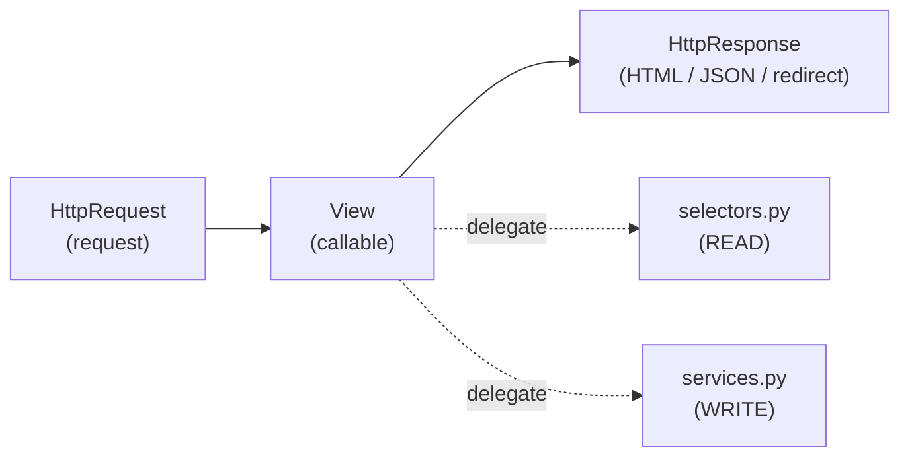
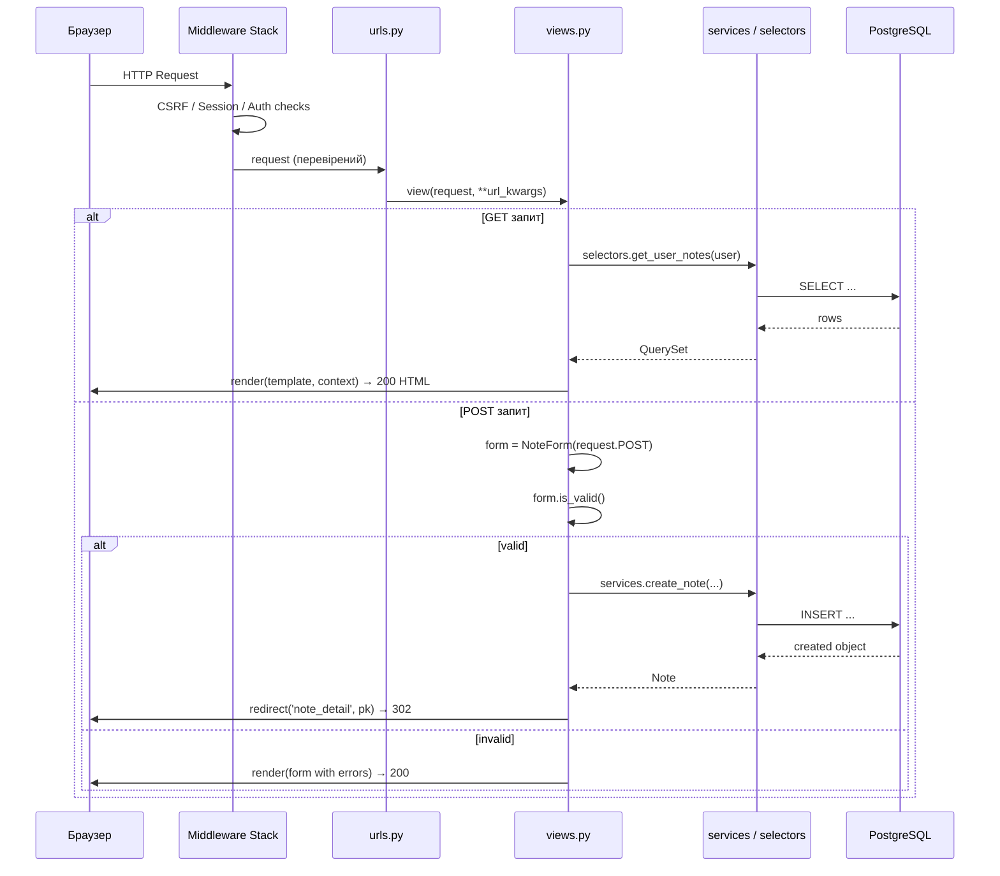
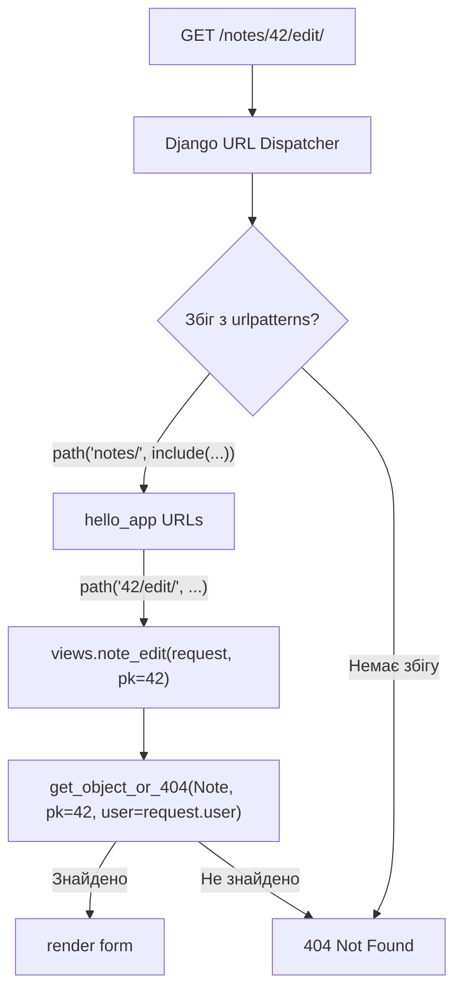
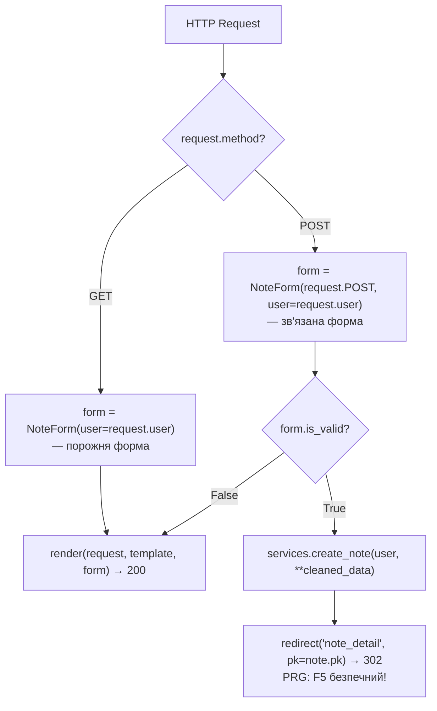
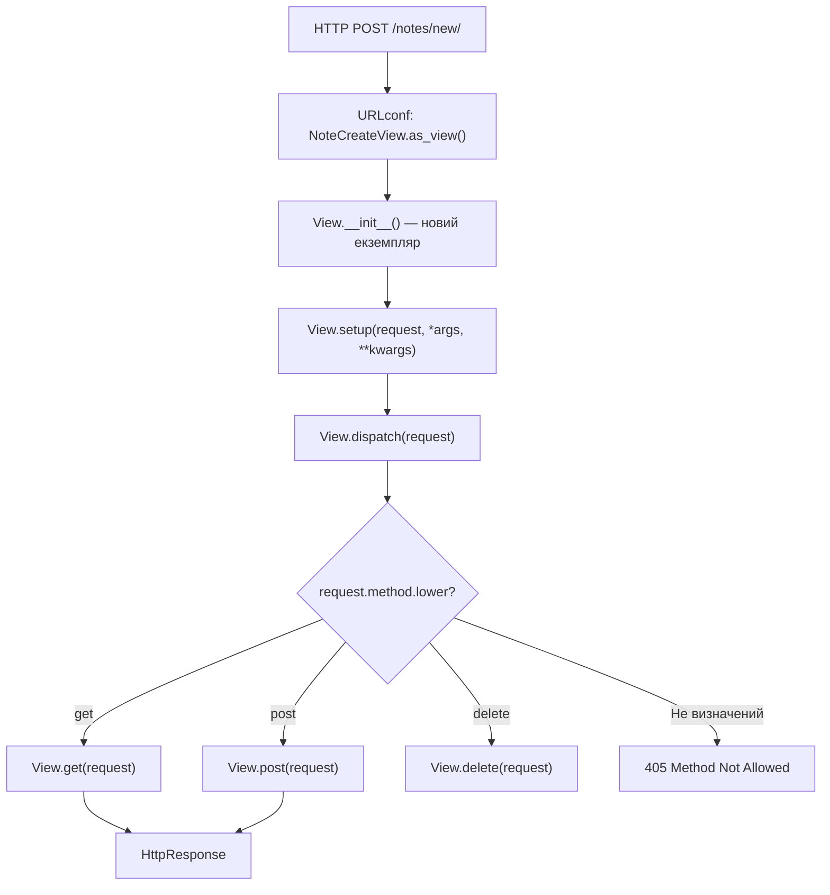
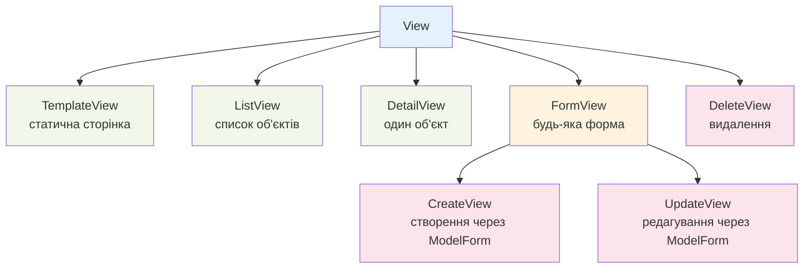
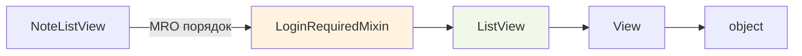
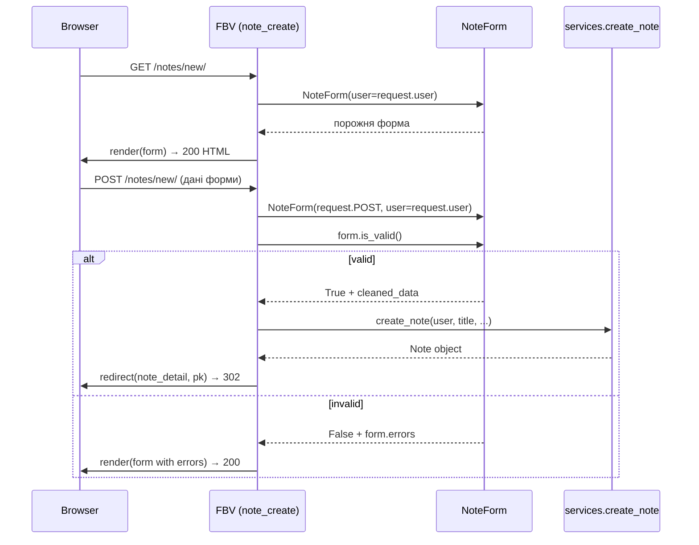
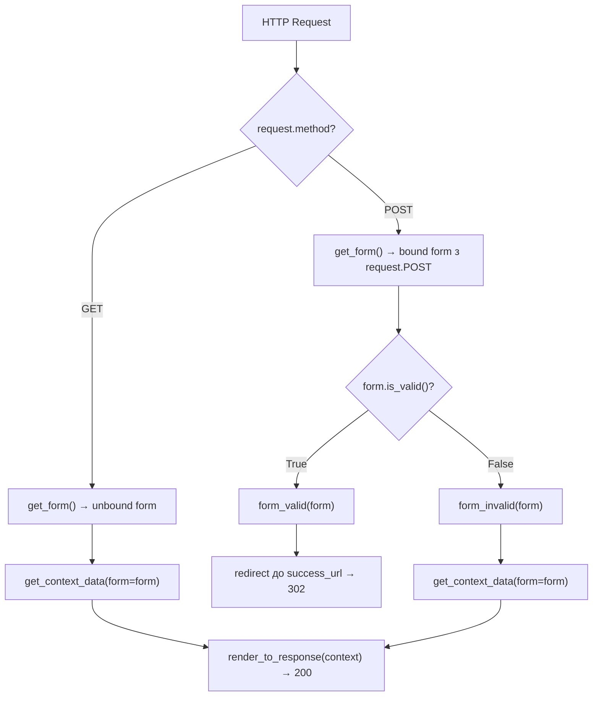
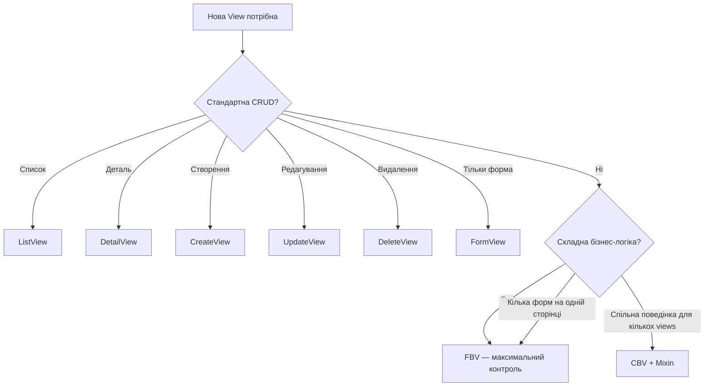

# Django Views — FBV та CBV

> **Де ти зараз у системі знань:**
> `RELATIONAL_DB_FOUNDATIONS` → `DJANGO_ORM_DEEP` → `DJANGO_FORMS` → **`DJANGO_VIEWS`** ← ти тут
>
> View — це точка де HTTP-запит зустрічається з твоєю бізнес-логікою.
> Django отримує request і повертає response. Все інше — деталі реалізації.

---

## Навігація

| Розділ | Що всередині |
|--------|--------------|
| [1. Контракт View](#1-контракт-view) | HttpRequest → callable → HttpResponse |
| [2. Lifecycle запиту](#2-lifecycle-запиту) | URL dispatch → View → Response |
| [3. FBV — функціональні представлення](#3-fbv--функціональні-представлення) | def view, GET/POST, форми, декоратори |
| [4. CBV — класові представлення](#4-cbv--класові-представлення) | dispatch(), as_view(), class attributes |
| [5. Generic Views](#5-generic-views) | ListView, DetailView, CreateView, UpdateView, DeleteView |
| [6. Mixins](#6-mixins) | LoginRequiredMixin, UserPassesTestMixin, кастомні |
| [7. Форми у Views](#7-форми-у-views) | FBV + Form, FormView, CreateView |
| [8. Декорування CBV](#8-декорування-cbv) | method_decorator, LoginRequiredMixin vs @decorator |
| [9. Вибір FBV vs CBV](#9-вибір-fbv-vs-cbv) | Коли що використовувати |
| [10. Антипатерни](#10-антипатерни) | Fat View, ORM у View, логіка в шаблоні |

---

## 1. Контракт View

Django View — це **Python callable** (функція або метод класу) що дотримується одного контракту:

```
HttpRequest  →  [ callable ]  →  HttpResponse
```

Це весь контракт. Django не вимагає нічого більше.

```python
from django.http import HttpRequest, HttpResponse

# Мінімальна можлива View — функція:
def hello(request: HttpRequest) -> HttpResponse:
    return HttpResponse("Hello!")

# Клас-еквівалент:
from django.views import View

class HelloView(View):
    def get(self, request: HttpRequest) -> HttpResponse:
        return HttpResponse("Hello!")
```

> **Ключова думка:** View не знає про SQL, не знає про бізнес-логіку, не тримає стан.
> View лише: (1) отримує запит, (2) делегує роботу в selector/service, (3) повертає відповідь.



---

## 2. Lifecycle запиту

### Повний шлях від браузера до відповіді



### URL Dispatch — як Django знаходить View

```python
# notes_project/urls.py  — головний роутер
from django.urls import path, include

urlpatterns = [
    path('admin/', admin.site.urls),
    path('notes/', include('hello_app.urls', namespace='hello_app')),
]

# hello_app/urls.py  — app-level роутер
from django.urls import path
from . import views

app_name = 'hello_app'

urlpatterns = [
    path('',                 views.note_list,   name='note_list'),
    path('<int:pk>/',        views.note_detail, name='note_detail'),
    path('new/',             views.note_create, name='note_create'),
    path('<int:pk>/edit/',   views.note_edit,   name='note_edit'),
    path('<int:pk>/delete/', views.note_delete, name='note_delete'),
]
```



---

## 3. FBV — Функціональні представлення

FBV — це проста Python функція. Приймає `request` і повертає `HttpResponse`.

### 3.1 Базова анатомія FBV

```python
# hello_app/views.py
from django.shortcuts import render, redirect, get_object_or_404
from django.contrib.auth.decorators import login_required
from django.contrib import messages

from .models import Note
from .forms import NoteForm
from . import selectors, services


@login_required                             # ← декоратор: перевіряє аутентифікацію
def note_list(request):
    """
    GET /notes/  → список нотаток з фільтрами.

    View робить рівно три речі:
    1. Читає параметри з request
    2. Делегує в selector
    3. Рендерить шаблон
    """
    # 1. Параметри з URL query string: /notes/?q=python&tag=5
    search = request.GET.get('q', '').strip()
    tag_id = request.GET.get('tag')

    # 2. Читання через Selector — не прямий ORM у View!
    notes     = selectors.get_user_notes(request.user, search=search or None)
    notebooks = selectors.get_user_notebooks(request.user)
    tags      = selectors.get_user_tags(request.user)

    # 3. Render: QuerySet ще лінивий — SQL виконається тут під час рендеру
    return render(request, 'hello_app/note_list.html', {
        'notes':     notes,
        'notebooks': notebooks,
        'tags':      tags,
        'search':    search,
    })
```

### 3.2 GET/POST розгалуження та PRG патерн



```python
@login_required
def note_create(request):
    """
    GET  /notes/new/ → показати порожню форму
    POST /notes/new/ → обробити і зберегти

    PRG (Post / Redirect / Get) — стандартний патерн для форм.
    """
    if request.method == 'POST':
        form = NoteForm(request.POST, user=request.user)

        if form.is_valid():
            note = services.create_note(
                user=request.user,
                title=form.cleaned_data['title'],
                content=form.cleaned_data.get('content', ''),
                priority=form.cleaned_data.get('priority', 1),
                tag_ids=[t.id for t in form.cleaned_data.get('tags', [])],
            )
            messages.success(request, f'Нотатку "{note.title}" створено!')
            return redirect('hello_app:note_detail', pk=note.pk)  # ← PRG!
        # is_valid=False → падаємо до render нижче (форма з помилками)

    else:
        form = NoteForm(user=request.user)    # GET: порожня форма

    return render(request, 'hello_app/note_form.html', {
        'form':   form,
        'action': 'Створити',
        'title':  'Нова нотатка',
    })
```

### 3.3 get_object_or_404 та перевірка прав

```python
@login_required
def note_edit(request, pk):
    # get_object_or_404:
    #   якщо не знайдено → 404 Not Found (не 500 Internal Server Error)
    #   user=request.user → перевіряємо що це НАША нотатка (не чужа!)
    note = get_object_or_404(Note, pk=pk, user=request.user)

    if request.method == 'POST':
        form = NoteForm(request.POST, instance=note, user=request.user)
        if form.is_valid():
            services.update_note(
                note,
                title=form.cleaned_data['title'],
                content=form.cleaned_data.get('content', ''),
            )
            return redirect('hello_app:note_detail', pk=note.pk)
    else:
        # instance=note → форма попередньо заповнена поточними даними
        form = NoteForm(instance=note, user=request.user)

    return render(request, 'hello_app/note_form.html', {
        'form':   form,
        'note':   note,
        'action': 'Зберегти',
        'title':  f'Редагувати: {note.title}',
    })


@login_required
def note_delete(request, pk):
    """
    GET  /notes/42/delete/ → сторінка підтвердження
    POST /notes/42/delete/ → видалення → redirect

    Чому тільки POST для видалення?
    Браузери, боти, пошукові системи автоматично переходять за GET-посиланнями.
    GET /notes/42/delete/ при кліку на посилання → нотатка зникає без підтвердження!
    """
    note = get_object_or_404(Note, pk=pk, user=request.user)

    if request.method == 'POST':
        title = note.title
        services.delete_note(note)
        messages.warning(request, f'Нотатку "{title}" видалено.')
        return redirect('hello_app:note_list')

    return render(request, 'hello_app/note_confirm_delete.html', {'note': note})
```

### 3.4 Декоратори для FBV

```python
from django.contrib.auth.decorators import login_required, permission_required
from django.views.decorators.http import require_POST, require_http_methods

# @login_required: якщо не залогінений → redirect на login page
@login_required
def note_list(request): ...

# @require_POST: дозволяє тільки POST → 405 Method Not Allowed для інших
@login_required
@require_POST
def note_delete_api(request, pk):
    note = get_object_or_404(Note, pk=pk, user=request.user)
    services.delete_note(note)
    return redirect('hello_app:note_list')

# Кілька методів:
@require_http_methods(["GET", "POST"])
def note_form_view(request): ...

# @permission_required: перевіряє конкретний дозвіл Django
@permission_required('hello_app.can_moderate')
def moderation_view(request): ...
```

---

## 4. CBV — Класові представлення

### 4.1 Навіщо CBV існують

FBV мають проблему: **шаблонна логіка повторюється**. Кожна CRUD-view містить однакову структуру:

```python
# FBV для List — завжди однаково:
def note_list(request):
    qs = Note.objects.filter(user=request.user)
    return render(request, 'note_list.html', {'notes': qs})

# FBV для Detail — майже однаково:
def note_detail(request, pk):
    note = get_object_or_404(Note, pk=pk)
    return render(request, 'note_detail.html', {'note': note})

# FBV для Delete — знову та сама структура...
def note_delete(request, pk):
    note = get_object_or_404(Note, pk=pk)
    if request.method == 'POST':
        note.delete()
        return redirect('note_list')
    return render(request, 'confirm_delete.html', {'note': note})
```

CBV вирішують це через **ООП**: успадкування, перевизначення методів, mixins.

### 4.2 dispatch() — серце CBV

Коли запит приходить до CBV, Django викликає `dispatch()`. Це **маршрутизатор HTTP-методів**:

```
HTTP Request → as_view() → dispatch() → get() / post() / put() / delete()
```

```python
# Спрощена внутрішня реалізація View.dispatch():
class View:
    http_method_names = ['get', 'post', 'put', 'patch', 'delete', 'head', 'options']

    @classmethod
    def as_view(cls, **initkwargs):
        """Повертає функцію-обгортку для urls.py."""
        def view(request, *args, **kwargs):
            self = cls(**initkwargs)         # ← новий екземпляр для кожного запиту!
            self.setup(request, *args, **kwargs)
            return self.dispatch(request, *args, **kwargs)
        return view

    def dispatch(self, request, *args, **kwargs):
        """Маршрутизує на відповідний метод класу за HTTP-методом."""
        method_name = request.method.lower()
        if method_name in self.http_method_names:
            handler = getattr(self, method_name, self.http_method_not_allowed)
        else:
            handler = self.http_method_not_allowed
        return handler(request, *args, **kwargs)
```



### 4.3 FBV → CBV: порівняння

```python
# ─── FBV ─────────────────────────────────────────────────────────────
def note_list(request):
    if not request.user.is_authenticated:
        return redirect('/login/')
    if request.method == 'GET':
        notes = selectors.get_user_notes(request.user)
        return render(request, 'note_list.html', {'notes': notes})
    return HttpResponseNotAllowed(['GET'])


# ─── CBV (базовий View) ───────────────────────────────────────────────
from django.views import View
from django.contrib.auth.mixins import LoginRequiredMixin

class NoteListView(LoginRequiredMixin, View):
    template_name = 'note_list.html'     # ← class attribute

    def get(self, request):              # ← окремий метод для GET
        notes = selectors.get_user_notes(request.user)
        return render(request, self.template_name, {'notes': notes})
    # POST → 405 автоматично (немає методу post())
    # auth → LoginRequiredMixin (немає if is_authenticated)
```

### 4.4 as_view() — підключення до URL

```python
# urls.py
from django.urls import path
from .views import NoteListView, NoteDetailView

urlpatterns = [
    # FBV — передаємо функцію напряму:
    path('notes/', views.note_list, name='note_list'),

    # CBV — обов'язково викликаємо .as_view():
    path('notes/', NoteListView.as_view(), name='note_list'),

    # as_view() приймає class attributes як kwargs:
    path('notes/', NoteListView.as_view(template_name='custom_list.html')),
    #                                    ↑ override атрибута для цього URL
]
```

### 4.5 Перевизначення class attributes

```python
# Успадкування дозволяє змінювати поведінку без редагування батьківського класу:

class BaseUserView(LoginRequiredMixin, View):
    """Базовий клас для всіх views що вимагають user фільтрацію."""
    model = None

    def get_queryset(self):
        return self.model.objects.filter(user=self.request.user)


class NoteListView(BaseUserView):
    model = Note
    template_name = 'note_list.html'

    def get_queryset(self):
        # Розширюємо батьківський — + оптимізація
        return super().get_queryset().select_related('notebook').prefetch_related('tags')

    def get(self, request):
        return render(request, self.template_name, {'notes': self.get_queryset()})


class NotebookListView(BaseUserView):
    model = Notebook
    template_name = 'notebook_list.html'

    def get(self, request):
        return render(request, self.template_name, {'notebooks': self.get_queryset()})
```

---

## 5. Generic Views

Django надає вбудовані CBV для найпоширеніших CRUD-операцій.
Вони містять **80% роботи автоматично** — ти тільки налаштовуєш.

### Ієрархія Generic Views



### 5.1 ListView

```python
from django.views.generic import ListView
from django.contrib.auth.mixins import LoginRequiredMixin

class NoteListView(LoginRequiredMixin, ListView):
    model = Note
    template_name = 'hello_app/note_list.html'
    context_object_name = 'notes'           # ← ім'я у шаблоні (default: object_list)
    paginate_by = 20                         # ← пагінація автоматично!
    ordering = ['-is_pinned', '-updated_at']

    def get_queryset(self):
        """
        Перевизначаємо default queryset (Model.objects.all())
        щоб фільтрувати по user і додати оптимізацію.
        """
        qs = Note.objects.filter(
            user=self.request.user,
            is_archived=False,
        ).select_related('notebook').prefetch_related('tags')

        search = self.request.GET.get('q')
        if search:
            qs = qs.filter(title__icontains=search)

        return qs

    def get_context_data(self, **kwargs):
        """Додаємо додаткові дані до контексту."""
        context = super().get_context_data(**kwargs)   # ← 'notes' вже тут!
        context['notebooks'] = selectors.get_user_notebooks(self.request.user)
        context['tags']      = selectors.get_user_tags(self.request.user)
        context['search']    = self.request.GET.get('q', '')
        return context

# ListView автоматично:
# 1. Викликає get_queryset()
# 2. Передає result у context[context_object_name]
# 3. Обробляє paginate_by → додає page_obj у контекст
# 4. Рендерить template_name
```

### 5.2 DetailView

```python
from django.views.generic import DetailView

class NoteDetailView(LoginRequiredMixin, DetailView):
    model = Note
    template_name = 'hello_app/note_detail.html'
    context_object_name = 'note'

    def get_queryset(self):
        """Фільтруємо по user → автоматично 404 для чужих нотаток."""
        return Note.objects.filter(
            user=self.request.user
        ).select_related('notebook', 'user').prefetch_related('tags', 'reminders')

# DetailView автоматично:
# 1. Бере pk або slug з URL kwargs
# 2. Викликає get_queryset().get(pk=pk) → або об'єкт або 404
# 3. Передає об'єкт у context[context_object_name]
# 4. Рендерить template_name
```

### 5.3 CreateView

```python
from django.views.generic.edit import CreateView
from django.urls import reverse_lazy

class NoteCreateView(LoginRequiredMixin, CreateView):
    model = Note
    form_class = NoteForm                              # ← наша форма
    template_name = 'hello_app/note_form.html'
    success_url = reverse_lazy('hello_app:note_list') # ← після успіху

    def get_form_kwargs(self):
        """Передаємо user у форму (для фільтрації queryset у полях)."""
        kwargs = super().get_form_kwargs()
        kwargs['user'] = self.request.user
        return kwargs

    def form_valid(self, form):
        """Викликається коли form.is_valid() == True."""
        # Використовуємо Service замість form.save():
        note = services.create_note(
            user=self.request.user,
            title=form.cleaned_data['title'],
            content=form.cleaned_data.get('content', ''),
            priority=form.cleaned_data.get('priority', 1),
            tag_ids=[t.id for t in form.cleaned_data.get('tags', [])],
        )
        messages.success(self.request, f'Нотатку "{note.title}" створено!')
        return redirect('hello_app:note_detail', pk=note.pk)

    def form_invalid(self, form):
        """Викликається коли form.is_valid() == False."""
        messages.error(self.request, 'Виправ помилки у формі.')
        return super().form_invalid(form)

    def get_context_data(self, **kwargs):
        context = super().get_context_data(**kwargs)
        context['action'] = 'Створити'
        context['title'] = 'Нова нотатка'
        return context

# CreateView автоматично:
# GET  → get_form() → render з порожньою формою
# POST → get_form(request.POST) → is_valid():
#          True  → form_valid(form)  → success_url redirect
#          False → form_invalid(form) → render з помилками
```

### 5.4 UpdateView

```python
from django.views.generic.edit import UpdateView

class NoteUpdateView(LoginRequiredMixin, UpdateView):
    model = Note
    form_class = NoteForm
    template_name = 'hello_app/note_form.html'

    def get_queryset(self):
        # Тільки свої нотатки — чужі → 404
        return Note.objects.filter(user=self.request.user)

    def get_form_kwargs(self):
        kwargs = super().get_form_kwargs()
        kwargs['user'] = self.request.user
        return kwargs

    def form_valid(self, form):
        services.update_note(
            self.object,
            title=form.cleaned_data['title'],
            content=form.cleaned_data.get('content', ''),
        )
        return redirect('hello_app:note_detail', pk=self.object.pk)

    def get_context_data(self, **kwargs):
        context = super().get_context_data(**kwargs)
        context['action'] = 'Зберегти'
        context['title'] = f'Редагувати: {self.object.title}'
        return context

# UpdateView ≈ CreateView але:
# - get_queryset().get(pk=pk) для знаходження об'єкта
# - GET → форма попередньо заповнена instance=self.object
```

### 5.5 DeleteView

```python
from django.views.generic.edit import DeleteView

class NoteDeleteView(LoginRequiredMixin, DeleteView):
    model = Note
    template_name = 'hello_app/note_confirm_delete.html'
    success_url = reverse_lazy('hello_app:note_list')

    def get_queryset(self):
        return Note.objects.filter(user=self.request.user)

    def form_valid(self, form):
        """Перевизначаємо щоб використати Service і message."""
        title = self.object.title
        services.delete_note(self.object)
        messages.warning(self.request, f'Нотатку "{title}" видалено.')
        return redirect(self.success_url)

# DeleteView автоматично:
# GET  → render сторінки підтвердження
# POST → self.object.delete() → redirect success_url
```

### Що Generic Views роблять автоматично

| Generic View | Автоматично | Зазвичай перевизначають |
|---|---|---|
| `ListView` | `all()`, paginate, render | `get_queryset()` — фільтрація по user |
| `DetailView` | `get(pk=pk)` → 404, render | `get_queryset()` — права доступу |
| `CreateView` | GET форма, POST валідація, `form.save()` | `form_valid()` якщо потрібен Service |
| `UpdateView` | GET заповнена форма, POST оновлення | `get_queryset()` + `form_valid()` |
| `DeleteView` | GET підтвердження, POST видалення | `get_queryset()` + `form_valid()` |

---

## 6. Mixins

Mixin — це клас що надає **одну конкретну поведінку** і не є самостійним view.
Комбінується через **multiple inheritance** (множинне успадкування).

### 6.1 Вбудовані auth mixins

```python
from django.contrib.auth.mixins import (
    LoginRequiredMixin,
    PermissionRequiredMixin,
    UserPassesTestMixin,
)

# LoginRequiredMixin: якщо не залогінений → redirect на login
class NoteListView(LoginRequiredMixin, ListView):
    login_url = '/accounts/login/'       # ← куди redirect (default: settings.LOGIN_URL)
    redirect_field_name = 'next'         # ← ?next=/notes/ щоб повернутись після логіну
    model = Note
    ...


# PermissionRequiredMixin: перевіряє конкретний дозвіл
class AdminNoteView(PermissionRequiredMixin, ListView):
    permission_required = 'hello_app.can_moderate'
    model = Note


# UserPassesTestMixin: довільна логіка перевірки
class OwnerOnlyNoteView(UserPassesTestMixin, DetailView):
    model = Note

    def test_func(self):
        """Повертає True → доступ дозволений, False → 403 Forbidden."""
        note = self.get_object()
        return self.request.user == note.user
```

### 6.2 Правильний порядок MRO

```python
# ✅ ПРАВИЛЬНО: Mixin ПЕРШИЙ, Generic View ОСТАННІЙ
class NoteListView(LoginRequiredMixin, ListView):
    ...

# ❌ НЕПРАВИЛЬНО: Generic View першим ламає MRO
class NoteListView(ListView, LoginRequiredMixin):
    ...
```



> **Чому:** Python MRO (C3 linearization) іде зліва направо.
> `dispatch()` з `LoginRequiredMixin` має спрацювати ПЕРЕД `dispatch()` з `View`.
> Тому Mixin завжди перший.

### 6.3 Кастомний Mixin

```python
class UserQuerySetMixin:
    """
    Автоматично фільтрує queryset по поточному user.
    Підключається до будь-якого Generic View з get_queryset().
    """
    def get_queryset(self):
        return super().get_queryset().filter(user=self.request.user)


# Використання — один рядок замість get_queryset() у кожному view:
class NoteListView(LoginRequiredMixin, UserQuerySetMixin, ListView):
    model = Note        # get_queryset() автоматично фільтрує по user!

class NoteDetailView(LoginRequiredMixin, UserQuerySetMixin, DetailView):
    model = Note

class NoteDeleteView(LoginRequiredMixin, UserQuerySetMixin, DeleteView):
    model = Note
    success_url = reverse_lazy('hello_app:note_list')
```

### 6.4 Обмеження: один Generic View parent

```python
# ❌ НЕ БУДЕ ПРАЦЮВАТИ: два Generic Views в одному класі
class BadView(ListView, CreateView):
    # Конфлікт методів get() і post() між ListView і CreateView
    # MRO не вирішить — поведінка непередбачувана
    ...

# ✅ Рішення 1: окремі класи
class NoteListView(LoginRequiredMixin, ListView): ...
class NoteCreateView(LoginRequiredMixin, CreateView): ...

# ✅ Рішення 2: FBV для складних комбінацій (список + форма на одній сторінці)
@login_required
def note_list_and_create(request):
    notes = selectors.get_user_notes(request.user)
    form = NoteForm(request.POST or None, user=request.user)
    if request.method == 'POST' and form.is_valid():
        services.create_note(user=request.user, **form.cleaned_data)
        return redirect('hello_app:note_list')
    return render(request, 'note_list_create.html', {'notes': notes, 'form': form})
```

---

## 7. Форми у Views

### 7.1 FBV + Form — стандартний патерн



```python
# Стандартна структура FBV з формою — запам'ятай назавжди:
@login_required
def note_create(request):
    if request.method == 'POST':
        form = NoteForm(request.POST, user=request.user)    # ← bound form
        if form.is_valid():
            note = services.create_note(user=request.user, ...)
            return redirect('hello_app:note_detail', pk=note.pk)  # ← PRG
    else:
        form = NoteForm(user=request.user)                  # ← unbound form

    return render(request, 'template.html', {'form': form})
```

### 7.2 FormView — CBV для будь-якої форми

```python
from django.views.generic.edit import FormView
from django.urls import reverse_lazy

class NoteCreateFormView(LoginRequiredMixin, FormView):
    template_name = 'hello_app/note_form.html'
    form_class = NoteForm
    success_url = reverse_lazy('hello_app:note_list')

    def get_form_kwargs(self):
        """Додаємо user у kwargs для форми."""
        kwargs = super().get_form_kwargs()
        kwargs['user'] = self.request.user
        return kwargs

    def form_valid(self, form):
        """Автоматично викликається коли form.is_valid() == True."""
        services.create_note(
            user=self.request.user,
            title=form.cleaned_data['title'],
        )
        return super().form_valid(form)  # ← redirect на success_url
```

### 7.3 Внутрішній механізм FormView



### 7.4 FBV vs CBV для форм — порівняння

| | FBV | FormView | CreateView |
|---|---|---|---|
| GET форма | `form = Form()` → render | автоматично | автоматично |
| POST bind | `form = Form(POST)` | автоматично | автоматично |
| is_valid | `if form.is_valid()` | автоматично | автоматично |
| success redirect | `redirect(...)` | `success_url` | `success_url` |
| Flexibilty | максимальна | середня | мінімальна |
| Читабельність | явна | ОО-стиль | декларативна |

---

## 8. Декорування CBV

FBV декоруються через `@decorator`. CBV — складніше, бо це клас, не функція.

### Спосіб 1: через URLconf (один екземпляр)

```python
# urls.py
from django.contrib.auth.decorators import login_required
from django.views.generic import TemplateView

urlpatterns = [
    # Декоратор застосовується тільки до цього URL:
    path('secret/', login_required(TemplateView.as_view(template_name='secret.html'))),
]
# ⚠️ Не декорує весь клас — тільки цей конкретний URL
```

### Спосіб 2: method_decorator на dispatch (весь клас)

```python
from django.utils.decorators import method_decorator
from django.contrib.auth.decorators import login_required
from django.views.decorators.cache import never_cache
from django.views.generic import TemplateView

# Один декоратор — на клас:
@method_decorator(login_required, name='dispatch')
class ProtectedView(TemplateView):
    template_name = 'secret.html'

# Кілька декораторів — список:
decorators = [never_cache, login_required]

@method_decorator(decorators, name='dispatch')
class ProtectedView(TemplateView):
    template_name = 'secret.html'
# Порядок виконання: never_cache → login_required (зліва направо)

# Або декорувати конкретний метод (не dispatch):
class NoteDetailView(DetailView):
    @method_decorator(login_required)
    def get(self, request, *args, **kwargs):
        return super().get(request, *args, **kwargs)
```

### Спосіб 3: LoginRequiredMixin (рекомендований для auth)

```python
# Найчистіший спосіб для auth:
from django.contrib.auth.mixins import LoginRequiredMixin

class NoteListView(LoginRequiredMixin, ListView):
    model = Note
    # LoginRequiredMixin перевизначає dispatch() автоматично — чистіше ніж декоратор
```

### Порівняння підходів декорування

| Спосіб | Код | Коли використовувати |
|--------|-----|---------------------|
| URLconf decorator | `login_required(View.as_view())` | Швидко для одного URL |
| `@method_decorator` | `@method_decorator(dec, name='dispatch')` | Нестандартні декоратори (cache, vary_on) |
| Mixin | `LoginRequiredMixin` | Auth/permissions — завжди краще |

---

## 9. Вибір: FBV vs CBV



| Ситуація | Рекомендація |
|----------|-------------|
| CRUD зі стандартними шаблонами | Generic CBV |
| Складна POST логіка | FBV або CBV + form_valid() |
| Кілька форм на одній сторінці | FBV |
| Потрібна спільна поведінка | CBV + Mixin |
| API endpoint (JSON) | FBV або DRF APIView |
| Навчання / читабельність | FBV |

---

## 10. Антипатерни

| Антипатерн | Що не так | Виправлення |
|-----------|-----------|------------|
| ORM прямо у View | `Note.objects.filter(...)` у `views.py` | Перенести в `selectors.py` |
| Бізнес-логіка у View | `if note.priority > 3: note.is_pinned = True` | Перенести в `services.py` |
| Логіка у шаблоні | `` | Logic → View / Service |
| Fat View | 200+ рядків у view функції | Розбити на Selector + Service + форми |
| `.get()` без 404 | `Note.objects.get(pk=pk)` → 500 якщо нема | `get_object_or_404()` |
| DELETE через GET | `GET /notes/delete/?pk=5` | Тільки POST для деструктивних операцій |
| `print()` в production | `print(request.POST)` | Django logging + Debug Toolbar |
| `request.POST[key]` в ORM | Прямо в `Note.objects.create(title=request.POST['title'])` | Через форму → `cleaned_data` |

---

## Швидка шпаргалка

```python
# === FBV шаблон ===
@login_required
def my_view(request, pk):
    obj = get_object_or_404(MyModel, pk=pk, user=request.user)

    if request.method == 'POST':
        form = MyForm(request.POST, instance=obj)
        if form.is_valid():
            services.update_my_object(obj, **form.cleaned_data)
            return redirect('my_app:detail', pk=obj.pk)
    else:
        form = MyForm(instance=obj)

    return render(request, 'template.html', {'form': form, 'obj': obj})


# === CBV (ListView) ===
class MyListView(LoginRequiredMixin, ListView):
    model = MyModel
    template_name = 'my_list.html'
    context_object_name = 'objects'
    paginate_by = 20

    def get_queryset(self):
        return MyModel.objects.filter(user=self.request.user)

    def get_context_data(self, **kwargs):
        ctx = super().get_context_data(**kwargs)
        ctx['extra'] = 'data'
        return ctx


# === URL реєстрація ===
urlpatterns = [
    # FBV:
    path('',       views.my_view,            name='my_view'),
    # CBV:
    path('list/',  views.MyListView.as_view(), name='my_list'),
]
```

---

## Зв'язок з рештою документації

| Тема | Файл |
|------|------|
| Forms (Trust Boundary, Validation Pipeline) | [DJANGO_FORMS.md](DJANGO_FORMS.md) |
| Services (бізнес-логіка, atomic, on_commit) | [DJANGO_SERVICES.md](DJANGO_SERVICES.md) |
| Selectors (читання даних, N+1) | [DJANGO_SELECTORS.md](DJANGO_SELECTORS.md) |
| ORM: QuerySet, select_related, prefetch_related | [DJANGO_ORM_DEEP.md](DJANGO_ORM_DEEP.md) |
| Практичний проект (notes_project) | [notes_project/README.md](notes_project/README.md) |