# Django ORM та БД — Mermaid-схеми

> Всі діаграми — візуалізація концепцій з усіх файлів документації.
> Використовуй після читання теорії щоб закріпити розуміння через схеми.
> Порядок: ER → Зв'язки → ORM Flow → Query Lifecycle → Transactions → Architecture

---

> 🔬 **Хочеш побачити ці схеми у дії?**
> [`notes_project/hello_app/orm_laboratory.ipynb`](notes_project/hello_app/orm_laboratory.ipynb) —
> кожна mermaid-діаграма має відповідний code cell де виконується реальний SQL.
>
> | Mermaid-схема в цьому файлі | Розділ ноутбука |
> |-----------------------------|-----------------|
> | ER-діаграма / схема таблиць | `## 0. 🧱 Що таке object в Django ORM?` |
> | ORM → SQL Lifecycle | `## 1. 🧠 ORM Mental Model` |
> | Lazy Evaluation flow | `## 1. 🧠 ORM Mental Model` |
> | N+1 vs select_related | `## 8. ⚡ N+1 Problem & Optimization` |
> | select_related vs prefetch_related | `## 8. ⚡ N+1 Problem & Optimization` |
> | transaction.atomic() SQL lifecycle | `## 13. 🔒 Транзакції` |
> | Services/Selectors архітектура | `README.md` → секція `03 · APPLICATION LAYERS` |

## 1. ER-діаграма — Notes Platform (повний проект)

> **Що показує:** Всі таблиці проекту `notes_project` з усіма зв'язками.
> `||--o|` = 1:1, `||--o{` = 1:N, `}o--o{` = M:N.
> FK завжди на стороні "багатьох" (Many side).

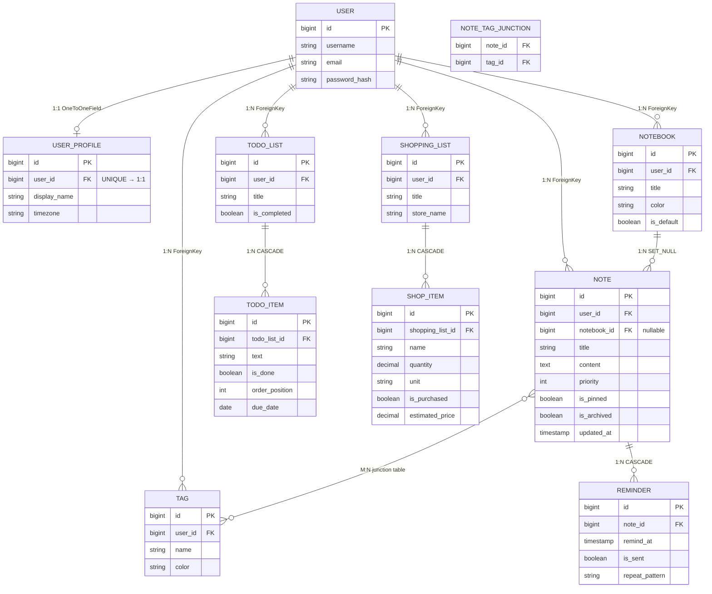
```mermaid
erDiagram
    USER ||--o| USER_PROFILE : "1:1 OneToOneField"
    USER ||--o{ NOTEBOOK : "1:N ForeignKey"
    USER ||--o{ NOTE : "1:N ForeignKey"
    USER ||--o{ TODO_LIST : "1:N ForeignKey"
    USER ||--o{ SHOPPING_LIST : "1:N ForeignKey"
    USER ||--o{ TAG : "1:N ForeignKey"

    NOTEBOOK ||--o{ NOTE : "1:N SET_NULL"
    NOTE }o--o{ TAG : "M:N junction table"
    NOTE ||--o{ REMINDER : "1:N CASCADE"

    TODO_LIST ||--o{ TODO_ITEM : "1:N CASCADE"
    SHOPPING_LIST ||--o{ SHOP_ITEM : "1:N CASCADE"

    USER {
        bigint id PK
        string username
        string email
        string password_hash
    }
    USER_PROFILE {
        bigint id PK
        bigint user_id FK "UNIQUE → 1:1"
        string display_name
        string timezone
    }
    NOTEBOOK {
        bigint id PK
        bigint user_id FK
        string title
        string color
        boolean is_default
    }
    NOTE {
        bigint id PK
        bigint user_id FK
        bigint notebook_id FK "nullable"
        string title
        text content
        int priority
        boolean is_pinned
        boolean is_archived
        timestamp updated_at
    }
    TAG {
        bigint id PK
        bigint user_id FK
        string name
        string color
    }
    NOTE_TAG_JUNCTION {
        bigint note_id FK
        bigint tag_id FK
    }
    REMINDER {
        bigint id PK
        bigint note_id FK
        timestamp remind_at
        boolean is_sent
        string repeat_pattern
    }
    TODO_LIST {
        bigint id PK
        bigint user_id FK
        string title
        boolean is_completed
    }
    TODO_ITEM {
        bigint id PK
        bigint todo_list_id FK
        string text
        boolean is_done
        int order_position
        date due_date
    }
    SHOPPING_LIST {
        bigint id PK
        bigint user_id FK
        string title
        string store_name
    }
    SHOP_ITEM {
        bigint id PK
        bigint shopping_list_id FK
        string name
        decimal quantity
        string unit
        boolean is_purchased
        decimal estimated_price
    }
```

---

## 2. Де живе FK — правило "Many side"

> **Що показує:** Наочно де записується Foreign Key при 1:N та M:N зв'язках.
> FK завжди в таблиці "Many" (не в "One"!).

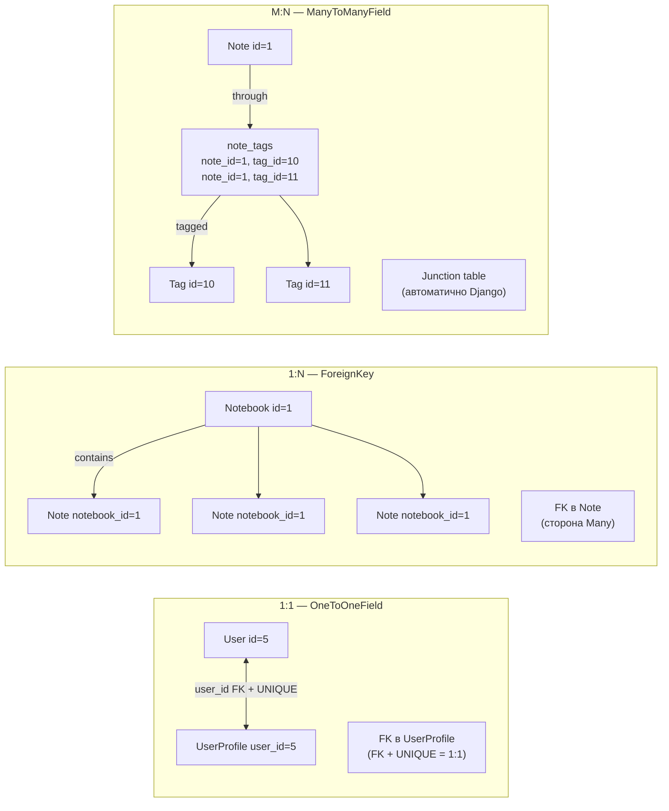
```mermaid
graph LR
    subgraph "1:1 — OneToOneField"
        U1[User id=5] <-->|user_id FK + UNIQUE| UP1[UserProfile user_id=5]
        N1["FK в UserProfile\n(FK + UNIQUE = 1:1)"]
    end

    subgraph "1:N — ForeignKey"
        NB[Notebook id=1] -->|"contains"| NO1[Note notebook_id=1]
        NB --> NO2[Note notebook_id=1]
        NB --> NO3[Note notebook_id=1]
        N2["FK в Note\n(сторона Many)"]
    end

    subgraph "M:N — ManyToManyField"
        N[Note id=1] -->|through| JT[note_tags\nnote_id=1, tag_id=10\nnote_id=1, tag_id=11]
        JT -->|"tagged"| T1[Tag id=10]
        JT --> T2[Tag id=11]
        N3["Junction table\n(автоматично Django)"]
    end
```

---

## 3. ORM → SQL — Lifecycle запиту

> **Що показує:** Повний шлях від Python коду до SQL і назад.
> Ключовий момент: QuerySet ЛІНИВИЙ — SQL виконується тільки при evaluation.

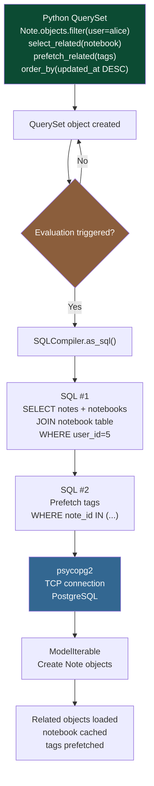
```mermaid
graph TD

    A["Python QuerySet
Note.objects.filter(user=alice)
select_related(notebook)
prefetch_related(tags)
order_by(updated_at DESC)"]

    B["QuerySet object created"]

    C{"Evaluation triggered?"}

    D["SQLCompiler.as_sql()"]

    E["SQL #1
SELECT notes + notebooks
JOIN notebook table
WHERE user_id=5"]

    F["SQL #2
Prefetch tags
WHERE note_id IN (...)"]

    G["psycopg2
TCP connection
PostgreSQL"]

    H["ModelIterable
Create Note objects"]

    I["Related objects loaded
notebook cached
tags prefetched"]

    A --> B

    B --> C

    C -->|"No"| B

    C -->|"Yes"| D

    D --> E

    E --> F

    F --> G

    G --> H

    H --> I

    style A fill:#0C4B33,color:#fff
    style G fill:#336791,color:#fff
    style C fill:#8B5E3C,color:#fff
```

---

## 4. Lazy Evaluation — коли виконується SQL

> **Що показує:** QuerySet методи що НЕ виконують SQL (повертають QuerySet)
> vs методи що ВИКОНУЮТЬ SQL (evaluation triggers).

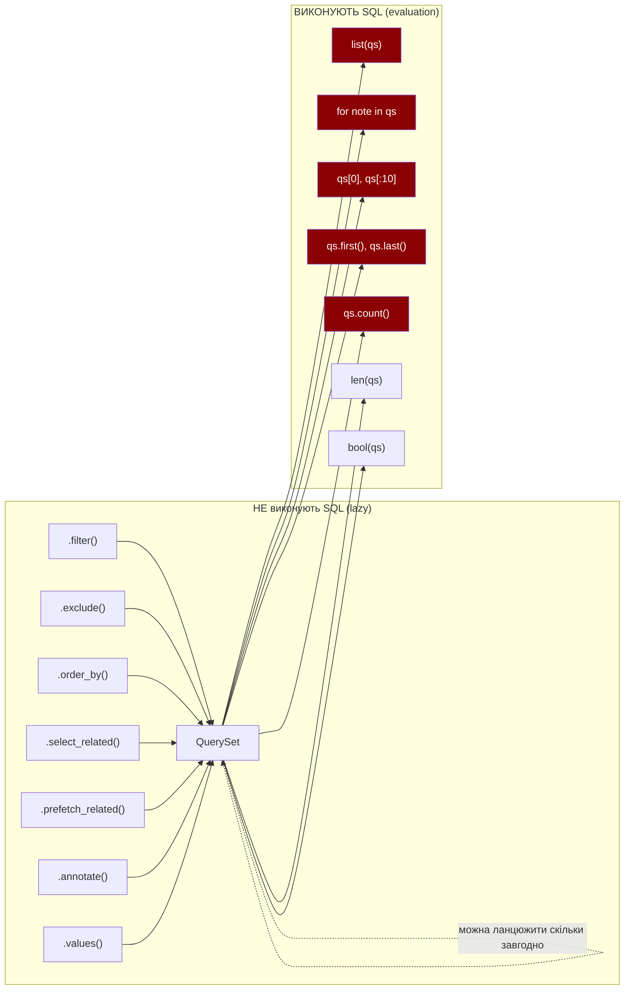
```mermaid
graph LR
    subgraph "НЕ виконують SQL (lazy)"
        L1[".filter()"] --> QS[QuerySet]
        L2[".exclude()"] --> QS
        L3[".order_by()"] --> QS
        L4[".select_related()"] --> QS
        L5[".prefetch_related()"] --> QS
        L6[".annotate()"] --> QS
        L7[".values()"] --> QS
        QS -.->|"можна ланцюжити скільки завгодно"| QS
    end

    subgraph "ВИКОНУЮТЬ SQL (evaluation)"
        QS --> E1["list(qs)"]
        QS --> E2["for note in qs"]
        QS --> E3["qs[0], qs[:10]"]
        QS --> E4["qs.first(), qs.last()"]
        QS --> E5["qs.count()"]
        QS --> E6["len(qs)"]
        QS --> E7["bool(qs)"]
    end

    style E1 fill:#8B0000,color:#fff
    style E2 fill:#8B0000,color:#fff
    style E3 fill:#8B0000,color:#fff
    style E4 fill:#8B0000,color:#fff
    style E5 fill:#8B0000,color:#fff
```

---

## 5. N+1 Problem vs select_related

> **Що показує:** Різниця в кількості SQL запитів між N+1 та select_related.
> Без оптимізації: 1 + N запитів. З select_related: 1 запит.

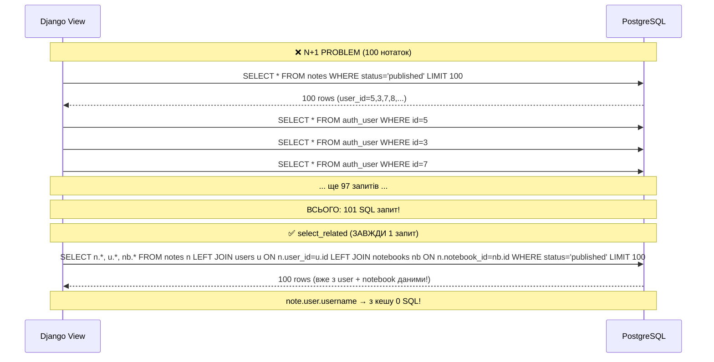
```mermaid
sequenceDiagram
    participant App as Django View
    participant DB as PostgreSQL

    Note over App,DB: ❌ N+1 PROBLEM (100 нотаток)
    App->>DB: SELECT * FROM notes WHERE status='published' LIMIT 100
    DB-->>App: 100 rows (user_id=5,3,7,8,...)
    App->>DB: SELECT * FROM auth_user WHERE id=5
    App->>DB: SELECT * FROM auth_user WHERE id=3
    App->>DB: SELECT * FROM auth_user WHERE id=7
    Note over App,DB: ... ще 97 запитів ...
    Note over App,DB: ВСЬОГО: 101 SQL запит!

    Note over App,DB: ✅ select_related (ЗАВЖДИ 1 запит)
    App->>DB: SELECT n.*, u.*, nb.* FROM notes n LEFT JOIN users u ON n.user_id=u.id LEFT JOIN notebooks nb ON n.notebook_id=nb.id WHERE status='published' LIMIT 100
    DB-->>App: 100 rows (вже з user + notebook даними!)
    Note over App,DB: note.user.username → з кешу 0 SQL!
```

---

## 6. select_related vs prefetch_related — архітектура

> **Що показує:** Механізм кожного методу на рівні SQL.
> select_related = SQL JOIN. prefetch_related = окремий запит + Python join.

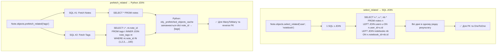
```mermaid
graph TD
    subgraph "select_related → SQL JOIN"
        A1["Note.objects.select_related('user', 'notebook')"] --> B1[1 SQL з JOIN]
        B1 --> C1["SELECT n.*, u.*, nb.*\nFROM notes n\nLEFT JOIN users u ON n.user_id=u.id\nLEFT JOIN notebooks nb ON n.notebook_id=nb.id"]
        C1 --> D1["Всі дані в одному рядку результату"]
        D1 --> E1["✅ Для FK та OneToOne"]
    end

    subgraph "prefetch_related → Python JOIN"
        A2["Note.objects.prefetch_related('tags')"] --> B2[SQL #1: Fetch Notes]
        B2 --> C2["SELECT * FROM notes"]
        A2 --> B3[SQL #2: Fetch Tags]
        B3 --> C3["SELECT t.*, nt.note_id\nFROM tags t INNER JOIN note_tags nt\nWHERE nt.note_id IN (1,2,3,...,100)"]
        C2 --> D2["Python: obj._prefetched_objects_cache\nзаповнюється dict note_id → [tags]"]
        C3 --> D2
        D2 --> E2["✅ Для ManyToMany та reverse FK"]
    end
```

---

## 7. Migration Lifecycle

> **Що показує:** Повний цикл міграції від зміни моделі до оновленої БД.
> Ключовий факт: `makemigrations` не змінює БД, `migrate` — змінює.

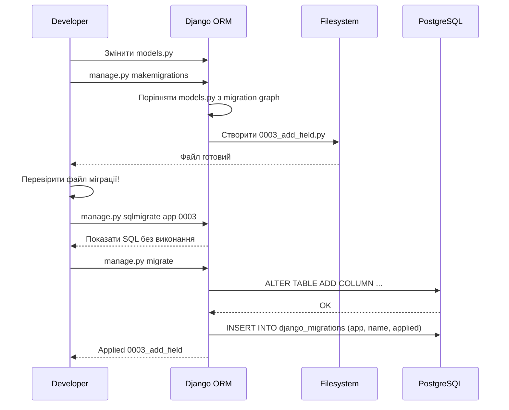
```mermaid
sequenceDiagram
    participant Dev as Developer
    participant Django as Django ORM
    participant FS as Filesystem
    participant DB as PostgreSQL

    Dev->>Django: Змінити models.py
    Dev->>Django: manage.py makemigrations
    Django->>Django: Порівняти models.py з migration graph
    Django->>FS: Створити 0003_add_field.py
    FS-->>Dev: Файл готовий

    Dev->>Dev: Перевірити файл міграції!
    Dev->>Django: manage.py sqlmigrate app 0003
    Django-->>Dev: Показати SQL без виконання

    Dev->>Django: manage.py migrate
    Django->>DB: ALTER TABLE ADD COLUMN ...
    DB-->>Django: OK
    Django->>DB: INSERT INTO django_migrations (app, name, applied)
    Django-->>Dev: Applied 0003_add_field
```

---

## 8. Migration Dependency Graph

> **Що показує:** Як міграції залежать одна від одної.
> Django виконує в правильному порядку залежностей (DAG).

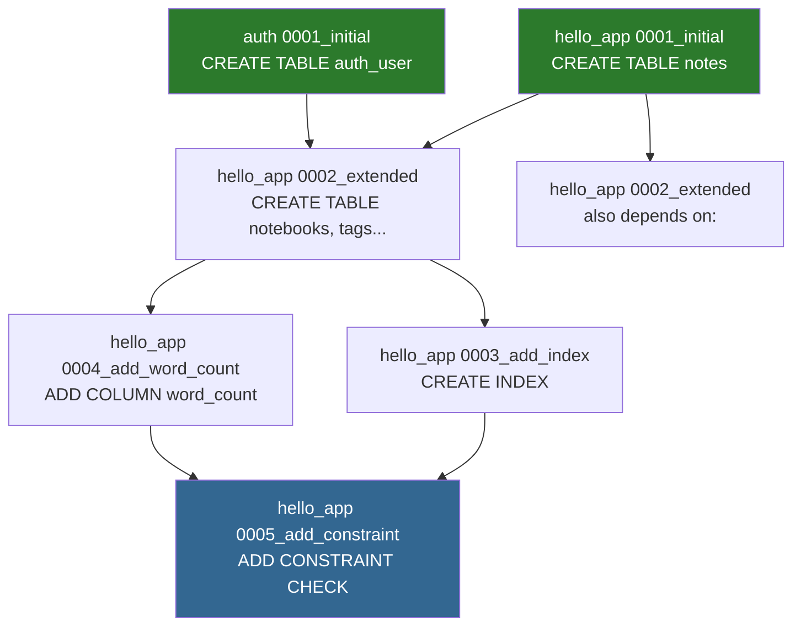
```mermaid
graph TD
    A["hello_app 0001_initial\nCREATE TABLE notes"] --> B["hello_app 0002_extended\nCREATE TABLE notebooks, tags..."]
    A --> C["hello_app 0002_extended\nalso depends on:"]
    D["auth 0001_initial\nCREATE TABLE auth_user"] --> B
    B --> E["hello_app 0003_add_index\nCREATE INDEX"]
    B --> F["hello_app 0004_add_word_count\nADD COLUMN word_count"]
    E --> G["hello_app 0005_add_constraint\nADD CONSTRAINT CHECK"]
    F --> G

    style A fill:#2C7A2C,color:#fff
    style D fill:#2C7A2C,color:#fff
    style G fill:#336791,color:#fff
```

---

## 9. Query Execution Lifecycle — 8 фаз

> **Що показує:** Що відбувається в PostgreSQL з SQL запитом від парсингу до результату.

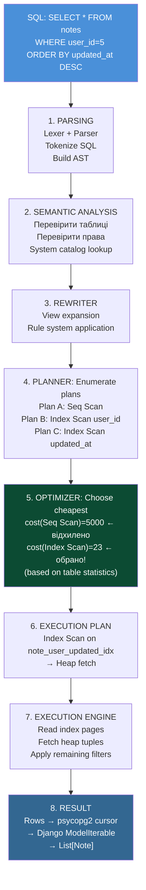
```mermaid
graph TD
    A["SQL: SELECT * FROM notes\nWHERE user_id=5 ORDER BY updated_at DESC"] --> B

    B["1. PARSING\nLexer + Parser\nTokenize SQL\nBuild AST"] --> C

    C["2. SEMANTIC ANALYSIS\nПеревірити таблиці\nПеревірити права\nSystem catalog lookup"] --> D

    D["3. REWRITER\nView expansion\nRule system application"] --> E

    E["4. PLANNER: Enumerate plans\nPlan A: Seq Scan\nPlan B: Index Scan user_id\nPlan C: Index Scan updated_at"] --> F

    F["5. OPTIMIZER: Choose cheapest\ncost(Seq Scan)=5000 ← відхилено\ncost(Index Scan)=23 ← обрано!\n(based on table statistics)"] --> G

    G["6. EXECUTION PLAN\nIndex Scan on note_user_updated_idx\n→ Heap fetch"] --> H

    H["7. EXECUTION ENGINE\nRead index pages\nFetch heap tuples\nApply remaining filters"] --> I

    I["8. RESULT\nRows → psycopg2 cursor\n→ Django ModelIterable\n→ List[Note]"]

    style A fill:#4A90D9,color:#fff
    style F fill:#0C4B33,color:#fff
    style I fill:#336791,color:#fff
```

---

## 10. B-Tree Index — навігація пошуку

> **Що показує:** Як B-Tree індекс знаходить запис за O(log N) замість O(N).
> Кожен рівень = один disk I/O. Глибина: log₂(N) рівнів.

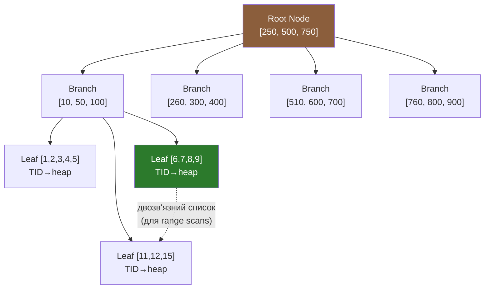
```mermaid
graph TD
    Root["Root Node\n[250, 500, 750]"] --> B1["Branch\n[10, 50, 100]"]
    Root --> B2["Branch\n[260, 300, 400]"]
    Root --> B3["Branch\n[510, 600, 700]"]
    Root --> B4["Branch\n[760, 800, 900]"]

    B1 --> L1["Leaf [1,2,3,4,5]\nTID→heap"]
    B1 --> L2["Leaf [6,7,8,9]\nTID→heap"]
    B1 --> L3["Leaf [11,12,15]\nTID→heap"]

    L2 -.->|"двозв'язний список\n(для range scans)"| L3

    style Root fill:#8B5E3C,color:#fff
    style L2 fill:#2C7A2C,color:#fff
```

> **Пошук user_id=7:**
> Root: `7 < 250` → Branch[10,50,100] → `7 < 10` → Leaf[6,7,8,9] → знайдено TID → heap fetch.
> **3-4 disk I/O** для мільярда рядків.

---

## 11. transaction.atomic() — SQL lifecycle

> **Що показує:** Що відбувається в SQL при transaction.atomic() та при exception.

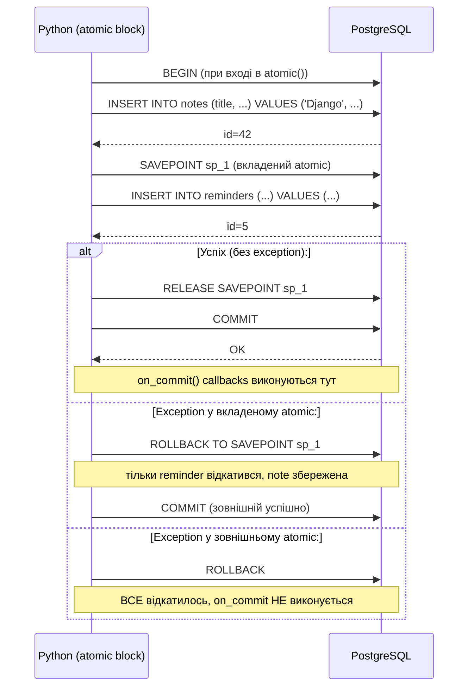
```mermaid
sequenceDiagram
    participant PY as Python (atomic block)
    participant PG as PostgreSQL

    PY->>PG: BEGIN (при вході в atomic())
    PY->>PG: INSERT INTO notes (title, ...) VALUES ('Django', ...)
    PG-->>PY: id=42
    PY->>PG: SAVEPOINT sp_1 (вкладений atomic)
    PY->>PG: INSERT INTO reminders (...) VALUES (...)
    PG-->>PY: id=5

    alt Успіх (без exception):
        PY->>PG: RELEASE SAVEPOINT sp_1
        PY->>PG: COMMIT
        PG-->>PY: OK
        Note over PY,PG: on_commit() callbacks виконуються тут
    else Exception у вкладеному atomic:
        PY->>PG: ROLLBACK TO SAVEPOINT sp_1
        Note over PY,PG: тільки reminder відкатився, note збережена
        PY->>PG: COMMIT (зовнішній успішно)
    else Exception у зовнішньому atomic:
        PY->>PG: ROLLBACK
        Note over PY,PG: ВСЕ відкатилось, on_commit НЕ виконується
    end
```

---

## 12. select_for_update() — Row Locking Timeline

> **Що показує:** Як select_for_update() запобігає race condition при конкурентному доступі.

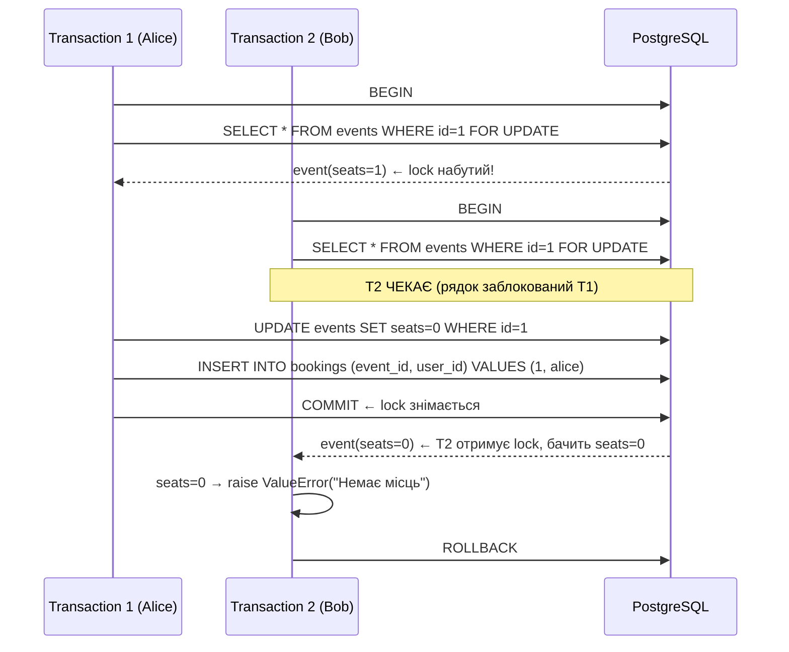
```mermaid
sequenceDiagram
    participant T1 as Transaction 1 (Alice)
    participant T2 as Transaction 2 (Bob)
    participant PG as PostgreSQL

    T1->>PG: BEGIN
    T1->>PG: SELECT * FROM events WHERE id=1 FOR UPDATE
    PG-->>T1: event(seats=1) ← lock набутий!

    T2->>PG: BEGIN
    T2->>PG: SELECT * FROM events WHERE id=1 FOR UPDATE
    Note over T2,PG: T2 ЧЕКАЄ (рядок заблокований T1)

    T1->>PG: UPDATE events SET seats=0 WHERE id=1
    T1->>PG: INSERT INTO bookings (event_id, user_id) VALUES (1, alice)
    T1->>PG: COMMIT ← lock знімається

    PG-->>T2: event(seats=0) ← T2 отримує lock, бачить seats=0
    T2->>T2: seats=0 → raise ValueError("Немає місць")
    T2->>PG: ROLLBACK
```

---

## 13. Deadlock — взаємне блокування

> **Що показує:** Як виникає deadlock при різному порядку блокування.
> Рішення: завжди блокувати в стабільному порядку (по id ASC).

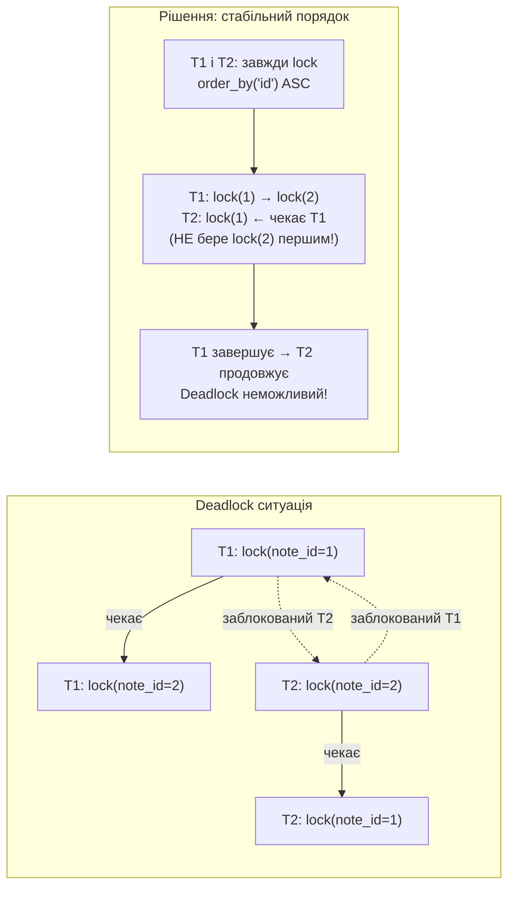
```mermaid
graph LR
    subgraph "Deadlock ситуація"
        T1A["T1: lock(note_id=1)"] -->|"чекає"| T1B["T1: lock(note_id=2)"]
        T2B["T2: lock(note_id=2)"] -->|"чекає"| T2A["T2: lock(note_id=1)"]
        T1A -.->|"заблокований T2"| T2B
        T2B -.->|"заблокований T1"| T1A
    end

    subgraph "Рішення: стабільний порядок"
        S1["T1 і T2: завжди lock\norder_by('id') ASC"] --> S2["T1: lock(1) → lock(2)\nT2: lock(1) ← чекає T1\n(НЕ бере lock(2) першим!)"]
        S2 --> S3["T1 завершує → T2 продовжує\nDeadlock неможливий!"]
    end
```

---

## 14. MVCC — Tuple Versioning

> **Що показує:** Як PostgreSQL зберігає кілька версій рядка для MVCC.
> xmin = транзакція що створила, xmax = транзакція що видалила/замінила.

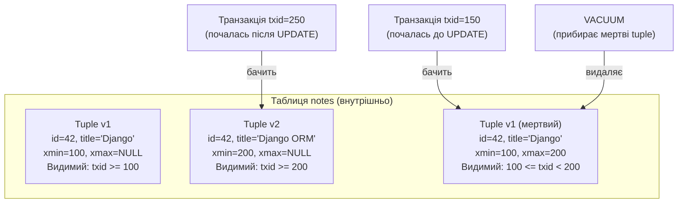
```mermaid
graph TD
    subgraph "Таблиця notes (внутрішньо)"
        T1["Tuple v1\nid=42, title='Django'\nxmin=100, xmax=NULL\nВидимий: txid >= 100"]
        T2["Tuple v2\nid=42, title='Django ORM'\nxmin=200, xmax=NULL\nВидимий: txid >= 200"]
        T3["Tuple v1 (мертвий)\nid=42, title='Django'\nxmin=100, xmax=200\nВидимий: 100 <= txid < 200"]
    end

    TX150["Транзакція txid=150\n(почалась до UPDATE)"] -->|"бачить"| T3
    TX250["Транзакція txid=250\n(почалась після UPDATE)"] -->|"бачить"| T2
    VACUUM["VACUUM\n(прибирає мертві tuple)"] -->|"видаляє"| T3
```

---

## 15. N+1 vs оптимізовані запити — повна картина

> **Що показує:** Кількість SQL запитів для різних стратегій завантаження 100 нотаток.

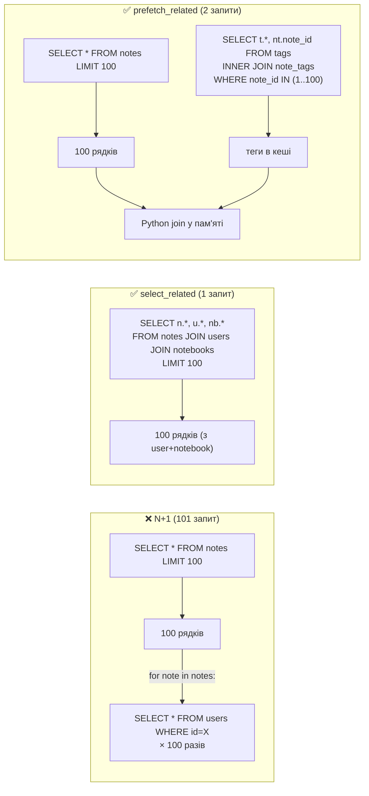
```mermaid
graph LR
    subgraph "❌ N+1 (101 запит)"
        Q1["SELECT * FROM notes LIMIT 100"] --> R1["100 рядків"]
        R1 -->|"for note in notes:"| Q2["SELECT * FROM users WHERE id=X\n× 100 разів"]
    end

    subgraph "✅ select_related (1 запит)"
        Q3["SELECT n.*, u.*, nb.*\nFROM notes JOIN users JOIN notebooks\nLIMIT 100"] --> R3["100 рядків (з user+notebook)"]
    end

    subgraph "✅ prefetch_related (2 запити)"
        Q4["SELECT * FROM notes LIMIT 100"] --> R4["100 рядків"]
        Q5["SELECT t.*, nt.note_id FROM tags\nINNER JOIN note_tags\nWHERE note_id IN (1..100)"] --> R5["теги в кеші"]
        R4 --> R6["Python join у пам'яті"]
        R5 --> R6
    end
```

---

## 16. PostgreSQL System Architecture

> **Що показує:** Як PostgreSQL обробляє Django запит на системному рівні.
> Shared Buffers = кеш. WAL = журнал відмовостійкості.

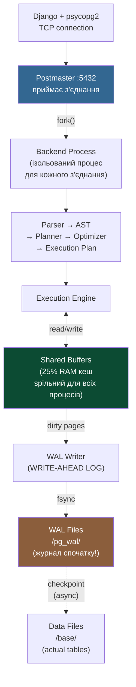
```mermaid
graph TD
    Client["Django + psycopg2\nTCP connection"] --> PM["Postmaster :5432\nприймає з'єднання"]
    PM -->|"fork()"| BP["Backend Process\n(ізольований процес\nдля кожного з'єднання)"]
    BP --> QP["Parser → AST\n→ Planner → Optimizer\n→ Execution Plan"]
    QP --> EE["Execution Engine"]
    EE <-->|"read/write"| SB["Shared Buffers\n(25% RAM кеш\nspільний для всіх процесів)"]
    SB -->|"dirty pages"| WW["WAL Writer\n(WRITE-AHEAD LOG)"]
    WW -->|"fsync"| WAL["WAL Files\n/pg_wal/\n(журнал спочатку!)"]
    WAL -.->|"checkpoint\n(async)"| DF["Data Files\n/base/\n(actual tables)"]

    style PM fill:#336791,color:#fff
    style SB fill:#0C4B33,color:#fff
    style WAL fill:#8B5E3C,color:#fff
```

---

## 17. Services/Selectors архітектура

> **Що показує:** Потік даних через шари Services/Selectors архітектури.
> View — тонкий. Логіка — в services/selectors.

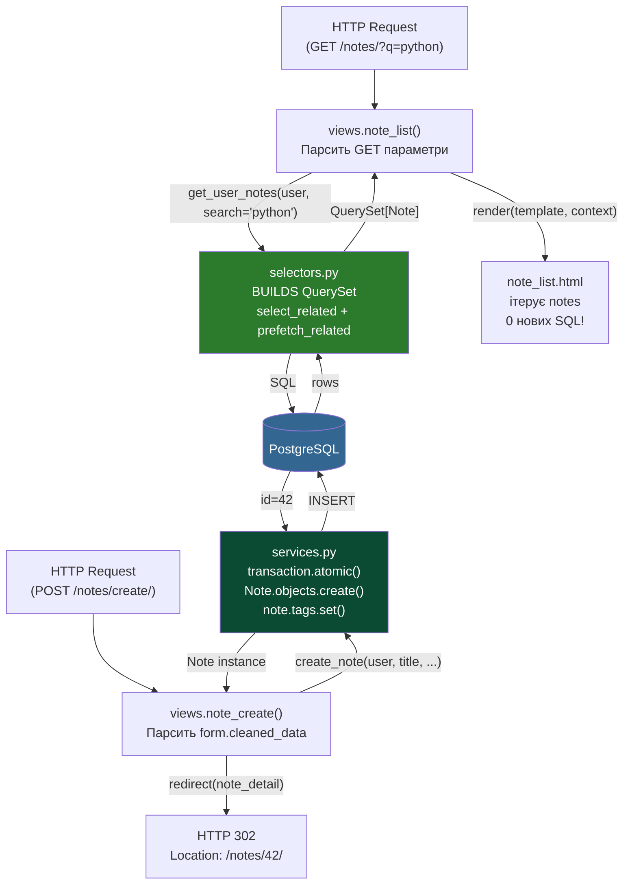
```mermaid
graph TD
    REQ["HTTP Request\n(GET /notes/?q=python)"] --> VIEW["views.note_list()\nПарсить GET параметри"]
    VIEW -->|"get_user_notes(user, search='python')"| SEL["selectors.py\nBUILDS QuerySet\nselect_related + prefetch_related"]
    SEL -->|"SQL"| DB[(PostgreSQL)]
    DB -->|"rows"| SEL
    SEL -->|"QuerySet[Note]"| VIEW
    VIEW -->|"render(template, context)"| TMPL["note_list.html\nітерує notes\n0 нових SQL!"]

    REQ2["HTTP Request\n(POST /notes/create/)"] --> VIEW2["views.note_create()\nПарсить form.cleaned_data"]
    VIEW2 -->|"create_note(user, title, ...)"| SVC["services.py\ntransaction.atomic()\nNote.objects.create()\nnote.tags.set()"]
    SVC -->|"INSERT"| DB
    DB -->|"id=42"| SVC
    SVC -->|"Note instance"| VIEW2
    VIEW2 -->|"redirect(note_detail)"| RESP["HTTP 302\nLocation: /notes/42/"]

    style SEL fill:#2C7A2C,color:#fff
    style SVC fill:#0C4B33,color:#fff
    style DB fill:#336791,color:#fff
```

---

## 18. Нормалізація — Before/After

> **Що показує:** Чому дублювання в схемі — проблема, і як нормалізація вирішує її.

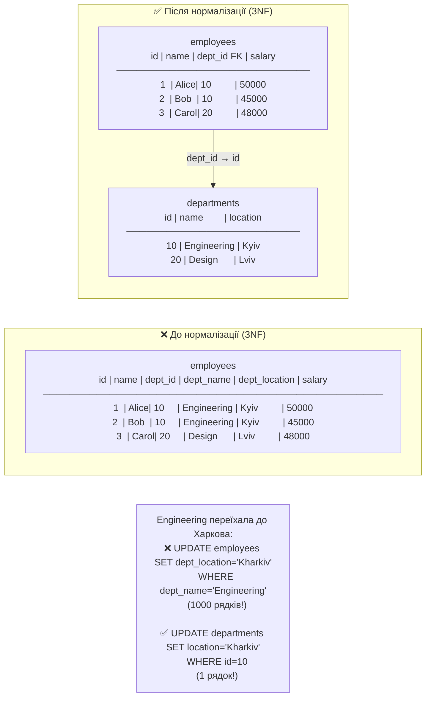
```mermaid
graph LR
    subgraph "❌ До нормалізації (3NF)"
        T1["employees\nid | name | dept_id | dept_name | dept_location | salary\n───────────────────────────────────────────────────\n1  | Alice| 10     | Engineering | Kyiv         | 50000\n2  | Bob  | 10     | Engineering | Kyiv         | 45000\n3  | Carol| 20     | Design      | Lviv         | 48000"]
    end

    subgraph "✅ Після нормалізації (3NF)"
        T2["employees\nid | name | dept_id FK | salary\n─────────────────────────────\n1  | Alice| 10         | 50000\n2  | Bob  | 10         | 45000\n3  | Carol| 20         | 48000"]
        T3["departments\nid | name        | location\n──────────────────────────\n10 | Engineering | Kyiv\n20 | Design      | Lviv"]
        T2 -->|"dept_id → id"| T3
    end

    PROB["Engineering переїхала до Харкова:\n❌ UPDATE employees SET dept_location='Kharkiv'\n   WHERE dept_name='Engineering'\n   (1000 рядків!)\n\n✅ UPDATE departments SET location='Kharkiv'\n   WHERE id=10\n   (1 рядок!)"]
```

---

## 19. Relationship Types Map (повна карта)

> **Що показує:** Всі типи зв'язків Django + SQL механізм + правило розташування FK.

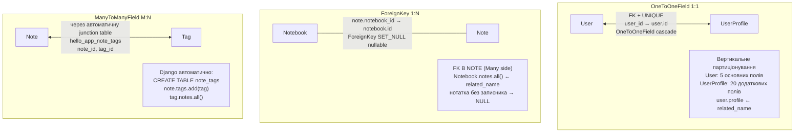
```mermaid
graph TD
    subgraph "OneToOneField 1:1"
        U[User] <-->|"FK + UNIQUE\nuser_id → user.id\nOneToOneField cascade"| UP[UserProfile]
        NOTE1["Вертикальне партиціонування\nUser: 5 основних полів\nUserProfile: 20 додаткових полів\nuser.profile ← related_name"]
    end

    subgraph "ForeignKey 1:N"
        NB[Notebook] <---|"note.notebook_id → notebook.id\nForeignKey SET_NULL nullable"| NO[Note]
        NOTE2["FK В NOTE (Many side)\nNotebook.notes.all() ← related_name\nнотатка без записника → NULL"]
    end

    subgraph "ManyToManyField M:N"
        N[Note] <-->|"через автоматичну junction table\nhello_app_note_tags\nnote_id, tag_id"| T[Tag]
        NOTE3["Django автоматично:\nCREATE TABLE note_tags\nnote.tags.add(tag)\ntag.notes.all()"]
    end
```

---

## 20. F() Expression — Race Condition Prevention

> **Що показує:** Різницю між небезпечним Python read-modify-write та атомарним F().

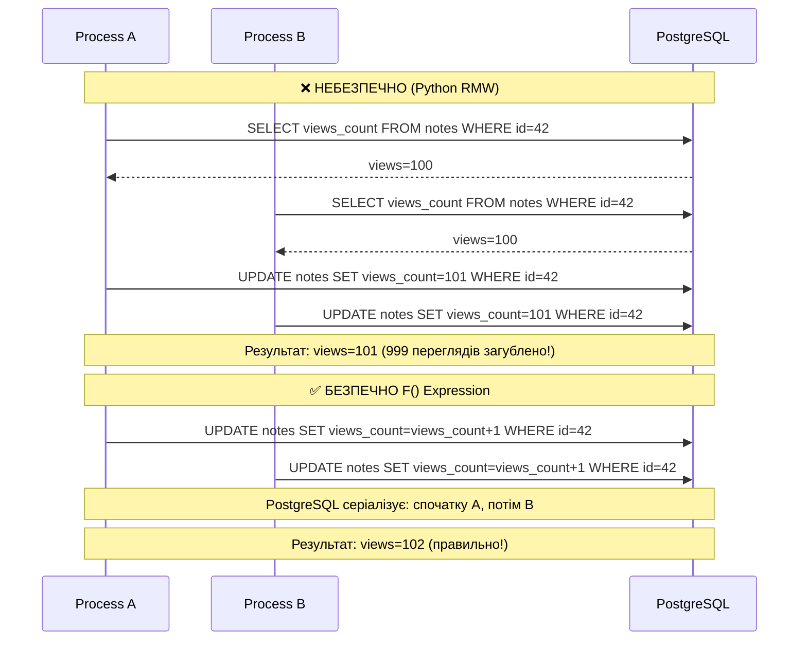
```mermaid
sequenceDiagram
    participant A as Process A
    participant B as Process B
    participant PG as PostgreSQL

    Note over A,PG: ❌ НЕБЕЗПЕЧНО (Python RMW)
    A->>PG: SELECT views_count FROM notes WHERE id=42
    PG-->>A: views=100
    B->>PG: SELECT views_count FROM notes WHERE id=42
    PG-->>B: views=100
    A->>PG: UPDATE notes SET views_count=101 WHERE id=42
    B->>PG: UPDATE notes SET views_count=101 WHERE id=42
    Note over A,PG: Результат: views=101 (999 переглядів загублено!)

    Note over A,PG: ✅ БЕЗПЕЧНО F() Expression
    A->>PG: UPDATE notes SET views_count=views_count+1 WHERE id=42
    B->>PG: UPDATE notes SET views_count=views_count+1 WHERE id=42
    Note over A,PG: PostgreSQL серіалізує: спочатку A, потім B
    Note over A,PG: Результат: views=102 (правильно!)
```
