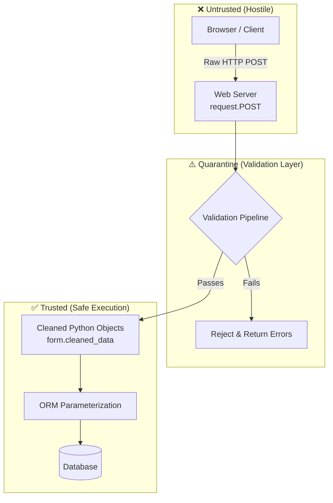
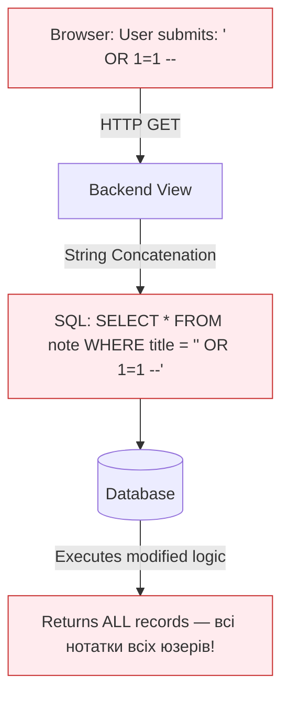
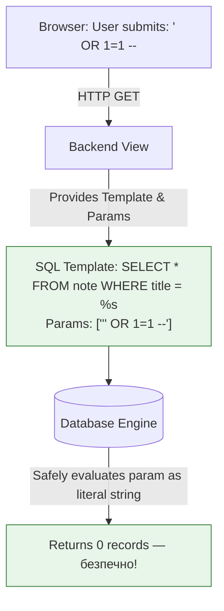
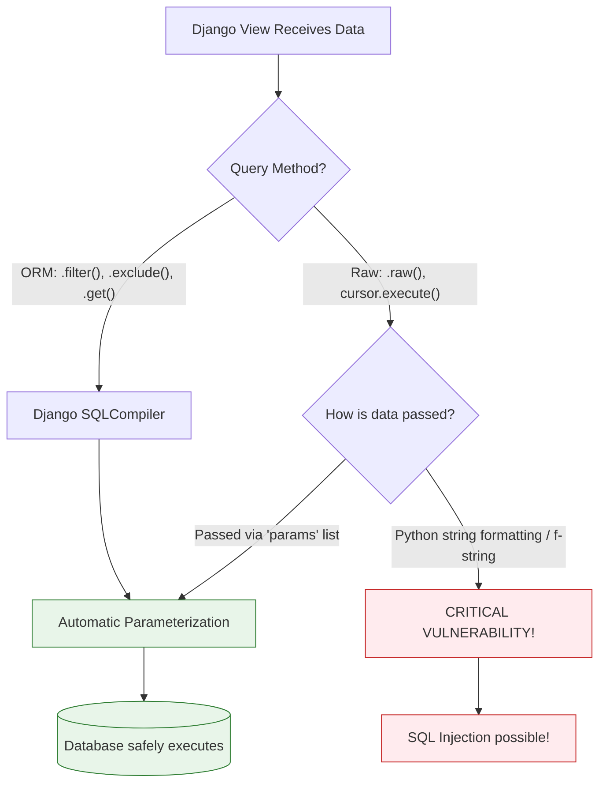

# Реляційний фундамент та SQL

> Цей документ — теоретичний фундамент перед роботою з будь-яким ORM.
> Розумієш це → Django ORM, SQLAlchemy, Hibernate стають прозорими.
> Не розумієш → пишеш запити "методом тику", не знаючи чому вони повільні.

---

> 🔬 **Від теорії до практики:**
> [`notes_project/hello_app/orm_laboratory.ipynb`](notes_project/hello_app/orm_laboratory.ipynb)
>
> Після читання цього файлу відкрий ноутбук і запусти:
>
> | Концепція з цього файлу | Розділ ноутбука |
> |------------------------|-----------------|
> | Primary Key, Foreign Key, SELECT | `## 2. 🔍 Lazy Methods` → filter/get |
> | JOIN через `__` lookup | `## 4. 🔗 Relationship Traversal` |
> | GROUP BY / агрегація | `## 7. 📊 Aggregation & Annotation` |
> | SQL Injection захист | `## 14. 🧪 Raw SQL` |
> | Query Execution Plan | `## 11. 🔬 SQL Inspection` → `queryset.explain(analyze=True)` |


> **🧠 Ментальна модель:** Реляційна база даних — це не "папка з таблицями Excel". Це **математична система** заснована на реляційній алгебрі (Едгар Кодд, 1970). Кожна таблиця — це **відношення (relation)** між сутностями. SQL — це мова запитів до цих відношень. ORM — це прошарок що дозволяє писати ці запити мовою Python, а не SQL.
>
> **📚 Чому СУБД існують:** До баз даних системи зберігали дані у плоских файлах (CSV, txt). Спробуй уявити: тисяча користувачів одночасно редагують один файл — катастрофа. СУБД вирішує три проблеми: **конкурентний доступ** (тисячі одночасних запитів), **цілісність** (неможливо записати рядок без обов'язкового поля), **пошук** (знайти запис за умовою серед мільярдів — мілісекунди).
>
> **🌐 Як це стосується Django:** Кожна твоя модель (`class Note(models.Model)`) — це таблиця. Кожен `QuerySet` — це SQL-запит. Django ORM генерує SQL за тебе, але якщо ти не розумієш SQL — ти не зрозумієш чому деякі запити повільні, а деякі — ні. `select_related` і `prefetch_related` мають сенс тільки якщо ти розумієш що таке JOIN.
>
> **❌ Типова помилка початківця:** Вважати що ORM = "я більше не пишу SQL". Насправді ORM = "я пишу SQL через Python". Розуміти SQL все одно потрібно — просто писати вручну потрібно рідше.

---

## 0. Загальна карта: від даних до програми

Перш ніж заходити в деталі — подивись на загальну картину. Як дані "подорожують" від Python-коду до диску і назад:

```
Python Code (Django View)
    │  QuerySet.filter(status='published')
    ▼
Django ORM (SQLCompiler)
    │  Перекладає Python → SQL
    ▼
psycopg2 (Database Adapter)
    │  Відправляє SQL по TCP
    ▼
PostgreSQL Postmaster
    │  Приймає з'єднання
    ▼
Parser → Planner → Optimizer → Executor
    │  Читає дані з диску в пам'ять
    ▼
Disk (Data Pages)
    │  Row data
    ▼
(назад по ланцюжку)
    │  Python objects (Model instances)
    ▼
Django Template (рендеринг)
    │  HTML
    ▼
HTTP Response → Браузер
```

Кожен крок цього шляху буде детально пояснений у цьому та наступних документах.

---

## 1. Чому існують бази даних

---
> **🧠 Ментальна модель:** База даних — це не просто "місце для збереження". Це **контракт**: система гарантує що дані збережуться навіть при збоях, що два паралельні запити не зіпсують один одного, і що ти знайдеш будь-який запис за мілісекунди серед мільярдів. Жоден файл не може дати такі гарантії.
>
> **📚 Чому не просто файли:** Уяви інтернет-магазин: 1000 покупців одночасно натискають "Купити" на останній товар у стоці. Якщо зберігати дані у файлі — всі 1000 прочитають `stock=1`, всі 1000 зменшать на 1 і збережуть `stock=0`. Проданий 1000 разів замість 1. База даних через транзакції та блокування гарантує що тільки одна операція пройде.
>
> **🌐 Як це в Django:** `transaction.atomic()` + `select_for_update()` — це Python-обгортки над механізмами БД. Вони не "магія Django" — це трансляція SQL команд `BEGIN`, `SELECT FOR UPDATE`, `COMMIT`.
>
> **❌ Типова помилка:** Думати що `Note.objects.create(...)` — це просто "записати в файл". Насправді це: відкрити з'єднання → почати транзакцію → перевірити constraints → записати на диск через WAL → підтвердити транзакцію → повернути об'єкт з id.
---

**СУБД (Database Management System)** існує щоб вирішити чотири проблеми:

| Проблема | Без СУБД | З СУБД |
|----------|---------|--------|
| **Конкурентність** | Два процеси псують один файл | MVCC, транзакції, блокування |
| **Цілісність** | Можна записати Email без @, ціну = -100 | Constraints, CHECK, FOREIGN KEY |
| **Пошук** | Читати весь файл для кожного пошуку | B-Tree індекси, O(log N) |
| **Відновлення** | Збій = втрата даних | WAL (Write-Ahead Log), репліки |

**Таблиці, Рядки та Стовпці**

Реляційна БД організує дані у **двовимірні таблиці**:
- **Стовпці (columns)** — визначають тип даних (`VARCHAR`, `INTEGER`, `BOOLEAN`) та накладають обмеження
- **Рядки (rows, tuples)** — окремі записи
- **Таблиця (relation)** — набір рядків з однаковою структурою

```
Таблиця: notes_note
┌────┬──────────────────────┬───────────────┬─────────────┬────────────┐
│ id │ title                │ status        │ views_count │ user_id    │
├────┼──────────────────────┼───────────────┼─────────────┼────────────┤
│  1 │ Django ORM глибоко   │ published     │          42 │         5  │ ← рядок (tuple)
│  2 │ PostgreSQL MVCC      │ draft         │           0 │         5  │
│  3 │ CSS Flexbox          │ published     │         128 │         8  │
└────┴──────────────────────┴───────────────┴─────────────┴────────────┘
  ↑
  Стовпець з типом BIGSERIAL (auto-increment INTEGER)
```

---

## 2. Primary Key та Foreign Key

---
> **🧠 Ментальна модель:** Primary Key — це паспорт рядка. Як паспортний номер: унікальний, незмінний, обов'язковий. Foreign Key — це посилання в одній таблиці на паспорт запису в іншій. Як у лікарні: картка пацієнта містить номер лікаря — не копію всієї інформації про лікаря, а тільки посилання на неї.
>
> **📚 Чому не копіювати дані:** Якщо в `Note` зберігати `author_name` замість `user_id` — що станеться коли користувач змінить ім'я? Потрібно оновити тисячі рядків. З Foreign Key → оновлюєш 1 рядок в `auth_user`, і всі нотатки автоматично "бачать" нове ім'я через JOIN.
>
> **🌐 Як це в Django:** `ForeignKey(User, on_delete=CASCADE)` → Django генерує стовпець `user_id INTEGER NOT NULL REFERENCES auth_user(id) ON DELETE CASCADE`. Це чистий SQL — Django просто допомагає написати це по-пітонячи.
>
> **❌ Типова помилка:** Зберігати `username` як рядок замість `ForeignKey`. Потім username змінюється → дані розсинхронізуються. Завжди зберігай посилання (id), а не копію даних.
---

### Primary Key (PK)

**Primary Key** — унікальний ідентифікатор рядка в таблиці. Гарантує:
- Кожен рядок ідентифікується однозначно (no duplicate rows)
- Значення не може бути NULL
- Значення не може повторюватись

Django автоматично додає `id` як PK якщо ти не визначив свій:

```python
# Це:
class Note(models.Model):
    title = models.CharField(max_length=200)

# Генерує SQL:
# CREATE TABLE notes_note (
#     id BIGSERIAL PRIMARY KEY,   ← автоматично!
#     title VARCHAR(200) NOT NULL
# );
```

Типи PK:
```
SERIAL / BIGSERIAL   → auto-increment integer (1, 2, 3, ...)
UUID                 → 550e8400-e29b-41d4-a716-446655440000 (глобально унікальний)
```

### Foreign Key (FK)

**Foreign Key** — стовпець що зберігає PK іншого рядка (в іншій або тій же таблиці). Це **структурний зв'язок**.

```
auth_user              notes_note
┌────┬──────────┐      ┌────┬────────────────┬─────────┐
│ id │ username │      │ id │ title          │ user_id │
├────┼──────────┤      ├────┼────────────────┼─────────┤
│  5 │ alice    │ ←──┐ │  1 │ Django ORM     │    5    │ ←FK
│  8 │ bob      │    └─┤  2 │ PostgreSQL      │    5    │ ←FK (той самий user)
└────┴──────────┘      │  3 │ CSS Flexbox    │    8    │ ←FK
                       └────┴────────────────┴─────────┘

user_id = 5 → посилається на рядок id=5 в auth_user (alice)
```

```python
# Django:
class Note(models.Model):
    user = models.ForeignKey(User, on_delete=models.CASCADE)

# Генерує SQL:
# user_id BIGINT NOT NULL REFERENCES auth_user(id) ON DELETE CASCADE
```

---

## 3. Constraints та Цілісність Даних

---
> **🧠 Ментальна модель:** Constraints — це охоронці на воротах бази даних. Неважливо звідки прийшли дані: з Django форми, з Python скрипта, або з прямого SQL-запиту в терміналі — constraint перевірить їх ОДНАКОВО. Це остання лінія захисту від поганих даних.
>
> **📚 Чому не тільки Python-валідація:** `clean()` і `full_clean()` в Django — це Python-рівень. Але якщо хтось пише напряму в БД через psql, або стара частина коду обходить форму — Python-валідація не спрацює. `CheckConstraint`, `UniqueConstraint` на рівні SQL спрацюють завжди.
>
> **🌐 Як PostgreSQL перевіряє constraints:** При кожному INSERT або UPDATE PostgreSQL перевіряє всі constraints АТОМАРНО — або всі проходять, або вся операція відкочується. Не буває "частково валідного" запису.
>
> **❌ Типова помилка:** Ставити `unique=True` тільки на рівні моделі (`models.CharField(unique=True)`) і думати що це достатньо. Так, Django генерує UNIQUE constraint в БД. Але `UniqueConstraint(fields=['user', 'slug'])` — складена унікальність — потрібно описувати явно в `Meta.constraints`.
---

| Constraint | SQL | Django | Що перевіряє |
|------------|-----|--------|--------------|
| `NOT NULL` | `name NOT NULL` | (за замовчуванням) | Значення обов'язкове |
| `UNIQUE` | `UNIQUE(email)` | `unique=True` | Без дублікатів |
| `PRIMARY KEY` | `id BIGSERIAL PK` | автоматично | NOT NULL + UNIQUE |
| `FOREIGN KEY` | `REFERENCES user(id)` | `ForeignKey(...)` | Посилання існує |
| `CHECK` | `CHECK(price > 0)` | `CheckConstraint(...)` | Довільна умова |

```python
class Note(models.Model):
    views_count = models.PositiveIntegerField(default=0)
    user = models.ForeignKey(User, ...)
    slug = models.SlugField(max_length=200)

    class Meta:
        constraints = [
            # Складений UNIQUE: slug унікальний в межах user
            # (alice може мати /notes/python/, bob теж може — але alice не може двічі)
            models.UniqueConstraint(
                fields=['user', 'slug'],
                name='unique_note_slug_per_user'
            ),

            # CHECK: views_count не може бути від'ємним
            # Перевіряється на рівні PostgreSQL — навіть при прямому SQL
            models.CheckConstraint(
                check=models.Q(views_count__gte=0),
                name='note_views_non_negative'
            ),
        ]
```

---

## 4. Нормалізація — архітектура без дублювання

---
> **🧠 Ментальна модель:** Нормалізація — це як рефакторинг коду. Дублювання в коді = порушення DRY. Дублювання в схемі БД = порушення нормальних форм. Якщо щоб змінити одне значення потрібно оновити тисячі рядків — схема порушує нормалізацію. "Єдине джерело істини" — принцип що до баз даних так само застосовується.
>
> **📚 Чому це важливо на практиці:** Уяви таблицю `orders` з полями `customer_name`, `customer_email`, `customer_city` у кожному рядку. Customer змінив email — потрібно UPDATE тисячі orders. Якщо пропустиш хоч одну — аномалія оновлення (update anomaly). Нормалізація вирішує це виносом в окрему таблицю.
>
> **🌐 Як це в Django:** Кожна окрема модель (`Category`, `UserProfile`, `Tag`) — це результат нормалізації. Замість того щоб дублювати `category_name` у кожній нотатці — зберігаємо один запис у `Category` і FK в `Note`.
>
> **❌ Типова помилка:** "Денормалізація для продуктивності" як відповідь на будь-яку повільність. Денормалізація — це свідомий архітектурний компроміс для конкретних bottlenecks (лічильники для analytics), а не рішення за замовчуванням.
---

### Аномалії що виникають без нормалізації

```
❌ ПОГАНА схема (денормалізована):
┌────┬──────────┬────────────────────────┬──────────────┬────────────────────┐
│ id │ customer │ customer_email         │ product      │ category_name      │
├────┼──────────┼────────────────────────┼──────────────┼────────────────────┤
│  1 │ Alice    │ alice@example.com      │ Django Book  │ Programming Books  │
│  2 │ Alice    │ alice@example.com      │ Python Book  │ Programming Books  │
│  3 │ Bob      │ bob@example.com        │ Django Book  │ Programming Books  │
└────┴──────────┴────────────────────────┴──────────────┴────────────────────┘

Проблеми:
- Alice змінила email → UPDATE тисяч рядків
- Якщо пропустити хоч один → дані розсинхронізовані
- Категорія "Programming Books" повторюється → якщо змінити назву → знову масовий UPDATE
```

```
✅ НОРМАЛІЗОВАНА схема:
customers:   id | name  | email
orders:      id | customer_id FK | product_id FK
products:    id | name  | category_id FK
categories:  id | name

Alice змінила email → UPDATE 1 рядок в customers. Всі orders автоматично "бачать" новий email через JOIN.
```

### 1NF — First Normal Form: атомарні значення

**Правило:** Кожне поле містить тільки одне неподільне значення.

```python
# ❌ Порушення 1NF: масив у стовпці
class Post(models.Model):
    tags = models.CharField(max_length=200)  # "python, django, orm"
    # Неможливо ефективно фільтрувати по одному тегу!

# ✅ 1NF: окрема таблиця
class Tag(models.Model):
    name = models.CharField(max_length=50)

class Post(models.Model):
    tags = models.ManyToManyField(Tag)  # Django генерує junction table
```

### 2NF — Second Normal Form: залежність від всього PK

**Правило:** Кожен не-ключовий атрибут залежить від **всього** Primary Key (актуально для composite PK).

```
❌ Порушення 2NF (composite PK = order_id + product_id):
order_items: order_id | product_id | quantity | product_name | product_category
                                                ↑              ↑
                              product_name залежить від product_id, а не від всього PK!

✅ 2NF:
order_items: order_id | product_id | quantity    ← залежить від обох
products:    product_id | name | category         ← product_name → окрема таблиця
```

### 3NF — Third Normal Form: немає транзитивних залежностей

**Правило:** Не-ключові поля не залежать від інших не-ключових полів.

```
❌ Порушення 3NF:
employees: id | dept_id | dept_name | dept_location
                          ↑
              dept_name залежить від dept_id (не від id!)
              Якщо відділ переїхав → UPDATE тисяч рядків employees

✅ 3NF:
employees:   id | dept_id FK | salary
departments: id | name | location    ← dept_name → окрема таблиця
```

---

## 5. Системи відносин (Relationship Systems)

---
> **🧠 Ментальна модель:** Зв'язки між таблицями — це не "опція" реляційних БД. Це СУТЬ. Слово "реляційна" походить від "relation" (відношення). Три типи відносин відповідають трьом різним реальним ситуаціям: "один веде одного" (лікар→пацієнт), "один має багато" (категорія→статті), "багато зв'язані з багатьма" (студент→курси).
>
> **📚 Чому M:N потребує junction table:** Реляційні БД фізично зберігають дані у двовимірних таблицях. Неможливо в одному рядку `Note` зберегти "список тегів" і одночасно в одному рядку `Tag` зберегти "список нотаток". Junction table — єдиний спосіб.
>
> **🌐 Як Django реалізує це:** `ManyToManyField(Tag)` → Django автоматично створює таблицю `hello_app_note_tags` з двома FK. Ти ніколи не бачиш цю таблицю в Python, але вона є в БД. `note.tags.add(tag)` → INSERT в junction table.
>
> **❌ Типова помилка:** Не знати де "живе" FK. **Правило завжди одне:** FK завжди на стороні "багатьох" (Many). Категорія→Нотатки: `note.category_id` (FK в Note, бо нотаток може бути багато). Не `category.note_ids` — це порушення реляційної моделі.
---

### One-to-One (1:1)

Один запис в таблиці A відповідає рівно одному запису в B. Використовується для **вертикального партиціонування** — розбиття широкої таблиці на дві вужчі.

**Навіщо:** якщо `User` має 5 полів (username, email, ...) + 20 полів профілю (bio, city, ...) — кожен запит до `User` навантажує 25 стовпців. Ліпше: 5 основних в `User`, 20 додаткових в `UserProfile`. Запити що не потребують профілю — читають тільки `User`.

```python
class UserProfile(models.Model):
    # OneToOneField = ForeignKey + UNIQUE constraint на FK
    user = models.OneToOneField(User, on_delete=models.CASCADE, related_name='profile')
    bio = models.TextField(blank=True)
    city = models.CharField(max_length=100, blank=True)

# SQL:
# user_id BIGINT NOT NULL UNIQUE REFERENCES auth_user(id) ON DELETE CASCADE
#                         ↑ UNIQUE робить це 1:1 (не 1:N)
```

```
auth_user         user_profiles
┌────┬───────┐    ┌────┬─────────┬────────────────────────┐
│ id │ name  │    │ id │ user_id │ bio          | city     │
├────┼───────┤    ├────┼─────────┼────────────────────────┤
│  1 │ Alice │◄───│  1 │    1    │ "Django dev" | Kyiv     │
│  2 │ Bob   │◄───│  2 │    2    │ "ML engineer"| Lviv     │
└────┴───────┘    └────┴─────────┴────────────────────────┘
                          ↑
                   UNIQUE: один user → максимум один profile
```

### One-to-Many (1:N) — найпоширеніший тип

Один запис в A може мати багато записів в B. FK **завжди на стороні B (Many)**.

```
categories              notes
┌────┬──────────────┐   ┌────┬──────────────────┬─────────────┐
│ id │ name         │   │ id │ title            │ category_id │
├────┼──────────────┤   ├────┼──────────────────┼─────────────┤
│  1 │ Programming  │◄──│  1 │ Django ORM       │      1      │
│  2 │ Design       │◄──│  2 │ Python Tips      │      1      │
│    │              │ ←─│  3 │ CSS Grid         │      2      │
└────┴──────────────┘   └────┴──────────────────┴─────────────┘

1 Category → N Notes. FK в Notes (сторона Many).
```

```python
class Note(models.Model):
    category = models.ForeignKey(
        Category,
        on_delete=models.SET_NULL,
        null=True, blank=True,
        related_name='notes'   # category.notes.all() → всі нотатки категорії
    )
```

### Many-to-Many (M:N)

Запис в A може бути пов'язаний з багатьма записами B, і навпаки. **Вимагає Junction Table**.

```
notes              note_tags (junction)    tags
┌────┬──────────┐  ┌─────────┬────────┐   ┌────┬──────────┐
│ id │ title    │  │ note_id │ tag_id │   │ id │ name     │
├────┼──────────┤  ├─────────┼────────┤   ├────┼──────────┤
│  1 │ Django   │──│    1    │   10   │──►│ 10 │ python   │
│  2 │ CSS tips │  │    1    │   11   │──►│ 11 │ orm      │
│    │          │  │    2    │   10   │──►│    │          │
└────┴──────────┘  └─────────┴────────┘   └────┴──────────┘

Note(1)="Django" має теги python(10) та orm(11)
Note(2)="CSS tips" має тег python(10)
Tag(10)="python" є в нотатках 1 та 2
```

```python
class Note(models.Model):
    tags = models.ManyToManyField(Tag, blank=True, related_name='notes')
    # Django автоматично створює: hello_app_note_tags (note_id FK, tag_id FK)

# Використання:
note.tags.add(tag)           # INSERT INTO hello_app_note_tags (note_id, tag_id)
note.tags.remove(tag)        # DELETE FROM hello_app_note_tags WHERE...
note.tags.all()              # SELECT * FROM tags JOIN note_tags...
tag.notes.all()              # зворотній запит через related_name
```

### on_delete — що робити при видаленні батька

Це одне з найважливіших рішень при проектуванні схеми. Вибір неправильного on_delete може призвести до "orphan records" (записи без батька) або втрати пов'язаних даних.

```
Сценарій: видаляємо User alice
          alice має 50 нотаток
          Що робити з нотатками?

CASCADE   → видалити 50 нотаток разом з alice
            ✓ Якщо нотатки без автора не мають сенсу
            ✗ Ризик втратити важливі дані

SET_NULL  → note.user_id = NULL (нотатки залишаються)
            ✓ Якщо нотатки мають цінність навіть без автора
            ✗ Потрібно null=True на полі

RESTRICT  → заборонити видалення alice поки є нотатки
            ✓ Жорсткий захист від втрати даних
            ✗ Потрібно спочатку видалити всі нотатки вручну

SET_DEFAULT → note.user_id = default_id
              ✓ Є "системний" користувач або архівний акаунт
```

```python
# Кожен on_delete вирішує різну ситуацію:
user = models.ForeignKey(User, on_delete=models.CASCADE)      # ноти видаляємо разом
category = models.ForeignKey(Cat, on_delete=models.SET_NULL, null=True)  # ноти лишаємо
parent = models.ForeignKey('self', on_delete=models.SET_NULL, null=True) # replies лишаємо
```

---

## 6. SQL — мова запитів

---
> **🧠 Ментальна модель:** SQL — **декларативна** мова. Ти описуєш **ЩО** хочеш отримати, а не **ЯК**. `SELECT * FROM notes WHERE status='published'` — ти не кажеш "прочитай файл рядок за рядком, перевір кожен". Ти кажеш "дай мені опубліковані нотатки". СУБД сама вирішує як це зробити найефективніше — через індекс, кеш або sequential scan.
>
> **📚 Чому розуміти SQL важливо навіть з ORM:** Django ORM генерує SQL. Іноді він генерує неефективний SQL (наприклад, кілька запитів замість одного JOIN). Щоб це помітити і виправити — потрібно розуміти SQL. `print(queryset.query)` покаже тобі що саме ORM згенерував.
>
> **🌐 Як ORM транслює Python у SQL:** `Note.objects.filter(status='published').order_by('-created_at')` → `SELECT * FROM notes_note WHERE status = 'published' ORDER BY created_at DESC`. Кожен метод QuerySet відповідає конкретному SQL-ключовому слову.
>
> **❌ Типова помилка:** Ніколи не дивитись на згенерований SQL. `print(qs.query)` — команда яку потрібно знати і використовувати. Якщо сторінка завантажується повільно — подивись на SQL, часто проблема очевидна.
---

### SELECT — основа всього

```sql
-- Базовий синтаксис
SELECT стовпці FROM таблиця WHERE умова ORDER BY поле LIMIT n;

-- Прості приклади
SELECT id, title, status FROM notes_note;
SELECT * FROM notes_note WHERE status = 'published';
SELECT title, views_count FROM notes_note WHERE views_count > 100 ORDER BY views_count DESC LIMIT 10;
```

```python
# Відповідність Python → SQL:
Note.objects.all()
# → SELECT * FROM notes_note

Note.objects.filter(status='published')
# → SELECT * FROM notes_note WHERE status = 'published'

Note.objects.filter(views_count__gt=100).order_by('-views_count')[:10]
# → SELECT * FROM notes_note WHERE views_count > 100 ORDER BY views_count DESC LIMIT 10
```

### JOIN — об'єднання таблиць

JOIN — найважливіша операція в реляційних БД. Вона поєднує рядки двох таблиць за умовою (зазвичай по FK).

```
Без JOIN:
  Запит 1: SELECT * FROM notes_note WHERE id=1         → {id:1, title:'Django', user_id:5}
  Запит 2: SELECT * FROM auth_user WHERE id=5          → {id:5, username:'alice'}
  = 2 запити (це і є N+1 проблема!)

З JOIN:
  SELECT n.*, u.username FROM notes_note n
  INNER JOIN auth_user u ON n.user_id = u.id
  WHERE n.id=1
  → {id:1, title:'Django', user_id:5, username:'alice'}
  = 1 запит
```

| Тип JOIN | Поведінка | Коли |
|----------|-----------|------|
| `INNER JOIN` | Тільки рядки зі збігом в обох таблицях | Коли потрібні тільки пов'язані записи |
| `LEFT JOIN` | Всі рядки з лівої + збіги з правої (або NULL) | Коли треба всі записи навіть без пов'язаного |
| `RIGHT JOIN` | Всі рядки з правої + збіги з лівої | Рідко, зазвичай краще LEFT JOIN з переставленими таблицями |
| `FULL JOIN` | Всі рядки з обох | Дуже рідко |

```sql
-- INNER JOIN: тільки нотатки з категорією (без NULL category)
SELECT n.title, c.name AS category_name
FROM notes_note n
INNER JOIN notes_category c ON n.category_id = c.id
WHERE n.status = 'published';

-- LEFT JOIN: всі нотатки, навіть без категорії
SELECT n.title, c.name AS category_name
FROM notes_note n
LEFT JOIN notes_category c ON n.category_id = c.id;
-- Нотатки без категорії: category_name = NULL
```

```python
# Django ORM:
# INNER JOIN (тільки нотатки де category не NULL):
Note.objects.select_related('category').filter(category__isnull=False)

# LEFT JOIN (всі нотатки включно з category=None):
Note.objects.select_related('category').all()
# select_related завжди генерує LEFT JOIN для nullable FK
```

### GROUP BY та Агрегації

Агрегації дозволяють підраховувати, сумувати, знаходити мінімум/максимум **групами**.

```sql
-- Скільки нотаток в кожній категорії
SELECT c.name, COUNT(n.id) AS note_count, AVG(n.views_count) AS avg_views
FROM notes_category c
LEFT JOIN notes_note n ON n.category_id = c.id
GROUP BY c.id, c.name
HAVING COUNT(n.id) > 3          -- фільтр ПІСЛЯ групування (WHERE до, HAVING після)
ORDER BY note_count DESC;
```

```python
# Django ORM (annotate = GROUP BY в SQL):
from django.db.models import Count, Avg

categories = Category.objects.annotate(
    note_count=Count('notes'),
    avg_views=Avg('notes__views_count')
).filter(note_count__gt=3).order_by('-note_count')

# Генерує той самий SQL що вище
```

---

## 7. Lifecycle виконання запиту (Query Execution Flow)

---
> **🧠 Ментальна модель:** PostgreSQL — це не "програма яка читає файл". Це складна система що включає парсер, оптимізатор, планувальник і виконавець. Коли ти відправляєш запит — він проходить через 4 фази перед тим як торкнутись диску. Кожна фаза існує з конкретної причини.
>
> **📚 Чому Query Planner такий важливий:** Одне і те ж SQL може виконуватись по-різному залежно від даних у БД. На таблиці з 100 рядків — sequential scan ефективніший за індекс. На таблиці з мільйоном — навпаки. Planner збирає статистику і вирішує. `EXPLAIN ANALYZE` показує яке рішення прийняв Planner для конкретного запиту.
>
> **🌐 Як це стосується Django:** `qs.explain(analyze=True)` — Django метод що відправляє `EXPLAIN ANALYZE` в PostgreSQL і повертає план. Якщо бачиш "Seq Scan" на великій таблиці — потрібен індекс. Якщо бачиш "Index Scan" — все добре.
>
> **❌ Типова помилка:** Думати що PostgreSQL "просто читає рядки по порядку". Насправді навіть простий `SELECT * WHERE id=42` на великій таблиці БЕЗ індексу = сканування ВСІЄЇ таблиці. Мільйон рядків без індексу → 1 мільйон порівнянь. З індексом → log₂(1,000,000) ≈ 20 порівнянь.
---

### Чотири фази виконання

```
Raw SQL: "SELECT * FROM notes_note WHERE user_id=5 ORDER BY created_at DESC"
            │
            ▼
    ┌─── 1. PARSING ──────────────────────────────────────────────────────┐
    │  Lexer токенізує рядок: SELECT, *, FROM, notes_note, WHERE, ...      │
    │  Parser перевіряє синтаксис                                           │
    │  Будує Abstract Syntax Tree (AST)                                     │
    └─────────────────────────────────────────────────────────────────────┘
            │
            ▼
    ┌─── 2. SEMANTIC ANALYSIS ────────────────────────────────────────────┐
    │  Перевіряє: чи існує таблиця notes_note?                             │
    │  Чи існує стовпець user_id?                                          │
    │  Чи є у поточного користувача права на SELECT?                       │
    │  (Все з system catalog — PostgreSQL metadata)                        │
    └─────────────────────────────────────────────────────────────────────┘
            │
            ▼
    ┌─── 3. QUERY PLANNER & OPTIMIZER ───────────────────────────────────┐
    │  Дивиться на статистику таблиці (кількість рядків, розподіл значень)│
    │  Розглядає кілька планів виконання:                                  │
    │    Plan A: Sequential Scan (читати всю таблицю)                     │
    │    Plan B: Index Scan on user_id (якщо є індекс)                    │
    │  Рахує "cost" кожного плану (estimated disk I/O)                    │
    │  Обирає план з найменшою cost                                        │
    └─────────────────────────────────────────────────────────────────────┘
            │
            ▼
    ┌─── 4. EXECUTION ────────────────────────────────────────────────────┐
    │  Читає блоки з диску в Shared Buffers (пам'ять)                     │
    │  Застосовує WHERE фільтри                                            │
    │  Сортує результат (ORDER BY)                                         │
    │  Повертає рядки клієнту (psycopg2 → Django)                         │
    └─────────────────────────────────────────────────────────────────────┘
```

### Predicate Pushdown — оптимізація фільтрів

PostgreSQL **автоматично** переносить фільтри (WHERE) якомога ближче до читання даних. Це зменшує кількість рядків, що обробляються JOIN-ом.

```
❌ Наївне виконання (без оптимізації):
   1. CARTESIAN PRODUCT: 100,000 students × 500 departments = 50,000,000 рядків
   2. Потім фільтр: WHERE major='Math'
   → 50 мільйонів рядків оброблено щоб знайти 200

✅ Після Predicate Pushdown:
   1. Фільтр СПОЧАТКУ: WHERE major='Math' → 200 students
   2. Потім JOIN з departments: 200 × 500 = 100,000 рядків
   → у 500 разів менше роботи!
```

```python
# Django ORM автоматично генерує ефективний SQL
# Planner сам вирішує порядок операцій
qs = Note.objects.filter(
    user__username='alice',  # фільтр по JOIN
    status='published'       # фільтр по Note
).select_related('user')
print(qs.query)
# PostgreSQL Planner застосує Pushdown автоматично
```

### Алгоритми JOIN

Коли PostgreSQL виконує JOIN — він вибирає алгоритм залежно від розміру таблиць та наявності індексів:

```
Nested Loop Join:
  FOR EACH рядок в зовнішній таблиці:
      FOR EACH рядок у внутрішній таблиці:
          IF умова JOIN: додати в результат
  Складність: O(N×M)
  Коли: маленькі таблиці, є індекс на внутрішній таблиці

Hash Join:
  1. Побудувати hash table з меншої таблиці (в пам'яті)
  2. Для кожного рядка більшої → шукати в hash table
  Складність: O(N+M)
  Коли: великі таблиці, немає індексу, є пам'ять

Merge Join:
  1. Обидві таблиці відсортовані за ключем JOIN
  2. Один прохід через обидві одночасно
  Складність: O(N log N + M log M)
  Коли: обидві таблиці вже відсортовані або є індекс
```

---

## 8. ACID та гарантії PostgreSQL

---
> **🧠 Ментальна модель:** ACID — це 4 гарантії які PostgreSQL дає для кожної транзакції. Уяви банківський переказ: зняти 100$ з рахунку A і додати до рахунку B. Що якщо сервер впаде між цими двома операціями? ACID гарантує: або ОБИДВІ операції виконані, або ЖОДНА.
>
> **📚 Чому це стосується Django:** `transaction.atomic()` — це Python-обгортка над SQL `BEGIN`/`COMMIT`/`ROLLBACK`. Django не реалізує ACID сам — він використовує ACID PostgreSQL через правильні SQL команди.
>
> **🌐 Ізоляція в PostgreSQL:** PostgreSQL за замовчуванням `READ COMMITTED` — кожен запит бачить тільки закомічені дані. Це захищає від "dirty reads" (читання незакомічених змін). Для більш строгих гарантій є `REPEATABLE READ` і `SERIALIZABLE`.
>
> **❌ Типова помилка:** Вважати що `save()` — атомарна операція. `Note.objects.create(title=...) + NoteRevision.objects.create(...)` — це ДВА окремі запити, ДВЕ окремі транзакції. Якщо між ними падає помилка — Note збережено, Revision — ні. Потрібен `transaction.atomic()`.
---

| Властивість | Що гарантує | Реалізація в PostgreSQL |
|-------------|-------------|------------------------|
| **Atomicity** | "Все або нічого" — часткових змін не буває | `BEGIN`/`COMMIT`/`ROLLBACK` |
| **Consistency** | БД переходить з одного валідного стану в інший | Constraints, triggers |
| **Isolation** | Паралельні транзакції не бачать незавершених змін одна одної | MVCC (багатоверсійна конкурентність) |
| **Durability** | Після `COMMIT` дані збережені навіть при збої | WAL (Write-Ahead Log) |

```python
# Atomicity в Django:
from django.db import transaction

# БЕЗ atomic: два окремі INSERT, можуть частково виконатись
note = Note.objects.create(title='New Note', user=user)
revision = NoteRevision.objects.create(note=note, ...)  # якщо впаде тут → Note є, Revision немає

# З atomic: або обидва INSERT, або жоден
with transaction.atomic():
    note = Note.objects.create(title='New Note', user=user)
    revision = NoteRevision.objects.create(note=note, ...)
# Якщо будь-який крок кидає exception → ROLLBACK обох
```

---

## 9. SQLite vs PostgreSQL — чому важливо знати різницю

---
> **🧠 Ментальна модель:** SQLite — це як блокнот. Зручний для нотаток вдома, не підходить для команди в офісі. PostgreSQL — це як корпоративний документообіг: контроль версій, паралельний доступ, права, backup. Функціонально схожі для простих запитів, принципово різні під навантаженням.
>
> **📚 Чому Django використовує SQLite за замовчуванням:** Для розробки — не потрібно встановлювати нічого. SQLite = один файл `db.sqlite3`. Це правильне рішення для початку роботи. Але перед деплоєм — завжди PostgreSQL.
>
> **🌐 Де проблема SQLite:** Database-level lock на запис. Тобто в один момент тільки ОДИН процес може писати у базу. При двох одночасних запитах — один чекає. На production з 100+ одночасних користувачів це = bottleneck. PostgreSQL через MVCC обробляє тисячі паралельних записів без блокування.
>
> **❌ Типова помилка:** Деплоїти Django з SQLite в production. Це **не можна** робити для реальних проектів. Офіційна документація Django каже: "SQLite is not suitable for production use".
---

| Характеристика | SQLite | PostgreSQL |
|----------------|--------|------------|
| **Архітектура** | Serverless, файл на диску | Client-server, окремий процес |
| **Конкурентність** | Database-level lock на запис | MVCC — тисячі паралельних записів |
| **DDL у транзакціях** | Обмежено | Повна підтримка (`ALTER TABLE` в транзакції) |
| **Типи даних** | Обмежені (TEXT, INTEGER, REAL, BLOB) | Повний набір + JSONB, UUID, Arrays, hstore |
| **Constraints** | Базові | Повні + дострокові перевірки, exclusion |
| **Повнотекстовий пошук** | Базовий | GIN + tsvector, trigram |
| **Використання** | Розробка, тести, embedded | Production завжди |

```python
# settings.py для розробки (SQLite — ок для початку):
DATABASES = {
    'default': {
        'ENGINE': 'django.db.backends.sqlite3',
        'NAME': BASE_DIR / 'db.sqlite3',
    }
}

# settings.py для production (PostgreSQL — обов'язково):
DATABASES = {
    'default': {
        'ENGINE': 'django.db.backends.postgresql',
        'NAME': config('DB_NAME'),
        'USER': config('DB_USER'),
        'PASSWORD': config('DB_PASSWORD'),
        'HOST': config('DB_HOST', default='localhost'),
        'PORT': config('DB_PORT', default='5432'),
    }
}
```

---

## 10. Prediction Exercises — перевір себе

### Exercise 1: Primary Key

```python
class Article(models.Model):
    title = models.CharField(max_length=200)
```

**Питання:** Скільки стовпців у SQL таблиці?

> Відповідь: **2 стовпці** — `id` (автоматично) + `title`.
> Django завжди додає `id BIGSERIAL PRIMARY KEY` якщо ти не визначив свій PK.

### Exercise 2: on_delete

```python
class Comment(models.Model):
    note = models.ForeignKey(Note, on_delete=models.CASCADE)
    parent = models.ForeignKey('self', on_delete=models.SET_NULL, null=True)
```

**Питання:** Якщо видалити Note → що станеться з коментарями? Якщо видалити батьківський Comment → що станеться з відповідями?

> Відповідь:
> - Видалення Note → **всі коментарі видаляються** (CASCADE)
> - Видалення батьківського Comment → **відповіді залишаються**, але `parent=NULL` (SET_NULL)

### Exercise 3: Junction Table

```python
class Note(models.Model):
    tags = models.ManyToManyField(Tag)
```

**Питання:** Скільки SQL таблиць Django створить для цього?

> Відповідь: **2 таблиці** — `notes_note_tags` (junction) буде створена автоматично.
> Плюс існуюча `notes_note`. `notes_tag` створюється окремою моделлю.

### Exercise 4: SQL JOIN

```sql
SELECT n.title, u.username
FROM notes_note n
LEFT JOIN auth_user u ON n.user_id = u.id
WHERE u.username = 'alice'
```

**Питання:** Це LEFT JOIN або фактично INNER JOIN?

> Відповідь: **Фактично INNER JOIN**. Навіть якщо написано LEFT JOIN, умова `WHERE u.username = 'alice'` виключає рядки де `u` = NULL. Якщо потрібен справжній LEFT JOIN — умова по правій таблиці має бути в `ON`, а не в `WHERE`.

---

## SQL Ін'єкції та Trust Boundary Architecture

---
> **🧠 Ментальна модель:** SQL ін'єкція — це коли дані перетинають кордон і стають командою. Уяви ресторан: офіціант (backend) приймає замовлення (user input) і передає на кухню (database). Якщо відвідувач каже: "Принесіть борщ. І звільніть усіх кухарів!" — і офіціант передає це дослівно, кухня виконає обидва "накази". SQL ін'єкція = відвідувач вклав команду всередині замовлення.
>
> **📚 Чому це критично:** SQL ін'єкція — одна з найпоширеніших вразливостей вже 25+ років. Витік паролів, видалення таблиць, обхід авторизації — все через один рядок коду.
>
> **❌ Типова помилка:** Думати "я валідую input — значить захищений". Валідація форми ≠ захист від SQL ін'єкції. Потрібна параметризація запитів.
---

### Концепція: Trust Boundary (Кордон Довіри)

Trust Boundary — це архітектурний кордон між **ненадійним** зовнішнім середовищем і **безпечним** внутрішнім контекстом.

```
┌─────────────────────────────────────────────────────────────────────┐
│ СТАНИ БЕЗПЕКИ ДАНИХ:                                                │
│                                                                     │
│  🔴 HOSTILE (ненадійне):                                           │
│     Browser / Client → Raw HTTP POST → request.POST                │
│     Все що приходить з мережі = потенційно небезпечне!             │
│                                                                     │
│  🟡 QUARANTINE (карантин):                                         │
│     Django Forms / Serializers → Validation Pipeline               │
│     Тут дані перевіряються і очищаються.                           │
│                                                                     │
│  🟢 TRUSTED (безпечне):                                            │
│     form.cleaned_data → ORM Parameterization → Database            │
│     Дані типізовані, перевірені, готові до збереження.             │
└─────────────────────────────────────────────────────────────────────┘
```



---

### SQL Ін'єкція: Зламаний кордон

SQL ін'єкція виникає коли дані перетинають кордон і стають командою.

#### Механізм атаки

```python
# Сценарій: форма пошуку записника по назві
user_input = "'; DROP TABLE hello_app_note; --"
# Це введе користувач у поле пошуку!

# ❌ НЕБЕЗПЕЧНО: string concatenation (Inline SQL)
# Ніколи так не роби!
query = f"SELECT * FROM notebooks WHERE title = '{user_input}'"
# Що вийде:
# SELECT * FROM notebooks WHERE title = ''; DROP TABLE hello_app_note; --'
#                                           ↑ кінець першого запиту
#                                                     ↑ ДРУГИЙ ЗАПИТ!
#                                                                    ↑ коментар

cursor.execute(query)  # БД виконає DROP TABLE!
```



#### Безпечний підхід: Параметризація

```python
# ✅ БЕЗПЕЧНО: параметризований запит
# Дані і команда передаються ОКРЕМО!
cursor.execute(
    "SELECT * FROM notebooks WHERE title = %s",
    [user_input]   # ← дані як окремий параметр (не в SQL рядку!)
)
# БД driver (psycopg2) екранує user_input:
# user_input → ''''; DROP TABLE...; --' (екранована апостроф)
# SQL: WHERE title = ''''; DROP TABLE...; --'
# БД: шукає рядок з таким текстом буквально — не виконує!
```



---

### Django ORM: автоматичний захист

Django ORM **автоматично використовує параметризацію** для всіх стандартних запитів:

```python
# ✅ БЕЗПЕЧНО: Django ORM
user_input = "'; DROP TABLE hello_app_note; --"

# filter() автоматично параметризує
Note.objects.filter(title=user_input)
# SQL генерується: SELECT ... WHERE title = %s
# params: ["'; DROP TABLE..."]
# psycopg2 екранує → безпечно!

# ✅ БЕЗПЕЧНО: get(), exclude(), order_by()
Note.objects.get(id=pk, user=request.user)
Note.objects.exclude(is_archived=True).filter(user=user_input)
# Всі методи ORM → автоматична параметризація!
```

#### Django ORM Protection Flowchart



---

### Коли Django ORM НЕ захищає

ORM — не магічний щит. Є випадки де потрібна обережність:

```python
# ❌ НЕБЕЗПЕЧНО: raw SQL з f-string
user_input = "'; DROP TABLE hello_app_note; --"

# НІКОЛИ ТАК НЕ РОБИ:
Note.objects.raw(f"SELECT * FROM note WHERE title = '{user_input}'")
# або:
cursor.execute(f"SELECT * FROM note WHERE title = '{user_input}'")
# f-string вставляє дані прямо в SQL рядок → SQL ін'єкція!

# ✅ ПРАВИЛЬНО: передавати через params
Note.objects.raw(
    "SELECT * FROM note WHERE title = %s",
    [user_input]    # ← params: окремий аргумент, НЕ в SQL рядку!
)
cursor.execute(
    "SELECT * FROM hello_app_note WHERE title = %s",
    [user_input]    # ← OK: psycopg2 екранує
)

# ❌ НЕБЕЗПЕЧНО: не ставити лапки навколо %s в SQL!
cursor.execute("SELECT * FROM note WHERE title = '%s'", [user_input])
# '%s' → лапки в SQL ламають параметризацію → вразливість!
# Правильно: %s (без лапок), psycopg2 сам додасть необхідні лапки

# ❌ НЕБЕЗПЕЧНО: extra() з user input
Note.objects.extra(where=[f"title = '{user_input}'"])
# extra() не параметризує рядки в where!
# Безпечно: Note.objects.extra(where=["title = %s"], params=[user_input])
```

---

### Типові хибні уявлення

| Міф | Реальність |
|-----|-----------|
| "Я валідую input — значить захищений від SQLi" | Валідація форми ≠ параметризація. HTML5 `required` легко обходиться через curl |
| "Тільки login форми вразливі" | Будь-яке поле що потрапляє в БД: пошук, фільтри, URL параметри, JSON payload |
| "SQLi тільки видаляє таблиці" | Головне — exfiltration (крадіжка даних) та privilege escalation |
| "Екранування вручну достатньо" | Самописний escape = помилки. Тільки db driver знає всі edge cases |
| "ORM = повний захист" | ORM захищає стандартні запити. raw() + f-string = вразливість |

---

### Принцип мінімальних привілеїв (Least Privilege)

Навіть якщо SQL ін'єкція відбулась — мінімальні привілеї обмежують збитки:

```sql
-- ❌ НЕБЕЗПЕЧНО: Django підключається як superuser
-- Якщо SQLi → атакер може: DROP TABLE, CREATE USER, читати всі БД!

-- ✅ БЕЗПЕЧНО: окремий юзер тільки для Django
CREATE USER notes_app_user WITH PASSWORD 'secure_pass';
GRANT CONNECT ON DATABASE notes_db TO notes_app_user;
GRANT SELECT, INSERT, UPDATE, DELETE ON ALL TABLES IN SCHEMA public
    TO notes_app_user;
-- НЕ GRANT DROP TABLE, CREATE TABLE, SUPERUSER!
-- Якщо SQLi → атакер може читати/писати, але не видалити схему!
```

```python
# settings.py: підключаємось як обмежений юзер
DATABASES = {
    'default': {
        'ENGINE': 'django.db.backends.postgresql',
        'NAME': 'notes_db',
        'USER': 'notes_app_user',  # ← НЕ postgres superuser!
        'PASSWORD': 'secure_pass',
        'HOST': 'localhost',
        'PORT': '5432',
    }
}
```

---

### Зв'язок з Django Forms (Trust Boundary у практиці)

```
request.POST           form.is_valid()    form.cleaned_data     ORM
(рядки, небезпечно) → (validation) → (типізовані об'єкти) → (params)
        ↑                  ↑                   ↑                 ↑
  HOSTILE zone       QUARANTINE zone      TRUSTED zone      DB layer
```

```python
# Повний безпечний цикл:
def note_create(request):
    if request.method == 'POST':
        # 1. request.POST — HOSTILE (рядки з мережі)
        form = NoteForm(request.POST)

        # 2. is_valid() — QUARANTINE (перевірка і очистка)
        if form.is_valid():
            # 3. cleaned_data — TRUSTED (безпечні Python-об'єкти)
            # Django ORM параметризує автоматично:
            Note.objects.create(
                user=request.user,
                title=form.cleaned_data['title'],  # str (validated, escaped)
                priority=form.cleaned_data['priority'],  # int (type-coerced)
            )
            # SQL: INSERT INTO note (title, priority, ...) VALUES (%s, %s, ...)
            # params: ['Мій заголовок', 2, ...]
            # psycopg2: екранує параметри → SQL ін'єкція неможлива!
```

---

## Питання для самоперевірки

1. Що таке Primary Key і чому він не може бути NULL?
2. Де "живе" Foreign Key при зв'язку 1:N? Що за правило?
3. Що таке нормалізація і які проблеми вона вирішує?
4. Чим відрізняється INNER JOIN від LEFT JOIN?
5. Що таке GROUP BY і коли потрібен HAVING замість WHERE?
6. Які 4 фази проходить SQL-запит в PostgreSQL?
7. Чому `transaction.atomic()` важливий і що буде без нього при двох пов'язаних INSERT?
8. Чому SQLite не підходить для production?
9. Що таке Predicate Pushdown і навіщо він потрібен?
10. Django виконує `Note.objects.filter(user__username='alice')` — скільки SQL-запитів буде виконано?
11. Що таке SQL ін'єкція і чому вона виникає?
12. Чому валідація форми НЕ захищає від SQL ін'єкції?
13. Що таке параметризований запит і як він захищає від SQLi?
14. Коли Django ORM НЕ захищає автоматично від SQL ін'єкції?
15. Що таке Principle of Least Privilege і як він стосується БД?
