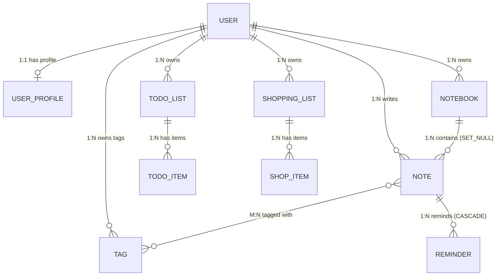
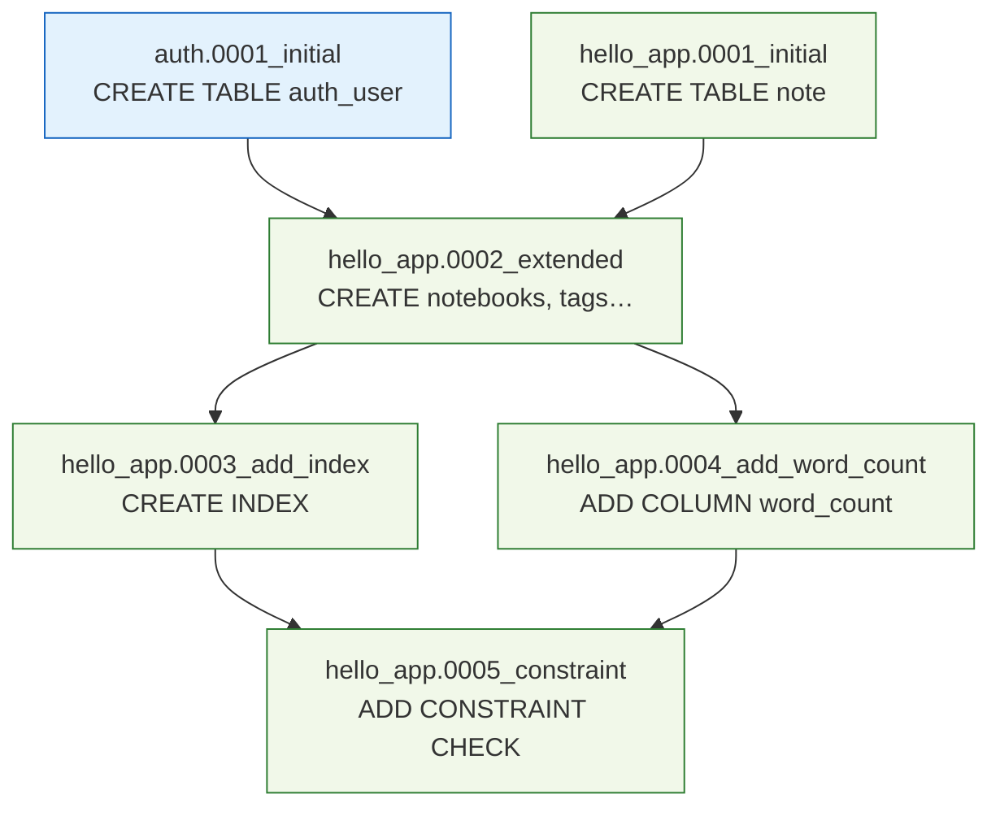
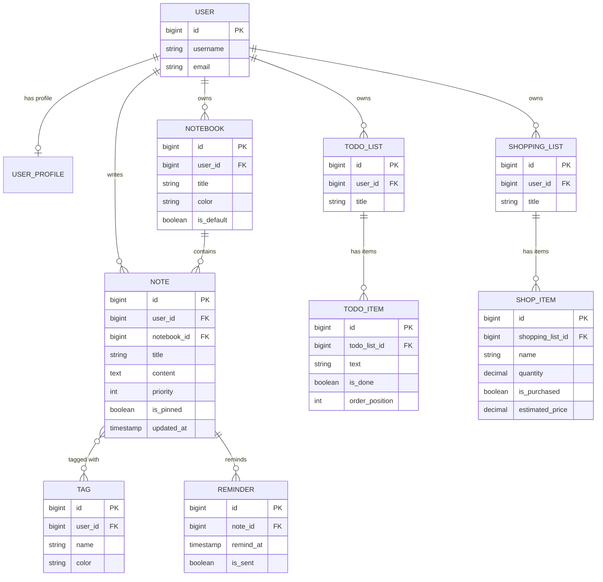
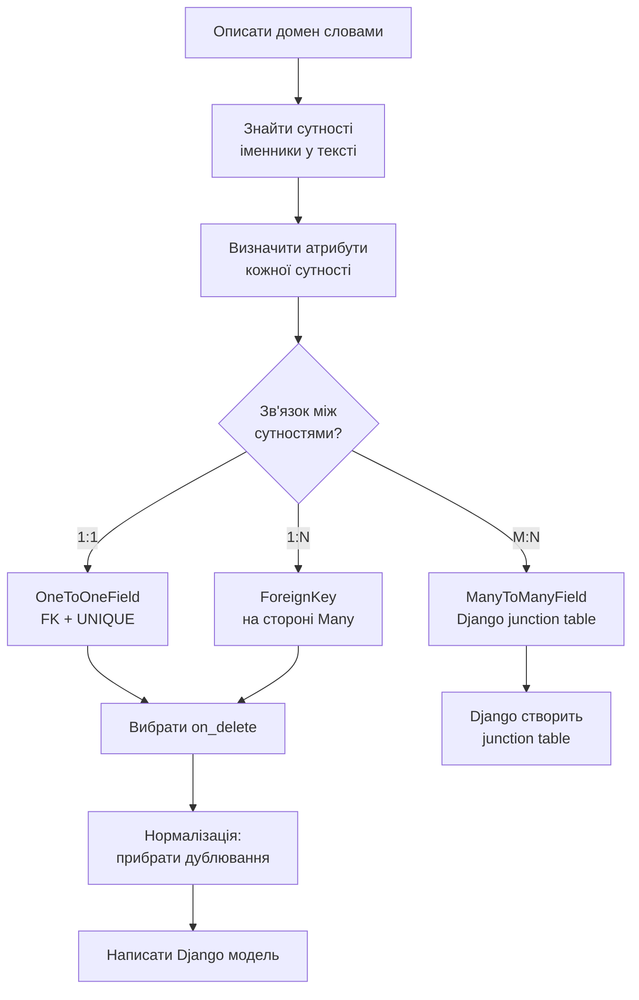
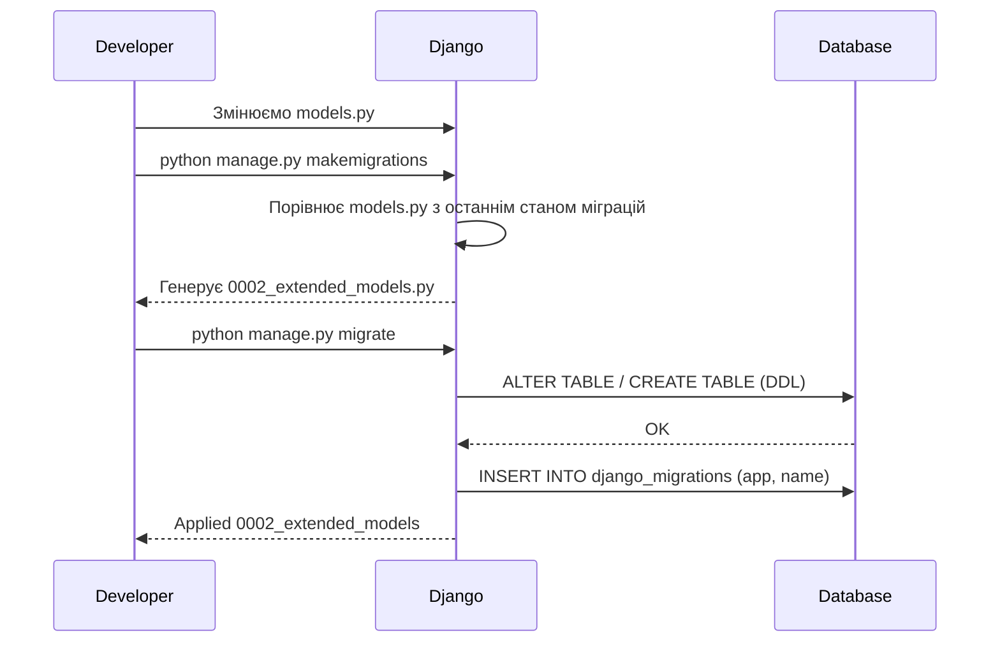

# Notes Project — від проектування моделей до PostgreSQL

> Цей туторіал проводить тебе через **повний цикл**:
> придумати структуру даних → намалювати схему → написати моделі → міграції → запити → selectors/services → шаблони → перехід з SQLite на PostgreSQL.
>
> Проект — **персональний менеджер записів**: нотатки, нагадування, записники, списки справ, списки покупок.
> Спеціально вибрані різні типи даних щоб показати всі типи зв'язків між таблицями.

---

## Зміст

**Архітектурний фундамент** _(читати перед кодом)_
- [01 · DOMAIN → SCHEMA — метод проектування](#01--domain--schema)
- [02 · RELATIONSHIP TYPES — де живе FK](#02--relationship-types)
- [03 · APPLICATION LAYERS — архітектура шарів](#03--application-layers)
- [04 · NORMALIZATION — одна правда для одного факту](#04--normalization)
- [05 · MIGRATIONS — Git для схеми БД](#05--migrations)

🔬 **[orm_laboratory.ipynb](hello_app/orm_laboratory.ipynb)** — інтерактивна лабораторія: виконуй кожну клітинку і дивись SQL

**Покрокова реалізація**
1. [Крок 0 — Від домену до схеми (правильний початок)](#крок-0--від-домену-до-схеми)
2. [Крок 1 — Проектуємо домен: що ми будуємо](#крок-1--проектуємо-домен)
3. [Крок 2 — Ідентифікуємо сутності та зв'язки](#крок-2--сутності-та-звязки)
4. [Крок 3 — ER-діаграми (схеми таблиць)](#крок-3--er-діаграми)
5. [Крок 4 — Пишемо Django моделі](#крок-4--django-моделі)
6. [Крок 5 — Міграції: схема → база даних](#крок-5--міграції)
7. [Крок 6 — Перший запуск з SQLite](#крок-6--sqlite-запуск)
8. [Крок 7 — Архітектура: Services & Selectors](#крок-7--архітектура-services--selectors)
9. [Крок 8 — Views та шаблони](#крок-8--views-та-шаблони)
10. [Крок 9 — QuerySet API: основні запити](#крок-9--querysets)
11. [Крок 10 — Перехід з SQLite на PostgreSQL](#крок-10--postgresql)
12. [Структура файлів проекту](#структура-файлів)

---

## 01 · DOMAIN → SCHEMA

> **"Design before code."**  
> Помилка №1 — починати з `class Note(models.Model)` і додавати поля «на ходу».  
> Через місяць — рефактор схеми = міграція яку важко відкотити в проді.  
> **30 хвилин на проектування = тижні зекономленого часу.**

Архітектурна дошка описує **7 кроків** від бізнес-слів до робочої бази:

| # | Крок | Що робиш | Приклад |
|---|------|----------|---------|
| **1** | **ДОМЕН** | Описати словами що будуєш | «Користувач має записники. Записники містять нотатки. Нотатки мають теги і нагадування.» |
| **2** | **СУТНОСТІ** | Знайди іменники у тексті | `User`, `Notebook`, `Note`, `Tag`, `Reminder`, `TodoList`, `ShoppingList` |
| **3** | **АТРИБУТИ** | Що ми знаємо про кожну сутність? | `Note` → `title`, `content`, `priority`, `is_pinned`, `updated_at`… |
| **4** | **ЗВ'ЯЗКИ** | Як сутності пов'язані? | `1:1` User↔Profile · `1:N` Notebook→Notes · `M:N` Note↔Tag |
| **5** | **НОРМАЛІЗАЦІЯ** | Прибери дублювання | `author_name` у Note? — Ні, лише FK на User |
| **6** | **on_delete** | Що при видаленні батька? | CASCADE / SET_NULL / PROTECT / RESTRICT |
| **7** | **DJANGO МОДЕЛЬ** | _Тільки тепер_ пишемо `models.py` | ← Помилка №1: починати звідси |

> ⚠️ **Anti-pattern.** Почати з `class Note(models.Model)` і додавати поля «на ходу».  
> ER-діаграма — це **контракт** між тобою і базою. Порушиш його в коді — заплатиш міграцією.

### Повна схема: 11 таблиць Notes Platform

```
schema_v1 · 11 tables · 1 junction table · postgres-ready
─────────────────────────────────────────────────────────

USER (auth_user)                    USER_PROFILE  ←── 1:1 OneToOne
┌──────────────┬─────────────┐      ┌────────────────┬──────────────────┐
│ id           │ bigint PK   │──┐   │ id             │ bigint PK        │
│ username     │ varchar(150)│  └──►│ user_id        │ bigint UNIQUE FK │
│ email        │ varchar(254)│      │ display_name   │ varchar(60)      │
│ password     │ varchar(128)│      │ timezone       │ varchar(40)      │
│ date_joined  │ timestamp   │      │ avatar_url     │ text             │
└──────────────┴─────────────┘      └────────────────┴──────────────────┘
       │ owns 1:N              │ writes 1:N          │ owns tags 1:N
       ▼                       ▼                     ▼
NOTEBOOK                      NOTE (центральна)     TAG
┌─────────────┬──────────┐    ┌───────────────┬──────────────────┐    ┌──────────┬───────────────────┐
│ id          │ bigint PK│    │ id            │ bigint PK        │    │ id       │ bigint PK         │
│ user_id     │ bigint FK│    │ user_id       │ bigint FK        │    │ user_id  │ bigint FK         │
│ title       │ varchar  │    │ notebook_id   │ bigint NULL FK   │    │ name     │ varchar(50)       │
│ color       │ varchar  │    │ title         │ varchar(200)     │    │ color    │ varchar(7)        │
│ is_default  │ boolean  │    │ content       │ text             │    └──────────┴───────────────────┘
└─────────────┴──────────┘    │ priority      │ smallint         │     unique_together(user_id, name)
       │ contains 1:N         │ is_pinned     │ boolean          │
       └─────────────────────►│ is_archived   │ boolean          │◄──── M:N через NOTE_TAGS
                              │ created_at    │ timestamp        │
                              │ updated_at    │ timestamp        │
                              │ views_count   │ integer          │
                              └───────────────┴──────────────────┘
                                     │ reminds 1:N
                                     ▼
                              REMINDER                         NOTE_TAGS (junction)
                              ┌───────────┬──────────────┐     ┌──────────┬────────────┐
                              │ id        │ bigint PK    │     │ note_id  │ bigint FK  │
                              │ note_id   │ bigint FK    │     │ tag_id   │ bigint FK  │
                              │ remind_at │ timestamp    │     └──────────┴────────────┘
                              │ is_sent   │ boolean      │     UNIQUE(note_id, tag_id)
                              │ repeat    │ varchar(20)  │     Django створює авто
                              └───────────┴──────────────┘

TODO_LIST                     TODO_ITEM
┌─────────────┬──────────┐    ┌────────────────┬──────────────┐
│ id          │ bigint PK│    │ id             │ bigint PK    │
│ user_id     │ bigint FK│───►│ todo_list_id   │ bigint FK    │
│ title       │ varchar  │    │ text           │ varchar(500) │
│ is_completed│ boolean  │    │ is_done        │ boolean      │
└─────────────┴──────────┘    │ order_position │ integer      │
                              │ due_date       │ date NULL    │
                              └────────────────┴──────────────┘

SHOPPING_LIST                 SHOP_ITEM
┌─────────────┬──────────┐    ┌──────────────────┬──────────────────┐
│ id          │ bigint PK│    │ id               │ bigint PK        │
│ user_id     │ bigint FK│───►│ shopping_list_id │ bigint FK        │
│ title       │ varchar  │    │ name             │ varchar(120)     │
│ store_name  │ varchar  │    │ quantity         │ decimal(8,2)     │
└─────────────┴──────────┘    │ unit             │ varchar(20)      │
                              │ is_purchased     │ boolean          │
                              │ estimated_price  │ decimal(10,2)    │
                              └──────────────────┴──────────────────┘
                              ⚠️ DecimalField для грошей — не FloatField!
```



---

## 02 · RELATIONSHIP TYPES

Три типи зв'язків між таблицями. Питання «де живе FK?» — це не технічне, це **архітектурне**.

### 1:1 — OneToOneField

> **FK + UNIQUE** · "user has exactly one profile"

```
USER                          USER_PROFILE
┌──────────────┬──────────┐   ┌────────────────┬──────────────────┐
│ id  bigint PK│          │──►│ id    bigint PK│                  │
│ username     │          │   │ user_id bigint │ UNIQUE FK        │
└──────────────┴──────────┘   │ display varchar│                  │
                              │ timezone       │                  │
                              └────────────────┴──────────────────┘
```

```python
class UserProfile(models.Model):
    user = models.OneToOneField(
        User, on_delete=CASCADE,
        related_name='profile',
    )
```

> **Чому це 1:1?** Звичайний `FK` + `UNIQUE` на колонці.  
> Реверс — **атрибут** (не QuerySet): `user.profile`.  
> Корисно для **вертикального партиціонування**: 5 базових полів у User, 20 опціональних у Profile — не забруднюємо головну таблицю.

---

### 1:N — ForeignKey

> **FK на "Many" стороні** · "notebook has many notes"

```
NOTEBOOK                    NOTE              NOTE              NOTE
┌──────────┬──────────┐     ┌───────────────────────┐
│ id       │ bigint PK│──┬─►│ id          bigint PK │
│ title    │ varchar  │  │  │ notebook_id bigint FK │← FK тут!
└──────────┴──────────┘  ├─►│ title       varchar   │
                         │  └───────────────────────┘
                         ├─► (ще одна нотатка)
                         └─► (ще одна нотатка)
```

```python
class Note(models.Model):
    notebook = models.ForeignKey(
        Notebook, on_delete=SET_NULL,
        null=True, related_name='notes',
    )
```

> **Де живе FK?** Завжди на **Many**-стороні.  
> `Notebook` **не зберігає** список нотаток — `Note` зберігає `notebook_id`.  
> Це фізика SQL: один стовпець = одне значення.

---

### M:N — ManyToManyField

> **Через junction table** · Django створює автоматично

```
NOTE                  NOTE_TAGS (junction)    TAG
┌──────────┬──────┐   ┌──────────┬──────────┐  ┌──────────┬──────────┐
│ id       │  PK  │──►│ note_id  │ bigint FK│  │ id       │  PK      │
│ title    │      │   │ tag_id   │ bigint FK│─►│ name     │ varchar  │
└──────────┴──────┘   └──────────┴──────────┘  └──────────┴──────────┘
                       UNIQUE(note_id, tag_id)
                       Django: hello_app_note_tags
```

```python
class Note(models.Model):
    tags = models.ManyToManyField(Tag, blank=True)

# Django САМ створює: hello_app_note_tags(note_id, tag_id)
note.tags.add(tag_py, tag_dj)   # INSERT × 2 у junction
tag_py.notes.all()              # reverse → SELECT JOIN
```

> **Junction = окрема таблиця.** Тут немає чарів — це звичайна таблиця з двома FK.  
> Хочеш додати `added_at` або `role` до зв'язку? Передай `through=` і опиши свою junction модель.

---

### on_delete — що відбувається при видаленні батька?

> ⚠️ **Помилка:** дефолт CASCADE для всього → одне видалення користувача може стерти сотні рядків.  
> Завжди **свідомо** вибирай стратегію. Це бізнес-рішення, не технічне.

| Стратегія | Що робить | Коли вибирати |
|-----------|-----------|---------------|
| `CASCADE` | Видалити дочірні автоматично | `Reminder → Note`: нагадування без нотатки не має сенсу |
| `SET_NULL` | FK → NULL, дочірні живуть далі | `Note → Notebook`: нотатка існує без записника. Поле має бути `null=True` |
| `SET_DEFAULT` | FK → значення `default` | `Note → Notebook`: перенести в «Default» записник |
| `PROTECT` | `ProtectedError`, видалення заборонене | `Tag`: не дозволити видаляти тег поки він використовується |
| `RESTRICT` | Заборонити, але дозволити каскад з вищого рівня | Складні домени з кількома рівнями власності |
| `DO_NOTHING` | БД сама вирішує (часто = orphan) | Майже ніколи. Тільки якщо керуєш consistency вручну (triggers) |

---

## 03 · APPLICATION LAYERS

> **Thin Views · Selectors Read · Services Write**  
> Кожен шар має **одну відповідальність**. Порушення цього правила — головна причина "fat view" антипатерну.

### Архітектура шарів

```
HTTP REQUEST
     │
     ▼
┌─────────────────────────────────────────┐
│  views.py                               │
│  ✓ парсить request                      │
│  ✓ кличе selector / service             │
│  ✓ render / redirect                    │
│  ✗ жодних QuerySet                      │
└────────────┬───────────────┬────────────┘
             │ READ →        │ WRITE →
             ▼               ▼
┌────────────────────┐  ┌──────────────────────────────┐
│  selectors.py      │  │  services.py                 │
│  SELECT тільки     │  │  CREATE / UPDATE / DELETE    │
│                    │  │                              │
│  get_user_notes()  │  │  create_note()               │
│  get_note_detail() │  │  update_note()               │
│  get_notebooks()   │  │  toggle_todo_item()          │
│  get_reminders()   │  │  mark_reminder_sent()        │
│                    │  │                              │
│  select_related,   │  │  transaction.atomic,         │
│  prefetch_related, │  │  F(), select_for_update      │
│  annotate — тут    │  │  — тут                       │
└────────┬───────────┘  └───────────┬──────────────────┘
         │ SELECT                   │ INSERT/UPDATE/DELETE
         └──────────┬───────────────┘
                    ▼
             ┌─────────────┐
             │  PostgreSQL │
             │  Database   │
             └─────────────┘
```

> **Чому розділяти?** Один і той самий запит потрібен у View, Celery task, API endpoint, тесті.  
> Без `selectors.py` — копіюєш QuerySet у 10 місцях. Зміниш логіку → 10 місць оновлювати.  
> З `selectors.py` → **одна функція**, всі використовують.

---

### Матриця відповідальності

| Шар | ✓ Робить | ✗ Не робить |
|-----|---------|------------|
| `models.py` | Структура · поля · зв'язки · constraints · indexes | Бізнес-логіка, HTTP |
| `selectors.py` | SELECT QuerySets · annotate · prefetch · фільтри | INSERT / UPDATE / DELETE |
| `services.py` | CREATE / UPDATE / DELETE · transaction · F() · locks | HTTP, render, redirect |
| `views.py` | Парсити request · викликати selector/service · render | QuerySet, бізнес-логіка |
| `forms.py` | Валідація вводу з HTTP · `clean_*` | БД запити (крім queryset для choices) |
| `templates/` | HTML розмітка · context з View | Будь-яка логіка |

> **Перевір себе:** якщо в `views.py` бачиш `Note.objects.filter(...)` — це сигнал перенести у `selectors.py`.  
> Якщо в шаблоні бачиш умову перевірки прав доступу — це теж порушення.

---

### READ flow — трасування GET /notes/?q=python

```
01 │ Browser      │ GET /notes/?q=python
02 │ urls.py      │ match → views.note_list
03 │ views.py     │ search = request.GET['q']
04 │ views.py     │ selectors.get_user_notes(user, search='python')
05 │ selectors.py │ QuerySet.filter().select_related('notebook').prefetch_related('tags')
06 │ ORM          │ SQLCompiler → 2 SQL (note + tags prefetch)
07 │ PostgreSQL   │ виконує план, повертає rows
08 │ ORM          │ ModelIterable → list[Note] з заповненим _result_cache
09 │ views.py     │ render('note_list.html', {notes, tags, notebooks})
10 │ Browser      │ 200 OK · HTML
```

> **View залишається тонкою:** 3 рядки коду (parse + delegate + render).  
> Уся складність — у `selectors.get_user_notes`: фільтри, JOIN-и, кеш prefetch.

---

### WRITE flow — трасування POST /notes/create/

```
01 │ Browser      │ POST /notes/create/ form=...
02 │ views.py     │ form = NoteForm(POST, user=request.user) · is_valid?
03 │ views.py     │ services.create_note(user, title, tag_ids)
04 │ services.py  │ with transaction.atomic():
05 │ services.py  │ Note.objects.create(...) → BEGIN, INSERT note
06 │ services.py  │ Tag.objects.filter(user=user, id__in=...) · перевірка ownership
07 │ services.py  │ note.tags.set(valid) → INSERT × N у junction
08 │ PostgreSQL   │ COMMIT · on_commit callbacks
09 │ views.py     │ messages.success(...)  ·  return redirect('note_detail', pk)
10 │ Browser      │ 302 → GET /notes/42/  (PRG pattern: F5 безпечний)
```

> **PRG (Post / Redirect / Get).** POST не рендерить — він робить redirect.  
> F5 повторює GET — безпечно. Без PRG: F5 = дубль запису.

> **Ownership через FK traversal.** `Tag.objects.filter(user=user, id__in=...)` —  
> не дай юзеру прикріпити чужі теги до своєї нотатки.

---

## 04 · NORMALIZATION

> **"Одна правда для одного факту."**  
> Нормалізація — це процес виявлення і усунення дублювання з реляційної схеми.  
> Мета: кожен факт зберігається **рівно в одному місці**.

### Before / After — 3NF на прикладі

**❌ ДО (1NF) — все в одній таблиці `employees`:**

| id | name  | dept_id | dept_name   | location | salary |
|----|-------|---------|-------------|----------|--------|
| 1  | Alice | 10      | **Engineering** | **Kyiv** | 50000  |
| 2  | Bob   | 10      | **Engineering** | **Kyiv** | 45000  |
| 3  | Carol | 20      | **Design**      | **Lviv** | 48000  |
| 4  | Dan   | 10      | **Engineering** | **Kyiv** | 52000  |
| 5  | Eva   | 20      | **Design**      | **Lviv** | 49000  |

**Проблема:** "Engineering / Kyiv" повторюється 3 рази.  
Переїхали в Харків? `UPDATE` 1000 рядків. Помилився в назві? Inconsistency.

---  →  3NF: **винести в окрему таблицю**  ---

**✅ ПІСЛЯ — `employees` (FK → `departments.id`):**

| id | name  | dept_id | salary |
|----|-------|---------|--------|
| 1  | Alice | **10**  | 50000  |
| 2  | Bob   | **10**  | 45000  |
| 3  | Carol | **20**  | 48000  |
| 4  | Dan   | **10**  | 52000  |
| 5  | Eva   | **20**  | 49000  |

**✅ `departments` — одна правда:**

| id | name        | location |
|----|-------------|----------|
| 10 | Engineering | Kyiv     |
| 20 | Design      | Lviv     |

```python
# Django модель після нормалізації:
class Department(models.Model):
    name     = models.CharField(max_length=80)
    location = models.CharField(max_length=80)

class Employee(models.Model):
    name       = models.CharField(max_length=80)
    department = models.ForeignKey(Department, on_delete=models.PROTECT)
    salary     = models.DecimalField(max_digits=10, decimal_places=2)
```

> **Переїзд тепер:** `UPDATE departments SET location='Kharkiv' WHERE id=10;`  
> **1 рядок замість 1000.** Неможлива inconsistency.

### Три нормальні форми — шпаргалка

| Форма | Правило | Порушення — приклад |
|-------|---------|---------------------|
| **1NF** | Всі значення атомарні, немає масивів у клітинці | `tags = "python,django,orm"` у одному стовпці |
| **2NF** | Всі неключові атрибути залежать від **цілого** PK | В таблиці `(order_id, product_id)` → `product_name` залежить тільки від `product_id` |
| **3NF** | Немає **транзитивних** залежностей (A→B→C де B не ключ) | `employee.dept_name` залежить від `dept_id`, а не від `employee.id` |

> **Практичне правило:** якщо при зміні одного факту треба `UPDATE` > 1 рядка — схема не нормалізована.

---

## 05 · MIGRATIONS

> **"Git для схеми бази даних."**  
> Кожна міграція — коміт що описує зміни схеми. Django відстежує які вже виконані у `django_migrations`.

### Migration Lifecycle — від зміни моделі до ALTER TABLE

```
┌─────────────┐    ┌─────────────────────────────────┐    ┌──────────────────┐
│  Developer  │    │         Django ORM              │    │   PostgreSQL     │
└──────┬──────┘    └──────────────┬──────────────────┘    └────────┬─────────┘
       │                         │                                  │
  1. Зміни в models.py           │                                  │
       │                         │                                  │
  2. $ makemigrations ──────────►│                                  │
       │              Порівнює   │                                  │
       │              models.py  │                                  │
       │              з останнім │                                  │
       │◄─────────────────────── │                                  │
  3. Отримує 0003_add_field.py   │                                  │
       │                         │                                  │
  4. $ sqlmigrate (перевірка)    │                                  │
       │                         │                                  │
  5. $ migrate ─────────────────►│                                  │
       │                         │  ALTER TABLE notes_note ────────►│
       │                         │  ADD COLUMN word_count integer;  │
       │                         │◄──────────────────────────────── │
       │                         │  INSERT INTO django_migrations   │
       │◄─────────────────────── │  (app, name, applied)            │
  6. ✓ Applied 0003_add_field    │                                  │
```

### Migration Dependency Graph (DAG)



> **`django_migrations`** — спеціальна таблиця-журнал. `migrate` застосовує тільки ті вузли,  
> яких там ще немає, у **топологічному порядку** залежностей.

### Ключові команди

```bash
# Генерувати міграцію з описовою назвою
python manage.py makemigrations --name add_word_count_to_note

# Переглянути SQL до виконання (завжди робити перед migrate!)
python manage.py sqlmigrate hello_app 0003

# Застосувати всі нові міграції
python manage.py migrate

# Показати стан усіх міграцій (✓ виконано, □ ще ні)
python manage.py showmigrations

# Відкотити до конкретної міграції
python manage.py migrate hello_app 0002
```

### Правила міграцій

| Правило | Чому |
|---------|------|
| ✅ Нове поле: завжди `default=` або `null=True` | Без дефолту — що записати в існуючі рядки? |
| ✅ Описова назва `--name add_word_count` | `0003_add_word_count` читабельніше за `0003_note` |
| ✅ Комітити міграції в git | Інакше колеги не зможуть оновити свою БД |
| ✅ `sqlmigrate` перед `migrate` | Перевіряєш SQL що буде виконано |
| ❌ Редагувати виконану міграцію | Production і dev розсинхронізуються — катастрофа |
| ❌ Видаляти міграції з git | Руйнує граф залежностей |

---

## Крок 0 — Від домену до схеми

---
> **🧠 Ментальна модель:** Проектування бази даних — це не "яку таблицю додати". Це **моделювання реального світу**. Спочатку думаєш мовою бізнесу: "користувач може мати записники, кожен записник містить нотатки, нотатки можуть мати теги". Потім переводиш це в структури даних. Django моделі — це останній крок, а не перший.
>
> **📚 Де починаються помилки:** Більшість проблем зі схемою БД виникають тому що розробник одразу пише код, не думаючи про зв'язки. Через місяць виявляється що потрібен новий зв'язок — а додати його без масивної міграції неможливо. **30 хвилин на проектування = тижні зекономленого часу**.
>
> **❌ Типова помилка:** Починати з написання моделі. Правильний порядок: **домен → сутності → атрибути → зв'язки → нормалізація → Django модель**.
---

### Процес проектування (правильний порядок):

```
1. ДОМЕН — описати словами що будуємо
   "Користувач має записники. Записники містять нотатки.
    Нотатки можуть бути в списках справ. Є нагадування з датою."

2. СУТНОСТІ — знайти "іменники" в описі домену
   Користувач, Записник, Нотатка, Список справ, Пункт списку,
   Нагадування, Список покупок, Товар, Тег

3. АТРИБУТИ — для кожної сутності: що ми знаємо про неї?
   Нотатка: title, content, created_at, is_pinned, priority

4. ЗВ'ЯЗКИ — як сутності пов'язані одна з одною?
   Нотатка → Записник: багато нотаток в одному записнику (FK)
   Нотатка ↔ Тег: одна нотатка, багато тегів; один тег, багато нотаток (M:N)

5. НОРМАЛІЗАЦІЯ — перевірити: чи є дублювання?
   Якщо в Нотатці є поле author_name — це дублювання з User. Замінити на FK.

6. ВИБІР on_delete — що відбувається при видаленні батьківського запису?
   Видалення Записника → видалити всі нотатки (CASCADE)?
   Або перенести їх в "Загальний записник" (SET_DEFAULT)?

7. DJANGO МОДЕЛЬ — тільки після всього вище
```

---

## Крок 1 — Проектуємо домен

Ми будуємо **персональний менеджер записів** — як Notion або Evernote, але спрощений.

### Що повинен вміти наш продукт:

| Функція | Опис |
|---------|------|
| 📓 Записники | Колекції нотаток (як папки). Кожна нотатка в одному записнику |
| 📝 Нотатки | Текстові записи з заголовком, вмістом, тегами, пріоритетом |
| 🏷️ Теги | Мітки для нотаток. Одна нотатка = багато тегів. Один тег = багато нотаток |
| ✅ Списки справ | To-do list. Кожен список має пункти з галочкою |
| 🛒 Списки покупок | Список товарів з кількістю та чи куплено |
| ⏰ Нагадування | Повідомлення прив'язані до нотатки або дати |
| 📌 Пінінг | Нотатки можна закріпити зверху |

---

## Крок 2 — Сутності та зв'язки

### Аналіз зв'язків по типах:

```
ONE-TO-ONE (1:1) — "один має рівно одного":
  User ←→ UserProfile
  (кожен користувач має один профіль, один профіль у одного користувача)

ONE-TO-MANY (1:N) — "один має багато":
  User → Notebook          (один користувач, багато записників)
  Notebook → Note          (один записник, багато нотаток)
  User → Note              (нотатка має автора)
  User → TodoList          (один користувач, багато списків справ)
  TodoList → TodoItem      (один список, багато пунктів)
  User → ShoppingList      (один користувач, багато списків покупок)
  ShoppingList → ShopItem  (один список, багато товарів)
  Note → Reminder          (одна нотатка може мати кілька нагадувань)

MANY-TO-MANY (M:N) — "багато пов'язані з багатьма":
  Note ↔ Tag  (нотатка має теги, тег є у багатьох нотатках)
```

### Де живе FK — правило "Many side":

```
Notebook → Note (1:N):

  notebooks:                   notes:
  ┌────┬──────────┐            ┌────┬─────────────┬─────────────┐
  │ id │ title    │            │ id │ title        │ notebook_id │  ← FK тут
  ├────┼──────────┤            ├────┼─────────────┼─────────────┤
  │  1 │ Робота   │◄───────────│  1 │ Django ORM   │      1      │
  │  2 │ Особисте │◄───────────│  2 │ Python tips  │      1      │
  │    │          │◄───────────│  3 │ Рецепт борщу │      2      │
  └────┴──────────┘            └────┴─────────────┴─────────────┘

Notebook НЕ зберігає список нотаток.
Note зберігає ПОСИЛАННЯ на свій записник (notebook_id=1).
```

---

## Крок 3 — ER-діаграми

### Головна ER-діаграма



### Flowchart: процес проектування моделей



---

## Крок 4 — Django Моделі

Детальний код моделей у `hello_app/models.py`. Ось ключові принципи:

```python
# Короткий огляд всіх моделей і їх зв'язків

class UserProfile(models.Model):
    user = models.OneToOneField(User, on_delete=CASCADE, related_name='profile')
    # OneToOne = FK + UNIQUE. Кожен User → максимум один Profile.


class Tag(models.Model):
    user = models.ForeignKey(User, on_delete=CASCADE)
    name = models.CharField(max_length=50)
    # Теги прив'язані до конкретного user (privacy!)
    class Meta:
        unique_together = [('user', 'name')]  # Alice і Bob можуть мати однаковий тег


class Notebook(models.Model):
    user = models.ForeignKey(User, on_delete=CASCADE, related_name='notebooks')
    title = models.CharField(max_length=100)
    is_default = models.BooleanField(default=False)


class Note(models.Model):
    user = models.ForeignKey(User, on_delete=CASCADE, related_name='notes')
    notebook = models.ForeignKey(Notebook, on_delete=SET_NULL, null=True, blank=True)
    tags = models.ManyToManyField(Tag, blank=True)
    # Три типи зв'язків в одній моделі:
    # user: FK (обов'язковий, CASCADE)
    # notebook: FK (необов'язковий, SET_NULL — нотатка може існувати без записника)
    # tags: M:N (Django автоматично створює junction table)
    priority = models.PositiveSmallIntegerField(default=1)
    is_pinned = models.BooleanField(default=False)
    is_archived = models.BooleanField(default=False)


class Reminder(models.Model):
    note = models.ForeignKey(Note, on_delete=CASCADE, related_name='reminders')
    remind_at = models.DateTimeField()
    is_sent = models.BooleanField(default=False)


class TodoList(models.Model):
    user = models.ForeignKey(User, on_delete=CASCADE, related_name='todo_lists')

class TodoItem(models.Model):
    todo_list = models.ForeignKey(TodoList, on_delete=CASCADE, related_name='items')
    text = models.CharField(max_length=500)
    is_done = models.BooleanField(default=False)
    order_position = models.PositiveIntegerField(default=0)


class ShoppingList(models.Model):
    user = models.ForeignKey(User, on_delete=CASCADE, related_name='shopping_lists')

class ShopItem(models.Model):
    shopping_list = models.ForeignKey(ShoppingList, on_delete=CASCADE, related_name='items')
    quantity = models.DecimalField(max_digits=8, decimal_places=2, default=1)
    # DecimalField для грошей і кількості! FloatField → 0.1+0.2 = 0.30000000000000004
    estimated_price = models.DecimalField(max_digits=10, decimal_places=2, null=True)
```

---

## Крок 5 — Міграції

---
> **🧠 Ментальна модель:** Міграції — це **Git для схеми бази даних**. Кожна міграція — це "коміт" що описує зміни схеми. Django відстежує які міграції вже виконані в таблиці `django_migrations`. `migrate` виконує тільки нові.
>
> **❌ Типова помилка:** Редагувати вже застосовану міграцію. Якщо міграція вже застосована на production і ти її редагуєш — production і development розсинхронізуються. Зміна застосованої міграції = катастрофа. Якщо потрібна зміна → **нова** міграція.
---

### Workflow міграцій — покроково:



```bash
# Кроки для нашого проекту:

# 1. Переходимо до папки проекту
cd module_5/lesson_Django_ORM_Database/notes_project

# 2. Перевіряємо що hello_app в INSTALLED_APPS
# settings.py → INSTALLED_APPS має містити 'hello_app'

# 3. Генеруємо першу міграцію
python manage.py makemigrations
# Очікуваний вивід:
# Migrations for 'hello_app':
#   hello_app/migrations/0001_initial.py
#     - Create model UserProfile, Tag, Notebook, Note, Reminder,
#       TodoList, TodoItem, ShoppingList, ShopItem

# 4. Переглядаємо SQL що буде виконано (без виконання)
python manage.py sqlmigrate hello_app 0001
# Корисно: перевірити типи стовпців, FK, індекси

# 5. Виконуємо міграцію
python manage.py migrate

# 6. Показати стан всіх міграцій
python manage.py showmigrations
```

### Коли потрібна нова міграція (додаємо поле):

```python
# Додаємо нове поле до Note
class Note(models.Model):
    ...
    word_count = models.PositiveIntegerField(default=0)  # НОВЕ ПОЛЕ
```

```bash
python manage.py makemigrations --name add_word_count_to_note
# → hello_app/migrations/0003_add_word_count_to_note.py

python manage.py sqlmigrate hello_app 0003
# ALTER TABLE "hello_app_note" ADD COLUMN "word_count" integer NOT NULL DEFAULT 0;

python manage.py migrate
```

| Правило | Чому |
|---------|------|
| Нове поле: завжди `default=` або `null=True` | Без дефолту — що записати в існуючі рядки? |
| Ніколи не редагувати виконану міграцію | Production і dev розсинхронізуються |
| Описова назва (`add_word_count`) | `0003_add_word_count` > `0003_note` |
| Комітити міграції в git | Інакше колеги не зможуть оновити свою БД |

---

## Крок 6 — SQLite запуск

SQLite — ідеальний для розробки. Нічого не встановлювати.

```bash
# Ініціалізуємо БД (SQLite за замовчуванням)
python manage.py migrate

# Створюємо суперюзера для адмінки
python manage.py createsuperuser

# Запускаємо сервер
python manage.py runserver
# http://127.0.0.1:8000/
# http://127.0.0.1:8000/admin/
# http://127.0.0.1:8000/notes/
```

### Тестуємо моделі через Django shell:

```bash
python manage.py shell
```

```python
from django.contrib.auth.models import User
from hello_app.models import *

# Створюємо користувача
user = User.objects.create_user('alice', 'alice@test.com', 'pass123')

# Профіль (OneToOne)
profile = UserProfile.objects.create(user=user, display_name='Alice')
print(user.profile.display_name)  # через related_name

# Записник
notebook = Notebook.objects.create(user=user, title='Робота', is_default=True)

# Теги
tag_py = Tag.objects.create(user=user, name='python', color='#3776AB')
tag_dj = Tag.objects.create(user=user, name='django', color='#092E20')

# Нотатка з тегами
note = Note.objects.create(
    user=user, notebook=notebook,
    title='Django ORM', content='QuerySet — лінива оцінка...',
    priority=Note.PRIORITY_HIGH, is_pinned=True
)
note.tags.add(tag_py, tag_dj)  # M:N — INSERT у junction table

# Список справ
todo = TodoList.objects.create(user=user, title='Вивчити ORM')
TodoItem.objects.bulk_create([
    TodoItem(todo_list=todo, text='RELATIONAL_DB_FOUNDATIONS.md', order_position=1),
    TodoItem(todo_list=todo, text='DJANGO_ORM_DEEP.md', order_position=2),
    TodoItem(todo_list=todo, text='Зробити проект', order_position=3),
])

# Список покупок
shopping = ShoppingList.objects.create(user=user, title='В магазин')
ShopItem.objects.create(
    shopping_list=shopping, name='Молоко',
    quantity=2, unit=ShopItem.UNIT_LITER, estimated_price=45.00
)

print(f"Нотаток: {user.notes.count()}")
print(f"Теги: {[t.name for t in note.tags.all()]}")
```

---

## Крок 7 — Архітектура: Services & Selectors

> **Детальна документація (читати окремо):**
> - [DJANGO_SERVICES_SELECTORS.md](../DJANGO_SERVICES_SELECTORS.md) — повна архітектура: View→Service→Selector→ORM, data flow, антипатерни, таблиця відповідальностей
> - [DJANGO_SELECTORS.md](../DJANGO_SELECTORS.md) — глибоко про Selector: CQRS-light, naming convention, QuerySet vs evaluated list, централізація N+1
> - [DJANGO_SERVICES.md](../DJANGO_SERVICES.md) — глибоко про Service: stateless функції, `@transaction.atomic`, `on_commit()`, Celery як transport layer

---
> **🧠 Ментальна модель:** View — це **контролер трафіку**, не виконавець. Він приймає HTTP-запит, делегує роботу і повертає відповідь. Якщо View сам виконує всі запити до БД — це "fat view" і через місяць код стає нечитабельним. Selector = читання. Service = запис/зміна.
>
> **📚 Чому Services/Selectors:** Один і той самий запит до БД потрібен у View, в Celery task, в API, в тесті. Без Selector — копіюєш QuerySet у 10 місцях. Зміниш бізнес-логіку → 10 місць оновлювати. З Selector → 1 функція.
>
> **🌐 Архітектурний поділ:**
> - `selectors.py` — ТІЛЬКИ читання (SELECT). Немає INSERT/UPDATE/DELETE.
> - `services.py` — ТІЛЬКИ запис (CREATE/UPDATE/DELETE). Немає прямих SELECT в View.
> - `views.py` — ТІЛЬКИ HTTP логіка. Викликає selectors і services.
>
> **❌ Типова помилка:** `Note.objects.filter(user=user)` прямо у View — це порушення. Всі QuerySets → у selectors.
---

### Файл `hello_app/selectors.py`:

```python
# hello_app/selectors.py
"""
Selectors — шар ЧИТАННЯ даних.
Тут живуть всі SELECT запити.
View, Tasks, API — всі використовують selectors.
"""
from django.db.models import Count, Q, Prefetch
from django.utils import timezone

from .models import Note, Notebook, Tag, TodoList, TodoItem, ShoppingList, Reminder


def get_user_notes(user, *, archived=False, notebook=None, tag=None, search=None):
    """
    Список нотаток користувача з фільтрами.
    select_related + prefetch_related — вирішує N+1 проблему.
    """
    qs = Note.objects.filter(
        user=user,
        is_archived=archived
    ).select_related(
        'notebook'           # FK → JOIN (1 запит замість N)
    ).prefetch_related(
        'tags'               # M:N → 2-й запит (не N+1)
    )

    if notebook:
        qs = qs.filter(notebook=notebook)

    if tag:
        qs = qs.filter(tags=tag)

    if search:
        qs = qs.filter(
            Q(title__icontains=search) | Q(content__icontains=search)
        )

    return qs.order_by('-is_pinned', '-priority', '-updated_at')


def get_note_detail(user, note_id):
    """
    Деталь нотатки — з усіма зв'язками.
    Raises Note.DoesNotExist якщо не знайдено або не власник.
    """
    return Note.objects.select_related(
        'notebook', 'user'
    ).prefetch_related(
        'tags',
        Prefetch(
            'reminders',
            queryset=Reminder.objects.filter(
                remind_at__gte=timezone.now()
            ).order_by('remind_at')
        )
    ).get(id=note_id, user=user)


def get_user_notebooks(user):
    """Всі записники з кількістю нотаток."""
    return Notebook.objects.filter(user=user).annotate(
        note_count=Count('notes', filter=Q(notes__is_archived=False))
    ).order_by('-is_default', 'title')


def get_user_tags(user):
    """Теги з кількістю нотаток."""
    return Tag.objects.filter(user=user).annotate(
        note_count=Count('notes')
    ).order_by('name')


def get_user_todo_lists(user):
    """Списки справ з прогресом."""
    return TodoList.objects.filter(
        user=user
    ).annotate(
        total_items=Count('items'),
        done_items=Count('items', filter=Q(items__is_done=True))
    ).prefetch_related('items').order_by('is_completed', '-created_at')


def get_pending_reminders():
    """Для Celery worker: нагадування які треба відправити."""
    return Reminder.objects.filter(
        is_sent=False,
        remind_at__lte=timezone.now()
    ).select_related('note__user')
```

### Файл `hello_app/services.py`:

```python
# hello_app/services.py
"""
Services — шар ЗАПИСУ даних.
Тут живе вся бізнес-логіка: CREATE, UPDATE, DELETE.
Services можуть викликати selectors але не навпаки.
"""
from django.db import transaction
from django.db.models import F
from django.utils.text import slugify

from .models import Note, Notebook, Tag, TodoItem, Reminder


def create_note(*, user, title, content='', notebook=None, priority=1, tag_ids=None):
    """
    Створення нотатки з тегами.
    transaction.atomic() — або Note і теги зберігаються разом, або нічого.
    """
    with transaction.atomic():
        note = Note.objects.create(
            user=user,
            title=title,
            content=content,
            notebook=notebook,
            priority=priority,
        )
        if tag_ids:
            # Перевіряємо що теги належать цьому user (безпека!)
            valid_tags = Tag.objects.filter(id__in=tag_ids, user=user)
            note.tags.set(valid_tags)

    return note


def update_note(note, *, title=None, content=None, priority=None,
                notebook=None, is_pinned=None, tag_ids=None):
    """
    Оновлення нотатки — тільки вказані поля.
    update_fields → генерує UPDATE тільки для змінених стовпців.
    """
    changed_fields = []

    if title is not None:
        note.title = title
        changed_fields.append('title')
    if content is not None:
        note.content = content
        changed_fields.append('content')
    if priority is not None:
        note.priority = priority
        changed_fields.append('priority')
    if notebook is not None:
        note.notebook = notebook
        changed_fields.append('notebook')
    if is_pinned is not None:
        note.is_pinned = is_pinned
        changed_fields.append('is_pinned')

    if changed_fields:
        note.save(update_fields=changed_fields)

    if tag_ids is not None:
        valid_tags = Tag.objects.filter(id__in=tag_ids, user=note.user)
        note.tags.set(valid_tags)

    return note


def archive_note(note):
    """Архівування нотатки (не видалення)."""
    Note.objects.filter(pk=note.pk).update(is_archived=True)


def delete_note(note):
    """Видалення нотатки. CASCADE видалить Reminders автоматично."""
    note.delete()


def toggle_todo_item(item_id, *, user):
    """
    Відмітити/зняти відмітку пункту списку.
    select_for_update() — запобігає race condition при одночасних кліках.
    """
    with transaction.atomic():
        item = TodoItem.objects.select_for_update().get(
            id=item_id,
            todo_list__user=user   # перевірка права доступу через FK traversal
        )
        item.is_done = not item.is_done
        item.save(update_fields=['is_done'])
    return item


def mark_reminder_sent(reminder_id):
    """
    Атомарно позначаємо нагадування як відправлене.
    F() + update() — race condition safe.
    """
    Reminder.objects.filter(pk=reminder_id).update(is_sent=True)


def create_tag(*, user, name, color='#808080'):
    """Створення тегу з перевіркою унікальності."""
    tag, created = Tag.objects.get_or_create(
        user=user,
        name=name.lower().strip(),
        defaults={'color': color}
    )
    return tag, created
```

---

## Крок 8 — Views та шаблони

---
> **🧠 Ментальна модель:** View — це **тонкий шар**. Він: (1) парсить HTTP запит, (2) викликає selector або service, (3) рендерить шаблон або повертає redirect. **Жодної бізнес-логіки, жодних QuerySets прямо у View**.
>
> **📚 PRG патерн:** Post/Redirect/Get — стандарт для форм. GET → показати форму. POST → обробити → **redirect** (не render). Чому? Без redirect: користувач натискає F5 → браузер повторює POST → дублікат запису. З redirect → F5 повторює GET → безпечно.
>
> **❌ Типова помилка:** `Note.objects.filter(...)` прямо у View. Це порушення архітектурного поділу. Через 3 місяці той самий запит потрібен у Celery task → копіюєш → дублювання → розсинхронізація.
---

### `hello_app/views.py`:

```python
# hello_app/views.py
from django.shortcuts import render, redirect, get_object_or_404
from django.contrib import messages
from django.contrib.auth.decorators import login_required

from .models import Note
from .forms import NoteForm
from . import selectors, services


@login_required
def note_list(request):
    """
    Список нотаток поточного користувача.
    View тільки: отримує фільтри з GET → викликає selector → рендерить.
    """
    search = request.GET.get('q', '')
    tag_id = request.GET.get('tag')
    notebook_id = request.GET.get('notebook')

    # Selector вирішує ЯКИЙ запит, View вирішує ЯКІ параметри
    notes = selectors.get_user_notes(
        request.user,
        search=search or None,
        tag=tag_id or None,
    )
    notebooks = selectors.get_user_notebooks(request.user)
    tags = selectors.get_user_tags(request.user)

    return render(request, 'hello_app/note_list.html', {
        'notes': notes,
        'notebooks': notebooks,
        'tags': tags,
        'search': search,
        'active_tag': tag_id,
    })


@login_required
def note_detail(request, pk):
    """Деталь нотатки. Selector piднімає Note.DoesNotExist якщо не власник."""
    try:
        note = selectors.get_note_detail(request.user, pk)
    except Note.DoesNotExist:
        from django.http import Http404
        raise Http404("Нотатку не знайдено")

    return render(request, 'hello_app/note_detail.html', {'note': note})


@login_required
def note_create(request):
    """
    PRG: GET → порожня форма. POST → service.create_note() → redirect.
    """
    if request.method == 'POST':
        form = NoteForm(request.POST)
        if form.is_valid():
            note = services.create_note(
                user=request.user,
                title=form.cleaned_data['title'],
                content=form.cleaned_data.get('content', ''),
                priority=form.cleaned_data.get('priority', 1),
            )
            messages.success(request, f'Нотатку "{note.title}" створено!')
            return redirect('hello_app:note_detail', pk=note.pk)
    else:
        form = NoteForm()

    return render(request, 'hello_app/note_form.html', {
        'form': form,
        'action': 'Створити',
        'title': 'Нова нотатка',
    })


@login_required
def note_edit(request, pk):
    """Редагування. Service робить UPDATE тільки змінених полів."""
    note = get_object_or_404(Note, pk=pk, user=request.user)

    if request.method == 'POST':
        form = NoteForm(request.POST, instance=note)
        if form.is_valid():
            services.update_note(
                note,
                title=form.cleaned_data['title'],
                content=form.cleaned_data.get('content', ''),
                priority=form.cleaned_data.get('priority', note.priority),
            )
            messages.success(request, f'Нотатку "{note.title}" оновлено!')
            return redirect('hello_app:note_detail', pk=note.pk)
    else:
        form = NoteForm(instance=note)

    return render(request, 'hello_app/note_form.html', {
        'form': form,
        'note': note,
        'action': 'Зберегти',
        'title': f'Редагувати: {note.title}',
    })


@login_required
def note_delete(request, pk):
    """
    Видалення через POST (не GET!).
    GET → сторінка підтвердження. POST → service.delete_note() → redirect.
    """
    note = get_object_or_404(Note, pk=pk, user=request.user)

    if request.method == 'POST':
        title = note.title
        services.delete_note(note)
        messages.warning(request, f'Нотатку "{title}" видалено.')
        return redirect('hello_app:note_list')

    return render(request, 'hello_app/note_confirm_delete.html', {'note': note})
```

### Шаблони

**`hello_app/templates/hello_app/note_list.html`:**

```html



Мої нотатки


<div class="container py-4">
    <div class="row">
        <!-- Sidebar: фільтри -->
        <div class="col-md-3">
            <div class="card mb-3">
                <div class="card-header fw-bold">📓 Записники</div>
                <ul class="list-group list-group-flush">
                    <li class="list-group-item">
                        <a href="" class="text-decoration-none">
                            Всі нотатки
                        </a>
                    </li>
                    
                    <li class="list-group-item d-flex justify-content-between">
                        <a href="?notebook={{ nb.id }}" class="text-decoration-none">
                            {{ nb.title }}
                        </a>
                        <span class="badge bg-secondary">{{ nb.note_count }}</span>
                    </li>
                    
                </ul>
            </div>

            <div class="card">
                <div class="card-header fw-bold">🏷️ Теги</div>
                <div class="card-body">
                    
                    <a href="?tag={{ tag.id }}"
                       class="badge text-decoration-none me-1 mb-1"
                       style="background-color: {{ tag.color }};">
                        #{{ tag.name }}
                        <small>({{ tag.note_count }})</small>
                    </a>
                    
                </div>
            </div>
        </div>

        <!-- Основний контент -->
        <div class="col-md-9">
            <div class="d-flex justify-content-between align-items-center mb-3">
                <h2>📝 Нотатки</h2>
                <a href="" class="btn btn-primary">
                    ➕ Нова нотатка
                </a>
            </div>

            <!-- Пошук -->
            <form method="get" class="mb-3">
                <div class="input-group">
                    <input type="text" name="q" value="{{ search }}"
                           class="form-control" placeholder="Пошук нотаток...">
                    <button type="submit" class="btn btn-outline-secondary">🔍</button>
                </div>
            </form>

            <!-- Django Messages -->
            
            <div class="alert alert-{{ message.tags }} alert-dismissible" role="alert">
                {{ message }}
                <button type="button" class="btn-close" data-bs-dismiss="alert"></button>
            </div>
            

            <!-- Список нотаток -->
            
            <div class="row row-cols-1 row-cols-md-2 g-3">
                
                <div class="col">
                    <div class="card h-100 border-warning">
                        <div class="card-body">
                            <div class="d-flex justify-content-between">
                                <h5 class="card-title">
                                    📌 
                                    <a href=""
                                       class="text-decoration-none text-dark">
                                        {{ note.title }}
                                    </a>
                                </h5>
                                <!-- Пріоритет -->
                                <span class="badge
                                    bg-danger
                                    bg-warning text-dark
                                    bg-info text-dark
                                    bg-light text-dark">
                                    {{ note.get_priority_display }}
                                </span>
                            </div>

                            <p class="card-text text-muted small">
                                {{ note.content|truncatechars:100 }}
                            </p>

                            <!-- Теги (завантажені через prefetch_related — без N+1!) -->
                            <div class="mb-2">
                                
                                <a href="?tag={{ tag.id }}"
                                   class="badge text-decoration-none"
                                   style="background-color: {{ tag.color }};">
                                    #{{ tag.name }}
                                </a>
                                
                            </div>
                        </div>

                        <div class="card-footer d-flex justify-content-between">
                            <small class="text-muted">
                                📁 {{ note.notebook.title|default:"Без записника" }}
                                · {{ note.updated_at|date:"d.m.Y" }}
                            </small>
                            <div>
                                <a href=""
                                   class="btn btn-sm btn-outline-secondary">✏️</a>
                                <a href=""
                                   class="btn btn-sm btn-outline-danger">🗑️</a>
                            </div>
                        </div>
                    </div>
                </div>
                
            </div>

            
            <div class="text-center py-5">
                <div class="display-1">📝</div>
                <p class="text-muted">
                    
                        Нотаток за запитом "{{ search }}" не знайдено.
                    
                        У вас ще немає нотаток.
                    
                </p>
                <a href="" class="btn btn-primary">
                    Створити першу нотатку
                </a>
            </div>
            
        </div>
    </div>
</div>

```

**`hello_app/templates/hello_app/note_detail.html`:**

```html


{{ note.title }}


<div class="container py-4">
    <div class="row">
        <div class="col-lg-8 mx-auto">

            <!-- Breadcrumb -->
            <nav aria-label="breadcrumb" class="mb-3">
                <ol class="breadcrumb">
                    <li class="breadcrumb-item">
                        <a href="">Нотатки</a>
                    </li>
                    
                    <li class="breadcrumb-item">{{ note.notebook.title }}</li>
                    
                    <li class="breadcrumb-item active">{{ note.title }}</li>
                </ol>
            </nav>

            <div class="card">
                <div class="card-header d-flex justify-content-between align-items-start">
                    <div>
                        <h1 class="h3 mb-1">
                            📌 
                            {{ note.title }}
                        </h1>
                        <small class="text-muted">
                            Створено: {{ note.created_at|date:"d.m.Y H:i" }}
                            · Оновлено: {{ note.updated_at|date:"d.m.Y H:i" }}
                        </small>
                    </div>
                    <span class="badge
                        bg-danger
                        bg-warning text-dark
                        bg-info text-dark
                        bg-secondary">
                        {{ note.get_priority_display }}
                    </span>
                </div>

                <div class="card-body">
                    <!-- Теги -->
                    <div class="mb-3">
                        
                        <span class="badge" style="background-color: {{ tag.color }};">
                            #{{ tag.name }}
                        </span>
                        
                        <span class="text-muted small">Без тегів</span>
                        
                    </div>

                    <!-- Вміст -->
                    <div class="note-content">
                        {{ note.content|linebreaks }}
                    </div>
                </div>

                <!-- Нагадування -->
                
                <div class="card-footer">
                    <h6>⏰ Майбутні нагадування:</h6>
                    
                    <div class="d-flex align-items-center mb-1">
                        <span class="badge bg-light text-dark me-2">
                            {{ reminder.remind_at|date:"d.m.Y H:i" }}
                        </span>
                        
                        <small>{{ reminder.message }}</small>
                        
                    </div>
                    
                </div>
                
            </div>

            <!-- Кнопки дій -->
            <div class="mt-3 d-flex gap-2">
                <a href=""
                   class="btn btn-outline-primary">✏️ Редагувати</a>
                <a href=""
                   class="btn btn-outline-danger">🗑️ Видалити</a>
                <a href=""
                   class="btn btn-outline-secondary">← До списку</a>
            </div>
        </div>
    </div>
</div>

```

**`hello_app/templates/hello_app/note_form.html`:**

```html


{{ title }}


<div class="container py-4">
    <div class="row">
        <div class="col-md-8 mx-auto">
            <div class="card">
                <div class="card-header">
                    <h2 class="h4 mb-0">{{ title }}</h2>
                </div>
                <div class="card-body">
                    <form method="post" novalidate>
                        

                        
                        <div class="mb-3">
                            <label class="form-label fw-semibold" for="{{ field.id_for_label }}">
                                {{ field.label }}
                                
                                <span class="text-danger">*</span>
                                
                            </label>

                            
                            <textarea
                                class="form-control is-invalid"
                                id="{{ field.id_for_label }}"
                                name="{{ field.html_name }}"
                                rows="6">{{ field.value|default:'' }}</textarea>
                            
                            <input
                                type="{{ field.field.widget.input_type }}"
                                class="form-control is-invalid"
                                id="{{ field.id_for_label }}"
                                name="{{ field.html_name }}"
                                value="{{ field.value|default:'' }}">
                            

                            
                            <div class="invalid-feedback">
                                {{ field.errors|join:', ' }}
                            </div>
                            

                            
                            <div class="form-text text-muted">{{ field.help_text }}</div>
                            
                        </div>
                        

                        <div class="d-flex gap-2">
                            <button type="submit" class="btn btn-primary">
                                💾 {{ action }}
                            </button>
                            
                            <a href=""
                               class="btn btn-outline-secondary">Скасувати</a>
                            
                            <a href=""
                               class="btn btn-outline-secondary">Скасувати</a>
                            
                        </div>
                    </form>
                </div>
            </div>
        </div>
    </div>
</div>

```

**`hello_app/templates/hello_app/note_confirm_delete.html`:**

```html


Видалити нотатку


<div class="container py-4">
    <div class="row">
        <div class="col-md-6 mx-auto">
            <div class="card border-danger">
                <div class="card-header bg-danger text-white">
                    <h4 class="mb-0">🗑️ Підтвердження видалення</h4>
                </div>
                <div class="card-body">
                    <p class="mb-1">Ви впевнені що хочете видалити нотатку:</p>
                    <h5 class="text-danger">{{ note.title }}</h5>

                    
                    <div class="alert alert-warning">
                        ⚠️ Разом з нотаткою будуть видалені {{ note.reminders.count }} нагадування (CASCADE).
                    </div>
                    

                    <p class="text-muted small">Цю дію не можна відмінити.</p>
                </div>
                <div class="card-footer d-flex gap-2">
                    <form method="post">
                        
                        <button type="submit" class="btn btn-danger">
                            Так, видалити
                        </button>
                    </form>
                    <a href=""
                       class="btn btn-outline-secondary">Скасувати</a>
                </div>
            </div>
        </div>
    </div>
</div>

```

---

## Крок 8.5 — Детальний туторіал: кожна функція з поясненням

> Тут ми розберемо КОЖНУ функцію з `selectors.py`, `services.py`, `views.py`
> і `forms.py` покроково — що відбувається всередині і навіщо.

---

### `selectors.py` — функція за функцією

#### `get_user_notes(user, *, archived, notebook, tag, search)`

```
Що робить: повертає відфільтрований список нотаток юзера
Де викликається: views.note_list()
```

**Крок за кроком:**

```python
# Крок 1: Базовий QuerySet (ЛІНИВИЙ — SQL ще не виконаний!)
qs = Note.objects.filter(user=user, is_archived=archived)
#    SQL поки: WHERE note.user_id=? AND note.is_archived=?
#    Але SQL НЕ виконується — Django чекає поки хтось ітерує QuerySet!

# Крок 2: select_related('notebook') — приєднуємо FK одним JOIN
qs = qs.select_related('notebook')
#    SQL стане: LEFT JOIN hello_app_notebook nb ON note.notebook_id = nb.id
#    Наслідок: note.notebook.title → НЕ запускає новий SELECT (вже в пам'яті!)
#
#    БЕЗ select_related: for note in qs: print(note.notebook.title)
#                        → 1 SELECT + N SELECT = N+1 проблема!
#    З select_related: 1 SELECT з JOIN — завжди!

# Крок 3: prefetch_related('tags') — завантажуємо M:N
qs = qs.prefetch_related('tags')
#    ЗАПИТ 1: SELECT * FROM note WHERE ...
#    ЗАПИТ 2: SELECT tag.* ... WHERE note_id IN (1, 2, 3, ...)
#    Python: Django з'єднує самостійно
#    Наслідок: note.tags.all() → вже в кеші, НЕ новий SELECT!

# Крок 4: Опційні фільтри — ЛАНЦЮГ (лінивий)
if notebook is not None:
    qs = qs.filter(notebook=notebook)
    # SQL додається: AND note.notebook_id = ?

if tag is not None:
    qs = qs.filter(tags=tag)
    # SQL: AND EXISTS (SELECT 1 FROM note_tags WHERE note_id=? AND tag_id=?)

if search:
    qs = qs.filter(Q(title__icontains=search) | Q(content__icontains=search))
    # SQL: AND (note.title ILIKE '%search%' OR note.content ILIKE '%search%')

# Крок 5: Сортування та повернення (ще ЛІНИВИЙ!)
return qs.order_by('-is_pinned', '-priority', '-updated_at')
# SQL: ORDER BY is_pinned DESC, priority DESC, updated_at DESC
# SQL виконається тільки коли View передає notes у шаблон і !
```

---

#### `get_note_detail(user, note_id)`

```
Що робить: завантажує ONE нотатку з усіма зв'язками для сторінки деталі
Де викликається: views.note_detail()
```

**Ключова відмінність від get_user_notes:**

```python
# get_user_notes → QuerySet (список, ще не виконано)
# get_note_detail → ОДИН об'єкт (вже виконано!)

note = Note.objects.select_related('notebook', 'user')  # JOIN для FK
.prefetch_related(
    'tags',         # M:N: 2 запити
    Prefetch(       # ФІЛЬТРОВАНИЙ prefetch!
        'reminders',
        queryset=Reminder.objects.filter(
            remind_at__gte=timezone.now()  # тільки МАЙБУТНІ нагадування
        ).order_by('remind_at'),
        to_attr='upcoming_reminders'  # зберігаємо у ОКРЕМИЙ атрибут!
    )
).get(id=note_id, user=user)  # .get() → ВИКОНУЄ SQL + перевіряє права

# Чому Prefetch з to_attr?
# БЕЗ to_attr:  note.reminders.all()         → NEW QuerySet (ще один SELECT!)
#              note.reminders.filter(...)      → NEW QuerySet (інший SELECT!)
# З to_attr:   note.upcoming_reminders        → list[Reminder] (вже в пам'яті!)
#   У шаблоні:   ← НЕ SELECT!
```

---

#### `get_user_notebooks(user)` та `get_user_tags(user)`

```
Що роблять: записники/теги з КІЛЬКІСТЮ нотаток в одному SQL
Де викликаються: views.note_list() → sidebar
```

**Чому annotate а не окремий count():**

```python
# ❌ НЕПРАВИЛЬНО: N+1!
notebooks = Notebook.objects.filter(user=user)
for nb in notebooks:
    count = nb.notes.filter(is_archived=False).count()  # окремий SELECT!
# 10 записників → 11 SQL запитів!

# ✅ ПРАВИЛЬНО: один GROUP BY
notebooks = Notebook.objects.filter(user=user).annotate(
    note_count=Count('notes', filter=Q(notes__is_archived=False))
)
# SQL: SELECT nb.*, COUNT(note.id) FILTER (WHERE note.is_archived=FALSE) AS note_count
#      FROM notebook nb LEFT JOIN note ON note.notebook_id=nb.id
#      WHERE nb.user_id=? GROUP BY nb.id
# 1 SQL! nb.note_count → число, вже в пам'яті!
```

---

#### `get_user_todo_lists(user)` — подвійна анотація

```python
TodoList.objects.filter(user=user).annotate(
    total_items=Count('items'),                                    # всього пунктів
    done_items=Count('items', filter=Q(items__is_done=True))       # виконаних
)
# SQL: SELECT todolist.*,
#             COUNT(item.id) AS total_items,
#             COUNT(item.id) FILTER (WHERE item.is_done=TRUE) AS done_items
#      FROM todolist LEFT JOIN todoitem item ON item.todo_list_id = todolist.id
#      WHERE todolist.user_id = ? GROUP BY todolist.id
#
# У шаблоні:
# todo.total_items → 5 (без жодного SELECT!)
# todo.done_items  → 3 (без жодного SELECT!)
# Прогрес: 3/5 = 60%
```

---

#### `get_pending_reminders()` — для Celery

```python
# Ця функція НЕ для View — для background task!
Reminder.objects.filter(
    is_sent=False,                  # ще не відправлені
    remind_at__lte=timezone.now()   # час прийшов (remind_at <= зараз)
).select_related('note__user')      # traversal ЧЕРЕЗ ДВА FK
# SQL JOIN: reminder → note → user
# reminder.note.user.email → без жодного додаткового SELECT!

# Використання в Celery:
# @shared_task
# def send_reminders():
#     for r in selectors.get_pending_reminders():
#         send_email(to=r.note.user.email, ...)  ← без N+1!
#         services.mark_reminder_sent(r.id)
```

---

### `services.py` — функція за функцією

#### `create_note(*, user, title, content, notebook, priority, tag_ids)`

```
Що робить: атомарно створює нотатку + прив'язує теги
Де викликається: views.note_create() після form.is_valid()
```

**Крок за кроком:**

```python
# Чому зірочка * перед аргументами?
# def create_note(*, user, title, ...)
# → всі аргументи KEYWORD-ONLY (немає позиційних після *)
# → виклик: services.create_note(user=user, title="Test")  ✓
# → виклик: services.create_note(user, "Test")             ✗ TypeError!
# Навіщо? Читабельніше, менше помилок при рефакторингу.

with transaction.atomic():  # SQL: BEGIN;
    # Крок 1: INSERT нотатку
    note = Note.objects.create(user=user, title=title, ...)
    # SQL: INSERT INTO note (...) VALUES (...) RETURNING id, created_at, ...

    if tag_ids:
        # Крок 2: Перевіряємо теги (БЕЗПЕКА!)
        valid_tags = Tag.objects.filter(id__in=tag_ids, user=user)
        # SQL: SELECT * FROM tag WHERE id IN (1,2,3) AND user_id=?
        # Без user=user: Alice могла б додати тег Bob'а до своєї нотатки!

        # Крок 3: Встановлюємо M:N зв'язок
        note.tags.set(valid_tags)
        # SQL: INSERT INTO hello_app_note_tags (note_id, tag_id) VALUES (?,?), ...

# Крок 4: COMMIT (або ROLLBACK якщо будь-яка операція впала!)
# Якщо tags.set() кине Exception → автоматичний ROLLBACK для Note теж!
return note  # після COMMIT: note.id доступний
```

---

#### `update_note(note, *, title, content, priority, ...)` — часткове оновлення

```python
# Патерн "часткове оновлення":
# - Якщо аргумент=None → поле НЕ оновлюється
# - Якщо аргумент передано → оновлюємо

changed_fields = []
if title is not None:
    note.title = title
    changed_fields.append('title')
# ... для кожного поля ...

if changed_fields:
    note.save(update_fields=changed_fields)
    # update_fields=['title'] → SQL: UPDATE note SET title=? WHERE id=?
    # Без update_fields:      → SQL: UPDATE note SET title=?, content=?,
    #                                priority=?, is_pinned=?, ... (ВСІ поля!)
    # З update_fields: тільки змінені! Безпечніше для конкурентних записів.

# M:N: окрема операція (не в update_fields!)
if tag_ids is not None:  # None = "не змінювати", [] = "видалити всі"
    note.tags.set(Tag.objects.filter(id__in=tag_ids, user=note.user))
```

---

#### `toggle_todo_item(item_id, *, user)` — race condition prevention

```python
# ЧОМУ select_for_update()?
# Проблема без блокування:
#   Thread A: SELECT item WHERE id=5 → is_done=False
#   Thread B: SELECT item WHERE id=5 → is_done=False  (ТЕ Ж ЗНАЧЕННЯ!)
#   Thread A: UPDATE item SET is_done=True
#   Thread B: UPDATE item SET is_done=True  ← обидва встановлюють True!
#   Помилка: другий клік мав би зняти відмітку!

with transaction.atomic():  # select_for_update ВИМАГАЄ atomic!
    item = TodoItem.objects.select_for_update().get(
        id=item_id,
        todo_list__user=user  # БЕЗПЕКА: перевіряємо право доступу через FK!
    )
    # SQL: SELECT ... FROM todoitem
    #      JOIN todolist ON todoitem.todo_list_id = todolist.id
    #      WHERE todoitem.id=? AND todolist.user_id=?
    #      FOR UPDATE  ← блокує рядок!

    item.is_done = not item.is_done
    item.save(update_fields=['is_done'])
# COMMIT → знімає блокування рядка
```

---

#### `create_or_get_tag(*, user, name, color)` — idempotent операція

```python
tag, created = Tag.objects.get_or_create(
    user=user,
    name=name.lower().strip(),  # нормалізація: "Python" → "python"
    defaults={'color': color}   # color встановлюється ТІЛЬКИ при CREATE
)
# get_or_create:
#   1. SELECT WHERE user=? AND name=?
#   2. Якщо знайдено → return (existing_tag, False)
#   3. Якщо не знайдено → INSERT → return (new_tag, True)
#
# Атомарно! UNIQUE constraint (user, name) захищає від race condition.
# Два запити одночасно: один INSERT виграє, другий отримує SELECT.

return tag, created
# views.py: tag, created = services.create_or_get_tag(user=user, name='python')
```

---

#### `complete_todo_list(todo_list)` — масове оновлення

```python
with transaction.atomic():
    # Крок 1: позначаємо список
    todo_list.is_completed = True
    todo_list.save(update_fields=['is_completed'])

    # Крок 2: масово позначаємо всі пункти
    todo_list.items.filter(is_done=False).update(is_done=True)
    # SQL: UPDATE todoitem SET is_done=TRUE
    #      WHERE todo_list_id=? AND is_done=FALSE
    #
    # НЕПРАВИЛЬНО:
    # for item in todo_list.items.all():
    #     item.is_done = True
    #     item.save()  # N запитів замість 1!
    #
    # ПРАВИЛЬНО: .update() → 1 SQL для всіх рядків!
```

---

### `forms.py` — функція за функцією

#### `NoteForm.__init__(self, *args, user=None, **kwargs)`

```python
def __init__(self, *args, user=None, **kwargs):
    # Крок 1: ініціалізуємо батьківський ModelForm
    super().__init__(*args, **kwargs)
    # Після super().__init__:
    #   self.fields = {
    #       'title': CharField(max_length=200),
    #       'notebook': ModelChoiceField(queryset=Notebook.objects.all()),  ← ALL!
    #       'tags': ModelMultipleChoiceField(queryset=Tag.objects.all()),    ← ALL!
    #       ...
    #   }

    # Крок 2: фільтруємо queryset по user (БЕЗПЕКА!)
    if user is not None:
        self.fields['notebook'].queryset = Notebook.objects.filter(user=user)
        # Тепер dropdown показує ТІЛЬКИ записники цього юзера!
        self.fields['tags'].queryset = Tag.objects.filter(user=user)
        # Тепер чекбокси показують ТІЛЬКИ теги цього юзера!
    else:
        self.fields['notebook'].queryset = Notebook.objects.none()
        self.fields['tags'].queryset = Tag.objects.none()

    # Крок 3: кастомний label для порожнього варіанту
    self.fields['notebook'].empty_label = '── Без записника ──'
    self.fields['notebook'].required = False

# Виклики:
# GET: form = NoteForm(user=request.user)           → порожня форма
# GET: form = NoteForm(instance=note, user=request.user)  → форма для редагування
# POST: form = NoteForm(request.POST, user=request.user)  → валідація
```

---

#### `TagForm.clean_name(self)` — кастомна очистка поля

```python
def clean_name(self):
    # Validation Pipeline:
    # 1. to_python("  Python  ") → str "  Python  "
    # 2. validate("  Python  ") → OK (required, max_length)
    # 3. run_validators → (жодних кастомних)
    # 4. clean_name(self) ← МИ ТУТ
    #    self.cleaned_data['name'] = "  Python  " (рядок що пройшов validate)

    name = self.cleaned_data['name']
    normalized = name.lower().strip()   # "  Python  " → "python"

    if not normalized:
        raise forms.ValidationError("Назва тегу не може бути порожньою.")

    return normalized  # ← ОБОВ'ЯЗКОВО повертати!
    # cleaned_data['name'] = "python" (нормалізовано!)
```

---

### `views.py` — функція за функцією

#### `note_list(request)` — GET запит з фільтрами

```
URL: GET /notes/?q=python&notebook=3&tag=7
```

```python
# Крок 1: Читаємо фільтри з URL
search = request.GET.get('q', '').strip()  # '' якщо відсутній
tag_id = request.GET.get('tag')            # '7' або None

# Крок 2: Конвертуємо id → об'єкти (з перевіркою прав!)
tag = None
if tag_id:
    try:
        tag = Tag.objects.get(id=int(tag_id), user=request.user)
        #                          ↑                ↑
        #              конвертація рядка→int    тільки свій тег!
    except (Tag.DoesNotExist, ValueError):
        pass  # некоректний id → просто ігноруємо

# Крок 3: Отримуємо дані через selector
notes = selectors.get_user_notes(request.user, search=search or None, tag=tag)
# '' → None: щоб selector знав що search відсутній (не порожній рядок)

# Крок 4: Render (тут QuerySet виконається!)
return render(request, 'hello_app/note_list.html', {'notes': notes, ...})
# Під час рендеру:  → SQL SELECT виконується!
```

---

#### `note_create(request)` — PRG патерн

```
GET  /notes/new/  → показати порожню форму
POST /notes/new/  → обробити форму → redirect
```

```python
if request.method == 'POST':
    # 1. Прив'язуємо POST дані до форми (форма стає "bound")
    form = NoteForm(request.POST, user=request.user)

    # 2. Validation Pipeline:
    #    to_python → validate → run_validators → clean_<field> → clean
    if form.is_valid():
        # 3. Витягуємо tag_ids з M:N поля
        tags = form.cleaned_data.get('tags')   # QuerySet[Tag] або None
        tag_ids = [t.id for t in tags] if tags else None  # [1, 3] або None

        # 4. Бізнес-логіка → Service (не тут у View!)
        note = services.create_note(
            user=request.user,
            title=form.cleaned_data['title'],  # типізований str (validated!)
            tag_ids=tag_ids,
            ...
        )

        # 5. PRG: messages + redirect (не render!)
        messages.success(request, f'Нотатку "{note.title}" створено!')
        return redirect('hello_app:note_detail', pk=note.pk)
        # HTTP 302 → GET /notes/42/ → безпечно, F5 не дублює!
    # Якщо is_valid=False → падаємо до render нижче

else:  # GET
    form = NoteForm(user=request.user)  # порожня форма

# Рендер для GET і для POST з помилками:
return render(request, 'hello_app/note_form.html', {'form': form, ...})
```

---

#### `note_delete(request, pk)` — чому тільки POST

```
GET  /notes/42/delete/  → сторінка підтвердження
POST /notes/42/delete/  → видалення → redirect
```

```python
# Чому GET не може видаляти?
# Браузер, боти, антивіруси АВТОМАТИЧНО роблять GET запити
# (prefetch links, перевірка доступності тощо)
# GET /notes/42/delete/ якби видаляв → нотатки зникали б "самі"!

note = get_object_or_404(Note, pk=pk, user=request.user)
# SQL: SELECT WHERE id=42 AND user_id=request.user.id
# 404 якщо не знайдено → Alice не може видалити нотатки Bob'а!

if request.method == 'POST':  # форма в шаблоні підтвердження
    title = note.title  # зберігаємо ПЕРЕД видаленням
    services.delete_note(note)
    # CASCADE: видалення note → автоматично видаляє Reminder
    messages.warning(request, f'Нотатку "{title}" видалено.')
    return redirect('hello_app:note_list')

# GET → показуємо сторінку з попередженням і формою підтвердження
return render(request, 'hello_app/note_confirm_delete.html', {'note': note})
```

---

## Крок 9 — QuerySets

### select_related — вирішення N+1 для FK

```python
# ❌ N+1: 100 нотаток + 100 запитів для user + 100 для category = 201 запит
notes = Note.objects.filter(is_archived=False)[:100]
for note in notes:
    print(note.user.username, note.notebook.title)  # нові SQL для кожного!

# ✅ select_related: 1 запит з JOIN
notes = Note.objects.select_related(
    'user', 'notebook'
).filter(is_archived=False)[:100]
for note in notes:
    print(note.user.username, note.notebook.title)  # вже в пам'яті
```

### prefetch_related — для M:N та reverse FK

```python
# ✅ 2 запити: один для notes, один для tags
notes = Note.objects.prefetch_related('tags').all()[:50]
for note in notes:
    print([t.name for t in note.tags.all()])  # вже в пам'яті!

# ✅ Комбінація (найефективніше для note_list)
notes = (
    Note.objects
    .select_related('user', 'notebook')     # FK → SQL JOIN (1 запит)
    .prefetch_related('tags', 'reminders')  # M:N + reverse FK (2 запити)
    .filter(is_archived=False)
    .order_by('-is_pinned', '-priority', '-updated_at')
)
```

### F() — atomic операції

```python
from django.db.models import F

# ✅ Атомарний інкремент (race-condition safe!)
# UPDATE hello_app_note SET views_count = views_count + 1 WHERE id = 42
Note.objects.filter(pk=42).update(views_count=F('views_count') + 1)

# ✅ Порівняння двох полів між собою
Note.objects.filter(views_count__gt=F('likes_count'))
# WHERE views_count > likes_count  (порівняння СТОВПЦІВ, не значень)

# ❌ Небезпечно при конкурентних запитах:
note = Note.objects.get(pk=42)
note.views_count += 1   # читає в Python
note.save()             # записує назад → race condition!
```

### transaction.atomic()

```python
from django.db import transaction

# Атомарна операція: або обидва INSERT, або жоден
with transaction.atomic():
    note = Note.objects.create(
        title='Нова нотатка', user=user, content='...'
    )
    Reminder.objects.create(
        note=note,
        remind_at=timezone.now() + timedelta(days=1),
        message='Перегляньте завтра'
    )
    # Якщо тут exception → обидва INSERT відкочуються (ROLLBACK)
```

### select_for_update() — запобігання race conditions

```python
with transaction.atomic():
    # SELECT ... FOR UPDATE → блокує рядок до кінця транзакції
    note = Note.objects.select_for_update().get(pk=note_id)
    if not note.is_archived:
        note.is_archived = True
        note.save(update_fields=['is_archived'])
    # COMMIT → lock знімається

# nowait=True: кидає DatabaseError замість чекання якщо рядок вже заблокований
try:
    note = Note.objects.select_for_update(nowait=True).get(pk=note_id)
except DatabaseError:
    return JsonResponse({'error': 'Ресурс зайнятий, спробуйте пізніше'}, status=409)
```

---

## Структура файлів

```
notes_project/
├── notes_project/              ← Django project config
│   ├── settings.py             ← DATABASES, INSTALLED_APPS, AUTH
│   ├── urls.py                 ← root URL router
│   └── wsgi.py / asgi.py       ← production entry point
│
├── hello_app/                  ← Django додаток
│   ├── models.py               ← 8 моделей (UserProfile, Tag, Notebook, Note,
│   │                             Reminder, TodoList, TodoItem, ShoppingList, ShopItem)
│   ├── selectors.py            ← ВСІ SELECT запити тут (читання)
│   ├── services.py             ← ВСЯ бізнес-логіка тут (запис/зміна)
│   ├── views.py                ← ТІЛЬКИ HTTP: парсити запит → selector/service → render
│   ├── forms.py                ← Django Forms для валідації вводу
│   ├── admin.py                ← реєстрація в адмін-панелі (з select_related)
│   ├── urls.py                 ← app URL маршрути
│   └── migrations/
│       ├── 0001_initial.py           ← стартова Note модель
│       └── 0002_extended_models.py   ← всі розширені моделі
│
├── hello_app/templates/hello_app/
│   ├── note_list.html          ← список нотаток + sidebar фільтри
│   ├── note_detail.html        ← деталь нотатки + нагадування
│   ├── note_form.html          ← форма створення/редагування
│   └── note_confirm_delete.html ← сторінка підтвердження видалення
│
├── templates/
│   └── base.html               ← базовий шаблон (Bootstrap navbar, messages)
│
├── manage.py
├── requirements.txt            ← Django, psycopg2-binary, python-decouple
├── docker-compose.yml          ← PostgreSQL у Docker
└── .env                        ← секрети (ніколи не комітити!)
```

### Де живе кожна відповідальність:

| Компонент | Відповідальність | НЕ робить |
|-----------|-----------------|-----------|
| `models.py` | Описує структуру даних і зв'язки | Бізнес-логіка, HTTP |
| `selectors.py` | SELECT запити (читання) | INSERT/UPDATE/DELETE |
| `services.py` | Бізнес-логіка, CREATE/UPDATE/DELETE | HTTP, render |
| `views.py` | HTTP: парсить запит, викликає selector/service, рендерить | QuerySets, логіка |
| `forms.py` | Валідація вводу з HTTP | БД запити |
| `templates/` | HTML розмітка | Бізнес-логіка |

---

## Крок 10 — PostgreSQL

### 10.1 Запуск PostgreSQL через Docker

```bash
# Запуск через docker-compose:
docker-compose up -d

# Або прямо через docker run:
docker run -d \
  --name notes_postgres \
  -e POSTGRES_DB=notes_db \
  -e POSTGRES_USER=notes_user \
  -e POSTGRES_PASSWORD=notes_pass \
  -p 5432:5432 \
  postgres:16-alpine
```

```yaml
# docker-compose.yml
version: '3.9'
services:
  db:
    image: postgres:16-alpine
    environment:
      POSTGRES_DB: notes_db
      POSTGRES_USER: notes_user
      POSTGRES_PASSWORD: notes_pass
    volumes:
      - postgres_data:/var/lib/postgresql/data
    ports:
      - "5432:5432"
volumes:
  postgres_data:
```

### 10.2 Налаштування Django

```bash
pip install psycopg2-binary python-decouple
```

```python
# settings.py — після переходу на PostgreSQL
from decouple import config

DATABASES = {
    'default': {
        'ENGINE': 'django.db.backends.postgresql',
        'NAME': config('DB_NAME', default='notes_db'),
        'USER': config('DB_USER', default='notes_user'),
        'PASSWORD': config('DB_PASSWORD', default='notes_pass'),
        'HOST': config('DB_HOST', default='localhost'),
        'PORT': config('DB_PORT', default='5432'),
        'CONN_MAX_AGE': 60,  # тримати з'єднання між запитами
    }
}
```

```
# .env (ніколи не комітити!)
DB_NAME=notes_db
DB_USER=notes_user
DB_PASSWORD=notes_pass
DB_HOST=localhost
DB_PORT=5432
```

### 10.3 Перенесення даних з SQLite

```bash
# Крок 1: Дамп з SQLite (поки ще підключена)
python manage.py dumpdata \
  --natural-foreign --natural-primary \
  --exclude=contenttypes --exclude=auth.permission \
  --indent=2 > data_backup.json

# Крок 2: Перемикаємо settings.py на PostgreSQL

# Крок 3: Міграції в нову БД
python manage.py migrate

# Крок 4: Завантаження даних
python manage.py loaddata data_backup.json

# Крок 5: Перевірка
python manage.py shell -c "from hello_app.models import Note; print(f'Notes: {Note.objects.count()}')"
```

### 10.4 PostgreSQL-специфічні поля (після переходу)

```python
# Тільки PostgreSQL — ArrayField, JSONField з повними можливостями
from django.contrib.postgres.fields import ArrayField

class Note(models.Model):
    # Масив тегів у стовпці (alternative до M:N для простих сценаріїв)
    quick_labels = ArrayField(
        models.CharField(max_length=30),
        blank=True, default=list
    )
    # metadata як JSON (не потребує окремої таблиці)
    metadata = models.JSONField(default=dict, blank=True)

# Фільтрація по JSON/Array:
Note.objects.filter(quick_labels__contains=['python'])
Note.objects.filter(metadata__word_count__gte=100)
Note.objects.filter(metadata__language='uk')
```
