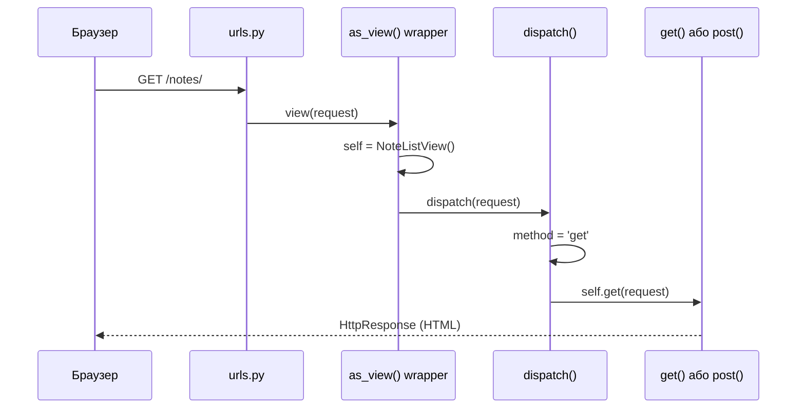
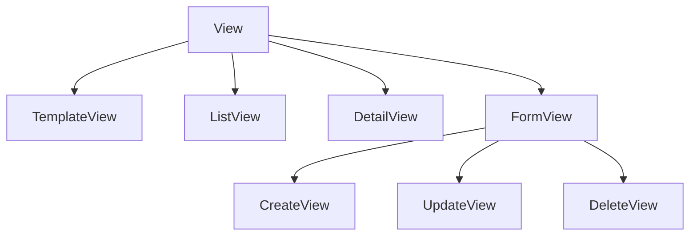
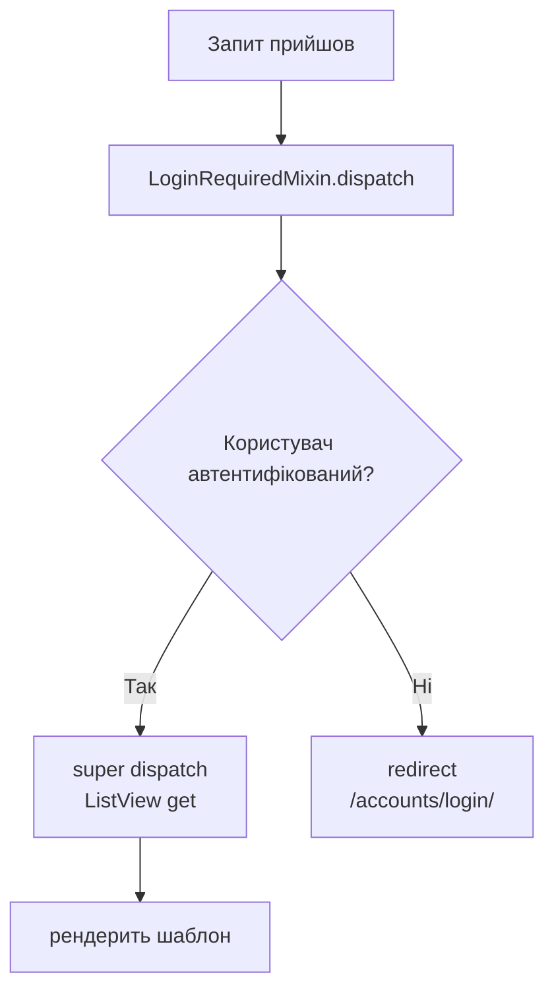

# notes_project_cbv — Class-Based Views

> Та сама платформа нотаток що і в `notes_project/`, але **views.py та urls.py повністю переписані на CBV**.
>
> **Що змінилось:** тільки `hello_app/views.py` + `hello_app/urls.py`  
> **Що залишилось:** models, forms, selectors, services, templates — без жодних змін  
>
> Порівняй з [`../notes_project/`](../notes_project/) — FBV оригінал.  
> Теорія CBV: [`../Django_Views.md`](../Django_Views.md)

---

## Зміст

- [Що таке CBV і навіщо](#що-таке-cbv-і-навіщо)
- [Крок 1 — Контракт CBV: `as_view()` та `dispatch()`](#крок-1--контракт-cbv-as_view-та-dispatch)
- [Крок 2 — Generic Views: ієрархія і що кожна робить автоматично](#крок-2--generic-views-ієрархія)
- [Крок 3 — `LoginRequiredMixin` та MRO](#крок-3--loginrequiredmixin-та-mro)
- [Крок 4 — `UserQuerySetMixin`: DRY ізоляція даних](#крок-4--userquerysetmixin-dry-ізоляція-даних)
- [Крок 5 — `ListView`: список нотаток із фільтрами](#крок-5--listview-список-нотаток-із-фільтрами)
- [Крок 6 — `DetailView`: деталь об'єкта](#крок-6--detailview-деталь-обєкта)
- [Крок 7 — `CreateView` та `get_form_kwargs()`](#крок-7--createview-та-get_form_kwargs)
- [Крок 8 — `UpdateView`: редагування з instance](#крок-8--updateview-редагування-з-instance)
- [Крок 9 — `DeleteView`: безпечне видалення тільки через POST](#крок-9--deleteview-безпечне-видалення-тільки-через-post)
- [Крок 10 — `get_success_url()` та `reverse_lazy`](#крок-10--get_success_url-та-reverse_lazy)
- [Крок 11 — Services архітектура в CBV: `form_valid()` замість `form.save()`](#крок-11--services-архітектура-в-cbv)
- [Крок 12 — CBV у `urls.py`: чому потрібен `.as_view()`](#крок-12--cbv-у-urlspy)
- [FBV → CBV швидке порівняння](#fbv--cbv-швидке-порівняння)
- [Структура файлів проекту](#структура-файлів)
- [Як запустити](#як-запустити)
- [Посилання на документацію](#посилання-на-документацію)

---

## Що таке CBV і навіщо

**FBV (Function-Based Views)** — view як функція:

```python
def note_list(request):
    notes = Note.objects.filter(user=request.user)
    return render(request, 'note_list.html', {'notes': notes})
```

**CBV (Class-Based Views)** — view як клас:

```python
class NoteListView(LoginRequiredMixin, ListView):
    model = Note
    template_name = 'hello_app/note_list.html'
    context_object_name = 'notes'
```

**Навіщо CBV?**

| Проблема у FBV | Рішення у CBV |
|----------------|---------------|
| `@login_required` треба ставити на _кожну_ функцію | `LoginRequiredMixin` один раз у класі |
| `Note.objects.filter(user=request.user)` повторюється в 5 місцях | `UserQuerySetMixin.get_queryset()` — один раз |
| `if request.method == 'POST': form = ...; if form.is_valid(): ...` — шаблонний код | `CreateView`/`UpdateView` роблять це автоматично |
| Немає стандартного способу розширити логіку | Перевизначаємо хуки: `get_queryset()`, `form_valid()`, `get_context_data()` |

> **Важливо:** CBV не замінюють архітектуру. Selectors/Services залишились там само — тільки виклики перенесли з функцій у методи класів.

---

## Крок 1 — Контракт CBV: `as_view()` та `dispatch()`

### Чому клас не можна поставити прямо у `urls.py`

Django router очікує **callable** (функцію):

```python
# ❌ НЕ ПРАЦЮЄ — NoteListView це клас, не callable
path('notes/', views.NoteListView, name='note_list')

# ✅ ПРАВИЛЬНО — .as_view() повертає callable функцію-обгортку
path('notes/', views.NoteListView.as_view(), name='note_list')
```

### Що робить `as_view()`

`as_view()` — це **classmethod** який Django викликає один раз при старті сервера. Він повертає звичайну функцію-обгортку `view`. Щоразу при HTTP запиті ця функція:

1. Створює **новий instance** класу (щоразу новий — thread-safe!)
2. Копіює `request`, `args`, `kwargs` на instance
3. Викликає `instance.dispatch(request, *args, **kwargs)`

```python
# Спрощений псевдокод того що робить as_view() всередині Django:
@classmethod
def as_view(cls, **initkwargs):
    def view(request, *args, **kwargs):
        self = cls(**initkwargs)          # 1. новий instance
        self.request = request            # 2. копіюємо request
        self.args = args
        self.kwargs = kwargs
        return self.dispatch(request, *args, **kwargs)  # 3. dispatch
    return view
```

### Що робить `dispatch()`

`dispatch()` — **головний роутер** CBV. Він дивиться на HTTP метод запиту і делегує виклик відповідному методу класу:

```python
# Псевдокод dispatch() з базового View:
def dispatch(self, request, *args, **kwargs):
    method = request.method.lower()          # 'get', 'post', 'put', ...
    handler = getattr(self, method, None)    # self.get, self.post, ...
    if handler:
        return handler(request, *args, **kwargs)
    return HttpResponseNotAllowed(...)       # 405 Method Not Allowed
```

### Sequence diagram: запит від браузера до методу



> **Посилання:** `Django_Views.md` — Розділ 4.2 (dispatch mechanism)

---

## Крок 2 — Generic Views: ієрархія

Django постачає готові CBV для типових CRUD операцій — **Generic Views**.

### Ієрархія класів



### Що кожна Generic View робить автоматично

| Generic View | GET | POST | Ключові атрибути |
|---|---|---|---|
| `TemplateView` | рендерить шаблон | — | `template_name` |
| `ListView` | отримує список через `get_queryset()`, рендерить | — | `model`, `template_name`, `context_object_name` |
| `DetailView` | отримує один об'єкт через `get_object()`, рендерить | — | `model`, `template_name`, `context_object_name` |
| `CreateView` | рендерить порожню форму | валідує → `form_valid()` або `form_invalid()` | `model`, `form_class`, `template_name` |
| `UpdateView` | рендерить форму з `instance=object` | валідує → `form_valid()` або `form_invalid()` | те саме + завантажує `get_object()` |
| `DeleteView` | рендерить підтвердження | видаляє → `success_url` | `model`, `template_name`, `success_url` |

### Class attributes замість аргументів

У FBV параметри передавались у функцію або hardcode всередині. У CBV — оголошуємо як **атрибути класу**:

```python
class NoteListView(LoginRequiredMixin, ListView):
    model = Note                              # ← яку модель використовувати
    template_name = 'hello_app/note_list.html'  # ← який шаблон рендерити
    context_object_name = 'notes'            # ← як назвати список у шаблоні
                                             #   (замість дефолтного 'object_list')
```

> **Посилання:** `Django_Views.md` — Розділ 5 (Generic Views)

---

## Крок 3 — `LoginRequiredMixin` та MRO

### FBV: декоратор `@login_required`

```python
from django.contrib.auth.decorators import login_required

@login_required
def note_list(request):
    ...
```

### CBV: `LoginRequiredMixin` — перший у списку базових класів

```python
from django.contrib.auth.mixins import LoginRequiredMixin

class NoteListView(LoginRequiredMixin, ListView):
    ...
```

### Чому порядок у дужках критично важливий

Python визначає порядок пошуку методів через **MRO (Method Resolution Order)**. Коли Django викликає `dispatch()`, Python шукає його по MRO зліва направо:

```
NoteListView → LoginRequiredMixin → ListView → View
```

`LoginRequiredMixin.dispatch()` перевіряє автентифікацію **першим** — до того як `ListView.dispatch()` взагалі щось зробить.

```python
# ✅ ПРАВИЛЬНО: LoginRequiredMixin першим → перевірка auth ПЕРША
class NoteListView(LoginRequiredMixin, UserQuerySetMixin, ListView):
    ...

# ❌ НЕПРАВИЛЬНО: ListView першим → auth перевірка ПІСЛЯ завантаження даних
class NoteListView(UserQuerySetMixin, ListView, LoginRequiredMixin):
    ...
```

### Flowchart: перевірка автентифікації



> За замовчуванням редірект — `/accounts/login/?next=/notes/`. Можна змінити через `login_url` і `redirect_field_name` на класі.

---

## Крок 4 — `UserQuerySetMixin`: DRY ізоляція даних

### Проблема: дублювання фільтра по user

Без міксина у кожному `Detail`, `Update`, `Delete` view потрібно повторювати:

```python
# У NoteDetailView:
queryset = Note.objects.filter(user=self.request.user)

# У NoteUpdateView:
queryset = Note.objects.filter(user=self.request.user)

# У NoteDeleteView:
queryset = Note.objects.filter(user=self.request.user)
```

Це не просто повторення коду — **це дірка в безпеці**: якщо забути в одному місці, Alice побачить нотатки Bob'а.

### Рішення: кастомний міксин

```python
class UserQuerySetMixin:
    """
    Міксин для автоматичної фільтрації QuerySet по поточному юзеру.
    """
    def get_queryset(self):
        # super().get_queryset() → повертає model.objects.all()
        # .filter(user=...) → обмежуємо тільки об'єктами цього юзера
        return super().get_queryset().filter(user=self.request.user)
```

### Як Django використовує `get_queryset()` для захисту

`DetailView`, `UpdateView`, `DeleteView` завантажують об'єкт через `get_object()`:

```python
# Псевдокод get_object() у DetailView:
def get_object(self, queryset=None):
    queryset = self.get_queryset()        # ← наш відфільтрований queryset!
    pk = self.kwargs.get('pk')
    return queryset.get(pk=pk)           # SQL: WHERE id=pk AND user_id=current_user
```

Якщо Alice намагається відкрити нотатку Bob'а (`/notes/42/`):
- `get_queryset()` повертає `Note.objects.filter(user=Alice)`
- `get_object()` робить `.get(pk=42)` на цьому queryset
- SQL: `SELECT * FROM note WHERE id=42 AND user_id=<Alice_id>` → нічого не знайдено
- Django кидає `Note.DoesNotExist` → `Http404`

**Alice бачить 404, а не дані Bob'а.**

### MRO з UserQuerySetMixin

```python
class NoteDetailView(LoginRequiredMixin, UserQuerySetMixin, DetailView):
    ...

# Python MRO:
# NoteDetailView → LoginRequiredMixin → UserQuerySetMixin → DetailView → View
#
# При виклику get_queryset():
#   1. Знаходить UserQuerySetMixin.get_queryset()
#   2. super().get_queryset() → іде далі → DetailView.get_queryset()
#   3. DetailView.get_queryset() → повертає Note.objects.all()
#   4. UserQuerySetMixin додає .filter(user=self.request.user)
#   Результат: Note.objects.all().filter(user=self.request.user)
```

---

## Крок 5 — `ListView`: список нотаток із фільтрами

`NoteListView` — найскладніший view у проекті: підтримує пошук, фільтр по тегу і записнику.

### Атрибути класу

```python
class NoteListView(LoginRequiredMixin, ListView):
    model = Note
    template_name = 'hello_app/note_list.html'
    context_object_name = 'notes'   # замість дефолтного 'object_list'
```

### `get_queryset()` — яку колекцію повернути

У FBV читали GET параметри прямо у функції. У CBV — у `get_queryset()` через `self.request.GET`:

```python
def get_queryset(self):
    self._get_filters()       # парсимо GET params один раз (cache у self)
    return selectors.get_user_notes(
        self.request.user,
        search=self.search or None,
        tag=self.active_tag,
        notebook=self.active_notebook,
    )
```

> Архітектура збережена: selector виконує всю ORM логіку. `get_queryset()` — лише делегування.

### `get_context_data()` — які дані передати у шаблон

`ListView` автоматично додає у контекст:
- `notes` (або `object_list`) — результат `get_queryset()`
- `page_obj` — якщо є пагінація
- `is_paginated` — boolean

Ми **розширюємо** контекст через `super()`:

```python
def get_context_data(self, **kwargs):
    self._get_filters()
    ctx = super().get_context_data(**kwargs)   # ← містить 'notes' вже!
    ctx['notebooks'] = selectors.get_user_notebooks(self.request.user)
    ctx['tags'] = selectors.get_user_tags(self.request.user)
    ctx['search'] = self.search
    ctx['active_tag'] = self.active_tag
    ctx['active_notebook'] = self.active_notebook
    return ctx
```

**Завжди** викликай `super().get_context_data(**kwargs)` і доповнюй словник — не заміняй.

### `_get_filters()` — приватний хелпер для DRY

Обидва методи (`get_queryset` і `get_context_data`) потребують одних і тих самих GET параметрів. Щоб не парсити двічі — приватний хелпер з кешуванням у `self`:

```python
def _get_filters(self):
    if hasattr(self, '_filters_parsed'):   # вже розпарсили раніше
        return
    self._filters_parsed = True

    self.search = self.request.GET.get('q', '').strip()

    tag_id = self.request.GET.get('tag')
    self.active_tag = None
    if tag_id:
        try:
            # перевіряємо права! user=request.user
            self.active_tag = Tag.objects.get(id=int(tag_id), user=self.request.user)
        except (Tag.DoesNotExist, ValueError):
            pass   # некоректний id → просто ігноруємо
```

---

## Крок 6 — `DetailView`: деталь об'єкта

```python
class NoteDetailView(LoginRequiredMixin, UserQuerySetMixin, DetailView):
    model = Note
    template_name = 'hello_app/note_detail.html'
    context_object_name = 'note'
```

### Що `DetailView` робить автоматично

1. Читає `pk` з `self.kwargs['pk']` (з URL pattern `<int:pk>`)
2. Викликає `get_object()` → `get_queryset().get(pk=pk)`
3. Передає об'єкт у шаблон як `'note'` (наш `context_object_name`)
4. Рендерить `template_name`
5. Якщо не знайдено → 404 автоматично

### Перевизначення `get_object()` для Prefetch

У нашому проекті selector завантажує нотатку з `Prefetch(to_attr='upcoming_reminders')`. Тому перевизначаємо `get_object()` щоб використати selector замість стандартного `queryset.get(pk=pk)`:

```python
def get_object(self, queryset=None):
    try:
        return selectors.get_note_detail(self.request.user, self.kwargs['pk'])
    except Note.DoesNotExist:
        raise Http404("Нотатку не знайдено")
```

> `Http404` — стандартне виключення Django. Автоматично повертає 404 сторінку.

### `get_context_data()` — додаємо reminders

```python
def get_context_data(self, **kwargs):
    ctx = super().get_context_data(**kwargs)
    # upcoming_reminders встановлений через Prefetch(to_attr=) у selector
    ctx['reminders'] = getattr(self.object, 'upcoming_reminders', [])
    return ctx
```

`self.object` — завантажений об'єкт (завжди доступний після `get_object()`).

---

## Крок 7 — `CreateView` та `get_form_kwargs()`

```python
class NoteCreateView(LoginRequiredMixin, CreateView):
    model = Note
    form_class = NoteForm
    template_name = 'hello_app/note_form.html'
```

### Що `CreateView` робить автоматично

**GET запит:**
1. `get_form()` → `form_class(**get_form_kwargs())` → порожня форма
2. `get_context_data()` → додає `{'form': form}`
3. Рендерить шаблон

**POST запит:**
1. `get_form()` → форма з `data=request.POST`
2. `form.is_valid()`:
   - `True` → викликає `form_valid(form)`
   - `False` → викликає `form_invalid(form)` → рендерить шаблон з помилками

### Проблема: як передати `user=` у форму

`NoteForm.__init__` потребує `user=` щоб фільтрувати QuerySet для полів `notebook` і `tags`:

```python
# FBV:
form = NoteForm(request.POST, user=request.user)

# CBV: як це зробити якщо форму будує CreateView автоматично?
```

### Рішення: `get_form_kwargs()`

`CreateView` будує форму через `get_form()`:

```python
# Всередині CreateView (спрощено):
def get_form(self):
    return self.form_class(**self.get_form_kwargs())
```

`get_form_kwargs()` повертає словник аргументів для форми. Ми **розширюємо** його:

```python
def get_form_kwargs(self):
    kwargs = super().get_form_kwargs()
    # super() повертає: {'data': request.POST, 'files': request.FILES, ...}
    kwargs['user'] = self.request.user   # ← додаємо user=
    return kwargs
    # Результат: NoteForm(data=POST, files=FILES, user=request.user)
```

### `get_initial()` — початкові значення для форми

У `TagCreateView` підтримується `?name=python` — попередньо заповнює поле:

```python
def get_initial(self):
    initial = super().get_initial()
    name = self.request.GET.get('name')
    if name:
        initial['name'] = name
    return initial
```

`get_initial()` повертає словник початкових значень. `CreateView` передає їх у форму як `initial=`.

---

## Крок 8 — `UpdateView`: редагування з instance

```python
class NoteUpdateView(LoginRequiredMixin, UserQuerySetMixin, UpdateView):
    model = Note
    form_class = NoteForm
    template_name = 'hello_app/note_form.html'
```

### Що `UpdateView` робить автоматично (порівняно з `CreateView`)

`UpdateView` робить все те саме що `CreateView`, плюс:

- Перед рендером GET: завантажує існуючий об'єкт через `get_object()`
- Передає `instance=object` у форму → автозаповнення всіх полів
- `UserQuerySetMixin.get_queryset()` → 404 якщо чужий об'єкт

```python
# Всередині UpdateView (спрощено):
def get_form_kwargs(self):
    kwargs = super().get_form_kwargs()
    kwargs['instance'] = self.object    # ← ключова різниця від CreateView
    return kwargs
```

### `get_form_kwargs()` — передаємо `user=`

```python
def get_form_kwargs(self):
    kwargs = super().get_form_kwargs()
    kwargs['user'] = self.request.user
    return kwargs
    # Результат: NoteForm(data=POST, instance=note, user=request.user)
```

### `get_context_data()` — breadcrumbs

```python
def get_context_data(self, **kwargs):
    ctx = super().get_context_data(**kwargs)
    ctx['note'] = self.object           # для breadcrumbs у шаблоні
    ctx['action'] = 'Зберегти зміни'
    ctx['title'] = f'Редагувати: {self.object.title}'
    return ctx
```

---

## Крок 9 — `DeleteView`: безпечне видалення тільки через POST

```python
class NoteDeleteView(LoginRequiredMixin, UserQuerySetMixin, DeleteView):
    model = Note
    template_name = 'hello_app/note_confirm_delete.html'
    success_url = reverse_lazy('hello_app:note_list')
    context_object_name = 'note'
```

### Чому DELETE тільки через POST?

**GET видалення — порушення HTTP семантики:**

```
GET /notes/42/delete/   ← Небезпечно!
```

- Браузер може **prefetch** ці URL — видалить без кліку!
- Пошуковий бот обходить посилання — видалить всі записи!
- `` у листі — видалить при відкритті!

**`DeleteView` автоматично вимагає POST для фактичного видалення:**
- `GET` → рендерить сторінку підтвердження ("Ви впевнені?")
- `POST` → видаляє і редіректить

### `form_valid()` — хук POST підтвердження

```python
def form_valid(self, form):
    note = self.get_object()
    title = note.title    # зберігаємо ДО видалення!
    services.delete_note(note)
    messages.warning(self.request, f'🗑️ Нотатку "{title}" видалено.')
    return redirect(self.success_url)
```

> Зберігаємо `title` до `services.delete_note()` — після видалення `note.title` може бути недоступним.

### `get_context_data()` — показуємо попередження

У `NotebookDeleteView` додаємо кількість нотаток що стануть без записника:

```python
def get_context_data(self, **kwargs):
    ctx = super().get_context_data(**kwargs)
    ctx['note_count'] = self.object.notes.count()
    return ctx
```

Шаблон показує: _"Видалення не видалить нотатки, вони стануть без записника"_.

---

## Крок 10 — `get_success_url()` та `reverse_lazy`

Після успішного збереження/видалення CBV потребує знати куди редіректити.

### Варіант 1: `success_url` — статична URL

```python
class NoteDeleteView(..., DeleteView):
    success_url = reverse_lazy('hello_app:note_list')
```

**Чому `reverse_lazy` а не `reverse()`?**

`success_url = reverse('hello_app:note_list')` — виконується **при завантаженні класу** (при старті Django), ще до того як URL patterns зареєстровані. Це призводить до `NoReverseMatch`.

`reverse_lazy('hello_app:note_list')` — виконується **ліниво**, тільки коли атрибут реально потрібен (при запиті). URL patterns вже зареєстровані.

### Варіант 2: `get_success_url()` — динамічна URL

Коли URL залежить від стану об'єкта або параметрів запиту:

```python
# У TagCreateView: підтримуємо ?next= параметр
def get_success_url(self):
    return self._get_next_url()

def _get_next_url(self):
    return (
        self.request.GET.get('next')     # ?next= у GET
        or self.request.POST.get('next') # next у POST формі
        or 'hello_app:note_create'       # дефолт якщо немає
    )
```

### Порівняння

| | `success_url` | `get_success_url()` |
|---|---|---|
| Коли | статична URL відома заздалегідь | URL залежить від об'єкта або запиту |
| Приклад | список записників | деталь щойно створеної нотатки |
| `reverse_lazy` | обов'язково | не потрібно (викликається при запиті) |

---

## Крок 11 — Services архітектура в CBV

У FBV Services/Selectors викликались прямо у функції-view. У CBV — у хуках.

### `form_valid()` замість `form.save()`

**Ключове правило:** якщо у вас є `services.py`, **ніколи** не викликайте `super().form_valid()` у `CreateView`/`UpdateView` — там всередині `form.save()`, який обходить вашу бізнес-логіку.

```python
class NoteCreateView(LoginRequiredMixin, CreateView):
    ...

    def form_valid(self, form):
        # ❌ НЕ РОБИМО: super().form_valid(form) → там form.save()!

        # ✅ ДЕЛЕГУЄМО у service — там transaction.atomic(), бізнес-правила
        tags = form.cleaned_data.get('tags')
        tag_ids = [t.id for t in tags] if tags else None

        note = services.create_note(
            user=self.request.user,
            title=form.cleaned_data['title'],
            content=form.cleaned_data.get('content', ''),
            priority=form.cleaned_data.get('priority', 1),
            notebook=form.cleaned_data.get('notebook'),
            tag_ids=tag_ids,
        )
        messages.success(self.request, f'✅ Нотатку "{note.title}" створено!')
        return redirect('hello_app:note_detail', pk=note.pk)
```

### `get_queryset()` замість прямих запитів у `get_context_data()`

У `NoteListView` не робимо запити у `get_context_data()` крім sidebar даних. Основний список — через `get_queryset()`. Це дозволяє пагінації працювати коректно.

```python
# ✅ ПРАВИЛЬНО: список нотаток через get_queryset()
def get_queryset(self):
    return selectors.get_user_notes(self.request.user, ...)

# ✅ ПРАВИЛЬНО: sidebar дані через get_context_data()
def get_context_data(self, **kwargs):
    ctx = super().get_context_data(**kwargs)
    ctx['notebooks'] = selectors.get_user_notebooks(self.request.user)
    return ctx
```

### Повна таблиця хуків

| Хук | Де перевизначаємо | Для чого |
|---|---|---|
| `get_queryset()` | `ListView`, `UserQuerySetMixin` | яку колекцію повернути |
| `get_object()` | `NoteDetailView` | завантаження з Prefetch через selector |
| `get_context_data()` | всі | додаткові дані у шаблон |
| `get_form_kwargs()` | `NoteCreateView`, `NoteUpdateView` | передати `user=` у форму |
| `get_initial()` | `TagCreateView` | початкові значення полів |
| `form_valid()` | всі `Create`/`Update`/`Delete` | викликати service замість `form.save()` |
| `get_success_url()` | `TagCreateView` | динамічний redirect після збереження |

---

## Крок 12 — CBV у `urls.py`

```python
# hello_app/urls.py
from django.urls import path
from . import views

app_name = "hello_app"

urlpatterns = [
    path('', views.IndexView.as_view(), name='index'),

    # Notes
    path('notes/', views.NoteListView.as_view(), name='note_list'),
    path('notes/new/', views.NoteCreateView.as_view(), name='note_create'),
    path('notes/<int:pk>/', views.NoteDetailView.as_view(), name='note_detail'),
    path('notes/<int:pk>/edit/', views.NoteUpdateView.as_view(), name='note_edit'),
    path('notes/<int:pk>/delete/', views.NoteDeleteView.as_view(), name='note_delete'),

    # Notebooks
    path('notebooks/', views.NotebookListView.as_view(), name='notebook_list'),
    path('notebooks/new/', views.NotebookCreateView.as_view(), name='notebook_create'),
    path('notebooks/<int:pk>/edit/', views.NotebookUpdateView.as_view(), name='notebook_edit'),
    path('notebooks/<int:pk>/delete/', views.NotebookDeleteView.as_view(), name='notebook_delete'),

    # Tags
    path('tags/new/', views.TagCreateView.as_view(), name='tag_create'),
]
```

### FBV vs CBV у `urls.py`

```python
# FBV: views.note_list — це вже callable функція
path('notes/', views.note_list, name='note_list')

# CBV: views.NoteListView — це клас (не callable!)
path('notes/', views.NoteListView.as_view(), name='note_list')
#                              ^^^^^^^^^^^ обов'язково!
```

### `IndexView` — базовий `View` без Generic

```python
class IndexView(View):
    """Найпростіший CBV — базовий View."""
    def get(self, request):
        return HttpResponse("Hello, Django ORM!")
```

Базовий `View` не рендерить шаблон автоматично — потрібно реалізувати `get()` та `post()` вручну. Підходить для простих сторінок або API endpoints.

---

## FBV → CBV швидке порівняння

### Список (List)

```python
# FBV
@login_required
def note_list(request):
    notes = selectors.get_user_notes(request.user, ...)
    return render(request, 'hello_app/note_list.html', {'notes': notes})

# CBV
class NoteListView(LoginRequiredMixin, ListView):
    model = Note
    template_name = 'hello_app/note_list.html'
    context_object_name = 'notes'

    def get_queryset(self):
        return selectors.get_user_notes(self.request.user, ...)
```

### Створення (Create)

```python
# FBV
@login_required
def note_create(request):
    if request.method == 'POST':
        form = NoteForm(request.POST, user=request.user)
        if form.is_valid():
            note = services.create_note(user=request.user, ...)
            messages.success(request, '...')
            return redirect('hello_app:note_detail', pk=note.pk)
    else:
        form = NoteForm(user=request.user)
    return render(request, 'hello_app/note_form.html', {'form': form})

# CBV
class NoteCreateView(LoginRequiredMixin, CreateView):
    model = Note
    form_class = NoteForm
    template_name = 'hello_app/note_form.html'

    def get_form_kwargs(self):
        kwargs = super().get_form_kwargs()
        kwargs['user'] = self.request.user
        return kwargs

    def form_valid(self, form):
        note = services.create_note(user=self.request.user, ...)
        messages.success(self.request, '...')
        return redirect('hello_app:note_detail', pk=note.pk)
```

### Редагування (Update)

```python
# FBV
@login_required
def note_edit(request, pk):
    note = get_object_or_404(Note, pk=pk, user=request.user)
    if request.method == 'POST':
        form = NoteForm(request.POST, instance=note, user=request.user)
        if form.is_valid():
            services.update_note(note, ...)
            return redirect('hello_app:note_detail', pk=note.pk)
    else:
        form = NoteForm(instance=note, user=request.user)
    return render(request, 'hello_app/note_form.html', {'form': form, 'note': note})

# CBV
class NoteUpdateView(LoginRequiredMixin, UserQuerySetMixin, UpdateView):
    model = Note
    form_class = NoteForm
    template_name = 'hello_app/note_form.html'

    def get_form_kwargs(self):
        kwargs = super().get_form_kwargs()
        kwargs['user'] = self.request.user
        return kwargs

    def form_valid(self, form):
        note = self.get_object()
        services.update_note(note, ...)
        return redirect('hello_app:note_detail', pk=note.pk)
```

### Видалення (Delete)

```python
# FBV
@login_required
def note_delete(request, pk):
    note = get_object_or_404(Note, pk=pk, user=request.user)
    if request.method == 'POST':
        services.delete_note(note)
        messages.warning(request, f'Нотатку видалено.')
        return redirect('hello_app:note_list')
    return render(request, 'hello_app/note_confirm_delete.html', {'note': note})

# CBV
class NoteDeleteView(LoginRequiredMixin, UserQuerySetMixin, DeleteView):
    model = Note
    template_name = 'hello_app/note_confirm_delete.html'
    success_url = reverse_lazy('hello_app:note_list')
    context_object_name = 'note'

    def form_valid(self, form):
        note = self.get_object()
        services.delete_note(note)
        messages.warning(self.request, f'Нотатку видалено.')
        return redirect(self.success_url)
```

---

## Структура файлів

```
notes_project_cbv/
├── notes_project_cbv/
│   ├── settings.py
│   ├── urls.py            ← включає hello_app.urls з namespace='hello_app'
│   └── wsgi.py
│
└── hello_app/
    ├── views.py           ★ ЗМІНЕНО — CBV версія
    ├── urls.py            ★ ЗМІНЕНО — .as_view() у кожному path()
    │
    ├── forms.py           · Без змін — ті самі NoteForm, NotebookForm, TagForm
    ├── selectors.py       · Без змін — та сама ORM логіка
    ├── services.py        · Без змін — та сама бізнес-логіка
    ├── models.py          · Без змін — ті самі 9 моделей
    │
    └── templates/         · Без змін — ті самі шаблони
        └── hello_app/
            ├── note_list.html
            ├── note_detail.html
            ├── note_form.html
            ├── note_confirm_delete.html
            ├── notebook_list.html
            ├── notebook_form.html
            ├── notebook_confirm_delete.html
            └── tag_form.html
```

> `views_fbv_backup.py` — резервна копія оригінального FBV views.py для порівняння.

---

## Як запустити

```bash
cd notes_project_cbv

# Активуй venv (той самий що для notes_project)
source ../notes_project/venv/bin/activate   # або свій venv

# Застосуй міграції (якщо нова база)
python manage.py migrate

# Створи суперюзера
python manage.py createsuperuser

# Запусти на іншому порту щоб не конфліктував з notes_project
python manage.py runserver 8001
```

Відкрий: `http://localhost:8001/notes/`

---

## Bootstrap форми у шаблонах

Шаблони цього проекту (`note_form.html`, `notebook_form.html`, `tag_form.html`) рендерять Django форми **вручну** через Bootstrap 5 — без `django-crispy-forms`. Це дає повний контроль над HTML і дозволяє зрозуміти як Django і Bootstrap взаємодіють.

---

### 1. Структура шаблону форми (Template Inheritance)

Кожен шаблон форми починається однаково:

```html
   {# успадковуємо base: navbar, footer, Bootstrap CDN #}

{{ title }}  {# title приходить з context CBV #}


       {# завантажуємо тег  — без цього рядка тег не працює #}
    <link rel="stylesheet" href="">
    {# forms.css: .form-card, .tag-label, .pin-toggle, .tag-checkbox-item {display:none} #}



    ...форма...



    <script>/* live preview JS */</script>

```

**Навіщо окремі блоки:**

| Блок | Призначення |
|------|-------------|
| `` | CSS тільки для цієї сторінки — не забруднює всі інші |
| `` | Основний HTML контент сторінки |
| `` | JS тільки для цієї сторінки, підключається після `</body>` |

`` — це **завантаження бібліотеки тегів**, не файлу. Без нього `` кине помилку `Invalid block tag: 'static'`. Завантажувати треба в кожному шаблоні де використовується.

---

### 2. Context variables — що приходить з CBV у шаблон

Шаблон `note_form.html` використовується двома CBV-класами. Обидва передають однакові ключі через `get_context_data()`:

```python
# views.py — NoteCreateView
def get_context_data(self, **kwargs):
    ctx = super().get_context_data(**kwargs)
    ctx['action'] = 'Створити'       # текст кнопки submit
    ctx['title']  = 'Нова нотатка'  # заголовок форми
    return ctx
    # ctx['form'] додається автоматично CreateView/UpdateView!
    # ctx['note'] = None (не передаємо) → шаблон перевіряє 

# views.py — NoteUpdateView
def get_context_data(self, **kwargs):
    ctx = super().get_context_data(**kwargs)
    ctx['note']   = self.object            # Note instance для breadcrumb
    ctx['action'] = 'Зберегти зміни'
    ctx['title']  = f'Редагувати: {self.object.title}'
    return ctx
    # ctx['form'] вже заповнений instance=note автоматично!
```

У шаблоні доступні такі змінні:

| Змінна в шаблоні | Тип | Звідки | Використання |
|------------------|-----|--------|--------------|
| `{{ form }}` | `NoteForm` | `CreateView`/`UpdateView` автоматично | `{{ form.title }}`, `` |
| `{{ title }}` | `str` | `get_context_data()` | `<h2>{{ title }}</h2>` |
| `{{ action }}` | `str` | `get_context_data()` | `<button>{{ action }}</button>` |
| `{{ note }}` | `Note` або `None` | `get_context_data()` | `` у breadcrumb |
| `{{ request }}` | `HttpRequest` | context processor | `{{ request.path }}` для ?next= |

`{{ request }}` доступний тому що в `settings.py` є `django.template.context_processors.request` у `TEMPLATES` → Django автоматично додає `request` до кожного шаблону.

---

### 3. Як Widget передає Bootstrap клас

Django форма рендерить поле через `Widget`. У `forms.py` кожному полю присвоєно `attrs`:

```python
# forms.py — Widget attrs встановлюють Bootstrap клас
class NoteForm(forms.ModelForm):
    class Meta:
        widgets = {
            'title':    forms.TextInput(attrs={
                            'class': 'form-control',    # Bootstrap: стилізує <input>
                            'placeholder': 'Назва нотатки...',
                            'autofocus': True,          # браузер фокусує поле автоматично
                        }),
            'content':  forms.Textarea(attrs={
                            'class': 'form-control',
                            'rows': 8,                  # висота textarea у рядках
                        }),
            'priority': forms.Select(attrs={
                            'class': 'form-select',     # Bootstrap: стилізує <select>
                        }),
            'notebook': forms.Select(attrs={
                            'class': 'form-select',
                        }),
            'is_pinned': forms.CheckboxInput(attrs={
                            'class': 'form-check-input', # Bootstrap: стилізує checkbox
                        }),
        }
```

| Bootstrap клас | HTML елемент | Ефект |
|----------------|-------------|-------|
| `form-control` | `<input>`, `<textarea>` | Повна ширина, рамка, padding, focus-ring |
| `form-select` | `<select>` | Стрілочка dropdown, padding, рамка |
| `form-check-input` | `<input type="checkbox">` | Кастомний стиль чекбоксу |
| `form-control-color` | `<input type="color">` | Спеціальний стиль для color picker |

---

### 4. Рендеринг одного поля — повна анатомія BoundField

Це реальний код з `note_form.html`, рядок за рядком:

```html
<div class="mb-3">
    <!--
      form.title — BoundField: об'єкт що об'єднує поле форми + поточне значення + форму.
      .id_for_label → рядок 'id_title' (Django: префікс 'id_' + назва поля)
      Браузер: клік на <label for="id_title"> фокусує <input id="id_title">
    -->
    <label for="{{ form.title.id_for_label }}" class="form-label">
        <i class="bi bi-type me-1"></i>  {# Bootstrap Icon: іконка поруч з label #}
        {{ form.title.label }}           {# → 'Заголовок' (з Meta.labels у forms.py) #}
        <span class="text-danger ms-1">*</span>  {# червона зірочка = обов'язкове поле #}
    </label>

    <!--
      {{ form.title }} викликає BoundField.__str__() → Widget.render()
      Результат: <input type="text"
                        name="title"
                        id="id_title"
                        class="form-control"
                        placeholder="Назва нотатки..."
                        autofocus
                        maxlength="200">
      Всі атрибути (class, placeholder, autofocus) прийшли з Meta.widgets!
    -->
    {{ form.title }}

    <!--
      form.title.help_text — текст підказки з Meta.help_texts.
      Для title help_text не задано → блок не показується.
      Для notebook: help_text = 'Залиш порожнім — нотатка буде без записника.'
    -->
    
    <div class="form-text">{{ form.title.help_text }}</div>
    

    <!--
      form.title.errors — ErrorList (список рядків з повідомленнями про помилки).
      Порожній після GET запиту. Заповнюється якщо POST + is_valid() = False.
      Наприклад: ['Це поле обов'язкове.'] або ['Не більше 200 символів.']
    -->
    
    <ul class="errorlist">
        <li>{{ error }}</li>
    </ul>
    
</div>
```

---

### 5. BoundField — всі атрибути що використовуються у шаблонах

`form.field_name` у шаблоні — це `BoundField` об'єкт (не просто рядок!). Він знає поточне значення, помилки, метадані.

| Вираз у шаблоні | Python тип | Приклад значення | Опис |
|-----------------|-----------|------------------|------|
| `{{ form.title }}` | `str` (HTML) | `<input type="text" ...>` | Рендерить Widget → повний HTML тег |
| `{{ form.title.id_for_label }}` | `str` | `'id_title'` | id для `<label for="">`, автогенерований |
| `{{ form.title.label }}` | `str` | `'Заголовок'` | Текст мітки (з `Meta.labels`) |
| `{{ form.title.help_text }}` | `str` | `'Залиш порожнім...'` | Підказка (з `Meta.help_texts`) |
| `{{ form.title.html_name }}` | `str` | `'title'` | `name` атрибут `<input name="title">` |
| `{{ form.title.errors }}` | `ErrorList` | `['Це поле обов'язкове.']` | Список помилок, ітерується |
| `` | `bool` | `True` / `False` | Перевіряє чи є помилки |
| `form.title.field` | `Field` | `CharField(max_length=200)` | Об'єкт поля форми (не Widget!) |
| `form.title.value()` | `str` | `'Назва нотатки'` | Поточне значення (з initial або POST) |

---

### 6. Bootstrap Grid у формі + `help_text` + `form.instance`

**Bootstrap Grid** дозволяє розмістити кілька полів в один рядок. Реальний блок з `note_form.html`:

```html
<!--
  Bootstrap Grid: row + col-* = 12 колонок.
  col-6 + col-6 = 12 → два поля займають рівно один рядок.
  g-3 = gap між колонками (Bootstrap 5 gutter).
-->
<div class="row g-3 mb-3">

    <div class="col-6">
        <label for="{{ form.priority.id_for_label }}" class="form-label">
            <i class="bi bi-flag me-1"></i>{{ form.priority.label }}
        </label>
        {{ form.priority }}  {# → <select class="form-select" name="priority">...</select> #}
        <!--
          priority-hint — додаткова підказка з кольоровими іконками.
          НЕ є частиною Django форми — чистий HTML для UX.
        -->
        <div class="priority-hint mt-1">
            <span class="bg-secondary bg-opacity-25">🟢 Низький</span>
            <span class="bg-warning bg-opacity-25">🟠 Високий</span>
            <span class="bg-danger bg-opacity-25">🔴 Терміново</span>
        </div>
    </div>

    <div class="col-6">
        <label for="{{ form.notebook.id_for_label }}" class="form-label">
            <i class="bi bi-journals me-1"></i>{{ form.notebook.label }}
        </label>
        {{ form.notebook }}  {# → <select> з відфільтрованими по user записниками #}
        <!--
          form.notebook.help_text → 'Залиш порожнім — нотатка буде без записника.'
          Рендериться тільки якщо help_text не порожній.
        -->
        
        <div class="form-text">{{ form.notebook.help_text }}</div>
        
    </div>

</div>
```

**`form.instance` у шаблоні** — доступ до поточного об'єкту моделі (тільки при `UpdateView`):

```html
<!-- notebook_form.html — color preview strip -->
<div class="color-preview-strip" id="colorStrip"
     style="background: {{ form.instance.color|default:'#4A90E2' }};"></div>
<!--
  form.instance → Notebook ORM об'єкт (при редагуванні) або порожній об'єкт (при створенні).
  .color → значення поля кольору з бази даних.
  |default:'#4A90E2' → Django фільтр: якщо color порожній → '#4A90E2'.
-->
```

---

### 7. Чому `novalidate` на `<form>`

```html
<form method="post" novalidate>
    
    ...
</form>
```

`novalidate` **вимикає браузерну HTML5 валідацію** (`required`, `minlength`, `type="email"` тощо).

**Чому це правильно:**
- Браузерна валідація виглядає по-різному у Chrome, Firefox, Safari
- Вона не знає про Django-специфічні правила (наприклад `clean_name()`)
- Django валідує на сервері: завжди однаково, з вашими повідомленнями про помилки
- Після POST з помилками → шаблон рендериться знову з `form.errors` → єдиний стиль помилок

`` → вставляє прихований input:
```html
<input type="hidden" name="csrfmiddlewaretoken" value="abc123XYZ...">
```
Django відхиляє POST без цього токена з `403 Forbidden`. Захист від Cross-Site Request Forgery.

---

### 8. Кастомний Checkbox для тегів (M:N) — детально

`ManyToManyField(Tag)` → Django рендерить як групу `<input type="checkbox">`. Проблема: стандартний вигляд некрасивий. Рішення — ітеруємося по чекбоксах вручну і ховаємо рідний input, стилізуємо label як badge.

Реальний код з `note_form.html`:

```html
<div class="tags-grid">

    <!--
      form.tags — BoundWidget для CheckboxSelectMultiple.
      Ітерація: кожен checkbox — це окремий SubWidget зі своїми даними.
    -->
    <div>
        <!--
          Рідний checkbox: функціональний (браузер надсилає його value при submit),
          але НЕВИДИМИЙ через CSS: .tag-checkbox-item { display: none; }

          name="{{ form.tags.html_name }}"
            → 'tags' (однакове для всіх checkbox у групі!)
            → Django отримає: POST['tags'] = ['1', '3'] (список pk вибраних тегів)
            → Чому не Django's авто-name? Бо ми рендеримо input вручну, поза Widget.

          value="{{ checkbox.data.value }}"
            → pk тегу: '1', '2', '3'...
            → checkbox.data — словник: {'value': '1', 'label': 'python', 'selected': False}

          id="{{ checkbox.id_for_label }}"
            → унікальний: 'id_tags_0', 'id_tags_1', 'id_tags_2'...
            → зв'язок з <label for="..."> нижче

          checked
            → якщо тег вже прив'язаний до нотатки (при редагуванні) → checkbox буде відмічений
        -->
        <input type="checkbox"
               class="tag-checkbox-item"
               name="{{ form.tags.html_name }}"
               value="{{ checkbox.data.value }}"
               id="{{ checkbox.id_for_label }}"
               checked>

        <!--
          <label for="id_tags_0"> — клік на label перемикає <input id="id_tags_0">!
          Це стандартна HTML поведінка: label + input з однаковим id ↔ for.
          Оскільки input прихований (display:none), користувач бачить тільки label-badge.

          checkbox.choice_label → текст тегу: 'python', 'django', 'work'
          style="--tag-color: #7c6efa;" → CSS custom property (CSS змінна)
            → forms.css використовує var(--tag-color) для кольору badge
        -->
        <label for="{{ checkbox.id_for_label }}" class="tag-label"
               style="--tag-color: #7c6efa;">
            <i class="bi bi-tag-fill" style="font-size:0.7rem;"></i>
            {{ checkbox.choice_label }}
        </label>
    </div>


    <!--
       — виконується якщо form.tags queryset порожній.
      Тобто якщо у цього user немає жодного тегу.
      Показуємо посилання на створення тегу з ?next={{ request.path }}
    -->
    <span class="text-muted small fst-italic">
        Немає тегів.
        <a href="?next={{ request.path }}"
           class="text-primary">Створити тег</a>
    </span>

</div>
```

**Що таке `checkbox.data`:**
```python
# Для кожного тегу Python об'єкт в checkbox.data виглядає так:
{
    'value':    '1',        # pk тегу (рядок!)
    'label':    'python',   # назва тегу
    'selected': False,      # чи вибраний (True при редагуванні якщо тег прив'язаний)
    'index':    '0',        # порядковий номер у групі
    'disabled': False,
    'type':     'checkbox',
    'attrs':    {'id': 'id_tags_0'},
}
```

---

### 9. JavaScript live preview у ``

`notebook_form.html` і `tag_form.html` мають `<input type="color">` для вибору кольору. Щоб показати превью відразу при виборі — додаємо JS у ``.

Ключовий момент: **Django підставляє `id_for_label` прямо в JS-код** при рендерингу шаблону:

```html

<script>
/*
  Живий превью кольору записника.
  Оновлює смужку-превью при кожній зміні color picker.
*/
(function() {
    /*
      '{{ form.color.id_for_label }}' → Django рендерить це як рядок 'id_color'
      перед тим як відправити HTML в браузер.
      Браузер отримує: document.getElementById('id_color')  — готовий JS!
    */
    const colorInput = document.getElementById('{{ form.color.id_for_label }}');
    const colorStrip = document.getElementById('colorStrip');  {# id у шаблоні #}

    if (colorInput && colorStrip) {
        colorInput.addEventListener('input', function() {
            /*
              'input' подія: спрацьовує при кожній зміні (не тільки після blur).
              this.value → HEX рядок: '#FF5733'
            */
            colorStrip.style.background = this.value;
        });
    }
})();  {# IIFE: Immediately Invoked Function Expression — не забруднює глобальний scope #}
</script>

```

`tag_form.html` — складніший live preview: синхронізує і колір і назву тегу:

```javascript
function update() {
    const color = colorInput ? colorInput.value : '#808080';
    const name  = nameInput  ? (nameInput.value.trim() || 'назва') : 'назва';
    if (strip) strip.style.background = color;        // оновлює смужку
    if (badge) badge.style.background = color;        // оновлює badge
    if (badgeName) badgeName.textContent = name;      // оновлює текст badge
}

if (colorInput) colorInput.addEventListener('input', update);
if (nameInput)  nameInput.addEventListener('input', update);
update();  // початковий стан при завантаженні
```

---

### 10. Redirect pattern: hidden `next` input (tag\_form.html)

Тег можна створити **прямо з форми нотатки** — щоб не втратити незбережену нотатку. URL: `/tags/new/?next=/notes/new/`

```html
<!-- tag_form.html -->
<form method="post" novalidate>
    
    <!--
      Прихований input зберігає URL для redirect після збереження.
      next = '{{ next }}' → Django підставляє значення з context.

      Звідки next у context?  TagCreateView.get_context_data():
        ctx['next'] = self.request.GET.get('next') or 'hello_app:note_create'

      Після submit:  TagCreateView.get_success_url():
        return self.request.POST.get('next') or 'hello_app:note_create'
        → redirect назад на форму нотатки!
    -->
    <input type="hidden" name="next" value="{{ next }}">
    ...
</form>
```

Також: кнопка "Скасувати" веде на той самий `next`:
```html
<a href="{{ next }}" class="btn btn-outline-secondary">
    <i class="bi bi-x me-1"></i>Скасувати
</a>
```

Посилання "Створити тег" у `note_form.html` передає поточний шлях:
```html
<a href="?next={{ request.path }}">Створити тег</a>
<!--
  request.path → '/notes/new/' (поточний URL без домену)
   → '/tags/new/'
  Повний URL: '/tags/new/?next=/notes/new/'
-->
```

---

### Bootstrap форма — повна анатомія

```
note_form.html
├──               ← Template Inheritance
├──                   ← forms.css тільки для цієї сторінки
│       
│       
│   
│
├── 
│   ├── <nav> breadcrumb                   ←  або порожній
│   │
│   └── <div class="form-card card">
│       ├── <div class="card-header">
│       │       <h2>{{ title }}</h2>       ← context: 'Нова нотатка'
│       │
│       └── <div class="card-body">
│           └── <form method="post" novalidate>
│               ├──        ← hidden input з CSRF токеном
│               │
│               ├── <div class="mb-3">    ← поле title
│               │   ├── <label for="{{ form.title.id_for_label }}">
│               │   │       {{ form.title.label }}   ← 'Заголовок'
│               │   ├── {{ form.title }}              ← <input class="form-control">
│               │   └──    ← помилки валідації
│               │
│               ├── <div class="mb-3">    ← поле content
│               │   └── {{ form.content }}           ← <textarea class="form-control">
│               │
│               ├── <div class="row g-3"> ← Bootstrap Grid
│               │   ├── col-6: {{ form.priority }}   ← <select class="form-select">
│               │   └── col-6: {{ form.notebook }}   ← <select> відфільтрований по user
│               │
│               ├── <div> tags            ← кастомні checkbox-badge
│               │   └── 
│               │           <input type="checkbox" class="tag-checkbox-item" (hidden)>
│               │           <label class="tag-label"> (видимий badge) </label>
│               │        → посилання на tag_create?next=...
│               │
│               ├── <label> is_pinned     ← toggle-стиль (label обгортає checkbox)
│               │
│               └── <div class="d-flex gap-2">
│                   ├── <button type="submit">{{ action }}</button>
│                   └── <a href="...">Скасувати</a>  ←  detail | list
│
└──                    ← (немає JS у note_form, є у notebook/tag)
```

> **Посилання для глибшого вивчення Bootstrap форм:**
> - Bootstrap 5 Forms (§7): [`../../lesson_HTML_CSS_Bootstrap/BOOTSTRAP_5.md`](../../lesson_HTML_CSS_Bootstrap/BOOTSTRAP_5.md)
> - Django Templates + Bootstrap Forms (§7): [`../../lesson_HTML_CSS_Bootstrap/DJANGO_TEMPLATES_BOOTSTRAP.md`](../../lesson_HTML_CSS_Bootstrap/DJANGO_TEMPLATES_BOOTSTRAP.md)
> - crispy-forms (автоматизований Bootstrap рендеринг): [`../../lesson_HTML_CSS_Bootstrap/ADVANCED_TEMPLATES.md`](../../lesson_HTML_CSS_Bootstrap/ADVANCED_TEMPLATES.md)

---

## Посилання на документацію

### CBV та Views

| Тема | Файл | Що там |
|------|------|--------|
| CBV: dispatch, mixins, decorating, Generic Views | [`../Django_Views.md`](../Django_Views.md) | Основна теорія CBV цього проекту |
| CBV: FBV vs CBV, Generic Views lifecycle | [`../../lesson_Django_Network_Architecture/Django_Views.md`](../../lesson_Django_Network_Architecture/Django_Views.md) | Огляд Views у контексті Django архітектури |
| URL Routing: `path()`, `<int:pk>`, `include()`, namespace | [`../../lesson_Django_Network_Architecture/Django_URL_Routing.md`](../../lesson_Django_Network_Architecture/Django_URL_Routing.md) | `as_view()` у `urls.py`, path converters |
| Django Project Structure: роль кожного файлу | [`../../lesson_Django_Network_Architecture/DJANGO_PROJECT_STRUCTURE.md`](../../lesson_Django_Network_Architecture/DJANGO_PROJECT_STRUCTURE.md) | Навіщо `urls.py`, `views.py`, `apps.py` |
| Django архітектура як система (MVT, Middleware) | [`../../lesson_Django_Network_Architecture/django_architecture.md`](../../lesson_Django_Network_Architecture/django_architecture.md) | Request Lifecycle, Middleware chain |
| Django CBV Inspector (ієрархія методів онлайн) | https://ccbv.co.uk/ | Інтерактивна схема всіх хуків |
| Django офіційна документація CBV | https://docs.djangoproject.com/en/stable/topics/class-based-views/ | |

### Forms та Bootstrap

| Тема | Файл | Що там |
|------|------|--------|
| Forms: Trust Boundary, Validation Pipeline, ModelForm | [`../DJANGO_FORMS.md`](../DJANGO_FORMS.md) | Основна теорія форм цього проекту |
| Bootstrap 5 Forms §7: `form-control`, validation, `was-validated` | [`../../lesson_HTML_CSS_Bootstrap/BOOTSTRAP_5.md`](../../lesson_HTML_CSS_Bootstrap/BOOTSTRAP_5.md) | Як Bootstrap стилізує форми |
| Django Templates + Bootstrap Forms §7: Widget attrs, `` | [`../../lesson_HTML_CSS_Bootstrap/DJANGO_TEMPLATES_BOOTSTRAP.md`](../../lesson_HTML_CSS_Bootstrap/DJANGO_TEMPLATES_BOOTSTRAP.md) | Ручний рендеринг і django-bootstrap5 |
| crispy-forms §3: FormHelper, Layout, Row/Column | [`../../lesson_HTML_CSS_Bootstrap/ADVANCED_TEMPLATES.md`](../../lesson_HTML_CSS_Bootstrap/ADVANCED_TEMPLATES.md) | Автоматизований Bootstrap рендеринг |
| Django Templates: DTL, Template Inheritance, Static | [`../../lesson_Django_Network_Architecture/Django_Templates.md`](../../lesson_Django_Network_Architecture/Django_Templates.md) | Шаблонний рушій, ``, `` |

### Services та Selectors

| Тема | Файл | Що там |
|------|------|--------|
| Services + Selectors повна архітектура | [`../DJANGO_SERVICES_SELECTORS.md`](../DJANGO_SERVICES_SELECTORS.md) | View→Service→Selector→ORM data flow |
| Services: `@transaction.atomic`, `on_commit`, side effects | [`../DJANGO_SERVICES.md`](../DJANGO_SERVICES.md) | Чому `form_valid()` викликає service, не `form.save()` |
| Selectors: CQRS-light, N+1 централізація, named queries | [`../DJANGO_SELECTORS.md`](../DJANGO_SELECTORS.md) | Чому `get_queryset()` делегує у selector |
| Архітектурні схеми Mermaid (Services/Selectors) | [`../ORM_MERMAID.md`](../ORM_MERMAID.md) | Візуальні схеми архітектури |

### ORM та БД

| Тема | Файл | Що там |
|------|------|--------|
| ORM: QuerySets, N+1, select_related, F(), atomic() | [`../DJANGO_ORM_DEEP.md`](../DJANGO_ORM_DEEP.md) | Як ORM використовується у selectors/services |
| Транзакції: `select_for_update()`, deadlocks, race conditions | [`../TRANSACTIONS_CONCURRENCY.md`](../TRANSACTIONS_CONCURRENCY.md) | Чому services використовують `@atomic` |
| Головна карта навчання (всі файли ORM модуля) | [`../INDEX.md`](../INDEX.md) | Навігація по всіх матеріалах |
| Головна карта навчання (Network Architecture модуль) | [`../../lesson_Django_Network_Architecture/INDEX.md`](../../lesson_Django_Network_Architecture/INDEX.md) | Навігація по Views, Templates, URL Routing |
| Bootstrap + CSS + HTML система знань | [`../../lesson_HTML_CSS_Bootstrap/INDEX.md`](../../lesson_HTML_CSS_Bootstrap/INDEX.md) | Навігація по Bootstrap, Templates, Forms |

### FBV порівняння

| Тема | Файл |
|------|------|
| FBV оригінал (той самий проект на функціях) | [`../notes_project/README.md`](../notes_project/README.md) |
| FBV views.py з CBV-еквівалентами у кожній функції | [`hello_app/views_fbv_backup.py`](hello_app/views_fbv_backup.py) |
