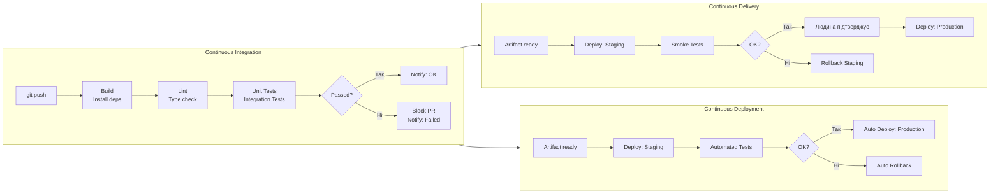
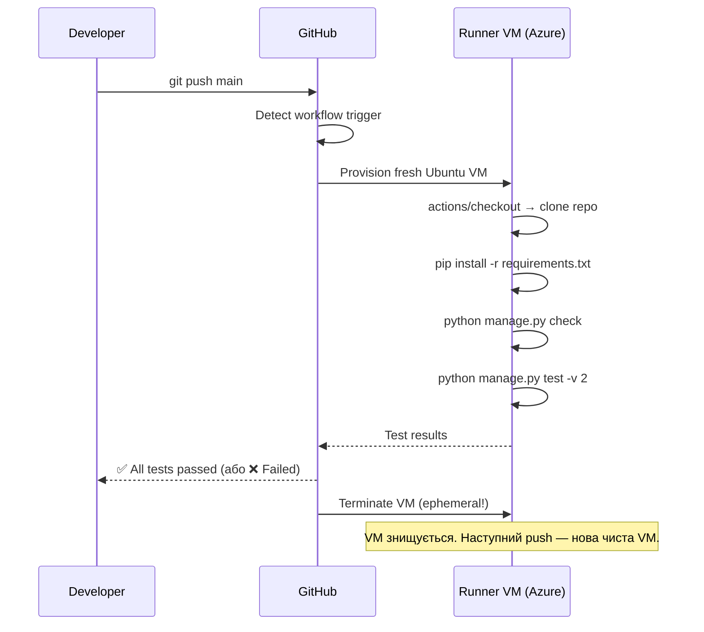
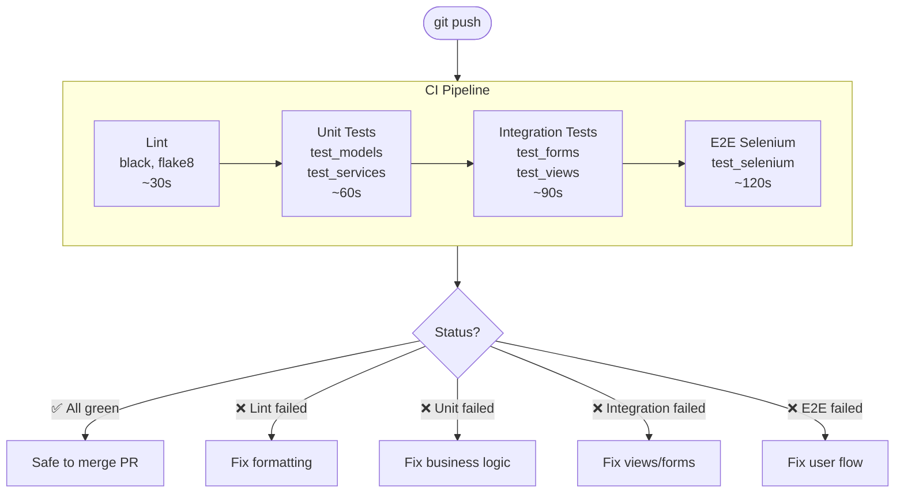

# CI/CD та GitHub Actions: автоматичне тестування Django-проєкту

> Цей файл — самодостатній довідник по CI/CD у контексті Django Testing.
> Тут пояснено: що таке CI/CD, як влаштований GitHub Actions, як читати
> існуючий `django-tests.yml` у нашому проєкті, і як це все пов'язано з тестами,
> які ти вже пишеш.

---

## Зміст

**Концепції**
- [1. Проблема, яку вирішує CI/CD](#1-проблема-яку-вирішує-cicd)
- [2. Що таке CI/CD](#2-що-таке-cicd)
- [3. Continuous Integration vs Continuous Delivery vs Continuous Deployment](#3-continuous-integration-vs-continuous-delivery-vs-continuous-deployment)

**GitHub Actions**
- [4. Компоненти GitHub Actions](#4-компоненти-github-actions)
- [5. Як читати YAML workflow](#5-як-читати-yaml-workflow)
- [6. Наш django-tests.yml — рядок за рядком](#6-наш-django-testsyml--рядок-за-рядком)
- [7. Events — коли запускати](#7-events--коли-запускати)
- [8. Jobs і Steps — що і як виконується](#8-jobs-і-steps--що-і-як-виконується)
- [9. Actions — готові блоки](#9-actions--готові-блоки)
- [10. Runners — де виконується код](#10-runners--де-виконується-код)

**Практика**
- [11. Як переглянути результати в GitHub](#11-як-переглянути-результати-в-github)
- [12. CI/CD і піраміда тестування](#12-cicd-і-піраміда-тестування)
- [13. GitHub Pages — публікація статичного сайту](#13-github-pages--публікація-статичного-сайту)
- [14. Типові помилки та як їх читати](#14-типові-помилки-та-як-їх-читати)
- [15. Питання для самоперевірки](#15-питання-для-самоперевірки)

---

## 1. Проблема, яку вирішує CI/CD

Уяви ситуацію. Ти написав функцію `create_note_for_user`. Вона пройшла локальні тести. Ти зробив `git push`. Через дві години виявляється, що форма на сторінці реєстрації більше не зберігає дані.

Як таке відбувається? Ти не торкався форми. Але десь зміна у сервісному шарі потягла за собою залежність, яку ти не бачив.

Без автоматизації цей ланцюжок виглядає так:

```
Розробник A         Розробник B         Деплой у production
пише фічу ─────┐   пише фічу ─────┐
               │                   │
               └── merge вручну ───┴── тести вручну ── деплой вручну
                   (merge conflicts!)  (хтось забув)    (2+ год. ритуалів)
```

А потім у production — баг. І ніхто точно не знає, чия зміна його спричинила.

**CI/CD вирішує саме це:** кожен `git push` автоматично запускає повний набір тестів на чистому сервері. Якщо тести пройшли — код безпечний для злиття. Якщо впали — розробник бачить це ще до того, як код потрапить до `main`.

---

## 2. Що таке CI/CD

**CI/CD** розшифровується як Continuous Integration / Continuous Delivery (або Deployment).

Це не один інструмент і не одна кнопка. Це спосіб організувати роботу команди так, щоб тестування і деплой відбувалися автоматично після кожної зміни.

Коротко:

| Скорочення | Назва | Що робить |
|---|---|---|
| CI | Continuous Integration | Автоматично збирає і тестує код після кожного push |
| CD | Continuous Delivery | Автоматично готує білд до production — але деплоїть людина |
| CD | Continuous Deployment | Автоматично деплоїть у production без участі людини |

Різниця між Delivery і Deployment в одному слові: **людина**. У Delivery людина натискає кнопку підтвердження. У Deployment — ні.

Важлива думка:

> CI/CD — це не про інструменти. Це про те, що тести запускаються автоматично і що feedback приходить швидко.

---

## 3. Continuous Integration vs Continuous Delivery vs Continuous Deployment

Розгорнута схема:



Де зараз наш `crispy_notes_project`? На рівні **CI**: кожен push до `main` запускає тести. Деплой ще не автоматизований — але це перший і найважливіший крок.

---

## 4. Компоненти GitHub Actions

GitHub Actions — це платформа CI/CD, вбудована прямо в GitHub. Не потрібно сторонніх сервісів.

Ієрархія компонентів:

```
Репозиторій
└── .github/
    └── workflows/
        └── django-tests.yml     ← Workflow
            │
            ├── on: push         ← Event (тригер)
            │
            └── jobs:
                ├── test:        ← Job 1
                │   ├── step 1   ← Step: checkout
                │   ├── step 2   ← Step: setup-python
                │   └── step 3   ← Step: pytest
                │
                └── test-selenium:  ← Job 2 (needs: test)
                    ├── step 1
                    └── step 2
```

| Компонент | Що це | Аналогія |
|---|---|---|
| Workflow | Весь сценарій у YAML файлі | Сценарій вистави |
| Event | Тригер, що запускає workflow | Піднімається завіса |
| Job | Набір кроків на одному runner | Акт вистави |
| Step | Одна команда або action | Окрема сцена |
| Action | Готовий переиспользований крок | Реквізит з магазину |
| Runner | Сервер де виконується код | Майданчик |

---

## 5. Як читати YAML workflow

Workflow — це YAML файл. Ось мінімальний приклад з поясненням:

```yaml
name: Django Tests          # Назва (відображається в GitHub → Actions)

on:                         # Коли запускати
  push:
    branches: [main]        # При push у main

jobs:                       # Що робити
  test:                     # Назва job
    runs-on: ubuntu-latest  # На якій ОС

    steps:                  # Кроки по порядку
      - uses: actions/checkout@v4       # Клонувати репозиторій
      - uses: actions/setup-python@v5   # Встановити Python
        with:
          python-version: "3.12"
      - run: pip install -r requirements.txt   # Shell команда
      - run: python manage.py test             # Запустити тести
```

Правила читання:
- `uses:` — взяти готовий action (з marketplace)
- `run:` — виконати shell команду
- `with:` — параметри для action
- `needs:` — цей job чекає іншого
- `env:` — змінні середовища

---

## 6. Наш django-tests.yml — рядок за рядком

У нашому проєкті вже є workflow:

```
crispy_notes_project/.github/workflows/django-tests.yml
```

Зверни увагу: цей файл знаходиться всередині `crispy_notes_project/`, тому GitHub його **не запускає автоматично** — він лежить не в кореневій директорії репозиторію. Він служить зразком. Робочий файл для реального репозиторію треба покласти у:

```
<корінь-репо>/.github/workflows/django-tests.yml
```

Розберемо його по частинах.

### Тригери

```yaml
on:
  push:
    branches: [ main, master ]   # push у main або master
  pull_request:
    branches: [ main, master ]   # PR до main або master
  workflow_dispatch:             # ручний запуск через кнопку в UI
```

Що відбувається: якщо хтось відкриває Pull Request до `main` → GitHub побачить `on: pull_request` → запустить workflow → результат (зелений/червоний) з'явиться прямо у PR.

### Job 1: Unit + Integration тести

```yaml
jobs:
  test:
    name: Unit & Integration Tests
    runs-on: ubuntu-latest
```

`ubuntu-latest` — це свіжа VM на Azure, яка знищується після кожного запуску. Немає стану між запусками.

```yaml
    steps:
      - name: Checkout code
        uses: actions/checkout@v4
```

Перший крок завжди однаковий: клонувати репозиторій на VM. Без цього кроку на runner-і взагалі немає твого коду.

```yaml
      - name: Cache pip dependencies
        uses: actions/cache@v4
        with:
          path: ~/.cache/pip
          key: ${{ runner.os }}-pip-${{ hashFiles('requirements.txt') }}
          restore-keys: |
            ${{ runner.os }}-pip-
```

Кеш pip залежностей. Якщо `requirements.txt` не змінився — pip пакети завантажаться з кешу замість інтернету. Прискорює pipeline з 3 хвилин до 1 хвилини.

```yaml
      - name: Django system check
        run: python manage.py check
```

`manage.py check` — вбудована Django команда. Перевіряє конфігурацію, моделі, middleware без запуску сервера. Якщо у тебе помилка у `settings.py` — дізнаєшся ще до запуску тестів.

```yaml
      - name: Run unit and integration tests
        run: python manage.py test hello_app.tests.test_models \
             hello_app.tests.test_services hello_app.tests.test_forms \
             hello_app.tests.test_views -v 2
```

Запускає всі тести крім Selenium (вони в окремому job). Параметр `-v 2` — verbose, показує назву кожного тесту.

```yaml
      - name: Generate coverage report
        run: |
          coverage run manage.py test ...
          coverage report
          coverage xml
```

Coverage: запускає тести через `coverage run`, щоб відстежити які рядки коду виконувались. `coverage xml` генерує файл для інтеграції з такими сервісами як Codecov.

```yaml
      - name: Upload coverage artifact
        uses: actions/upload-artifact@v4
        with:
          name: coverage-report
          path: coverage.xml
```

Зберігає `coverage.xml` як артефакт — файл, який можна завантажити після завершення workflow через GitHub UI.

### Job 2: Selenium E2E

```yaml
  test-selenium:
    needs: test           # Запускати ПІСЛЯ успіху job "test"
    runs-on: ubuntu-latest

    services:
      selenium:
        image: selenium/standalone-chrome:latest
        options: --shm-size=2gb
        ports:
          - 4444:4444
```

`services` — це Docker контейнери, які запускаються поруч із runner. Selenium/standalone-chrome запускає Chrome у безголовому режимі. Наш тест підключається до нього через `http://localhost:4444`.

```yaml
    steps:
      - name: Run Selenium E2E tests
        env:
          SELENIUM_REMOTE_URL: http://localhost:4444/wd/hub
        run: python manage.py test hello_app.tests.test_selenium -v 2
```

`SELENIUM_REMOTE_URL` — змінна середовища, яку читає `_make_driver()` у коді тестів. Якщо вона є — Selenium підключається до Remote WebDriver замість локального браузера.

---

## 7. Events — коли запускати

Найчастіше використовувані тригери:

```yaml
on:
  # При push у певні гілки
  push:
    branches: [main, develop]
    paths: ['hello_app/**', 'tests/**']  # Тільки якщо ці файли змінились

  # При відкритті або оновленні PR
  pull_request:
    types: [opened, synchronize, reopened]

  # За розкладом (cron-синтаксис)
  schedule:
    - cron: '0 6 * * 1'   # Щопонеділка о 6:00 UTC

  # Ручний запуск через GitHub UI
  workflow_dispatch:

  # При публікації релізу
  release:
    types: [published]
```

Практична порада: для навчального проєкту достатньо `push` і `pull_request`. `schedule` корисний для нічних повних тест-ранів, `release` — для деплою при публікації версії.

---

## 8. Jobs і Steps — що і як виконується

### Паралельність і залежності

За замовчуванням jobs виконуються **паралельно**. `needs` змінює це:

```yaml
jobs:
  lint:          # Запускається одразу
    ...
  test:          # Запускається одразу (паралельно з lint)
    ...
  test-selenium:
    needs: test  # Чекає test
    ...
  deploy:
    needs: [lint, test]   # Чекає ОБОХ
    ...
```

Як це виглядає по часу:

```
Час:    0s          30s         60s         90s
        │           │           │           │
lint    ├───────────┤
test    ├───────────────────────┤
selenium                        ├───────────┤
deploy              (не запустить поки не пройдуть lint і test)
```

### Умовне виконання

```yaml
steps:
  - name: Deploy (тільки при успіху)
    if: success()
    run: ./deploy.sh

  - name: Сповістити про помилку (при будь-якій)
    if: failure()
    run: ./notify.sh

  - name: Очистити temp файли (завжди)
    if: always()
    run: rm -rf /tmp/test_*

  - name: Деплоїти тільки з main
    if: github.ref == 'refs/heads/main'
    run: ./deploy.sh
```

---

## 9. Actions — готові блоки

Actions — це перевикористані кроки з GitHub Marketplace.

### Найчастіше використовувані у Django проєктах

```yaml
# Клонування репозиторію (завжди перший крок)
- uses: actions/checkout@v4

# Встановлення Python з кешом pip
- uses: actions/setup-python@v5
  with:
    python-version: '3.12'
    cache: 'pip'            # Автоматично кешує pip

# Ручний кеш (більше контролю)
- uses: actions/cache@v4
  with:
    path: ~/.cache/pip
    key: ${{ runner.os }}-pip-${{ hashFiles('requirements.txt') }}

# Зберегти файл як артефакт
- uses: actions/upload-artifact@v4
  with:
    name: test-results
    path: coverage.xml
    retention-days: 7       # Зберігати 7 днів

# Завантажити артефакт в іншому job
- uses: actions/download-artifact@v4
  with:
    name: test-results
```

### Передача даних між Jobs

Jobs не мають спільної файлової системи. Для передачі даних: артефакти або outputs:

```yaml
jobs:
  build:
    runs-on: ubuntu-latest
    outputs:
      version: ${{ steps.ver.outputs.version }}
    steps:
      - id: ver
        run: echo "version=$(cat VERSION)" >> $GITHUB_OUTPUT

  deploy:
    needs: build
    runs-on: ubuntu-latest
    steps:
      - run: echo "Deploying ${{ needs.build.outputs.version }}"
```

---

## 10. Runners — де виконується код

### GitHub-hosted runners

| Runner | ОС | CPU | RAM |
|---|---|---|---|
| `ubuntu-latest` | Ubuntu 22.04 | 2-core | 7 GB |
| `windows-latest` | Windows Server 2022 | 2-core | 7 GB |
| `macos-latest` | macOS 13 | 3-core | 14 GB |

Для Django проєктів завжди `ubuntu-latest` — найшвидший і найдешевший.

### Що відбувається коли ти робиш git push



Важлива деталь: VM **ephemeral** — знищується після кожного запуску. Немає ніякого "стану" між запусками. Якщо тести проходять на runner — вони проходять на чистій машині без твоїх локальних налаштувань.

---

## 11. Як переглянути результати в GitHub

1. Відкрий репозиторій на GitHub
2. Вкладка **Actions** — список всіх workflow runs
3. Клікни на конкретний run — побачиш граф jobs
4. Клікни на job — побачиш список steps
5. Клікни на step — побачиш live logs

### Що означають кольори

| Колір | Значення |
|---|---|
| Зелений ✅ | Step/Job завершився успішно |
| Жовтий 🟡 | Step/Job виконується прямо зараз |
| Червоний ❌ | Step/Job провалився |
| Сірий ⏭ | Step/Job пропущений (через `if:` або `needs:`) |

### Live logs — твій найкращий інструмент дебагінгу

Кожен step розгортається у повний лог з:
- Timestamp кожного рядка
- Stdout і stderr процесу
- Кнопка "Download log archive"

Якщо тест впав — розгорни step з тестами і читай вивід так само, як читаєш його локально.

---

## 12. CI/CD і піраміда тестування

Пам'ятаєш піраміду з [INDEX.md](INDEX.md)?

```
        E2E / Selenium
      integration tests
    unit tests (основа)
```

У CI/CD кожен рівень відповідає за свою роль:



Чому важливий порядок? Lint падає за 30 секунд. Якщо є проблема з форматуванням — ти дізнаєшся ще до того як витратиш 5 хвилин на повний run. "Fail fast" — принцип хорошого CI.

---

## 13. GitHub Pages — публікація статичного сайту

GitHub Pages — вбудований спосіб публікувати статичний сайт прямо з репозиторію. Для Django документації або landing page.

### Спосіб 1: Публікація з гілки (простий)

```
Settings → Pages → Source: Deploy from a branch
    └── Branch: main, /docs
```

Поклади HTML/CSS у папку `docs/` → пуш → сайт доступний за адресою `username.github.io/repo`.

### Спосіб 2: Через GitHub Actions (гнучкий)

```yaml
name: Deploy Documentation

on:
  push:
    branches: [main]

permissions:
  contents: read
  pages: write
  id-token: write

jobs:
  build:
    runs-on: ubuntu-latest
    steps:
      - uses: actions/checkout@v4

      - uses: actions/setup-python@v5
        with:
          python-version: '3.12'

      - name: Build MkDocs site
        run: |
          pip install mkdocs mkdocs-material
          mkdocs build

      - uses: actions/upload-pages-artifact@v3
        with:
          path: ./site

  deploy:
    environment:
      name: github-pages
      url: ${{ steps.deployment.outputs.page_url }}
    needs: build
    runs-on: ubuntu-latest
    steps:
      - uses: actions/deploy-pages@v4
        id: deployment
```

### Важливі обмеження

```
⚠️  Сайт ПУБЛІЧНО доступний в інтернеті — навіть якщо репозиторій приватний.

⚠️  CNAME файл у репозиторії НЕ налаштовує custom domain.
    Домен змінюється тільки через Settings → Pages.

ℹ️  Push через GITHUB_TOKEN не тригерить Pages rebuild
    (захист від нескінченної рекурсії).
```

---

## 14. Типові помилки та як їх читати

### Workflow не запускається

```
Симптом:  push зроблено, але в Actions tab немає нового run

Причини:
  - YAML файл не в <repo-root>/.github/workflows/ (як наш зразок)
  - Синтаксична помилка у YAML (перевір відступи)
  - Гілка не відповідає фільтру у on.push.branches

Діагностика:  GitHub → Actions → "Check workflows" або дивись червону іконку
              біля коміту в списку комітів
```

### Process completed with exit code 1

```
Симптом:  Step "Run unit tests" червоний, у лозі:
          FAILED hello_app/tests/test_views.py::NoteListViewTest::test_login_required

Причина:  Тест впав. Це нормально — для цього і є CI.

Дія:      Розгорни step → читай traceback → виправ код або тест
```

### Permission denied / Resource not accessible

```
Симптом:  Step "Upload artifact" або "Deploy Pages" червоний

Причина:  У workflow немає потрібних прав

Рішення:  Додай у верхній рівень YAML:
          permissions:
            contents: read
            pages: write
            id-token: write
```

### Cache miss кожного разу

```
Симптом:  pip install займає 3 хвилини при кожному run

Причина:  cache key змінюється — можливо hashFiles бере неправильний файл

Рішення:  Перевір шлях:
          key: ${{ runner.os }}-pip-${{ hashFiles('**/requirements.txt') }}
                                       ↑ glob шукає requirements.txt
                                         у будь-якій підпапці
```

### Секрет не передано в середовище

```
Симптом:  Step падає з "API key not found" або "env var is None"

Причина:  Секрет є в Settings, але не передано у workflow

Рішення:
    - name: Deploy
      env:
        API_KEY: ${{ secrets.MY_API_KEY }}  ← явно передати
      run: ./deploy.sh
```

---

## 15. Питання для самоперевірки

1. Чим CI відрізняється від Continuous Delivery і Continuous Deployment?
2. Чому runner VM знищується після кожного run — це перевага чи обмеження?
3. Навіщо `actions/checkout@v4` має бути першим кроком?
4. Чому `needs: test` у `test-selenium` — це важливо?
5. Що відбудеться якщо `on: push` вказати без `branches: [main]`?
6. Навіщо кешувати pip залежності, якщо можна просто встановлювати кожного разу?
7. Де знаходиться наш `django-tests.yml` і чому GitHub його не запускає автоматично?
8. Яку роль відіграє `SELENIUM_REMOTE_URL` у Job 2 і де цю змінну читає код тестів?
9. Чому lint виконується першим у pipeline, а Selenium останнім?
10. Якщо тест падає в CI але проходить локально — що варто перевірити першим?
