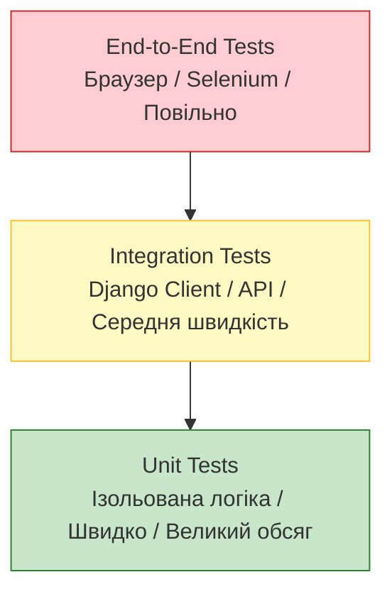
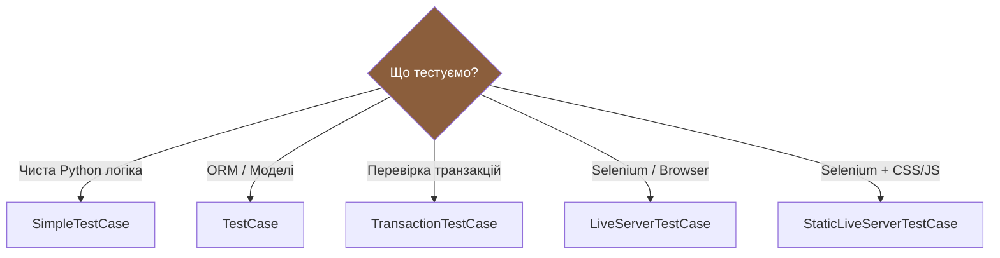
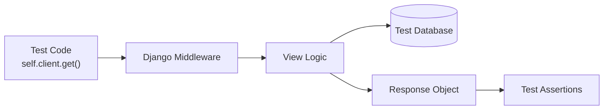
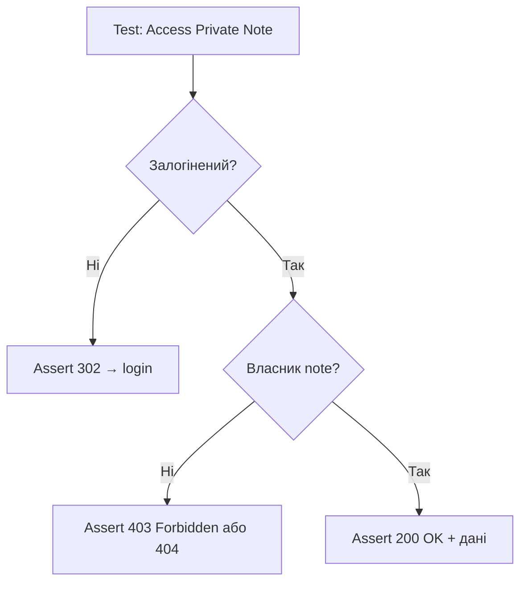
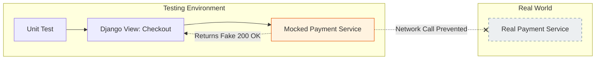
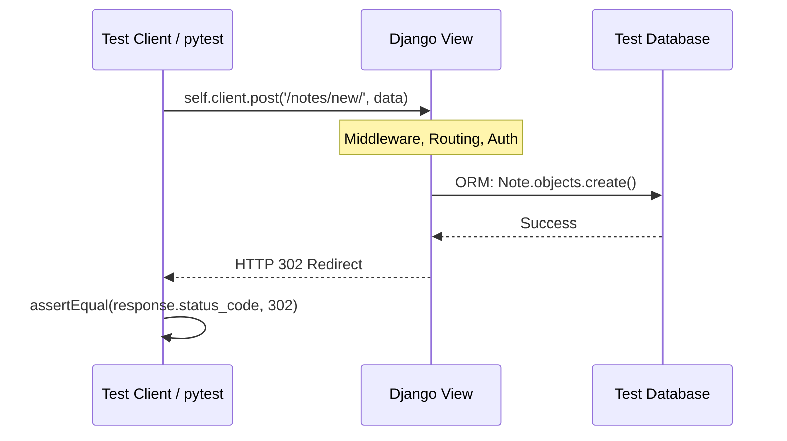
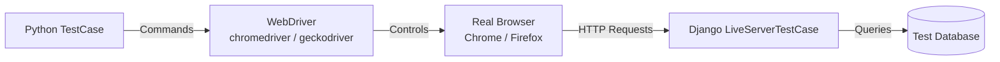
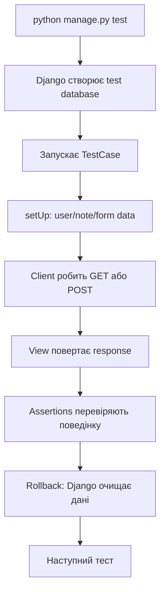

# Тестування Django-застосунку: повний довідник

> Після цього файлу ти зможеш писати Django-тести через `TestCase`, розуміти test database, перевіряти model/form/view/URL, тестувати авторизацію, мокати зовнішні сервіси, писати Selenium E2E тести і читати результати `python manage.py test`.

---

## 1. Навіщо тестування існує

У backend-розробці баги неминучі — застосунок є складною абстрактною моделлю реального світу. Щоразу коли ти вносиш зміну, ти створюєш ризик. Зміна одного поля в моделі може зламати views, serializers і templates по всьому проєкту.

Тестування існує як **механізм впевненості**. Написавши тести, ти навчаєш застосунок перевіряти себе самостійно.

Як думають про тести досвідчені розробники:

| Ментальна модель | Що це означає |
|---|---|
| **Страховий поліс** | Тести сигналізують до того, як баг потрапить у production |
| **Контракт** | Тест фіксує точно що функція або endpoint обіцяє робити |
| **Експеримент** | Ти висуваєш гіпотезу ("invalid data → 400") і запускаєш код щоб довести |
| **Захист від регресій** | Баг, виправлений одного разу, більше не повернеться |

**Обмеження:** тести перевіряють тільки ті сценарії, які ти явно описав. Вони не магічно захищають застосунок і не ловлять невідомі граничні випадки.

Django дає test runner:

```bash
python manage.py test
```

Він:

1. знаходить тести;
2. створює окрему test database;
3. запускає перевірки;
4. очищає дані;
5. показує результат.

---

## 2. Ментальна модель: test database

Django-тести — це тренувальна копія твого застосунку.

У реальному проєкті є production database. Її чіпати тестами не можна.

Django створює окрему тестову базу:

```text
real database      -> не чіпаємо
test database      -> створюємо, наповнюємо, очищаємо
```

Тому в тесті можна сміливо робити:

```python
Note.objects.create(...)
```

Ці дані існують тільки під час тесту і повністю ізольовані.

---

## 3. Типи тестів



| Тип | Що перевіряє | Швидкість | Обсяг |
|---|---|---|---|
| **Unit** | Одна функція або метод у ізоляції | Дуже швидко | ~70% тестів |
| **Integration** | Взаємодія компонентів (view + DB + form) | Середньо | ~20% тестів |
| **Functional** | Поведінка API endpoint: HTTP коди, JSON payload | Середньо | — |
| **E2E** | Весь маршрут від браузера до БД | Повільно | ~10% тестів |
| **Regression** | Відтворює конкретний баг, щоб він не повернувся | Залежить | — |

---

## 4. Django Testing Architecture

Django розширює Python `unittest` для веб-специфічних сценаріїв.



| Клас | База даних | Для чого |
|---|---|---|
| `SimpleTestCase` | Немає доступу | URL tests, прості views без БД |
| `TestCase` | Є test database, rollback між тестами | Найчастіший варіант (90% випадків) |
| `TransactionTestCase` | Реальна transaction behavior | `commit`, `rollback`, `select_for_update()` |
| `LiveServerTestCase` | Test DB + live HTTP server | Selenium |
| `StaticLiveServerTestCase` | Live server + static files | Selenium з CSS/JS |

---

## 5. Мінімальний notes-приклад

Уявімо app `notes`.

`notes/models.py`:

```python
from django.conf import settings
from django.db import models


class Note(models.Model):
    owner = models.ForeignKey(
        settings.AUTH_USER_MODEL,
        on_delete=models.CASCADE,
        related_name="notes",
    )
    title = models.CharField(max_length=120)
    content = models.TextField()
    is_archived = models.BooleanField(default=False)
    created_at = models.DateTimeField(auto_now_add=True)

    def __str__(self):
        return self.title

    def archive(self):
        self.is_archived = True
        self.save(update_fields=["is_archived"])
```

Що тут варто тестувати:

| Частина | Тестувати? | Чому |
|---|---|---|
| `CharField` зберігає рядок | Ні | Це тестує сам Django |
| `__str__` повертає title | Так | Це наша поведінка |
| `archive()` змінює `is_archived` | Так | Це наша бізнес-логіка |
| `owner` є ForeignKey | Зазвичай ні | Це декларація моделі |

---

## 6. Model tests

Структура:

```text
notes/
└── tests/
    └── test_models.py
```

```python
# notes/tests/test_models.py
from django.contrib.auth import get_user_model
from django.test import TestCase

from notes.models import Note


User = get_user_model()


class NoteModelTest(TestCase):
    def setUp(self):
        self.user = User.objects.create_user(username="student", password="pw")

    def test_note_str_returns_title(self):
        note = Note.objects.create(
            owner=self.user,
            title="First note",
            content="Hello",
        )

        self.assertEqual(str(note), "First note")

    def test_archive_marks_note_as_archived(self):
        note = Note.objects.create(
            owner=self.user,
            title="First note",
            content="Hello",
        )

        note.archive()
        note.refresh_from_db()  # перечитуємо з БД, не з пам'яті

        self.assertTrue(note.is_archived)

    def test_note_creation_and_ownership(self):
        note = Note.objects.create(
            owner=self.user,
            title="My note",
            content="Testing models"
        )

        self.assertEqual(note.owner, self.user)
        self.assertFalse(note.is_archived)
```

Чому `refresh_from_db()`?

Метод `archive()` зберігає зміни в базу. `refresh_from_db()` перечитує об'єкт з БД і перевіряє, що зміна справді збережена, а не тільки сталася в пам'яті Python.

---

## 7. Form tests

`notes/forms.py`:

```python
from django import forms

from notes.models import Note


class NoteForm(forms.ModelForm):
    class Meta:
        model = Note
        fields = ["title", "content"]

    def clean_title(self):
        title = self.cleaned_data["title"].strip()

        if title.lower() == "admin":
            raise forms.ValidationError("Title cannot be admin.")

        return title
```

Тести:

```python
# notes/tests/test_forms.py
from django.test import TestCase

from notes.forms import NoteForm


class NoteFormTest(TestCase):
    def test_form_is_valid_with_title_and_content(self):
        form = NoteForm(data={"title": "My note", "content": "Hello"})
        self.assertTrue(form.is_valid())

    def test_form_is_invalid_without_title(self):
        form = NoteForm(data={"title": "", "content": "Hello"})
        self.assertFalse(form.is_valid())
        self.assertIn("title", form.errors)

    def test_form_strips_title_spaces(self):
        form = NoteForm(data={"title": "  My note  ", "content": "Hello"})
        self.assertTrue(form.is_valid())
        self.assertEqual(form.cleaned_data["title"], "My note")

    def test_form_rejects_reserved_title(self):
        form = NoteForm(data={"title": "admin", "content": "Hello"})
        self.assertFalse(form.is_valid())
        self.assertIn("title", form.errors)
```

Що важливо:

- у form test ми передаємо "сирі" дані як із HTML-форми (словник);
- потім викликаємо `form.is_valid()`;
- після valid form можна дивитися `cleaned_data`;
- після invalid form дивимось `form.errors`.

---

## 8. URL tests

```python
# notes/tests/test_urls.py
from django.test import SimpleTestCase
from django.urls import resolve, reverse

from notes.views import note_list


class NoteUrlsTest(SimpleTestCase):
    def test_note_list_url_resolves_to_note_list_view(self):
        match = resolve(reverse("note_list"))
        self.assertEqual(match.func, note_list)

    def test_note_create_url_resolves_to_note_create_view(self):
        from notes.views import note_create
        match = resolve(reverse("note_create"))
        self.assertEqual(match.func, note_create)
```

Тут не потрібна база, тому використовуємо `SimpleTestCase`.

---

## 9. View tests через Django Client

Django `self.client` — це не реальний браузер. Це швидкий тестовий HTTP-клієнт.



Він може:

- зробити GET/POST запит;
- пройти через URL routing, middleware, view;
- повернути response з status code, template, context.

Він **не може**:

- виконати JavaScript;
- перевірити реальний CSS layout;
- клікнути кнопку як браузер.

View:

```python
# notes/views.py
from django.contrib.auth.decorators import login_required
from django.shortcuts import render

from notes.models import Note


@login_required
def note_list(request):
    notes = Note.objects.filter(owner=request.user, is_archived=False)
    return render(request, "notes/note_list.html", {"notes": notes})
```

Тест:

```python
# notes/tests/test_views.py
from django.contrib.auth import get_user_model
from django.test import TestCase
from django.urls import reverse

from notes.models import Note


User = get_user_model()


class NoteListViewTest(TestCase):
    def setUp(self):
        self.user = User.objects.create_user(username="student", password="pw")

    def test_anonymous_user_is_redirected_to_login(self):
        response = self.client.get(reverse("note_list"))
        self.assertEqual(response.status_code, 302)

    def test_logged_user_can_open_note_list(self):
        self.client.login(username="student", password="pw")
        response = self.client.get(reverse("note_list"))

        self.assertEqual(response.status_code, 200)
        self.assertTemplateUsed(response, "notes/note_list.html")

    def test_note_list_shows_only_current_user_notes(self):
        other_user = User.objects.create_user(username="other", password="pw")
        own_note = Note.objects.create(owner=self.user, title="Mine", content="Hello")
        Note.objects.create(owner=other_user, title="Not mine", content="Secret")

        self.client.login(username="student", password="pw")
        response = self.client.get(reverse("note_list"))

        notes = list(response.context["notes"])
        self.assertIn(own_note, notes)
        self.assertEqual(len(notes), 1)
```

Останній тест важливий: він перевіряє **ownership** — User A не бачить нотатки User B.

---

## 10. POST tests: створення нотатки

```python
# notes/tests/test_views.py
class NoteCreateViewTest(TestCase):
    def setUp(self):
        self.user = User.objects.create_user(
            username="student",
            email="student@example.com",
            password="pw",
        )

    def test_logged_user_can_create_note(self):
        self.client.login(username="student", password="pw")

        response = self.client.post(reverse("note_create"), {
            "title": "Created from test",
            "content": "Hello",
        })

        self.assertEqual(response.status_code, 302)
        self.assertTrue(Note.objects.filter(title="Created from test").exists())

    def test_created_note_belongs_to_current_user(self):
        self.client.login(username="student", password="pw")

        self.client.post(reverse("note_create"), {
            "title": "Owner test",
            "content": "Hello",
        })

        note = Note.objects.get(title="Owner test")
        self.assertEqual(note.owner, self.user)

    def test_invalid_form_does_not_create_note(self):
        self.client.login(username="student", password="pw")

        response = self.client.post(reverse("note_create"), {
            "title": "",
            "content": "Hello",
        })

        self.assertEqual(response.status_code, 200)  # форма знову — немає redirect
        self.assertFalse(Note.objects.exists())
```

Що ми перевірили:

- POST запит з валідними даними → нотатка збережена + redirect;
- owner береться з `request.user`, не з форми;
- invalid POST → форма повертається назад (немає redirect).

---

## 11. Тестування авторизації та ownership

Найважливіший клас тестів для notes-app — перевіряємо що User A не може читати/змінювати дані User B.



```python
# notes/tests/test_views.py
class NoteAuthorizationTest(TestCase):
    def setUp(self):
        self.alice = User.objects.create_user(username="alice", password="pw")
        self.bob   = User.objects.create_user(username="bob",   password="pw")
        self.alice_note = Note.objects.create(
            owner=self.alice,
            title="Alice's Secret",
            content="Private",
        )

    def test_anonymous_access_redirects_to_login(self):
        response = self.client.get(f"/notes/{self.alice_note.id}/edit/")
        self.assertEqual(response.status_code, 302)
        self.assertIn("/accounts/login/", response["Location"])

    def test_alice_can_edit_her_own_note(self):
        self.client.login(username="alice", password="pw")
        response = self.client.post(
            f"/notes/{self.alice_note.id}/edit/",
            {"title": "Updated", "content": "Changed"},
        )
        self.assertEqual(response.status_code, 302)

    def test_bob_cannot_edit_alice_note(self):
        self.client.login(username="bob", password="pw")
        response = self.client.post(
            f"/notes/{self.alice_note.id}/edit/",
            {"title": "Hacked", "content": "By bob"},
        )
        # 403 Forbidden або 404 залежно від реалізації view
        self.assertIn(response.status_code, [403, 404])
        # Нотатка НЕ змінилася
        self.alice_note.refresh_from_db()
        self.assertEqual(self.alice_note.title, "Alice's Secret")
```

`force_login()` vs `login()`:

| Метод | Як працює | Коли використовувати |
|---|---|---|
| `self.client.login(username=, password=)` | Перевіряє пароль через auth backend | Коли тестуєш сам процес логіну |
| `self.client.force_login(user)` | Одразу встановлює сесію | У 95% тестів — швидше |

---

## 12. Django Test Client: корисні assertions

| Assertion | Що перевіряє | Приклад |
|---|---|---|
| `assertEqual(a, b)` | Рівність | `self.assertEqual(response.status_code, 200)` |
| `assertTrue(x)` | Істина | `self.assertTrue(form.is_valid())` |
| `assertFalse(x)` | Хибність | `self.assertFalse(form.is_valid())` |
| `assertIn(a, b)` | Наявність | `self.assertIn("title", form.errors)` |
| `assertTemplateUsed` | Template | `self.assertTemplateUsed(response, "notes/list.html")` |
| `assertRedirects` | Redirect | `self.assertRedirects(response, reverse("note_list"))` |
| `assertContains` | Текст у HTML | `self.assertContains(response, "Alice's Note")` |
| `assertNotContains` | Текст відсутній | `self.assertNotContains(response, "Bob's Secret")` |
| `assertNumQueries` | Кількість SQL | `with self.assertNumQueries(2): ...` |

Приклад `assertRedirects`:

```python
def test_create_note_redirects_to_list(self):
    self.client.login(username="student", password="pw")

    response = self.client.post(reverse("note_create"), {
        "title": "Redirect test",
        "content": "Hello",
    })

    self.assertRedirects(response, reverse("note_list"))
```

---

## 13. Перевірка N+1 через `assertNumQueries`

N+1 проблема: сторінка робить один запит за списком, а потім ще по одному на кожен об'єкт.

Для 10 нотаток — 11 запитів. Для 1000 — 1001 запит. Це вбиває продуктивність.

```python
def test_note_list_query_count_is_stable(self):
    for index in range(10):
        Note.objects.create(
            owner=self.user,
            title=f"Note {index}",
            content="Hello",
        )

    self.client.login(username="student", password="pw")

    with self.assertNumQueries(3):
        self.client.get(reverse("note_list"))
```

Число `3` треба підібрати після реального запуску. Мета — щоб кількість запитів не росла зі збільшенням кількості нотаток.

---

## 14. Mocking зовнішніх сервісів

Мок — це підміна реального об'єкта або функції фейком на час одного тесту.

**Навіщо:** якщо застосунок відправляє email, заряджає кредитні картки або викликає зовнішній API, під час тестів ми **не хочемо** реально звертатися до цих сервісів. Це повільно, дорого і робить тести ненадійними.



`notes/services.py`:

```python
from django.core.mail import send_mail


def send_note_created_email(email, title):
    send_mail(
        subject="Note created",
        message=f"Your note '{title}' was created.",
        from_email="noreply@example.com",
        recipient_list=[email],
    )
```

Тест з `@patch`:

```python
# notes/tests/test_services.py
from unittest.mock import patch
from django.test import SimpleTestCase

from notes.services import send_note_created_email


class NoteEmailServiceTest(SimpleTestCase):
    @patch("notes.services.send_mail")
    def test_send_note_created_email_calls_send_mail(self, mock_send_mail):
        send_note_created_email("student@example.com", "My note")

        mock_send_mail.assert_called_once_with(
            subject="Note created",
            message="Your note 'My note' was created.",
            from_email="noreply@example.com",
            recipient_list=["student@example.com"],
        )
```

Тест view + mock:

```python
# notes/tests/test_views.py
from unittest.mock import patch

class NoteCreateViewTest(TestCase):
    ...

    @patch("notes.views.send_note_created_email")  # мокаємо у місці використання
    def test_logged_user_can_create_note(self, mock_send_email):
        self.client.login(username="student", password="pw")

        response = self.client.post(reverse("note_create"), {
            "title": "Created from test",
            "content": "Hello",
        })

        self.assertRedirects(response, reverse("note_list"))
        mock_send_email.assert_called_once_with(
            "student@example.com",
            "Created from test",
        )

    @patch("notes.views.send_note_created_email")
    def test_invalid_form_does_not_send_email(self, mock_send_email):
        self.client.login(username="student", password="pw")

        self.client.post(reverse("note_create"), {
            "title": "",
            "content": "Hello",
        })

        mock_send_email.assert_not_called()
```

Чому `patch("notes.views.send_note_created_email")`, а не `patch("notes.services.send_note_created_email")`?

Бо view імпортує і **використовує** це ім'я у файлі `notes/views.py`. Мокаємо місце використання, не місце визначення.

---

## 15. Sequence diagram: request lifecycle



---

## 16. Coverage

Встановлення:

```bash
pip install coverage
```

Запуск:

```bash
coverage run manage.py test
coverage report
coverage html
```

Як читати:

```text
Name                    Stmts   Miss  Cover
-------------------------------------------
notes/models.py            18      0   100%
notes/forms.py             20      2    90%
notes/views.py             45      8    82%
```

Що coverage показує:

- які рядки виконувались під час тестів;
- які файли майже не зачеплені;
- де є "темні зони".

Що coverage **не показує**:

- чи правильні assertions;
- чи перевірені важливі бізнес-сценарії;
- чи не тестуєш ти випадково дурниці.

> 80% осмисленого coverage краще, ніж 100% тестів, які нічого важливого не перевіряють.

---

## 17. pytest для Django

Python `unittest` (на якому побудований `TestCase`) — перевірена система. Але сучасний backend часто використовує **pytest**.

| Аспект | unittest (Django TestCase) | pytest |
|---|---|---|
| Стиль | OOP: `class MyTest(TestCase)`, `self.assertEqual()` | Функціональний: `def test_...`, plain `assert` |
| Fixtures | `setUp()` / `tearDown()` — запускається перед кожним тестом | `@pytest.fixture` — ін'єктується тільки в ті тести що потребують |
| Однаковий тест з різними даними | Окремий метод для кожного сценарію | `@pytest.mark.parametrize` |
| Повідомлення про помилку | Стандартне | Реwriting assertions — показує точні значення |
| Django інтеграція | Вбудована | `pytest-django` плагін |

Приклад `@pytest.mark.parametrize`:

```python
import pytest
from notes.forms import NoteForm


@pytest.mark.parametrize("title,valid", [
    ("My note", True),
    ("", False),
    ("admin", False),
    ("  ", False),
])
def test_note_form_title_validation(title, valid):
    form = NoteForm(data={"title": title, "content": "Hello"})
    assert form.is_valid() == valid
```

Замість 4 окремих тест-функцій — одна параметризована.

Fixtures для DRY setUp:

```python
# conftest.py
import pytest
from django.contrib.auth.models import User


@pytest.fixture
def alice(db):
    return User.objects.create_user(username="alice", password="pw")


@pytest.fixture
def alice_note(alice):
    from notes.models import Note
    return Note.objects.create(owner=alice, title="Alice's Note", content="Hello")
```

```python
# test_views.py
def test_note_owner_can_view(client, alice, alice_note):
    client.force_login(alice)
    response = client.get(f"/notes/{alice_note.id}/")
    assert response.status_code == 200
```

---

## 18. E2E тести: Selenium

Поки unit і integration тести доводять що ізольовані backend-компоненти працюють математично, **E2E тести** доводять що вся система функціонує як єдиний продукт.

E2E тести відкривають реальний браузер, клікають кнопки, заповнюють форми і перевіряють що підсумковий HTML саме такий, яким його побачить реальний користувач.



Selenium vs Django Test Client:

| | Django Test Client | Selenium |
|---|---|---|
| Браузер | Ні (Python HTTP) | Так (реальний Chrome/Firefox) |
| JavaScript | Не виконується | Виконується |
| CSS rendering | Не перевіряється | Перевіряється |
| Швидкість | Дуже швидко | Повільно (~3–15s на тест) |
| Доступ до `response.context` | Так | Ні |
| Коли використовувати | 95% view тестів | Критичні user flows |

### Базова структура

```python
# notes/tests/test_e2e.py
import unittest
from django.contrib.auth import get_user_model
from django.contrib.staticfiles.testing import StaticLiveServerTestCase

try:
    from selenium import webdriver
    from selenium.webdriver.common.by import By
    from selenium.webdriver.chrome.options import Options as ChromeOptions
    from selenium.webdriver.support.ui import WebDriverWait
    from selenium.webdriver.support import expected_conditions as EC
    SELENIUM_AVAILABLE = True
except ImportError:
    SELENIUM_AVAILABLE = False


User = get_user_model()


def _make_headless_driver():
    options = ChromeOptions()
    options.add_argument("--headless=new")
    options.add_argument("--no-sandbox")
    options.add_argument("--disable-dev-shm-usage")
    return webdriver.Chrome(options=options)  # Selenium Manager авто-скачає chromedriver


@unittest.skipUnless(SELENIUM_AVAILABLE, "selenium not installed — pip install selenium")
class NoteAppE2ETest(StaticLiveServerTestCase):
    @classmethod
    def setUpClass(cls):
        super().setUpClass()
        if SELENIUM_AVAILABLE:
            cls.driver = _make_headless_driver()
            cls.driver.implicitly_wait(5)

    @classmethod
    def tearDownClass(cls):
        if SELENIUM_AVAILABLE:
            cls.driver.quit()
        super().tearDownClass()

    def setUp(self):
        self.user = User.objects.create_user(
            username="student",
            email="student@example.com",
            password="password123",
        )

    def test_login_and_create_note(self):
        login_url = f"{self.live_server_url}/accounts/login/"
        self.driver.get(login_url)

        self.driver.find_element(By.NAME, "username").send_keys("student")
        self.driver.find_element(By.NAME, "password").send_keys("password123")
        self.driver.find_element(By.CSS_SELECTOR, "[type='submit']").click()

        # Чекаємо redirect — click() асинхронний
        WebDriverWait(self.driver, 5).until(EC.url_changes(login_url))

        self.assertIn("/notes/", self.driver.current_url)
```

### Стратегії очікування (Waiting)

Сторінки завантажуються динамічно. Selenium може клікнути елемент до того як він з'явиться в DOM.

| Стратегія | Як | Коли |
|---|---|---|
| Implicit wait | `driver.implicitly_wait(5)` | Для всіх `find_element` викликів глобально |
| Explicit wait | `WebDriverWait(driver, 5).until(condition)` | Для конкретної умови (URL change, element clickable) |
| `time.sleep()` | НЕ використовуй | Зайво повільно або ненадійно |

```python
# Explicit wait: чекаємо поки кнопка стане клікабельною
confirm_btn = WebDriverWait(self.driver, 5).until(
    EC.element_to_be_clickable((By.ID, "confirm-delete"))
)
confirm_btn.click()

# Explicit wait: чекаємо зміни URL після login
WebDriverWait(self.driver, 5).until(
    EC.url_changes(f"{self.live_server_url}/accounts/login/")
)
```

### Session cookie trick

Замість заповнення форми логіну в браузері (повільно і залежить від стану форми), використовуй session cookie:

```python
def _login_via_cookie(self, user):
    # 1. Залогінитись через Django Test Client
    self.client.force_login(user)
    session_cookie = self.client.cookies["sessionid"]

    # 2. Відкрити будь-яку сторінку домену (браузер потребує відкритої сторінки)
    self.driver.get(f"{self.live_server_url}/")

    # 3. Передати session cookie до Selenium
    self.driver.add_cookie({
        "name":  "sessionid",
        "value": session_cookie.value,
        "path":  "/",
    })
```

### Вибір елементів

| Метод | Приклад | Надійність |
|---|---|---|
| `By.ID` | `By.ID, "login-btn"` | Найнадійніший |
| `By.NAME` | `By.NAME, "username"` | Відмінно для форм |
| `By.CSS_SELECTOR` | `By.CSS_SELECTOR, ".note-card > h2"` | Потужний |
| `By.XPATH` | `By.XPATH, "//button[text()='Delete']"` | Корисний, але brittle |

Додавай `id` або `data-test-id` атрибути в HTML спеціально для тестів:

```html
<button id="submit-note" type="submit">Save</button>
<a id="create-note-link" href="">Create note</a>
```

### Типові помилки Selenium

| Помилка | Причина | Фікс |
|---|---|---|
| `NoSuchElementException` | Неправильний selector або сторінка ще не завантажена | Перевір selector + implicit wait |
| `StaleElementReferenceException` | DOM оновився після того як знайшли елемент | Re-find елемент після DOM update |
| Тест падає нестабільно (flaky) | Анімація або AJAX | `WebDriverWait` замість `time.sleep()` |
| ChromeDriver mismatch | Версія chromedriver != Chrome | Selenium Manager вирішує автоматично |

---

## 19. Selenium у Docker/CI

На CI-сервері немає монітора. Є три стратегії:

### A — headless Chrome у Dockerfile

```dockerfile
RUN apt-get update && apt-get install -y chromium chromium-driver \
    && rm -rf /var/lib/apt/lists/*
```

```python
options = ChromeOptions()
options.add_argument("--headless=new")
options.add_argument("--no-sandbox")
options.add_argument("--disable-dev-shm-usage")
driver = webdriver.Chrome(options=options)
```

### B — офіційні Selenium Docker-образи

```yaml
# docker-compose.yml
services:
  web:
    build: .
    command: python manage.py test
    environment:
      - SELENIUM_REMOTE_URL=http://selenium:4444/wd/hub
    depends_on:
      selenium:
        condition: service_healthy

  selenium:
    image: selenium/standalone-chrome:latest
    shm_size: "2gb"
    healthcheck:
      test: ["CMD", "curl", "-f", "http://localhost:4444/status"]
      interval: 5s
      retries: 5
```

```python
import os

SELENIUM_REMOTE_URL = os.environ.get("SELENIUM_REMOTE_URL")

def _make_driver():
    if SELENIUM_REMOTE_URL:
        return webdriver.Remote(
            command_executor=SELENIUM_REMOTE_URL,
            options=webdriver.ChromeOptions(),
        )
    options = ChromeOptions()
    options.add_argument("--headless=new")
    return webdriver.Chrome(options=options)
```

### C — GitHub Actions

```yaml
services:
  selenium:
    image: selenium/standalone-chrome:latest
    options: --shm-size=2gb
    ports:
      - 4444:4444

steps:
  - name: Run tests
    env:
      SELENIUM_REMOTE_URL: http://localhost:4444/wd/hub
    run: python manage.py test
```

---

## 20. Реальний інжиніринг: стратегія за доменом

Стратегія тестування залежить від бізнес-домену:

| Домен | Фокус тестів |
|---|---|
| **Notes / Blog** | Ownership: User A не бачить дані User B. Тест `alice` vs `bob` для всіх views. |
| **Ecommerce** | E2E checkout flow. Unit tests для price calculation. Mock external payment gateway (Stripe). |
| **Dashboard / Analytics** | `assertNumQueries` — N+1 не допускається. Performance критична. |
| **API** | JSON payload contracts. HTTP status codes (201 vs 403). Token auth. |
| **Auth/Permissions** | Тест кожного рівня доступу: anonymous, user, staff, superuser. |

Правила для notes-app зокрема:

1. Більшість тестів повинні мати `alice` та `bob` — тестуємо tenant isolation.
2. Кожен view повинен мати anonymous redirect test.
3. Ownership тест: User B не може edit/delete/view чужу нотатку.

---

## 21. Типові помилки початківців

| Помилка | Чому виникає | Як виправити |
| ------- | ------------ | ------------ |
| Тестують Django ORM замість своєї логіки | Хочеться покрити model | Тестуй `__str__`, methods, constraints, ownership |
| Перевіряють тільки `status_code == 200` | Це найпростіше | Додай template, context, content assertions |
| Не тестують anonymous user | Локально завжди залогінені | Додай redirect test для кожного захищеного URL |
| Не тестують чужого користувача | Думають тільки про happy path | Створи User A і User B |
| Мокають form або model | Хочуть ізоляції | Form/model тестуй реально через test DB |
| Починають відразу із Selenium | Виглядає "повним" | Спочатку model → form → view tests |
| Не додають стабільні selectors | HTML для очей, не тестів | Додай `id` або `data-test-id` для E2E |
| Використовують `time.sleep()` | Простий спосіб чекати | Використовуй `WebDriverWait` |
| `coverage` є, а assertions слабкі | Дивляться на цифру | Перевіряй зміст тестів, не відсоток |
| Хардкодять `/notes/` у тестах | Лінощі | Використовуй `reverse("note_list")` |

---

## 22. Головна діаграма: архітектура тестування



---

## 23. Практика

1. Створи модель `Note` з `owner`, `title`, `content`, `is_archived`.
2. Напиши test для `__str__`.
3. Додай method `archive()` і test для нього.
4. Створи `NoteForm` і тести valid/invalid/strip/reserved title.
5. Створи `note_list` view і перевір: anonymous redirect, logged user 200, User A не бачить User B.
6. Створи `note_create` view і перевір: POST → note saved, owner = request.user, invalid → no redirect.
7. Додай email service + mock у view test.
8. Напиши один Selenium smoke test: login → create note → note visible.
9. Запусти coverage і знайди непокриті рядки.

---

## 24. Питання для самоперевірки

1. Чому Django створює окрему test database?
2. Чим Django `Client` відрізняється від Selenium?
3. Навіщо тестувати User A vs User B?
4. Коли потрібен `SimpleTestCase`?
5. Чому `patch("notes.views.send_mail")` — неправильно, а `patch("notes.views.send_note_created_email")` — правильно?
6. Що таке `force_login` і чим він відрізняється від `login()`?
7. Навіщо `WebDriverWait` у Selenium і чому `time.sleep()` погано?
8. Що coverage може показати, а що ні?
9. Чому ownership тести критичні для notes-app?
10. Коли варто використовувати `pytest` замість `unittest`?
