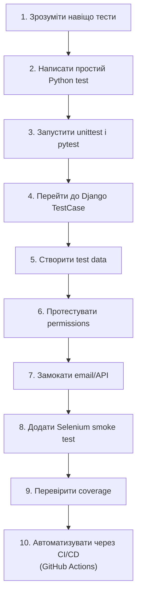

# Тестування в Python і Django: гід для початківців

> Після цього файлу ти зрозумієш, як проходити урок, які файли читати першими, що саме треба вміти руками і як тести пов’язані з реальним Django-проєктом.

---

## 1. Навіщо це потрібно

Уяви звичайну ситуацію: ти додав поле `is_archived` у модель нотатки. Начебто дрібниця. Але після цього може зламатися:

- список нотаток;
- форма створення;
- сторінка редагування;
- фільтр “активні нотатки”;
- права доступу;
- шаблон, який чекав інший набір полів.

Без тестів ти перевіряєш це руками. Відкрив браузер, залогінився, створив нотатку, відредагував, видалив, подивився адмінку. Один раз це нормально. Десять разів за день — вже втомлює. Через тиждень ти щось забудеш перевірити.

Тести потрібні, щоб програма частину перевірок робила сама.

Важлива думка:

> Тести не доводять, що програма ідеальна. Вони дають достатньо впевненості, щоб змінювати код і не боятися кожного рядка.

Цей урок для студента, який уже трохи знає Python/Django і хоче перейти від “я просто запускаю сайт і дивлюсь очима” до “я пишу перевірки, які можна запускати багато разів”.

---

## 2. Ментальна модель

Тести — це не “ще один синтаксис Python”. Це спосіб мислення.

Уяви будинок із сигналізацією:

- сигналізація не будує стіни;
- не робить двері міцнішими;
- не ловить усі можливі проблеми;
- але коли щось важливе порушено, вона швидко дає сигнал.

У коді так само. Тест не робить твою функцію правильною автоматично. Але він фіксує очікувану поведінку:

```text
Я очікую, що:
якщо користувач не залогінений,
то сторінка створення нотатки перенаправить його на login.
```

Після цього тест можна запускати після кожної зміни. Якщо поведінка зламалась, тест впаде.

---

## 3. Що студент має вміти після уроку

Після повного проходження ти маєш уміти:

| Навичка | Що це означає на практиці |
|---|---|
| Написати простий unit test | Перевірити функцію `add()`, `calculate_total()`, `slugify_title()` |
| Запустити тести | `python -m unittest`, `pytest`, `python manage.py test` |
| Прочитати помилку тесту | Зрозуміти, що було очікувано і що отримано |
| Тестувати Django model | Перевірити `__str__`, custom methods, ownership |
| Тестувати Django form | Перевірити valid/invalid data, `form.errors`, `cleaned_data` |
| Тестувати Django view | Перевірити status code, redirect, template, context |
| Тестувати permissions | Перевірити, що User A не може редагувати дані User B |
| Створювати test data | Через об’єкт у тесті, `setUp()`, `setUpTestData()`, fixtures |
| Використовувати mock | Не надсилати реальний email і не викликати зовнішній API |
| Написати Selenium E2E smoke test | Login -> create note -> note appears in browser |
| Запустити coverage | Побачити, які частини коду виконувались під час тестів |

---

## 4. Базовий приклад на 2 хвилини

Створи файл `math_utils.py`:

```python
def add(a, b):
    return a + b
```

Створи файл `test_math_utils.py`:

```python
from math_utils import add


def test_add_two_numbers():
    result = add(2, 3)

    assert result == 5
```

Запусти:

```bash
pytest
```

Що тут сталося:

| Частина | Що робить |
|---|---|
| `add(2, 3)` | Викликає код, який тестуємо |
| `result` | Зберігає реальний результат |
| `assert result == 5` | Порівнює реальність з очікуванням |
| `pytest` | Знаходить тест і запускає його |

Якщо змінити функцію на неправильну:

```python
def add(a, b):
    return a - b
```

тест впаде. І це добре. Тест показує: “поведінка вже не та, яку ми очікували”.

---

## 5. Як читати цей урок

Не читай усе як суху книжку. Кожен файл треба проходити руками.

Рекомендований спосіб:

1. Прочитай розділ “Навіщо це потрібно”.
2. Перепиши код вручну.
3. Запусти команду.
4. Спеціально зламай код.
5. Подивись, як падає тест.
6. Виправ код.
7. Відповідай на питання для самоперевірки.

Якщо ти тільки читаєш і не запускаєш — тема здаватиметься абстрактною.

---

## 6. Рівні тестування

| Рівень | Що перевіряє | Швидкість | Приклад |
|---|---|---|---|
| Unit test | Одну функцію або метод | Дуже швидко | `calculate_total(10, 2) == 20` |
| Integration test | Взаємодію кількох частин | Середньо | Form зберігає Model у test database |
| Functional test | Поведінку з точки зору сценарію | Середньо/повільно | Login -> create note |
| E2E / Selenium | Реальний браузер і весь шлях користувача | Повільно | Firefox відкриває сайт, вводить дані, клікає |
| Regression test | Старий bug не повернувся | Залежить від рівня | Тест на вже виправлену помилку |

Ментальна піраміда:

```text
        E2E / Selenium
      integration tests
    unit tests
```

Чому так:

- unit tests мають бути основою: їх багато, вони дешеві й швидкі;
- integration tests перевіряють, що частини працюють разом;
- E2E tests дають високу впевненість, але вони повільні й ламкі, тому їх має бути мало.

---

## 7. Три рівні розуміння

| Рівень | Назва | Що студент має зрозуміти |
|---:|---|---|
| 1 | Що це і як використовувати | Як написати простий тест і запустити його |
| 2 | Як це працює всередині | Як test runner знаходить тести, створює test database, виконує assertions |
| 3 | Архітектурні наслідки | Чому код із чистими функціями, сервісами і явними залежностями легше тестувати |

Приклад архітектурного висновку:

Погано для тестування:

```python
def create_note(request):
    # тут і HTTP, і форма, і email, і база, і бізнес-логіка разом
    ...
```

Краще:

```python
def create_note_for_user(user, title, content):
    note = Note.objects.create(owner=user, title=title, content=content)
    send_note_created_email(user.email)
    return note
```

Другий варіант легше тестувати: можна окремо перевірити сервіс, окремо view, окремо email через mock.

---

## 8. Карта файлів уроку

| Файл | Рівень | Що всередині | Що робити руками |
|---|---:|---|---|
| [TESTING_FOUNDATIONS.md](TESTING_FOUNDATIONS.md) | 1 | Філософія, bug, regression, assertion, піраміда | Написати перший простий test case |
| [UNITTEST_BASICS.md](UNITTEST_BASICS.md) | 2 | `unittest`, `TestCase`, assert-методи, `setUp()` | Запустити `python -m unittest` |
| [PYTEST_BASICS.md](PYTEST_BASICS.md) | 2 | `pytest`, fixtures, parametrization, `pytest-django` | Запустити `pytest`, написати fixture |
| [DJANGO_TESTING.md](DJANGO_TESTING.md) | 3 | `TestCase`, test database, Client, templates, permissions | Протестувати model/form/view |
| [TEST_DATA_AND_FIXTURES.md](TEST_DATA_AND_FIXTURES.md) | 3 | Test data, `setUp`, `setUpTestData`, factories | Прибрати дублювання тестових даних |
| [MOCKING_AND_PATCHING.md](MOCKING_AND_PATCHING.md) | 4 | `mock`, `patch`, email/API/payment | Замокати email-сервіс |
| [TESTING_PRACTICE_PROJECT.md](TESTING_PRACTICE_PROJECT.md) | 4 | Повний notes-проєкт, Selenium, Docker, coverage | Зібрати повний набір тестів |
| [SELENIUM.md](SELENIUM.md) | 3 | WebDriver, By стратегії, waits, StaticLiveServerTestCase, session cookie trick | Запустити перший Selenium скрипт |
| [CI_CD.md](CI_CD.md) | 4 | CI/CD, GitHub Actions, `django-tests.yml` рядок за рядком | Переглянути workflow run у GitHub Actions |

---

## 9. Mermaid-схема шляху студента



---

## 10. Швидкий старт

Якщо часу мало, пройди мінімальний маршрут:

1. [TESTING_FOUNDATIONS.md](TESTING_FOUNDATIONS.md) до розділу про AAA.
2. [PYTEST_BASICS.md](PYTEST_BASICS.md) до першого fixture.
3. [DJANGO_TESTING.md](DJANGO_TESTING.md) до тестів model/form/view.
4. [TESTING_PRACTICE_PROJECT.md](TESTING_PRACTICE_PROJECT.md) розділи 1-5.
5. [SELENIUM.md](SELENIUM.md) до розділу про session cookie trick.

Повний маршрут:

1. усі файли по порядку;
2. кожен приклад переписати вручну;
3. кожен тест один раз спеціально зламати;
4. [SELENIUM.md](SELENIUM.md) — розібрати WebDriver, By стратегії, waits, session cookie trick;
5. у фіналі додати тести у власний Django-проєкт;
6. [CI_CD.md](CI_CD.md) — автоматизувати запуск тестів через GitHub Actions.

---

## 11. Типові помилки початківців

| Помилка | Чому виникає | Як виправити |
| ------- | ------------ | ------------ |
| Читати тести як теорію | Здається, що все зрозуміло без запуску | Запускай кожен приклад |
| Писати тільки happy path | Початківець хоче довести, що код працює | Додай invalid data, permissions, edge cases |
| Робити Selenium на все | Браузерний тест виглядає “найсправжнішим” | Selenium тільки для критичних шляхів |
| Мокати все підряд | Хочеться ізолювати код повністю | Мокай зовнішні межі: email, API, payment |
| Гнатися за 100% coverage | Цифра здається якістю | Перевіряй зміст assertions |

---

## 12. Практика

1. Створи папку `testing_playground`.
2. Напиши функцію `calculate_total(price, quantity)`.
3. Напиши тест на нормальний випадок.
4. Напиши тест на `quantity = 0`.
5. Спеціально зламай функцію і подивись, як виглядає падіння тесту.
6. Поясни своїми словами: що саме довів цей тест, а чого він не довів.

---

## 13. Питання для самоперевірки

1. Чому тести збільшують впевненість, але не доводять ідеальність програми?
2. Чому unit tests мають бути швидкими?
3. Чому E2E tests не треба писати на кожну дрібну кнопку?
4. Що таке regression test?
5. Чому код, який легко тестувати, часто має кращу архітектуру?
