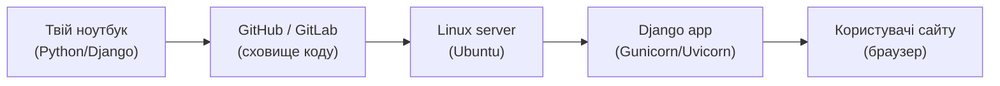
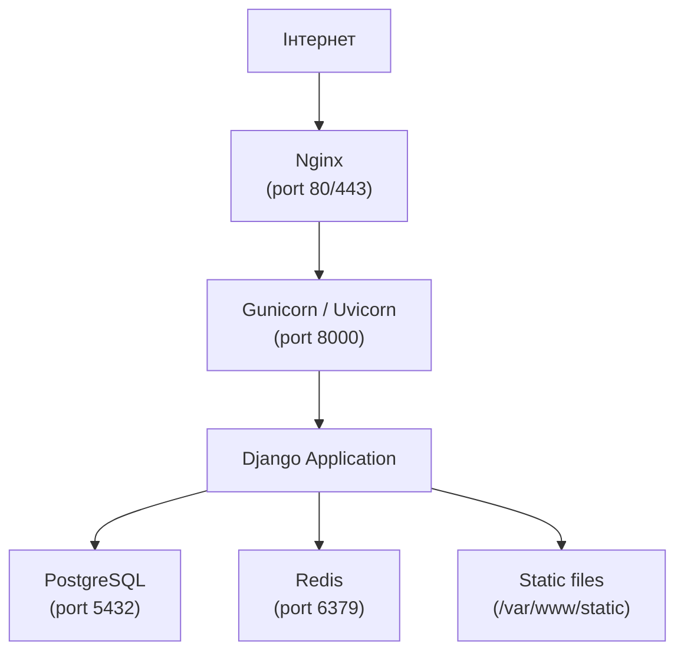

# 01. Ментальна модель Linux

## Навіщо це потрібно

Перш ніж запускати будь-яку команду, потрібно зрозуміти: **що таке Linux і чому він важливий для backend-розробника?**

Більшість Django-додатків, API-сервісів, баз даних і веб-серверів у світі працюють на Linux. Якщо ти пишеш Python/Django-код, рано чи пізно тобі доведеться його запустити не лише на своєму ноутбуці, а й на реальному сервері. Цей сервер майже напевно буде Linux.

---

## Просте пояснення

> Linux-сервер — це як орендована кімната в датацентрі, де твій Django-додаток має жити постійно, навіть коли твій ноутбук вимкнений.

Твій ноутбук — це твоя особиста машина. Ти вмикаєш її, коли потрібно, і вимикаєш, коли закінчив. Але сайт має бути доступний 24/7. Для цього потрібен **сервер** — комп'ютер, який ніколи не вимикається і завжди підключений до інтернету.

На більшості таких серверів встановлений Linux. Не тому що він ідеальний, а тому що він:

- **безкоштовний** — можна встановити без ліцензії;
- **стабільний** — може працювати роками без перезавантаження;
- **гнучкий** — можна налаштувати під будь-яке завдання;
- **ефективний** — потребує менше ресурсів, ніж Windows Server;
- **відкритий** — тисячі розробників по всьому світу вдосконалюють його.

---

## Ключові терміни

| Термін | Що означає |
|---|---|
| **Операційна система (OS)** | Програма, яка керує залізом і дозволяє запускати інші програми |
| **Linux** | Ядро операційної системи (kernel), написане Лінусом Торвальдсом у 1991 р. |
| **Дистрибутив** | Linux-ядро + набір інструментів + пакетний менеджер. Наприклад: Ubuntu, Debian, CentOS |
| **Ubuntu** | Найпопулярніший дистрибутив для серверів і для початківців |
| **WSL** | Windows Subsystem for Linux — Linux-термінал всередині Windows |
| **Сервер** | Комп'ютер (або хмарна VM), який постійно підключений до мережі і запускає сервіси |
| **Деплой** | Процес переносу коду з розробки на сервер |
| **Термінал** | Текстовий інтерфейс для роботи з операційною системою |

---

## Як влаштований Linux

Linux складається з кількох шарів:

```text
+---------------------------------------------------+
|           Твої програми (User Space)               |
|   Django, PostgreSQL, Nginx, Python, pip...        |
+---------------------------------------------------+
|              Shell (bash, zsh, sh)                 |
|   Інтерфейс між тобою і ядром                      |
+---------------------------------------------------+
|              Linux Kernel (Ядро)                   |
|   Управляє пам'яттю, процесами, файлами, мережею  |
+---------------------------------------------------+
|              Залізо (Hardware)                     |
|   CPU, RAM, диск, мережева карта                  |
+---------------------------------------------------+
```

**Kernel** — це серце системи. Він безпосередньо спілкується із залізом. Твої програми ніколи не звертаються до заліза напряму — вони просять kernel через системні виклики (syscalls).

**Shell** — це як перекладач між тобою і kernel. Ти пишеш команди у терміналі → shell їх розуміє → shell просить kernel щось зробити.

**User Space** — це де живуть усі програми: Django, PostgreSQL, Nginx, твої Python-скрипти.

---

## Чим Linux відрізняється від Windows

| | Linux | Windows |
|---|---|---|
| Ціна | Безкоштовний | Платна ліцензія |
| Управління | Переважно через термінал | Переважно через GUI |
| Сервери | ~70% серверів у світі | Менша частка |
| Файлова система | Регістрозалежна (`File.txt` ≠ `file.txt`) | Регістронезалежна |
| Оновлення | Без перезавантаження (здебільшого) | Часто вимагає restart |
| Docker | Native | Потребує WSL або VM |

---

## Що таке дистрибутив

Linux — це тільки ядро. Але щоб ним користуватися, потрібні ще інструменти, файловий менеджер, пакетний менеджер, утиліти командного рядка. Набір ядра + інструментів = **дистрибутив**.

Популярні дистрибутиви:

| Дистрибутив | Для чого використовують |
|---|---|
| **Ubuntu** | Сервери, розробка, найлегший старт |
| **Debian** | Стабільні сервери, довгострокова підтримка |
| **CentOS / Rocky Linux** | Корпоративні сервери |
| **Arch Linux** | Досвідчені користувачі, максимальний контроль |
| **Alpine Linux** | Docker-образи (дуже маленький розмір) |

Для цього уроку ми будемо використовувати **Ubuntu** — найпоширеніший вибір для Django-розробників і хмарних серверів.

---

## Що таке WSL

Якщо ти на Windows, можна встановити **WSL** — Windows Subsystem for Linux. Це повноцінне Linux-середовище всередині Windows.

```bash
# Встановити WSL (у Windows PowerShell з правами адміністратора)
wsl --install

# Запустити Ubuntu
wsl
```

WSL дає тобі справжній Ubuntu-термінал без потреби купувати окремий сервер або встановлювати VM. Це найпростіший спосіб почати практикувати Linux на Windows-машині.

---

## Шлях коду від ноутбука до користувача



Ось як виглядає типовий шлях:

1. Ти пишеш код на ноутбуці.
2. Пушиш у Git-репозиторій (GitHub/GitLab).
3. На сервері виконуєш `git pull` — завантажуєш нову версію.
4. Запускаєш Django через Gunicorn або Uvicorn.
5. Nginx приймає запити від користувачів і передає їх до Django.
6. Користувачі бачать твій сайт.

---

## Архітектура Linux-сервера для Django



Кожен компонент — окрема програма на сервері. Всі вони запущені паралельно і спілкуються між собою через мережу або файлову систему.

---

## Типові помилки початківців

**Помилка 1:** Думати, що Linux і термінал — це одне і те ж.
> Linux — це операційна система. Термінал — це лише один зі способів нею керувати.

**Помилка 2:** Боятися, що "щось зламаю".
> На своєму WSL або тестовому сервері можна сміливо практикувати. Для важливих операцій завжди є бекапи і питання підтвердження.

**Помилка 3:** Думати, що треба вивчити всі команди напам'ять.
> Насправді треба розуміти логіку і знати де шукати (`man`, `--help`, Google). З часом потрібні команди запамʼятаються самі.

**Помилка 4:** Запускати `runserver` в production.
> `python manage.py runserver` — лише для локальної розробки. На сервері треба Gunicorn/Uvicorn + Nginx.

---

## Практичне завдання

### Завдання 1
Відкрий WSL або Ubuntu-термінал і введи:
```bash
uname -a
```
Прочитай вивід і знайди: яке ядро Linux у тебе встановлено?

### Завдання 2
Введи:
```bash
cat /etc/os-release
```
Яку Ubuntu ти використовуєш?

### Завдання 3
Намалюй від руки або в нотатках схему: як твій Django-проєкт потрапляє від ноутбука до браузера користувача. Використай терміни: ноутбук, Git, сервер, Nginx, Django, база даних.

---

## Самоперевірка

- [ ] Я можу пояснити, що таке Linux і чому він використовується на серверах
- [ ] Я розумію різницю між Linux-ядром і дистрибутивом
- [ ] Я знаю, що таке Ubuntu і WSL
- [ ] Я можу описати шлях коду від ноутбука до користувача
- [ ] Я розумію, чому `runserver` не можна використовувати в production

---

## Короткий підсумок

Linux — це фундамент більшості сучасних серверів. Як Python/Django-розробник, ти будеш регулярно підключатися до Linux-серверів, запускати сервіси, читати логи і деплоїти свої додатки. Наступний файл — про термінал і shell: як взагалі спілкуватися з Linux.
