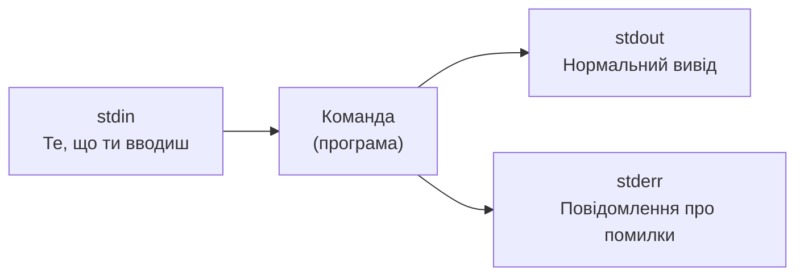

# 02. Термінал і Shell

## Навіщо це потрібно

Термінал — це твій основний інструмент роботи з Linux. Все, що ти будеш робити на сервері: підключатися, запускати програми, переглядати файли, керувати сервісами — все це відбувається через термінал.

Не потрібно боятися "чорного екрану". Це просто інший спосіб взаємодії з комп'ютером: замість кліків мишею — текстові команди.

---

## Просте пояснення

> Термінал — це вікно, через яке ти спілкуєшся з операційною системою. Shell — це мова, якою ти говориш.

Аналогія: уяви, що ти дзвониш в службу підтримки. Термінал — це телефон (пристрій). Shell — це мова розмови (наприклад, українська або англійська).

**Terminal** (термінал, консоль) — це програма, яка відображає текстовий інтерфейс. На твоєму ноутбуці це може бути:
- Windows Terminal (для WSL)
- iTerm2 (macOS)
- GNOME Terminal (Ubuntu)

**Shell** — це програма-інтерпретатор, яка читає твої команди і виконує їх. Найпопулярніший shell — **Bash** (Bourne Again Shell).

---

## Ключові терміни

| Термін | Що означає |
|---|---|
| **Terminal / Console** | Програма, що показує текстовий інтерфейс |
| **Shell** | Інтерпретатор команд (bash, zsh, sh, fish) |
| **Bash** | Найпоширеніший shell у Linux |
| **Prompt** | Запрошення до введення команди (`$` або `#`) |
| **Command** | Назва програми, яку запускаємо |
| **Option / Flag** | Додаткові налаштування команди (`-l`, `--all`) |
| **Argument** | Дані, які передаємо команді (шлях, ім'я файлу) |
| **stdin** | Стандартний ввід (те, що ти вводиш) |
| **stdout** | Стандартний вивід (результат команди) |
| **stderr** | Стандартний вивід помилок |
| **Exit code** | Числовий результат виконання команди (0 = успіх) |

---

## Як виглядає prompt

Коли ти відкриваєш термінал, бачиш щось подібне:

```text
student@ubuntu:~$
```

Це означає:
- `student` — твоє ім'я користувача
- `ubuntu` — ім'я сервера (hostname)
- `~` — поточна директорія (тильда = домашня директорія)
- `$` — звичайний користувач
- `#` — root-користувач (суперкористувач)

> Якщо бачиш `#` замість `$` — ти працюєш як root. Це небезпечно для повсякденної роботи. Виходь з root через `exit`.

---

## Структура команди

```bash
ls -la /home/user
```

```text
ls        -la       /home/user
^          ^            ^
команда   опції      аргумент
```

- `ls` — команда (програма `list`): показати список файлів
- `-la` — дві опції разом: `-l` (детальний вигляд) і `-a` (показати приховані файли)
- `/home/user` — аргумент: яку директорію показати

Опції можна записувати по-різному:
```bash
ls -l -a         # окремо
ls -la           # разом (коротка форма)
ls --all         # довга форма
```

---

## Базові команди для старту

```bash
# Де я зараз?
pwd
```
`pwd` — Print Working Directory. Показує повний шлях до поточної директорії.

```bash
# Хто я?
whoami
```
Виводить ім'я поточного користувача.

```bash
# Яка зараз дата і час?
date
```

```bash
# Очистити екран
clear
```
Або натисни `Ctrl+L` — ефект той самий.

```bash
# Вивести текст на екран
echo "Hello Linux"
```

```bash
# Подивитися документацію команди
man ls
```
`man` — manual. Показує повну документацію. Натисни `q` щоб вийти.

```bash
# Коротка підказка по командам
ls --help
```

```bash
# Переглянути останні введені команди
history
```

---

## Що таке stdin, stdout, stderr

Кожна програма в Linux має три стандартних потоки даних:



**Приклад:**
```bash
ls /home          # stdout: список файлів
ls /не-існує      # stderr: помилка "No such file or directory"
```

### Перенаправлення виводу

```bash
ls > files.txt        # записати stdout у файл
ls >> files.txt       # додати stdout у кінець файлу
ls 2> errors.txt      # записати stderr у файл
```

### Pipe (конвеєр)

```bash
ls -la | grep ".py"
```

`|` (pipe) — бере stdout однієї команди і передає як stdin в іншу.

Ця команда:
1. `ls -la` — виводить список файлів
2. `|` — передає цей список далі
3. `grep ".py"` — фільтрує рядки, що містять `.py`

---

## Що таке exit code

Кожна команда після виконання повертає **exit code** — числовий результат:

- `0` — успіх
- `1` або інше ненульове число — помилка

```bash
ls /home
echo $?      # 0 — все добре

ls /не_існує
echo $?      # 2 — помилка
```

`$?` — спеціальна змінна, яка зберігає exit code попередньої команди. Це важливо для Bash-скриптів.

---

## Корисні shortcuts

| Shortcut | Що робить |
|---|---|
| `Ctrl+C` | Зупинити поточну команду |
| `Ctrl+Z` | Призупинити і відправити у background |
| `Ctrl+D` | Завершити сесію (logout) |
| `Ctrl+L` | Очистити екран |
| `Tab` | Автодоповнення команди або шляху |
| `↑ / ↓` | Навігація по history команд |
| `Ctrl+R` | Пошук по history |
| `Ctrl+A` | Перейти на початок рядка |
| `Ctrl+E` | Перейти в кінець рядка |

> `Tab` — найкорисніший shortcut. Натисни двічі, якщо не знаєш, як продовжити команду — Linux покаже варіанти.

---

## Приклад з Django-проєктом

```bash
# Запустити Django сервер
python manage.py runserver
```

Поки сервер працює, ти бачиш вивід у терміналі (stdout). Натисни `Ctrl+C`, щоб зупинити.

```bash
# Запустити і одразу побачити вивід
python manage.py runserver 2>&1 | tee server.log
```

Ця команда:
- `2>&1` — перенаправляє stderr в stdout
- `| tee server.log` — зберігає вивід у файл і одночасно показує на екрані

---

## Типові помилки початківців

**Помилка 1:** `command not found`
> Програма не встановлена або не в PATH. Перевір: чи встановив ти її? Чи активоване virtualenv?

**Помилка 2:** `Permission denied`
> Недостатньо прав. Перевір права файлу або використай `sudo` (але обережно).

**Помилка 3:** Запустив важку команду і не знаю як зупинити.
> Натисни `Ctrl+C`. Якщо не допомагає — `Ctrl+Z`, потім `kill %1`.

**Помилка 4:** Плутати `>` і `>>`.
> `>` перезаписує файл. `>>` додає в кінець. Якщо використаєш `>` — попередній вміст зникне.

---

## Практичне завдання

### Завдання 1
Відкрий термінал і виконай:
```bash
whoami
pwd
date
uname -r
```
Що означає кожен результат?

### Завдання 2
Виконай:
```bash
echo "Hello, $(whoami)!"
```
Що відбулося? Чому `$(whoami)` виконалося всередині рядка?

### Завдання 3
Виконай:
```bash
ls /tmp
echo $?
ls /not_existing_dir
echo $?
```
Порівняй exit codes. Що означає різниця?

### Завдання 4
Введи:
```bash
history | tail -10
```
Що зробила ця команда? Розбери структуру: де команда, де pipe, де аргумент?

---

## Самоперевірка

- [ ] Я розумію різницю між terminal і shell
- [ ] Я можу пояснити, що таке Bash
- [ ] Я читаю структуру команди: команда, опції, аргументи
- [ ] Я розумію stdin, stdout, stderr
- [ ] Я знаю, що означає exit code 0 і ненульовий код
- [ ] Я можу зупинити запущену програму через `Ctrl+C`

---

## Короткий підсумок

Термінал — це не страшно. Це просто текстовий спосіб управляти Linux. Shell читає твої команди і виконує їх. Структура команди завжди однакова: назва + опції + аргументи. Наступний крок — навчитися орієнтуватися у файловій системі.
