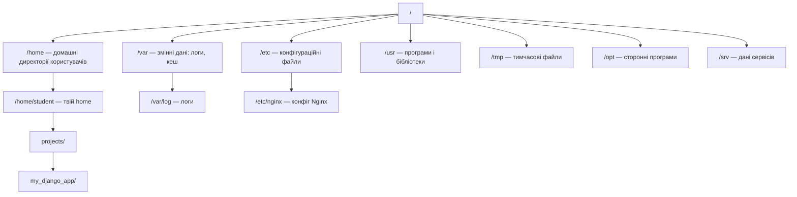

# 03. Файлова система і навігація

## Навіщо це потрібно

На сервері немає папок із іконками і файлів, які можна перетягнути мишею. Є тільки термінал. Щоб знайти файл конфігурації, зайти у директорію проєкту, скопіювати або видалити файл — потрібно знати базові команди навігації.

Це фундамент. Без розуміння файлової системи неможливо ні деплоїти проєкти, ні читати логи, ні налаштовувати сервіси.

---

## Просте пояснення

> Файлова система Linux — це одне велике дерево, яке починається з кореня `/`. Все є вузлом цього дерева: директорії, файли, навіть пристрої.

В Windows є диски: `C:\`, `D:\`. В Linux немає дисків — є одна коренева директорія `/`, і все інше всередині неї.

---

## Структура файлової системи



### Найважливіші директорії

| Директорія | Призначення |
|---|---|
| `/` | Корінь файлової системи. Все починається тут |
| `/home` | Домашні директорії користувачів |
| `/home/student` | Твоя особиста директорія |
| `/etc` | Конфігураційні файли системи і сервісів |
| `/var/log` | Логи: Nginx, системні, твоїх сервісів |
| `/tmp` | Тимчасові файли (видаляються після перезавантаження) |
| `/usr/bin` | Системні програми (python, git, nginx) |
| `/opt` | Сторонні програми, які ти встановлюєш вручну |
| `/srv` | Дані вебсервісів (Django static, media) |

---

## Ключові символи шляхів

| Символ | Що означає |
|---|---|
| `/` | Корінь (root) — якщо на початку шляху |
| `/` | Роздільник між частинами шляху |
| `~` | Домашня директорія поточного користувача |
| `.` | Поточна директорія |
| `..` | Батьківська директорія (на рівень вище) |

**Приклади:**
```bash
/home/student/projects   # абсолютний шлях
~/projects               # те саме (через ~)
./manage.py              # файл у поточній директорії
../settings.py           # файл на рівень вище
```

---

## Навігація

### Дізнатися, де ти знаходишся
```bash
pwd
```
Print Working Directory. Показує повний поточний шлях.

### Перейти в директорію
```bash
cd /home/student/projects   # абсолютний шлях
cd projects                  # відносний шлях (з поточної)
cd ..                        # на рівень вище
cd ~                         # в домашню директорію
cd -                         # в попередню директорію
```

### Список файлів і директорій
```bash
ls                   # простий список
ls -l                # детальний список (права, розмір, дата)
ls -a                # включаючи приховані файли (починаються з .)
ls -la               # детальний + приховані
ls /etc              # список конкретної директорії
```

**Приклад виводу `ls -la`:**
```text
drwxr-xr-x 3 student student 4096 Jun 10 12:00 projects
-rw-r--r-- 1 student student  234 Jun 10 11:50 manage.py
-rw-r--r-- 1 student student   98 Jun 10 11:45 requirements.txt
```

```bash
# Дерево директорій
tree
tree -L 2            # тільки 2 рівні глибини
```

---

## Робота з файлами і директоріями

### Створення
```bash
mkdir my_project             # створити директорію
mkdir -p a/b/c               # створити вкладені директорії

touch file.txt               # створити пустий файл
touch settings.py            # або оновити дату модифікації існуючого
```

### Перегляд вмісту файлу
```bash
cat file.txt                 # показати весь вміст
less file.txt                # переглянути посторінково (q — вийти)
head -20 file.txt            # перші 20 рядків
tail -20 file.txt            # останні 20 рядків
tail -f /var/log/nginx/access.log   # стежити за файлом у реальному часі
```

### Копіювання
```bash
cp file.txt copy.txt             # скопіювати файл
cp -r my_project/ backup/        # скопіювати директорію рекурсивно
```

### Переміщення і перейменування
```bash
mv file.txt new_name.txt         # перейменувати
mv file.txt /tmp/                # перемістити
mv old_dir/ new_dir/             # перейменувати директорію
```

### Видалення

> ⚠️ У Linux немає кошика. Видалений файл не повернеш.

```bash
rm file.txt                  # видалити файл
rm -r my_project/            # видалити директорію рекурсивно
rmdir empty_dir/             # видалити ПУСТУ директорію
```

### Небезпека `rm -rf`

```bash
rm -rf /            # НІКОЛИ НЕ РОБИ ЦЕ
```

`-r` — рекурсивно (всі файли і підпапки), `-f` — без підтвердження (force). Якщо це виконати в корені файлової системи — ти знищиш всю систему без попередження.

**Правила безпеки:**
- Завжди перевіряй шлях перед `rm -rf`
- Використовуй `ls` спочатку, щоб побачити що буде видалено
- На production-серверах ніколи не запускай `rm -rf` без бекапу

---

## Пошук файлів

```bash
find . -name "settings.py"              # знайти файл по імені
find /var/log -name "*.log"             # знайти всі .log файли
find . -type f -name "*.py"             # тільки файли (не директорії)
find . -type d -name "migrations"       # тільки директорії

grep -r "SECRET_KEY" .                  # знайти текст у файлах
grep -rn "def create_user" .            # з номерами рядків
```

---

## Корисні команди для Python/Django

```bash
# Де знаходиться python?
which python3

# Де встановлені пакети?
pip show django

# Подивитися структуру проєкту
tree my_django_project/ -L 2

# Знайти всі migration-файли
find . -path "*/migrations/*.py" -not -name "__init__.py"
```

---

## Абсолютний vs відносний шлях

```text
Абсолютний шлях — завжди починається з /
  /home/student/projects/my_app/settings.py

Відносний шлях — відносно поточної директорії
  (якщо ти в /home/student/)
  projects/my_app/settings.py
  або ./projects/my_app/settings.py
```

**Коли використовувати:**
- Абсолютний — у скриптах і конфігурах (надійно, незалежно від cd)
- Відносний — у терміналі для швидкої навігації

---

## Типові помилки початківців

**Помилка 1:** `No such file or directory`
> Перевір: чи правильно написано ім'я? Linux чутливий до регістру: `manage.py` ≠ `Manage.py`

**Помилка 2:** Видалив не те.
> Завжди перевіряй `ls` перед `rm`. Немає кошика.

**Помилка 3:** `Permission denied` при переході в директорію.
> У тебе немає права `x` (execute) на директорію. Перевір права через `ls -la`.

**Помилка 4:** Плутати `/` і `~`.
> `/` — корінь системи. `~` — твоя домашня директорія `/home/student`.

---

## Практичне завдання

### Завдання 1
```bash
mkdir -p ~/practice/django_project
cd ~/practice/django_project
touch manage.py requirements.txt .env
mkdir app templates static
ls -la
```
Поясни, що ти створив і де це знаходиться.

### Завдання 2
```bash
echo "DEBUG=True" > .env
cat .env
echo "SECRET_KEY=test123" >> .env
cat .env
```
Поясни різницю між `>` і `>>`.

### Завдання 3
```bash
cp -r ~/practice/django_project ~/practice/django_project_backup
ls ~/practice/
```
Що відбулося?

### Завдання 4
```bash
find ~/practice -name "*.py"
grep -r "DEBUG" ~/practice
```
Що знайшли ці команди?

---

## Самоперевірка

- [ ] Я можу пояснити структуру `/home`, `/etc`, `/var/log`
- [ ] Я розумію різницю між абсолютним і відносним шляхом
- [ ] Я можу навігуватися через `cd`, бачити список через `ls -la`
- [ ] Я вмію створювати, копіювати, переміщати і видаляти файли
- [ ] Я розумію небезпеку `rm -rf` і перевіряю шлях перед видаленням
- [ ] Я можу знайти файл через `find` і текст через `grep`

---

## Короткий підсумок

Файлова система Linux — це дерево від кореня `/`. Кожна директорія має своє призначення: `/etc` для конфігів, `/var/log` для логів, `/home` для твоїх файлів. Базові команди: `pwd`, `cd`, `ls`, `mkdir`, `touch`, `cp`, `mv`, `rm`. Наступний крок — права доступу і користувачі.
