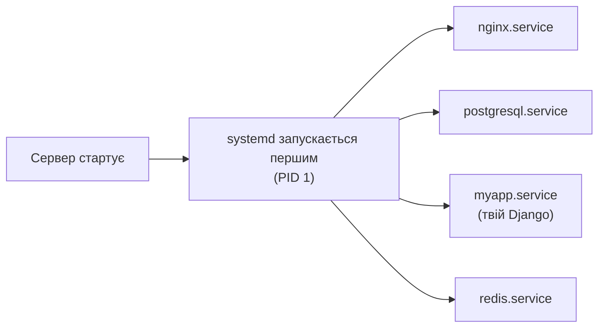
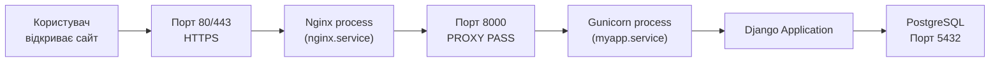

# 05. Процеси, порти і сервіси

## Навіщо це потрібно

Коли ти запускаєш `python manage.py runserver`, стартує **процес** — Django слухає на **порту** 8000. Коли ти деплоїш на сервер, Nginx і Gunicorn теж є процесами. Щоб розуміти, чому "сайт не відкривається" або "порт вже зайнятий" — потрібно знати, як керувати процесами і сервісами.

---

## Ключові терміни

| Термін | Що означає |
|---|---|
| **Процес** | Запущена програма в пам'яті. Має свій PID |
| **PID** | Process ID — унікальний номер процесу |
| **Foreground** | Процес займає термінал. Ctrl+C зупиняє |
| **Background** | Процес працює у фоні. Термінал вільний |
| **Daemon** | Фоновий сервісний процес без терміналу |
| **Порт** | Числова адреса (0–65535) для мережевого з'єднання |
| **Сервіс** | Програма, якою керує systemd (запуск, зупинка, автостарт) |
| **systemd** | Система керування сервісами в Ubuntu/Debian |

---

## Процеси

### Переглянути запущені процеси

```bash
ps aux
```
`ps` — process status. Показує всі процеси системи.

```text
USER   PID  %CPU %MEM   COMMAND
root     1   0.0  0.1   /sbin/init
student 1234  2.1  1.5   python manage.py runserver
nginx  5678  0.1  0.3   nginx: worker process
```

```bash
ps aux | grep python        # знайти процеси Python
ps aux | grep nginx         # знайти Nginx-процеси
```

### Інтерактивний монітор

```bash
top         # оновлюється в реальному часі
htop        # краща версія (потрібно встановити: sudo apt install htop)
```

У `top`/`htop`: натисни `q` щоб вийти, `k` щоб завершити процес за PID.

### Завершити процес

```bash
kill 1234           # надіслати сигнал SIGTERM (попросити завершитися)
kill -9 1234        # SIGKILL (примусово вбити, без можливості cleanup)
killall python      # завершити всі процеси з ім'ям python
pkill -f "manage.py runserver"   # знайти і завершити по шаблону
```

> `kill -9` — крайній захід. Процес не встигне зберегти дані. Спочатку пробуй просто `kill`.

---

## Foreground і Background

```bash
python manage.py runserver          # foreground — блокує термінал
python manage.py runserver &        # background — & наприкінці

jobs                                # показати фонові процеси
fg                                  # повернути останній фоновий процес
fg %1                               # повернути процес №1
bg                                  # продовжити призупинений процес у фоні
```

Якщо натиснути `Ctrl+Z` під час роботи foreground-процесу — він призупиняється і йде в background (статус Stopped).

---

## Порти

> Порт — це як номер кімнати в готелі. IP-адреса — це адреса готелю, порт — номер кімнати.

Коли Django слухає на порті `8000`, це означає: будь-хто, хто підключиться до цього сервера на порт 8000, отримає відповідь від Django.

### Відомі порти

| Порт | Сервіс |
|---|---|
| 22 | SSH |
| 80 | HTTP |
| 443 | HTTPS |
| 5432 | PostgreSQL |
| 6379 | Redis |
| 8000 | Django runserver (за замовчуванням) |
| 8080 | Альтернативний HTTP |

### Перевірити відкриті порти

```bash
ss -tulpn                   # всі відкриті порти і процеси
ss -tulpn | grep :8000      # конкретний порт

lsof -i :8000               # який процес використовує порт 8000
lsof -i :5432               # PostgreSQL запущений?
```

**Приклад виводу `ss -tulpn`:**
```text
Netid  State  Local Address:Port   Process
tcp    LISTEN 0.0.0.0:8000         python manage.py runserver
tcp    LISTEN 0.0.0.0:80           nginx
tcp    LISTEN 127.0.0.1:5432       postgres
```

---

## Сервіси і systemd



`systemd` — це перший процес, який запускається після старту системи (PID 1). Він відповідає за запуск і управління всіма сервісами.

### Команди systemctl

```bash
# Статус сервісу
systemctl status nginx
systemctl status postgresql

# Запуск / зупинка / перезапуск
sudo systemctl start nginx
sudo systemctl stop nginx
sudo systemctl restart nginx
sudo systemctl reload nginx        # перечитати конфіг без зупинки

# Автостарт при завантаженні
sudo systemctl enable nginx        # додати в автостарт
sudo systemctl disable nginx       # прибрати з автостарту

# Список всіх сервісів
systemctl list-units --type=service
```

### Перегляд логів сервісу

```bash
journalctl -u nginx                 # всі логи Nginx
journalctl -u nginx -f              # стежити за логами в реальному часі
journalctl -u nginx --since today   # логи за сьогодні
journalctl -u myapp -n 50          # останні 50 рядків
```

---

## Повний ланцюжок запиту



---

## Типові помилки початківців

**Помилка 1:** `Address already in use` при запуску
> Порт вже зайнятий іншим процесом. Знайди: `lsof -i :8000` і завершити старий процес.

**Помилка 2:** Запустив `python manage.py runserver` і закрив термінал — сервер зупинився.
> Foreground-процес прив'язаний до терміналу. Для production використовуй systemd або Docker.

**Помилка 3:** Nginx запущений, але сайт не відкривається.
> Перевір: `systemctl status nginx` і `journalctl -u nginx -n 20`. Можливо конфіг невалідний.

**Помилка 4:** Плутати порт і PID.
> PID — ідентифікатор процесу (наприклад 1234). Порт — мережева адреса (наприклад 8000).

---

## Практичне завдання

### Завдання 1
```bash
python manage.py runserver &
ps aux | grep manage
jobs
kill %1
```
Запусти Django у фоні, знайди його процес, потім зупини.

### Завдання 2
```bash
ss -tulpn
lsof -i :8000
```
Які порти зараз відкриті? Які процеси їх слухають?

### Завдання 3
```bash
sudo systemctl status nginx
sudo systemctl start nginx
sudo systemctl status nginx
```
Що змінилося після `start`?

---

## Самоперевірка

- [ ] Я можу знайти PID запущеного процесу через `ps aux`
- [ ] Я розумію різницю між foreground і background
- [ ] Я можу зупинити процес через `kill`
- [ ] Я знаю основні порти: SSH (22), HTTP (80), Django (8000), PostgreSQL (5432)
- [ ] Я можу перевірити, що слухає на порту через `ss -tulpn` або `lsof`
- [ ] Я можу перевірити статус і перезапустити сервіс через `systemctl`

---

## Короткий підсумок

Процес — запущена програма з унікальним PID. Порт — мережева адреса, на якій процес слухає підключення. Сервіс — процес, яким керує systemd (автостарт, перезапуск, логи). Розуміти ці три концепції — значить розуміти, як живе твій Django на сервері.
