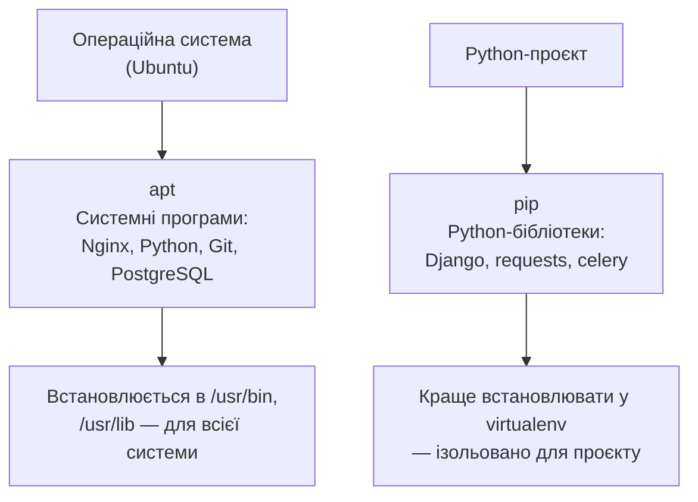
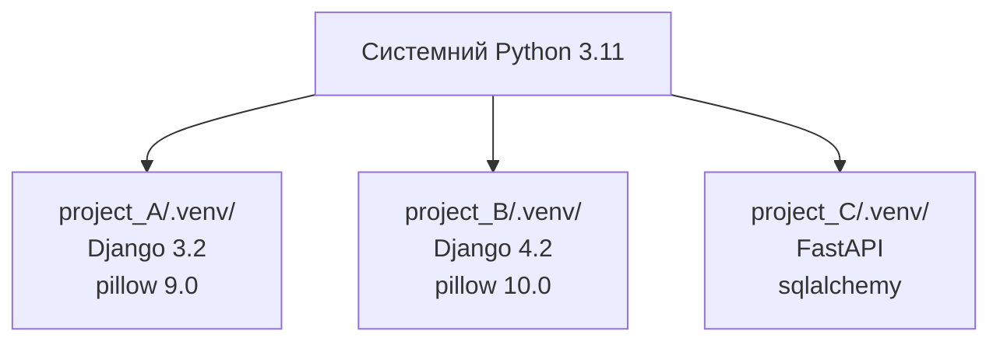

# 06. Пакетні менеджери і встановлення ПЗ

## Навіщо це потрібно

На сервері немає App Store і немає `.exe`-файлів. Щоб встановити Nginx, Python, PostgreSQL або будь-яку іншу програму — використовують **пакетний менеджер**. Для Python-бібліотек — `pip`.

Розуміти різницю між системними і Python-пакетами — важливо, щоб не ламати середовище і не плутатися, звідки береться та чи інша версія Python або Django.

---

## Два рівні пакетів



> `apt` встановлює програми для операційної системи.
> `pip` встановлює Python-бібліотеки для Python-проєкту.

---

## apt — системний пакетний менеджер

### Оновлення списку пакетів

```bash
sudo apt update
```
Не встановлює нічого — тільки завантажує актуальний список доступних пакетів з репозиторіїв. Завжди виконуй перед `install`.

### Оновлення встановлених пакетів

```bash
sudo apt upgrade
```
Оновлює всі встановлені пакети до нових версій.

### Встановлення пакетів

```bash
sudo apt install nginx
sudo apt install python3
sudo apt install python3-venv
sudo apt install python3-pip
sudo apt install git
sudo apt install postgresql
sudo apt install redis-server
sudo apt install htop curl wget tree
```

### Видалення пакетів

```bash
sudo apt remove nginx            # видалити програму
sudo apt purge nginx             # видалити + конфігураційні файли
sudo apt autoremove              # видалити непотрібні залежності
```

### Пошук пакета

```bash
apt search nginx
apt show nginx                   # детальна інформація про пакет
dpkg -l | grep nginx             # чи встановлений пакет?
```

---

## pip — Python пакетний менеджер

### Встановлення бібліотек

```bash
pip install django
pip install django==4.2.0        # конкретна версія
pip install "django>=4.0,<5.0"  # діапазон версій
pip install django psycopg2-binary celery redis
```

### Робота з requirements.txt

```bash
pip freeze                       # список всіх встановлених пакетів
pip freeze > requirements.txt    # зберегти у файл

pip install -r requirements.txt  # встановити з файлу
```

### Інформація про пакет

```bash
pip show django                  # версія, залежності, розташування
pip list                         # всі встановлені пакети
pip list --outdated              # що можна оновити
```

---

## virtualenv — ізольоване Python-середовище

### Чому virtualenv важливий

Без virtualenv всі `pip install` встановлюються в системний Python. Це проблема:

- Проєкт А вимагає `Django==3.2`, Проєкт Б — `Django==4.2`. Конфлікт.
- Ти оновив бібліотеку для одного проєкту — зламав інший.
- На production сервері встановлена не та версія.

Virtualenv ізолює бібліотеки для кожного проєкту:



### Команди virtualenv

```bash
# Створити virtualenv
python3 -m venv .venv

# Активувати (Linux/Mac)
source .venv/bin/activate

# Деактивувати
deactivate

# Після активації — встановити залежності
pip install -r requirements.txt
```

Після активації ти побачиш `(.venv)` перед prompt:
```text
(.venv) student@ubuntu:~/myproject$
```

### Де зберігати virtualenv

- Завжди в директорії проєкту: `.venv/`
- Додай у `.gitignore` — не комітити

```bash
# .gitignore
.venv/
__pycache__/
*.pyc
.env
```

---

## Типова послідовність на новому сервері

```bash
# 1. Оновити систему
sudo apt update && sudo apt upgrade -y

# 2. Встановити системні залежності
sudo apt install python3 python3-venv python3-pip git nginx -y

# 3. Клонувати проєкт
git clone https://github.com/you/myproject.git
cd myproject

# 4. Створити virtualenv
python3 -m venv .venv
source .venv/bin/activate

# 5. Встановити Python-залежності
pip install -r requirements.txt
```

---

## Типові помилки початківців

**Помилка 1:** Запускати `pip install` без активованого virtualenv
> Бібліотека встановиться в системний Python. Перевіряй: `which pip` — має вказувати на `.venv/bin/pip`.

**Помилка 2:** `pip: command not found`
> Використовуй `pip3` або `python3 -m pip`, або встанови через `sudo apt install python3-pip`.

**Помилка 3:** Не додати `.venv` у `.gitignore`
> Virtualenv містить тисячі файлів і важить 100+ МБ. Не потрібно в Git.

**Помилка 4:** Забути `sudo apt update` перед `install`
> Без оновлення можеш встановити стару версію або отримати помилку "package not found".

---

## Практичне завдання

### Завдання 1
```bash
sudo apt update
sudo apt install tree htop -y
tree --version
htop --version
```
Переконайся, що обидві програми встановились.

### Завдання 2
```bash
mkdir ~/test_project && cd ~/test_project
python3 -m venv .venv
source .venv/bin/activate
pip install django
python -c "import django; print(django.__version__)"
pip freeze > requirements.txt
cat requirements.txt
deactivate
```
Прослідкуй кожен крок. Поясни, що відбувається.

### Завдання 3
Відкрий два термінали. В одному активуй virtualenv і введи `which python`. В іншому — без virtualenv. Порівняй результати.

---

## Самоперевірка

- [ ] Я розумію різницю між `apt` і `pip`
- [ ] Я можу встановити системну програму через `apt install`
- [ ] Я можу створити і активувати virtualenv
- [ ] Я розумію, навіщо virtualenv потрібен для кожного проєкту
- [ ] Я вмію зберегти і відновити залежності через `pip freeze` і `requirements.txt`

---

## Короткий підсумок

`apt` — для системних програм (Nginx, PostgreSQL, Git). `pip` — для Python-бібліотек (Django, requests). Virtualenv ізолює бібліотеки кожного проєкту. Завжди активуй `.venv` перед роботою з проєктом. Наступний крок — SSH і підключення до сервера.
