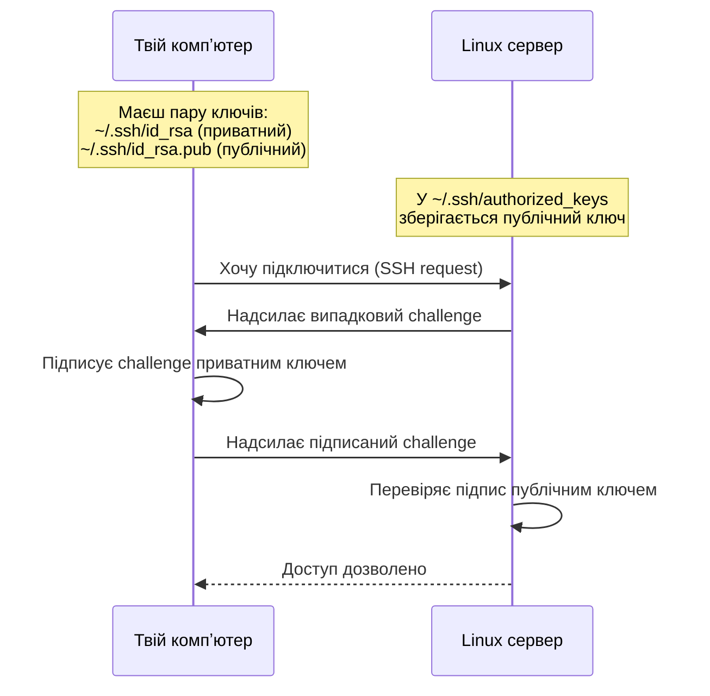

# 07. SSH і підключення до сервера

## Навіщо це потрібно

Сервер знаходиться в датацентрі за тисячі кілометрів. Щоб на ньому працювати — потрібно **SSH** (Secure Shell). Це протокол, який дозволяє безпечно підключитися до віддаленого сервера і керувати ним через термінал, ніби ти сидиш поруч.

SSH — основний інструмент DevOps і backend-розробника. Без нього неможливо деплоїти, читати логи або налаштовувати сервіс.

---

## Просте пояснення

> SSH — це як захищений тунель між твоїм ноутбуком і сервером. Все, що ти вводиш — шифрується і передається на сервер. Відповідь повертається зашифрованою назад.

Підключення через SSH виглядає так: ти відкриваєш термінал на своєму ноутбуці, набираєш одну команду — і отримуєш термінал на сервері. Наче ти "стрибнув" туди.

---

## Базове підключення

```bash
ssh user@server_ip
```

Де:
- `ssh` — програма для підключення
- `user` — ім'я користувача на сервері
- `server_ip` — IP-адреса або домен сервера

**Приклади:**
```bash
ssh student@192.168.1.10
ssh deploy@mysite.com
ssh ubuntu@ec2-54-123-45.compute.amazonaws.com
```

### Перший вхід — fingerprint

При першому підключенні SSH запитає:
```text
The authenticity of host '192.168.1.10' can't be established.
ECDSA key fingerprint is SHA256:abc123...
Are you sure you want to continue connecting (yes/no)?
```

Введи `yes`. Сервер буде записаний у `~/.ssh/known_hosts`. При наступних підключеннях перевірки не буде.

> Якщо fingerprint змінився і ти отримав попередження "WARNING: REMOTE HOST IDENTIFICATION HAS CHANGED" — це може означати атаку або що сервер перестворено. З'ясуй причину перш ніж підключатися.

---

## SSH-ключі

### Чому ключі краще за пароль

- Пароль можна підібрати brute-force
- Ключ — математично складно зламати
- З ключем не потрібно вводити пароль кожен раз
- Можна заблокувати конкретний ключ, не міняючи пароль

### Як працюють SSH-ключі



> SSH-ключі працюють як пара: приватний ключ залишається у тебе на комп'ютері, а публічний ключ кладеться на сервер. Сервер впізнає тебе не за паролем, а за тим, що ти маєш правильний приватний ключ.

**Золоте правило:** приватний ключ (`id_rsa`) — **ніколи** нікому не передавати. Публічний ключ (`id_rsa.pub`) — можна класти куди завгодно.

### Генерація ключів

```bash
ssh-keygen -t ed25519 -C "your_email@example.com"
```

Питання:
```text
Enter file in which to save the key (/home/student/.ssh/id_ed25519): [Enter]
Enter passphrase (empty for no passphrase): [твій пароль або Enter]
```

Після цього з'являться два файли:
```bash
~/.ssh/id_ed25519        # приватний ключ — НІКОМУ НЕ ПОКАЗУВАТИ
~/.ssh/id_ed25519.pub    # публічний ключ — можна розповсюджувати
```

```bash
cat ~/.ssh/id_ed25519.pub   # переглянути публічний ключ
```

### Копіювання публічного ключа на сервер

```bash
ssh-copy-id user@server_ip
```

Або вручну:
```bash
# Переглянути публічний ключ
cat ~/.ssh/id_ed25519.pub

# На сервері — додати в authorized_keys
echo "ssh-ed25519 AAAA... your@email" >> ~/.ssh/authorized_keys
chmod 600 ~/.ssh/authorized_keys
chmod 700 ~/.ssh/
```

### Права SSH-файлів (важливо!)

```bash
chmod 700 ~/.ssh/
chmod 600 ~/.ssh/id_ed25519          # приватний ключ
chmod 644 ~/.ssh/id_ed25519.pub      # публічний ключ
chmod 600 ~/.ssh/authorized_keys
```

SSH відмовиться підключатися, якщо права на ключ занадто відкриті.

---

## Копіювання файлів на сервер

### scp — проста копія

```bash
# Копіювати файл на сервер
scp file.txt user@server:/home/user/

# Копіювати файл з сервера
scp user@server:/home/user/file.txt ./

# Копіювати директорію
scp -r ./myproject/ user@server:/home/user/
```

### rsync — розумна синхронізація

```bash
rsync -av ./project/ user@server:/home/user/project/
```

`-a` — зберегти права і атрибути, `-v` — verbose (показати що синхронізується).

`rsync` копіює лише змінені файли — швидше за `scp` при повторних синхронізаціях.

---

## SSH Config — щоб не вводити довгі команди

Замість:
```bash
ssh -i ~/.ssh/my_key deploy@192.168.1.50 -p 2222
```

Додай в `~/.ssh/config`:
```text
Host myserver
    HostName 192.168.1.50
    User deploy
    Port 2222
    IdentityFile ~/.ssh/my_key
```

Тепер можна:
```bash
ssh myserver
scp file.txt myserver:/home/deploy/
```

---

## Безпечні практики

- Вимкни вхід по паролю після налаштування ключів (`PasswordAuthentication no` в `/etc/ssh/sshd_config`)
- Не запускай SSH на порту 22 на публічних серверах (використовуй нестандартний порт)
- Використовуй `ed25519` замість `rsa` — сучасніший і безпечніший
- Ніколи не клади приватний ключ у Git або не надсилай по email
- Додай passphrase до ключа для додаткового захисту

---

## Типові помилки початківців

**Помилка 1:** `Permission denied (publickey)`
> Перевір: чи скопійований публічний ключ на сервер? Чи правильні права на `~/.ssh/`?

**Помилка 2:** Надіслав приватний ключ замість публічного
> `id_rsa` — приватний. `id_rsa.pub` — публічний (з `.pub`). Завжди надсилай тільки `.pub`.

**Помилка 3:** `WARNING: REMOTE HOST IDENTIFICATION HAS CHANGED`
> Видали рядок зі старим ключем сервера: `ssh-keygen -R server_ip`

**Помилка 4:** `ssh: connect to host ... port 22: Connection refused`
> SSH не запущений або інший порт. Перевір: `sudo systemctl status ssh`

---

## Практичне завдання

### Завдання 1
```bash
ls -la ~/.ssh/
```
Якщо директорії немає — вона створюється автоматично при генерації ключа.

### Завдання 2
```bash
ssh-keygen -t ed25519 -C "test_key"
ls -la ~/.ssh/
cat ~/.ssh/id_ed25519.pub
```
Що знаходиться в публічному ключі?

### Завдання 3
Якщо є доступ до сервера або можна використати localhost:
```bash
ssh-copy-id student@localhost
ssh student@localhost
```
Спробуй підключитися по ключу.

### Завдання 4
Додай запис у `~/.ssh/config` для уявного сервера і поясни, що означає кожен рядок.

---

## Самоперевірка

- [ ] Я можу підключитися до сервера через `ssh user@ip`
- [ ] Я розумію різницю між приватним і публічним ключем
- [ ] Я можу згенерувати SSH-ключ через `ssh-keygen`
- [ ] Я знаю, як скопіювати публічний ключ на сервер
- [ ] Я вмію копіювати файли через `scp` і `rsync`
- [ ] Я розумію, чому приватний ключ не можна нікому давати

---

## Короткий підсумок

SSH — це зашифрований тунель для роботи з віддаленим сервером. Ключова пара (приватний + публічний) замінює пароль і є безпечнішою. Публічний ключ — на сервер. Приватний — тільки у тебе. Наступний крок — environment variables і секрети.
