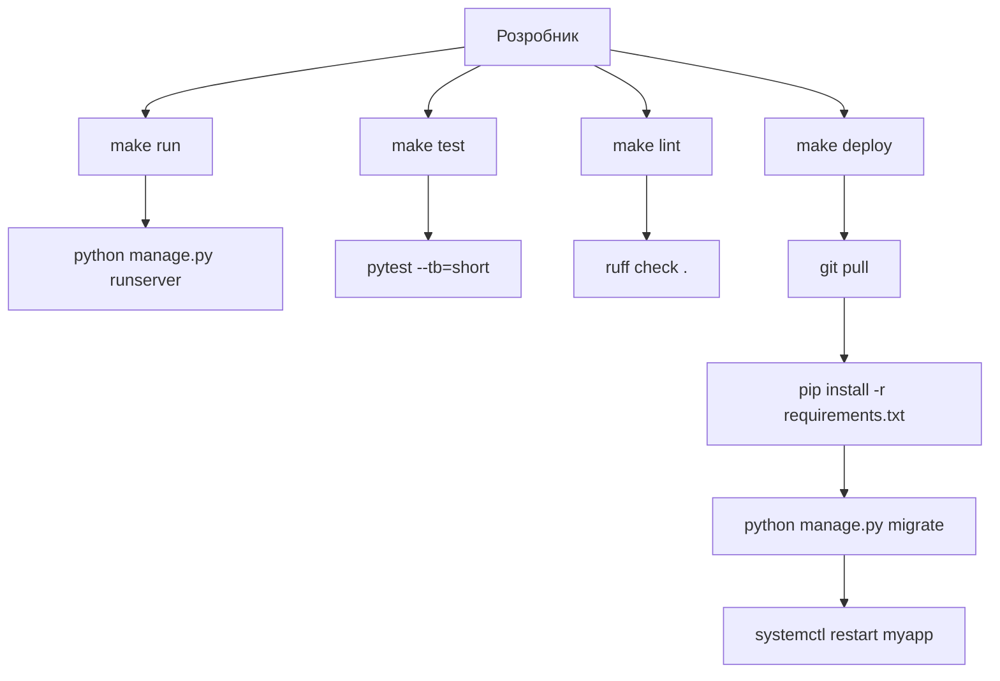

# 10. Makefile

## Навіщо це потрібно

У кожному Python/Django-проєкті є команди, які ти запускаєш постійно: `pip install -r requirements.txt`, `python manage.py migrate`, `python manage.py runserver`, `pytest`, `ruff check .`...

Makefile — це "панель кнопок" для проєкту. Замість довгих команд — короткі псевдоніми. Замість того щоб пам'ятати `gunicorn myapp.wsgi:application --workers 4 --bind 0.0.0.0:8000` — просто `make run`.

---

## Просте пояснення

> Makefile — це як меню в ресторані. Ти не пишеш рецепт кожного разу — ти просто говориш "хочу pizza" і кухня знає, що робити.

Замість:
```bash
python -m pytest --cov=. --cov-report=term-missing -v
```

Ти пишеш:
```bash
make test
```

---

## Структура Makefile

```makefile
target: dependencies
	recipe
```

- `target` — назва команди (те, що ти вводиш після `make`)
- `dependencies` — що має бути виконано перед (необов'язково)
- `recipe` — команди для виконання

> **Важливо:** відступ перед recipe — це **Tab**, не пробіли. Makefile не прийме пробіли.

---

## Базовий Makefile для Django-проєкту

```makefile
.PHONY: install migrate run test lint shell collectstatic

install:
	pip install -r requirements.txt

migrate:
	python manage.py migrate

makemigrations:
	python manage.py makemigrations

run:
	python manage.py runserver

shell:
	python manage.py shell

test:
	python manage.py test

pytest:
	pytest --tb=short

lint:
	ruff check .

format:
	ruff format .

collectstatic:
	python manage.py collectstatic --noinput

superuser:
	python manage.py createsuperuser

clean:
	find . -name "*.pyc" -delete
	find . -name "__pycache__" -type d -exec rm -rf {} +

setup: install migrate collectstatic
	@echo "Проєкт налаштовано!"
```

---

## .PHONY — важлива деталь

```makefile
.PHONY: install migrate run test
```

Make спочатку був інструментом для збірки файлів (C/C++). Він перевіряє: чи існує файл з таким ім'ям. Якщо є файл `install` — Make скаже "нічого не треба робити".

`.PHONY` каже Make: "ці targets — не файли, виконуй завжди".

---

## Залежності між targets

```makefile
.PHONY: setup install migrate collectstatic

install:
	pip install -r requirements.txt

migrate: install
	python manage.py migrate

collectstatic:
	python manage.py collectstatic --noinput

setup: install migrate collectstatic
	@echo "=== Проєкт готовий! ==="
```

```bash
make setup
```

Виконає: `install` → `migrate` → `collectstatic` → повідомлення.

`@echo` — `@` придушує вивід самої команди, показує тільки результат.

---

## Передача змінних

```makefile
PORT ?= 8000
WORKERS ?= 4

run:
	python manage.py runserver 0.0.0.0:$(PORT)

gunicorn:
	gunicorn myapp.wsgi:application --workers $(WORKERS) --bind 0.0.0.0:$(PORT)
```

```bash
make run                   # PORT=8000 за замовчуванням
make run PORT=9000         # інший порт
make gunicorn WORKERS=8    # більше воркерів
```

---

## Makefile з Docker

```makefile
.PHONY: build up down logs shell-web migrate

build:
	docker compose build

up:
	docker compose up -d

down:
	docker compose down

logs:
	docker compose logs -f

shell-web:
	docker compose exec web bash

migrate:
	docker compose exec web python manage.py migrate

collectstatic:
	docker compose exec web python manage.py collectstatic --noinput

restart:
	docker compose restart web
```

Тепер деплой зводиться до:
```bash
make build
make up
make migrate
```

---

## Візуалізація



---

## Типові помилки початківців

**Помилка 1:** `Makefile:3: *** missing separator. Stop.`
> Використав пробіли замість Tab. Перевір редактор — налаштуй Tab замість spaces для Makefile.

**Помилка 2:** `make: 'install' is up to date.`
> Забув `.PHONY`. Є файл з назвою `install`.

**Помилка 3:** Команда виконується але нічого не видно
> Забув `@` там де не треба, або навпаки. `@` приховує команду, але не її вивід.

---

## Практичне завдання

### Завдання 1
Створи Makefile для свого Django-проєкту з targets: `install`, `run`, `migrate`, `test`, `lint`, `clean`.

### Завдання 2
Додай target `setup` який залежить від `install` і `migrate`.

### Завдання 3
Запусти `make --dry-run migrate` — що виводить ця опція? Коли вона корисна?

---

## Самоперевірка

- [ ] Я розумію структуру Makefile: target, dependencies, recipe
- [ ] Я знаю, що відступ — Tab, не пробіли
- [ ] Я розумію навіщо потрібен `.PHONY`
- [ ] Я можу написати Makefile для Django-проєкту з основними командами
- [ ] Я вмію передавати змінні в make: `make run PORT=9000`

---

## Короткий підсумок

Makefile — це "панель кнопок" для проєкту. Замість довгих команд — короткі псевдоніми. `.PHONY` для targets, що не є файлами. Tab, не пробіли. Наступний крок — деплой Django на реальний Linux-сервер.
