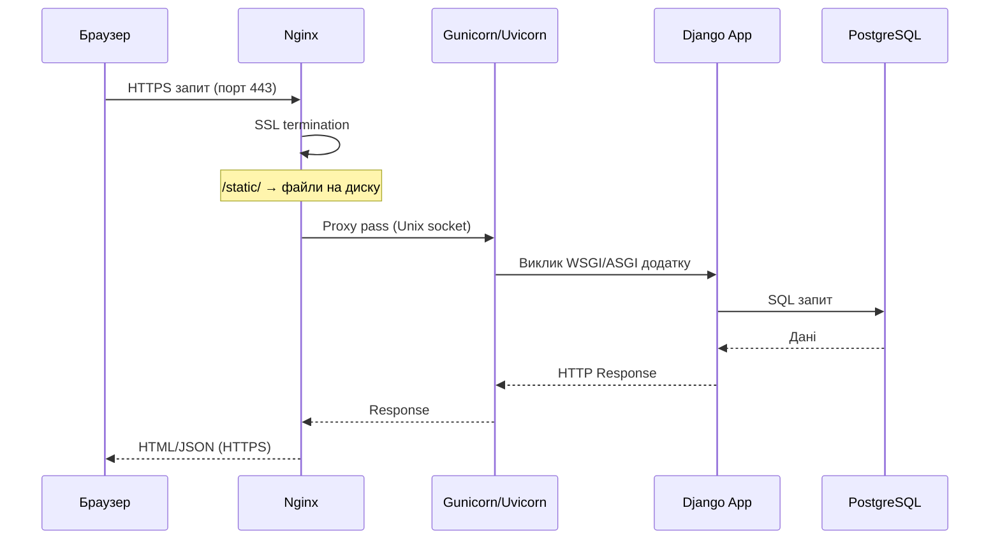

# 12. Nginx, Gunicorn і Uvicorn

## Навіщо це потрібно

Django сам по собі — це лише Python-додаток. Щоб він міг обробляти тисячі запитів паралельно, роздавати статичні файли швидко і спілкуватися через HTTPS — потрібна зв'язка: **Nginx + Gunicorn/Uvicorn**.

Розуміти цю архітектуру — значить розуміти, як твій сайт насправді працює на сервері.

---

## Загальна схема



---

## Nginx

> Nginx — це як швейцар на вході в будівлю. Він зустрічає всіх відвідувачів, перевіряє їхні запити, роздає прості речі (статику) одразу, а складні задачі — передає вглиб (Django).

### Що робить Nginx:

1. **Приймає HTTP/HTTPS запити** на портах 80 і 443
2. **SSL termination** — розшифровує HTTPS, всередині передає як HTTP
3. **Роздає статичні файли** (`/static/`, `/media/`) напряму з диска — без Django
4. **Reverse proxy** — передає динамічні запити до Gunicorn/Uvicorn
5. **Load balancing** — може розподіляти запити між кількома app servers
6. **Rate limiting** — захист від DDoS на базовому рівні

### Мінімальна конфігурація Nginx

```nginx
# /etc/nginx/sites-available/myapp

server {
    listen 80;
    server_name example.com www.example.com;

    # Статичні файли Django
    location /static/ {
        alias /var/www/myapp/staticfiles/;
        expires 30d;                          # кешувати на 30 днів
        add_header Cache-Control "public";
    }

    # Media файли (завантажені користувачами)
    location /media/ {
        alias /var/www/myapp/media/;
    }

    # Все інше — до Django через Gunicorn
    location / {
        proxy_pass http://unix:/run/myapp.sock;
        proxy_set_header Host $host;
        proxy_set_header X-Real-IP $remote_addr;
        proxy_set_header X-Forwarded-For $proxy_add_x_forwarded_for;
        proxy_set_header X-Forwarded-Proto $scheme;
    }
}
```

### Перевірка і перезапуск

```bash
sudo nginx -t                      # перевірити синтаксис конфігу
sudo systemctl reload nginx        # перечитати конфіг без зупинки
sudo systemctl restart nginx       # повний перезапуск
```

---

## Gunicorn

> Gunicorn — це як команда офіціантів. Nginx (швейцар) передає замовлення, а Gunicorn запускає кількох "офіціантів" (workers), кожен з яких може одночасно обробляти свій запит.

**Gunicorn** (Green Unicorn) — Python WSGI HTTP Server. Реалізує WSGI-протокол для запуску Django.

### Запуск Gunicorn

```bash
gunicorn myapp.wsgi:application \
    --workers 3 \
    --bind unix:/run/myapp.sock \
    --log-level info \
    --access-logfile /var/log/myapp/access.log \
    --error-logfile /var/log/myapp/error.log
```

### Параметри

| Параметр | Що означає |
|---|---|
| `myapp.wsgi:application` | Шлях до WSGI-обʼєкта Django |
| `--workers 3` | Кількість паралельних процесів |
| `--bind unix:/run/myapp.sock` | Слухати на Unix socket |
| `--bind 0.0.0.0:8000` | Або на TCP-порту |
| `--timeout 30` | Таймаут запиту в секундах |

### Скільки workers?

Загальне правило: `workers = 2 * CPU_cores + 1`

```bash
nproc           # кількість CPU ядер
```

На сервері з 2 CPU: 5 workers. Занадто багато workers = замало RAM на кожен.

---

## Uvicorn

**Uvicorn** — ASGI сервер. Використовується замість Gunicorn, коли Django-проєкт використовує async views, WebSocket або Django Channels.

```bash
pip install uvicorn
```

```bash
uvicorn myapp.asgi:application \
    --workers 4 \
    --bind 0.0.0.0:8000 \
    --log-level info
```

### Gunicorn + Uvicorn workers

Популярна комбінація: Gunicorn як менеджер процесів + Uvicorn як ASGI worker:

```bash
gunicorn myapp.asgi:application \
    -k uvicorn.workers.UvicornWorker \
    --workers 4 \
    --bind unix:/run/myapp.sock
```

---

## WSGI vs ASGI

| | WSGI | ASGI |
|---|---|---|
| Що таке | Web Server Gateway Interface | Async Server Gateway Interface |
| Синхронний/async | Синхронний | Підтримує async |
| Django | `myapp.wsgi:application` | `myapp.asgi:application` |
| Сервер | Gunicorn | Uvicorn, Daphne |
| Коли використовувати | Стандартний Django без async | Django async views, WebSocket, Channels |

---

## Чому статику роздає Nginx, а не Django

Django може роздавати статику через `DEBUG=True` в розробці. На production це катастрофа:

- Django завантажує файл у Python-пам'ять і передає побайтово
- Nginx читає файл з диска і передає на рівні OS — у 10-100 разів швидше
- Кожен запит до статики через Django займає worker — він недоступний для реальних запитів

Тому `collectstatic` + Nginx для `/static/` — обов'язкова практика.

---

## Типові помилки початківців

**Помилка 1:** `502 Bad Gateway`
> Gunicorn не запущений або socket не доступний. `systemctl status myapp`

**Помилка 2:** CSS не завантажується (404 для `/static/`)
> Не виконано `collectstatic` або неправильний шлях в Nginx `alias`

**Помилка 3:** Gunicorn запустився але Nginx не бачить сокет
> Перевір шлях сокета. Nginx worker і Gunicorn мають мати права на директорію `/run/`

**Помилка 4:** `ModuleNotFoundError` в Gunicorn
> Virtualenv не активований. Вказуй повний шлях: `/var/www/myapp/.venv/bin/gunicorn`

---

## Практичне завдання

### Завдання 1
Намалюй від руки схему: браузер → Nginx → Gunicorn → Django → PostgreSQL. Поясни, що робить кожен компонент.

### Завдання 2
```bash
gunicorn myapp.wsgi:application --bind 0.0.0.0:8000 --workers 3 --log-level debug
```
Запусти і подивися у вивід. Скільки worker-процесів запустилося?

### Завдання 3
Додай у Nginx конфіг `location /static/` і перевір, що статика відкривається напряму (без Django).

---

## Самоперевірка

- [ ] Я можу пояснити різницю між Nginx і Gunicorn
- [ ] Я розумію, що таке reverse proxy
- [ ] Я знаю, навіщо статику роздає Nginx, а не Django
- [ ] Я розумію різницю між WSGI і ASGI
- [ ] Я можу написати мінімальний Nginx конфіг для Django

---

## Короткий підсумок

Nginx — швейцар: приймає запити, роздає статику, проксує до Gunicorn. Gunicorn — команда workers: паралельно обробляє запити і запускає Django. Uvicorn — для async Django. Разом вони забезпечують production-готову роботу сайту.
