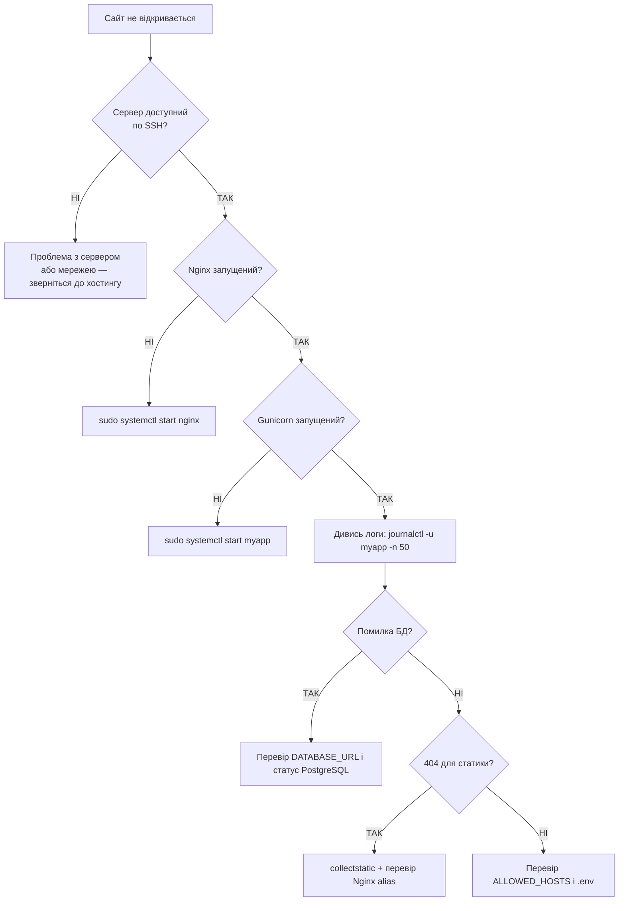

# 13. Логи, моніторинг і дебаггінг

## Навіщо це потрібно

Сайт впав. Що робити? Без логів ти сліпий — не знаєш, де сталася помилка, о котрій годині, і чому. З логами — у тебе є відповіді.

Вміння читати логи і систематично шукати проблему — це один з найважливіших навичок у роботі з сервером.

---

## Просте пояснення

> Логи — це журнал подій. Кожен раз, коли хтось відкрив сторінку, сталася помилка або зупинився сервіс — це записується в лог. Потім ти можеш прочитати цей журнал і зрозуміти, що відбулося.

---

## Де шукати логи

| Логи | Де знаходяться |
|---|---|
| Системні логи | `journalctl` або `/var/log/syslog` |
| Nginx access лог | `/var/log/nginx/access.log` |
| Nginx error лог | `/var/log/nginx/error.log` |
| Твій Django-сервіс | `journalctl -u myapp` або `/var/log/myapp/` |
| PostgreSQL | `/var/log/postgresql/` |
| Django debug | Термінал де запущено Gunicorn |

---

## Команди для читання логів

### tail — останні рядки

```bash
tail /var/log/nginx/error.log           # останні 10 рядків
tail -n 50 /var/log/nginx/error.log     # останні 50 рядків
tail -f /var/log/nginx/access.log       # стежити в реальному часі
```

`-f` (follow) — найкорисніша опція. Термінал оновлюється і показує нові рядки в міру їх появи. Відкрий другий термінал і роби запити до сайту — бачиш їх в логах в реальному часі.

### journalctl — логи systemd

```bash
journalctl -u myapp                     # всі логи сервісу
journalctl -u myapp -f                  # стежити в реальному часі
journalctl -u myapp -n 100             # останні 100 рядків
journalctl -u myapp --since today       # за сьогодні
journalctl -u myapp --since "1 hour ago"
journalctl -u nginx -p err             # тільки помилки
```

### grep — фільтрація логів

```bash
grep "ERROR" /var/log/nginx/error.log
grep "500" /var/log/nginx/access.log
grep -i "traceback" /var/log/myapp/gunicorn.log
tail -f /var/log/nginx/access.log | grep "POST"
```

---

## Читання логів

### Nginx access log

```text
192.168.1.1 - - [10/Jun/2026:12:34:56 +0000] "GET /api/notes/ HTTP/1.1" 200 1234 "-" "Mozilla/5.0..."
```

| Частина | Що означає |
|---|---|
| `192.168.1.1` | IP клієнта |
| `10/Jun/2026:12:34:56` | Дата і час |
| `GET /api/notes/` | HTTP метод і URL |
| `200` | HTTP статус-код |
| `1234` | Розмір відповіді в байтах |

### HTTP статус-коди

| Код | Що означає |
|---|---|
| `200` | OK |
| `301`/`302` | Redirect |
| `400` | Bad Request (помилка клієнта) |
| `403` | Forbidden (немає прав) |
| `404` | Not Found |
| `500` | Internal Server Error (помилка Django) |
| `502` | Bad Gateway (Gunicorn недоступний) |
| `503` | Service Unavailable |

### Stack trace Django

```text
[2026-06-10 12:34:56 +0000] [1234] [ERROR] Exception in application

Traceback (most recent call last):
  File "/var/www/myapp/.venv/lib/.../django/db/models/sql/compiler.py", line 456
    return super().execute_sql(result_type)
  File "..."
    ...
django.db.utils.OperationalError: could not connect to server: Connection refused
```

Читай знизу вгору: остання помилка — `OperationalError: could not connect to server`. Django не може підключитися до PostgreSQL.

---

## Checklist: "сайт не відкривається"



### Повний checklist у тексті

```markdown
## Якщо сайт не відкривається

- [ ] Сервер доступний по SSH?
- [ ] Nginx запущений? → `systemctl status nginx`
- [ ] Nginx конфіг валідний? → `nginx -t`
- [ ] Gunicorn/Django сервіс запущений? → `systemctl status myapp`
- [ ] Є помилки в логах Nginx? → `journalctl -u nginx -n 50`
- [ ] Є помилки в логах Django? → `journalctl -u myapp -n 50`
- [ ] PostgreSQL запущений? → `systemctl status postgresql`
- [ ] Міграції виконані? → `python manage.py migrate`
- [ ] collectstatic виконаний?
- [ ] .env налаштований? (`DEBUG=False`, `ALLOWED_HOSTS`, `DATABASE_URL`)
- [ ] Порти відкриті? → `ss -tulpn | grep -E ':80|:443|:8000'`
- [ ] Firewall не блокує? → `sudo ufw status`
```

---

## Логування в Django

```python
# settings.py
LOGGING = {
    'version': 1,
    'disable_existing_loggers': False,
    'handlers': {
        'file': {
            'level': 'ERROR',
            'class': 'logging.FileHandler',
            'filename': '/var/log/myapp/django.log',
        },
    },
    'loggers': {
        'django': {
            'handlers': ['file'],
            'level': 'ERROR',
            'propagate': True,
        },
    },
}
```

```python
# У своєму коді
import logging

logger = logging.getLogger(__name__)

def create_note(request):
    logger.info(f"User {request.user} creates a note")
    try:
        # ...
    except Exception as e:
        logger.error(f"Failed to create note: {e}", exc_info=True)
```

---

## Типові помилки початківців

**Помилка 1:** Шукати помилку "навмання" без читання логів
> Завжди починай з логів. 90% проблем видно одразу.

**Помилка 2:** Читати логи зверху
> Останні події — внизу. Читай `tail -n 50`, а не весь файл.

**Помилка 3:** `journalctl` нічого не показує
> Перевір ім'я сервісу: `systemctl list-units --type=service | grep myapp`

---

## Практичне завдання

### Завдання 1
```bash
sudo tail -f /var/log/nginx/access.log &
curl http://localhost/
```
Поясни, що з'явилося в логах після запиту.

### Завдання 2
Спеціально зламай DATABASE_URL в `.env` і запусти Django. Знайди помилку в логах.

### Завдання 3
Напиши команду, яка покаже всі рядки з кодом `500` в Nginx access log за останній день.

---

## Самоперевірка

- [ ] Я знаю де знаходяться логи Nginx і systemd
- [ ] Я вмію використовувати `tail -f` для стеження за логами в реальному часі
- [ ] Я можу прочитати stack trace і знайти причину помилки
- [ ] Я розумію значення HTTP статус-кодів (200, 404, 500, 502)
- [ ] Я знаю системний checklist для діагностики "сайт не відкривається"

---

## Короткий підсумок

Логи — це перше місце, куди треба дивитися при проблемах. `tail -f` для real-time, `journalctl -u` для systemd-сервісів, `grep` для фільтрації. Систематичний checklist допомагає швидко знайти проблему. Наступний крок — Docker.
