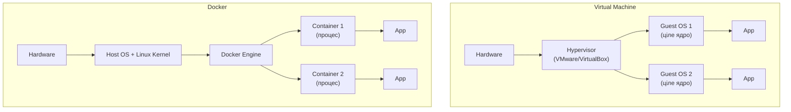

# 14. Docker: основи

## Навіщо це потрібно

"На моєму ноутбуці все працює" — класична фраза, яка руйнує продуктивність команди. На ноутбуці Python 3.11, на сервері — 3.9. На ноутбуці PostgreSQL 15, на CI — 13. Наслідок: баги, які неможливо відтворити.

Docker вирішує цю проблему: весь проєкт разом із залежностями упакований в **контейнер**, який однаково працює скрізь.

---

## Просте пояснення

> Docker image — це як рецепт і коробка з усім необхідним для запуску додатку. Container — це вже запущений екземпляр цієї коробки. Ти можеш запустити 10 контейнерів з одного image — і всі будуть однаковими.

**Без Docker:**
```text
Ноутбук розробника:    Python 3.11, Django 4.2, PostgreSQL 15
CI сервер:             Python 3.9,  Django 4.2, PostgreSQL 13
Production сервер:     Python 3.10, Django 4.1, PostgreSQL 14
```
Різні середовища → несподівані баги.

**З Docker:**
```text
Ноутбук / CI / Production: один і той самий image → однакова поведінка
```

---

## Ключові терміни

| Термін | Що означає |
|---|---|
| **Image** | Шаблон (frozen snapshot) файлової системи + метадані |
| **Container** | Запущений екземпляр image (процес з ізольованим середовищем) |
| **Dockerfile** | Інструкція для збірки image |
| **Registry** | Сховище images (Docker Hub, GitHub Container Registry) |
| **Volume** | Постійне сховище даних поза контейнером |
| **Port mapping** | Прив'язка порту контейнера до порту хоста |

---

## Container vs Virtual Machine



| | VM | Docker Container |
|---|---|---|
| Ізоляція | Повна ОС | Процес в ізольованому namespace |
| Розмір | Гігабайти | Мегабайти |
| Старт | Хвилини | Секунди |
| Ресурси | Важкі | Легкі |

---

## Dockerfile

Dockerfile — текстовий файл з інструкціями для збірки image.

```dockerfile
# Базовий image
FROM python:3.12-slim

# Встановити системні залежності
RUN apt-get update && apt-get install -y \
    libpq-dev \
    && rm -rf /var/lib/apt/lists/*

# Директорія в контейнері
WORKDIR /app

# Спочатку копіюємо requirements (кеш Docker)
COPY requirements.txt .
RUN pip install --no-cache-dir -r requirements.txt

# Потім копіюємо весь код
COPY . .

# Змінна оточення
ENV PYTHONDONTWRITEBYTECODE=1
ENV PYTHONUNBUFFERED=1

# Порт, який буде слухати
EXPOSE 8000

# Команда запуску
CMD ["gunicorn", "myapp.wsgi:application", "--bind", "0.0.0.0:8000"]
```

### Чому COPY requirements.txt спочатку?

Docker кешує кожен шар (layer). Якщо `requirements.txt` не змінився — Docker не перевстановлює залежності, а бере з кешу. Це прискорює збірку при змінах коду.

---

## Основні команди Docker

### Збірка image

```bash
docker build -t myapp:latest .
docker build -t myapp:v1.2.3 .
```

`-t` — назва і тег image. `.` — директорія з Dockerfile.

### Запуск контейнера

```bash
docker run myapp:latest
docker run -p 8000:8000 myapp:latest
docker run -p 8000:8000 -d myapp:latest        # -d = detached (фон)
docker run -p 8000:8000 --name mycontainer myapp
docker run --env-file .env -p 8000:8000 myapp
```

`-p 8000:8000` — прив'язати порт 8000 контейнера до порту 8000 хоста.

### Керування контейнерами

```bash
docker ps                           # запущені контейнери
docker ps -a                        # всі, включаючи зупинені
docker stop mycontainer             # зупинити
docker start mycontainer            # запустити зупинений
docker rm mycontainer               # видалити
docker rm -f mycontainer            # видалити примусово
```

### Логи і виконання команд

```bash
docker logs mycontainer             # логи контейнера
docker logs -f mycontainer          # стежити за логами
docker exec -it mycontainer bash    # увійти в контейнер
docker exec mycontainer python manage.py migrate
```

### Images

```bash
docker images                       # список images
docker rmi myapp:latest             # видалити image
docker pull python:3.12-slim        # завантажити з Docker Hub
```

---

## Volumes — збереження даних

Контейнер ізольований. Якщо ти зупиниш і видалиш контейнер — всі дані всередині зникнуть. Для збереження даних використовують **volumes**.

```bash
# Монтувати директорію хоста в контейнер
docker run -v /var/data/postgres:/var/lib/postgresql/data postgres:16

# Або іменований volume
docker volume create myapp_data
docker run -v myapp_data:/var/lib/postgresql/data postgres:16
```

---

## .dockerignore

Аналог `.gitignore` для Docker — щоб не копіювати зайве в image:

```text
# .dockerignore
.venv/
__pycache__/
*.pyc
.env
.git/
*.log
node_modules/
```

---

## Типові помилки початківців

**Помилка 1:** Зміни в коді не з'являються після `docker run`
> Потрібно перезібрати image: `docker build -t myapp . && docker run myapp`

**Помилка 2:** Контейнер зупиняється одразу після запуску
> Процес завершився. Перевір: `docker logs mycontainer`

**Помилка 3:** Дані PostgreSQL зникають після перезапуску
> Не підключений volume. Додай `-v postgres_data:/var/lib/postgresql/data`

**Помилка 4:** `Cannot connect to the Docker daemon`
> Docker не запущений. `sudo systemctl start docker`

---

## Практичне завдання

### Завдання 1
Напиши `Dockerfile` для Django-проєкту: python:3.12-slim, встанови залежності, скопіюй код.

### Завдання 2
```bash
docker build -t django-test .
docker run -p 8000:8000 -e DEBUG=True django-test
```
Чи відкривається `http://localhost:8000`?

### Завдання 3
```bash
docker exec -it <container_id> bash
ls -la
cat requirements.txt
exit
```
Поясни, де ти опинився після `docker exec -it ... bash`.

---

## Самоперевірка

- [ ] Я розумію різницю між Docker image і container
- [ ] Я можу написати базовий Dockerfile для Django
- [ ] Я знаю команди: `build`, `run`, `ps`, `logs`, `exec`, `stop`, `rm`
- [ ] Я розумію, навіщо volumes і що без них дані зникнуть
- [ ] Я знаю, що таке `.dockerignore`

---

## Короткий підсумок

Docker упаковує додаток разом із залежностями — однакове середовище скрізь. Dockerfile — інструкція збірки. `docker build` → image, `docker run` → container. Volumes — для збереження даних між перезапусками. Наступний крок — Docker Compose для запуску кількох контейнерів разом.
