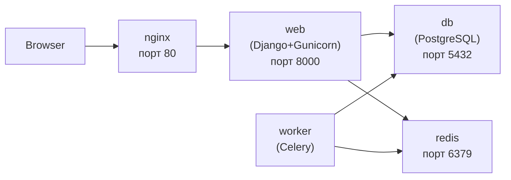

# 15. Docker Compose

## Навіщо це потрібно

Django-проєкт — це не один контейнер. Це зазвичай:
- Django app (Gunicorn)
- PostgreSQL
- Redis (для Celery або кешування)
- Celery worker
- Nginx

Запускати кожен вручну через `docker run` з довгими параметрами — складно і незручно. **Docker Compose** дозволяє описати весь стек у одному файлі і запустити все однією командою.

---

## Просте пояснення

> Docker Compose — це як диригент оркестру. Ти описуєш, які "музиканти" (контейнери) мають грати, і одна команда запускає всіх разом у правильному порядку.

---

## Мінімальний docker-compose.yml для Django

```yaml
services:
  web:
    build: .
    command: python manage.py runserver 0.0.0.0:8000
    ports:
      - "8000:8000"
    volumes:
      - .:/app
    env_file:
      - .env
    depends_on:
      db:
        condition: service_healthy

  db:
    image: postgres:16
    environment:
      POSTGRES_DB: app_db
      POSTGRES_USER: app_user
      POSTGRES_PASSWORD: app_password
    volumes:
      - postgres_data:/var/lib/postgresql/data
    healthcheck:
      test: ["CMD-SHELL", "pg_isready -U app_user -d app_db"]
      interval: 5s
      timeout: 5s
      retries: 5

volumes:
  postgres_data:
```

---

## Production docker-compose.yml

```yaml
services:
  web:
    build:
      context: .
      dockerfile: Dockerfile
    command: gunicorn myapp.wsgi:application --bind 0.0.0.0:8000 --workers 3
    expose:
      - "8000"
    volumes:
      - static_files:/app/staticfiles
      - media_files:/app/media
    env_file:
      - .env
    depends_on:
      db:
        condition: service_healthy
      redis:
        condition: service_started
    restart: always

  db:
    image: postgres:16-alpine
    volumes:
      - postgres_data:/var/lib/postgresql/data
    env_file:
      - .env.db
    restart: always
    healthcheck:
      test: ["CMD-SHELL", "pg_isready -U $POSTGRES_USER -d $POSTGRES_DB"]
      interval: 10s
      timeout: 5s
      retries: 5

  redis:
    image: redis:7-alpine
    restart: always

  worker:
    build: .
    command: celery -A myapp worker --loglevel=info
    env_file:
      - .env
    depends_on:
      - db
      - redis
    restart: always

  nginx:
    image: nginx:alpine
    ports:
      - "80:80"
      - "443:443"
    volumes:
      - ./nginx/conf.d:/etc/nginx/conf.d
      - static_files:/var/www/static
      - media_files:/var/www/media
    depends_on:
      - web
    restart: always

volumes:
  postgres_data:
  static_files:
  media_files:
```

---

## Ключові поля docker-compose.yml

### services

Кожен ключ всередині `services:` — це ім'я контейнера:

```yaml
services:
  web:      # Django app
  db:       # PostgreSQL
  redis:    # Redis
```

### build vs image

```yaml
# Зібрати з Dockerfile
build: .

# Або використати готовий image
image: postgres:16
```

### ports vs expose

```yaml
ports:
  - "8000:8000"      # HOST:CONTAINER — доступно ззовні

expose:
  - "8000"           # тільки між контейнерами в мережі Compose
```

На production: `expose` для web (тільки Nginx має доступ), `ports: "80:80"` для Nginx.

### volumes

```yaml
volumes:
  - .:/app                    # bind mount: директорія хоста → контейнер
  - postgres_data:/var/lib/postgresql/data    # іменований volume
```

Bind mount (`.:/app`) зручний у розробці: зміни в коді одразу видні в контейнері без перезбірки.

### depends_on

```yaml
depends_on:
  db:
    condition: service_healthy   # чекати поки PostgreSQL готовий
```

Без `condition: service_healthy` Django може стартувати раніше ніж PostgreSQL готовий приймати підключення.

### restart

```yaml
restart: always          # завжди перезапускати при падінні
restart: unless-stopped  # окрім явної зупинки
restart: on-failure      # тільки при помилці
```

---

## Основні команди Docker Compose

```bash
# Запуск всього стека
docker compose up
docker compose up -d           # у фоні (detached)
docker compose up --build      # перезібрати images перед запуском

# Зупинка
docker compose down
docker compose down -v         # зупинити і видалити volumes (дані!)

# Логи
docker compose logs
docker compose logs -f         # stежити в реальному часі
docker compose logs web        # логи конкретного сервісу

# Виконати команду в контейнері
docker compose exec web bash
docker compose exec web python manage.py migrate
docker compose exec web python manage.py createsuperuser
docker compose exec web python manage.py shell

# Статус
docker compose ps

# Перезапуск одного сервісу
docker compose restart web
```

---

## Мережа між контейнерами

Docker Compose автоматично створює мережу і всі сервіси знаходяться в ній. Вони спілкуються по **імені сервісу**:

```python
# settings.py (або .env)
DATABASES = {
    'default': {
        'ENGINE': 'django.db.backends.postgresql',
        'HOST': 'db',        # ім'я сервісу з docker-compose.yml
        'PORT': '5432',
        'NAME': 'app_db',
        'USER': 'app_user',
        'PASSWORD': 'app_password',
    }
}
```

Замість `localhost` — `db`. Замість `localhost:6379` для Redis — `redis:6379`.



---

## Типові помилки початківців

**Помилка 1:** `could not connect to server: Connection refused` при запуску Django
> PostgreSQL ще не стартував. Додай `healthcheck` і `condition: service_healthy` в `depends_on`.

**Помилка 2:** Зміни в коді не відображаються
> У dev-режимі потрібен bind mount: `- .:/app`. Або перезбери: `docker compose up --build`.

**Помилка 3:** `docker compose down -v` видалив дані бази
> `-v` видаляє volumes! Для зупинки без втрати даних — просто `docker compose down`.

**Помилка 4:** `HOST=localhost` для бази в Docker
> В мережі Compose — `HOST=db` (ім'я сервісу), не `localhost`.

---

## Практичне завдання

### Завдання 1
Напиши `docker-compose.yml` для Django + PostgreSQL. Запусти і перевір:
```bash
docker compose up --build
docker compose exec web python manage.py migrate
```

### Завдання 2
```bash
docker compose exec web python manage.py shell
```
Всередині shell: `from django.contrib.auth.models import User; User.objects.all()`

### Завдання 3
Перевір що сервіси бачать одне одного:
```bash
docker compose exec web ping db
```

---

## Самоперевірка

- [ ] Я розумію структуру `docker-compose.yml`: services, volumes, ports
- [ ] Я знаю різницю між `ports` і `expose`
- [ ] Я розумію, що контейнери спілкуються по імені сервісу, не через localhost
- [ ] Я вмію запустити стек через `docker compose up --build`
- [ ] Я знаю команди: `exec`, `logs`, `down`, `ps`

---

## Короткий підсумок

Docker Compose дозволяє описати весь стек у YAML і запустити однією командою. Контейнери в одному Compose-файлі утворюють спільну мережу і знаходять одне одного по імені сервісу. Для dev — bind mount коду. Для prod — іменовані volumes для даних. Наступний крок — DevOps workflow.
