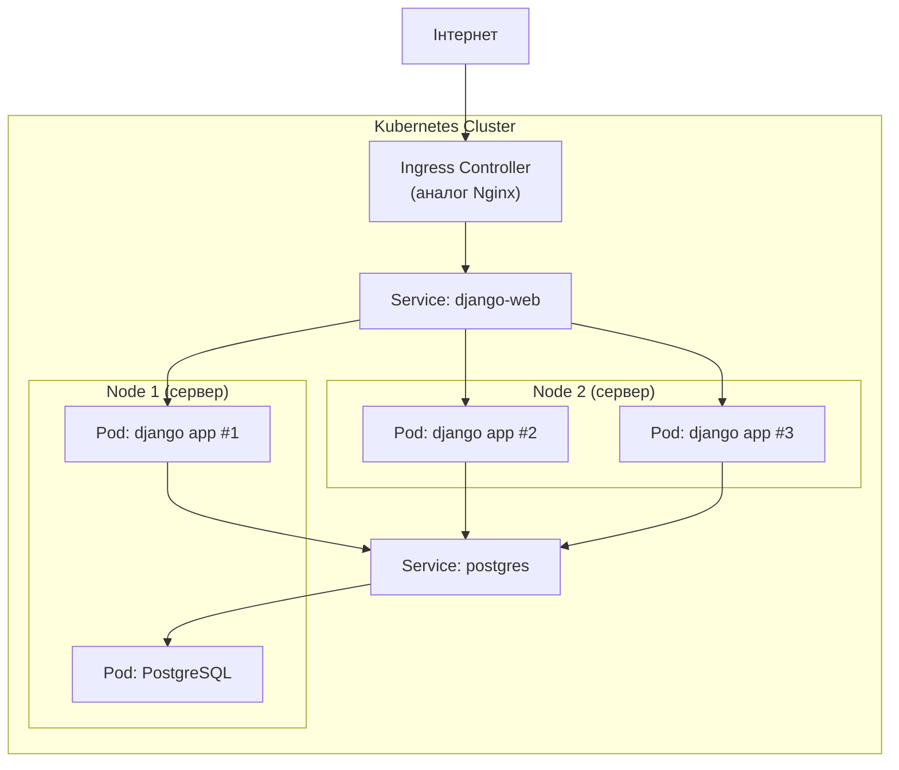
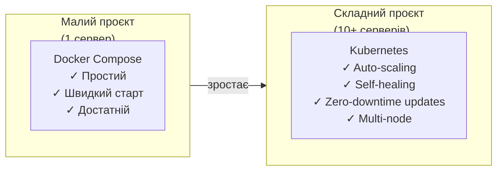

# 17. Kubernetes: огляд

## Навіщо це потрібно

Ти освоїв Docker і Docker Compose. Один сервер, один `docker compose up` — і все працює. Але що якщо у тебе 50 контейнерів, 10 серверів, і система має сама перезапускатися при падінні, масштабуватися при навантаженні і оновлюватися без зупинки?

Для цього існує **Kubernetes**.

> Цей файл — тільки огляд. Kubernetes — окремий великий курс. Тут ти отримаєш ментальну модель: навіщо він існує і коли стає потрібним.

---

## Просте пояснення

> Docker Compose зручний, коли у тебе один сервер або невеликий проєкт. Kubernetes потрібен, коли контейнерів багато, серверів багато, і система має сама перезапускати, масштабувати й розподіляти навантаження між ними.

Docker Compose — пульт від одного TV. Kubernetes — система управління цілим кінотеатром із сотнями екранів, де кожен показує різний фільм, і якщо один екран зламався — система сама переключає глядачів на інший.

---

## Коли Docker Compose вже недостатньо

| Ситуація | Docker Compose | Kubernetes |
|---|---|---|
| 1 сервер, 5 контейнерів | Відмінно | Надлишок |
| 3+ сервери | Складно | Призначений для цього |
| Auto-scaling | Ні | Так |
| Self-healing (авто-перезапуск) | Частково | Так, автоматично |
| Zero-downtime deployment | Складно | Вбудовано |
| 100+ мікросервісів | Важко керувати | Для цього і існує |

---

## Ключові терміни

| Термін | Що означає |
|---|---|
| **Cluster** | Набір серверів (nodes), якими керує Kubernetes |
| **Node** | Один сервер у кластері (фізичний або VM) |
| **Pod** | Мінімальна одиниця Kubernetes. Містить 1+ контейнер |
| **Deployment** | Описує бажаний стан Pods (скільки реплік, який image) |
| **Service** | Стабільна адреса для набору Pods (load balancing) |
| **Namespace** | Логічна ізоляція всередині кластера |
| **ConfigMap** | Конфігурація (без секретів) для Pods |
| **Secret** | Зашифровані дані (паролі, ключі) для Pods |
| **Ingress** | Аналог Nginx reverse proxy для кластера |

---

## Архітектура кластера



Kubernetes автоматично:
- Розміщує Pods на вільних Node
- Перезапускає Pod якщо він впав
- Балансує трафік між Pods
- Замінює Pods при оновленні (по одному, без downtime)

---

## Базові маніфести (для ознайомлення)

### Deployment

```yaml
# deployment.yaml
apiVersion: apps/v1
kind: Deployment
metadata:
  name: django-web
spec:
  replicas: 3             # 3 копії Django
  selector:
    matchLabels:
      app: django-web
  template:
    metadata:
      labels:
        app: django-web
    spec:
      containers:
        - name: django
          image: myapp:v1.2.3
          ports:
            - containerPort: 8000
          env:
            - name: SECRET_KEY
              valueFrom:
                secretKeyRef:
                  name: myapp-secrets
                  key: secret-key
```

### Service

```yaml
# service.yaml
apiVersion: v1
kind: Service
metadata:
  name: django-service
spec:
  selector:
    app: django-web
  ports:
    - port: 80
      targetPort: 8000
```

---

## Self-healing — автоматичне відновлення

Якщо Pod впав — Kubernetes помічає це через **health checks** і автоматично запускає новий:

```yaml
livenessProbe:
  httpGet:
    path: /health/
    port: 8000
  initialDelaySeconds: 10
  periodSeconds: 30
```

Django-ендпоінт `/health/` повертає `200 OK` — значить все добре. Якщо повертає помилку кілька разів підряд — Kubernetes перезапускає контейнер.

---

## Horizontal Pod Autoscaler

```yaml
apiVersion: autoscaling/v2
kind: HorizontalPodAutoscaler
metadata:
  name: django-hpa
spec:
  scaleTargetRef:
    apiVersion: apps/v1
    kind: Deployment
    name: django-web
  minReplicas: 2
  maxReplicas: 10
  metrics:
    - type: Resource
      resource:
        name: cpu
        target:
          averageUtilization: 70
```

При навантаженні CPU > 70% — Kubernetes автоматично збільшує кількість Pods. Навантаження спало — зменшує.

---

## Kubernetes vs Docker Compose



---

## Managed Kubernetes

Якщо не хочеш підтримувати кластер вручну — хмарні провайдери пропонують Kubernetes як сервіс:

| Провайдер | Сервіс |
|---|---|
| Google Cloud | GKE (Google Kubernetes Engine) |
| AWS | EKS (Elastic Kubernetes Service) |
| Azure | AKS (Azure Kubernetes Service) |
| DigitalOcean | DOKS |

Ти описуєш Deployments і Services → хмара керує Node, networking, оновленнями master.

---

## Що треба вивчити перед Kubernetes

Kubernetes — складна система. Починати з нього без фундаменту — марна трата часу.

```text
1. ✅ Linux та термінал
2. ✅ Docker та Dockerfile
3. ✅ Docker Compose
4. ✅ Деплой вручну (без Kubernetes)
5. ✅ CI/CD базовий
    ↓
6. → Kubernetes
```

---

## Практичне завдання

### Завдання 1
Поясни своїми словами: чим Kubernetes відрізняється від Docker Compose? Наведи 3 конкретні ситуації, коли Kubernetes потрібен.

### Завдання 2
Намалюй схему Kubernetes-кластера для типового Django-проєкту: що буде Pods, що Services, що Ingress.

### Завдання 3
Встанови Minikube (локальний Kubernetes для навчання):
```bash
# Встановити minikube
curl -LO https://storage.googleapis.com/minikube/releases/latest/minikube-linux-amd64
sudo install minikube-linux-amd64 /usr/local/bin/minikube

minikube start
kubectl get nodes
kubectl get pods --all-namespaces
```

---

## Самоперевірка

- [ ] Я можу пояснити, що таке Kubernetes і навіщо він потрібен
- [ ] Я розумію різницю між Cluster, Node і Pod
- [ ] Я знаю, коли Docker Compose достатній, а коли потрібен Kubernetes
- [ ] Я розумію концепцію self-healing і auto-scaling
- [ ] Я знаю наступні кроки для вивчення Kubernetes

---

## Короткий підсумок

Kubernetes — оркестратор контейнерів для складних систем з багатьма серверами. Автоматично перезапускає, масштабує і оновлює Pods. Для маленьких проєктів — Docker Compose достатній. Kubernetes стає актуальним, коли виростаєш з одного сервера. Наступний файл — roadmap і куди рухатися далі.
