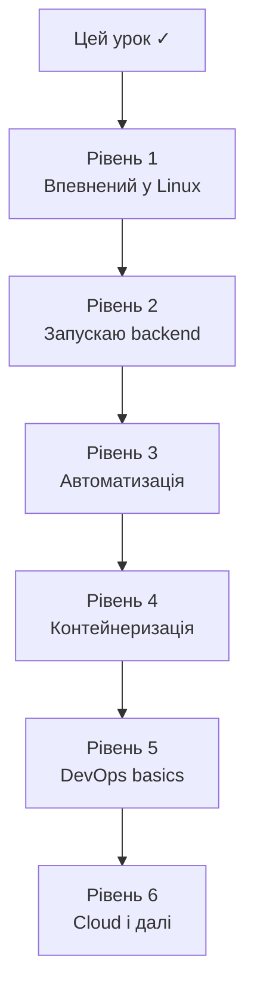
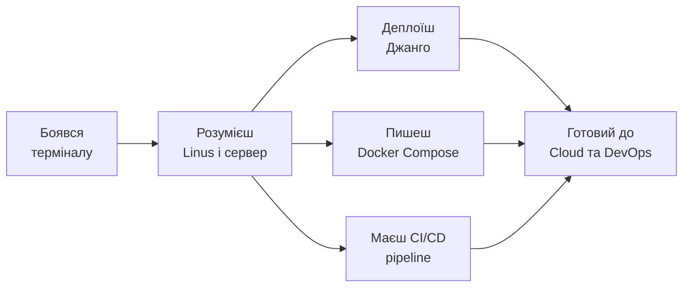

# 18. Roadmap і наступні кроки

## Ти пройшов цей урок

Якщо ти дійшов до цього файлу і пройшов увесь урок — вітаю. Ти більше не боїшся Linux. Ти розумієш, як твій Python-код живе на реальному сервері.

Але це не кінець — це початок. DevOps і server-side розробка — величезна область знань. Цей roadmap допоможе зрозуміти, де ти зараз і куди рухатися далі.

---

## Де ти зараз



---

## Рівень 1. Впевнено користуватися Linux

**Що вмієш після цього уроку:**

- [ ] Навігація у файловій системі (`cd`, `ls`, `pwd`, `find`)
- [ ] Робота з файлами (`cp`, `mv`, `rm`, `chmod`, `chown`)
- [ ] Розуміння прав доступу (`rwx`, `755`, `644`, `600`)
- [ ] Керування процесами (`ps`, `kill`, `top`, `jobs`)
- [ ] Підключення по SSH (`ssh`, `ssh-keygen`, `scp`)
- [ ] Читання логів (`tail -f`, `journalctl`, `grep`)

**Що практикувати далі:**
- Щодня працюй у терміналі замість GUI
- Вивчи `vim` або `nano` для редагування файлів на сервері
- Познайомся з `tmux` або `screen` для постійних сесій

---

## Рівень 2. Вміти запускати backend-проєкт

**Що вмієш після цього уроку:**

- [ ] Встановити залежності через `apt` і `pip`
- [ ] Налаштувати `virtualenv`
- [ ] Налаштувати `.env` для production
- [ ] Виконати `migrate` і `collectstatic`
- [ ] Запустити Gunicorn/Uvicorn
- [ ] Налаштувати базовий Nginx

**Що практикувати далі:**
- Задеплой реальний Django-проєкт на VPS (DigitalOcean, Hetzner)
- Налаштуй HTTPS через Let's Encrypt + Certbot
- Вивчи Django `check --deploy` — рекомендації для production

---

## Рівень 3. Автоматизувати роботу

**Що вмієш після цього уроку:**

- [ ] Писати Bash-скрипти з змінними, умовами, циклами
- [ ] Використовувати `set -e` і exit codes
- [ ] Писати `Makefile` для проєкту
- [ ] Читати і фільтрувати логи
- [ ] Налаштувати systemd service

**Що практикувати далі:**
- Напиши повний `deploy.sh` для свого проєкту
- Вивчи `cron` для запланованих задач
- Познайомся з `logrotate` для ротації логів

---

## Рівень 4. Контейнеризація

**Що вмієш після цього уроку:**

- [ ] Написати `Dockerfile` для Django
- [ ] Збирати і запускати Docker images
- [ ] Написати `docker-compose.yml` для стека
- [ ] Запустити Django + PostgreSQL + Redis через Compose
- [ ] Виконувати `migrate` і `shell` через `docker compose exec`

**Що практикувати далі:**
- Оптимізуй Dockerfile: multi-stage builds, мінімальний розмір image
- Вивчи Docker volumes і мережі детальніше
- Задеплой production-стек з Nginx + Gunicorn у Docker Compose

---

## Рівень 5. DevOps basics

**Що вмієш після цього уроку:**

- [ ] Розуміти CI/CD pipeline
- [ ] Написати базовий GitHub Actions workflow
- [ ] Знати різницю між Staging і Production
- [ ] Розуміти rollback стратегії
- [ ] Мати ментальну модель DevOps культури

**Що практикувати далі:**
- Налаштуй повний CI/CD pipeline для свого проєкту
- Вивчи GitHub Actions детальніше: secrets, caching, matrix
- Познайомся з автоматизованими E2E тестами в CI

---

## Рівень 6. Далі — cloud і спеціалізація

Після Рівнів 1–5 ти готовий рухатися у будь-якому напрямку:

### Cloud Platforms

| Платформа | Для чого вчити |
|---|---|
| **DigitalOcean** | Простий старт з VPS і managed databases |
| **AWS** | Найбільша платформа, EC2, S3, RDS, Lambda |
| **GCP** | GKE (Kubernetes), Cloud Run, BigQuery |
| **Hetzner** | Дешевий і надійний VPS для навчання |

### Infrastructure as Code

```text
Terraform → опис хмарної інфраструктури як код
Ansible   → автоматизація налаштування серверів
Pulumi    → IaC через Python/TypeScript
```

### Kubernetes

```text
Базові концепції → kubectl → Helm charts
→ Operators → Service Mesh (Istio) → GitOps (ArgoCD)
```

### Monitoring і Observability

```text
Prometheus → збір метрик
Grafana    → візуалізація
Loki       → агрегація логів
Jaeger     → distributed tracing
```

### Security

```text
Firewall (ufw, iptables)
SSL/TLS і сертифікати
Secrets management (HashiCorp Vault)
OWASP топ-10 для web
```

---

## Рекомендовані ресурси

### Для практики
- [OverTheWire: Bandit](https://overthewire.org/wargames/bandit/) — ігрове вивчення Linux команд
- [Linux Journey](https://linuxjourney.com/) — інтерактивний Linux-курс
- [Play with Docker](https://labs.play-with-docker.com/) — Docker у браузері безкоштовно

### Для читання
- "The Linux Command Line" — William Shotts (безкоштовно онлайн)
- "Docker Deep Dive" — Nigel Poulton
- Official Django deployment docs: docs.djangoproject.com/en/stable/howto/deployment/

### Для відео
- TechWorld with Nana (YouTube) — Docker, Kubernetes, DevOps
- Hussein Nasser (YouTube) — Backend engineering, Nginx

---

## Твій перший реальний проєкт

Найкращий спосіб закріпити знання — задеплоїти реальний проєкт:

### Мінімальний план

1. Орендуй VPS (DigitalOcean $5/місяць, Hetzner €4/місяць)
2. Встанови Ubuntu 22.04
3. Підключися по SSH з ключем
4. Задеплой свій Django-проєкт: git + virtualenv + Gunicorn + Nginx
5. Налаштуй HTTPS через Certbot (безкоштовно)
6. Додай systemd service для автоперезапуску
7. Налаштуй GitHub Actions для автодеплою

Після цього у тебе є реальний production сервер і живий досвід деплою. Це коштує більше, ніж 10 прочитаних книг.

---

## Підсумок всього уроку



---

## Фінальна думка

Ти пройшов шлях від "що таке Linux" до розуміння CI/CD, Docker Compose і Kubernetes. Це фундамент, на якому будується вся сучасна backend-розробка.

Найважливіше зараз — практика. Відкрий термінал, орендуй VPS, задеплой свій проєкт. Кожна команда, яку ти набереш руками, стає частиною твого досвіду.

> Linux перестає бути страшним, коли ти починаєш ним користуватися щодня.

---

## Самоперевірка (фінальна)

- [ ] Я можу підключитися до сервера по SSH і орієнтуватися у файловій системі
- [ ] Я можу задеплоїти Django-проєкт від git clone до запущеного Gunicorn
- [ ] Я можу написати базовий Bash-скрипт і Makefile
- [ ] Я можу запустити Django + PostgreSQL через Docker Compose
- [ ] Я розумію CI/CD pipeline і можу написати GitHub Actions workflow
- [ ] Я знаю, навіщо існує Kubernetes і коли він потрібен
- [ ] Я маю план подальшого навчання
