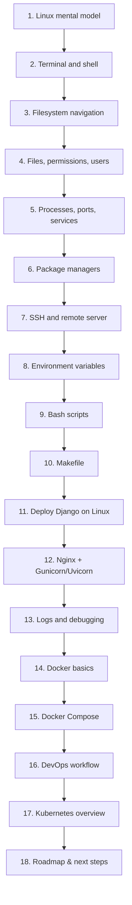

# Linux і основи DevOps для Python/Django-розробника

> Цей модуль — для студентів, які вже знають базовий Python і хочуть зрозуміти, як їхній код живе на реальному сервері. Ти навчишся орієнтуватися в Linux-терміналі, деплоїти Django-проєкти, розуміти Docker і читати основну DevOps-карту.

---

## Для кого цей урок

Цей урок для тебе, якщо:

- ти знаєш базовий Python і Django;
- ти вже писав прості веб-додатки, але все ще запускаєш їх лише локально;
- термінал Linux тебе лякає або здається загадковим;
- ти хочеш зрозуміти, як код потрапляє з ноутбука на реальний сервер;
- ти чув слова "Docker", "Nginx", "SSH", "CI/CD" і хочеш нарешті розібратися, що це таке.

---

## Що потрібно знати перед початком

| Що потрібно | Навіщо |
|---|---|
| Базовий Python (функції, класи, модулі) | Приклади будуть на Python |
| Що таке Django-проєкт | Файл `settings.py`, `manage.py`, додатки |
| Базове розуміння HTTP (запит/відповідь) | Для розуміння Nginx і деплою |
| Встановлений WSL або доступ до Ubuntu | Щоб практикувати команди |

---

## Таблиця всіх файлів

| № | Файл | Тема | Що студент зрозуміє |
|---|------|------|---------------------|
| 1 | [`01_linux_mental_model.md`](01_linux_mental_model.md) | Ментальна модель Linux | Навіщо Linux веброзробнику, що таке сервер |
| 2 | [`02_terminal_and_shell.md`](02_terminal_and_shell.md) | Термінал і shell | Як читати команди, stdin/stdout, exit codes |
| 3 | [`03_filesystem_navigation.md`](03_filesystem_navigation.md) | Файлова система | Структура директорій, навігація, базові операції |
| 4 | [`04_files_permissions_users.md`](04_files_permissions_users.md) | Права доступу і користувачі | chmod, chown, sudo, читання `ls -l` |
| 5 | [`05_processes_ports_services.md`](05_processes_ports_services.md) | Процеси, порти, сервіси | ps, systemd, ss, kill, foreground/background |
| 6 | [`06_package_managers_and_software.md`](06_package_managers_and_software.md) | Пакетні менеджери | apt vs pip, venv, встановлення ПЗ |
| 7 | [`07_ssh_and_remote_server.md`](07_ssh_and_remote_server.md) | SSH і підключення до сервера | Ключі, підключення, scp, rsync |
| 8 | [`08_environment_variables_and_secrets.md`](08_environment_variables_and_secrets.md) | Environment variables і секрети | .env, SECRET_KEY, що не можна комітити |
| 9 | [`09_bash_scripts.md`](09_bash_scripts.md) | Bash-скрипти | Автоматизація команд, shebang, змінні |
| 10 | [`10_makefile_basics.md`](10_makefile_basics.md) | Makefile | Скорочення команд, target/recipe |
| 11 | [`11_deploy_django_on_linux.md`](11_deploy_django_on_linux.md) | Деплой Django на Linux | Покроковий деплой від git clone до запуску |
| 12 | [`12_nginx_gunicorn_uvicorn.md`](12_nginx_gunicorn_uvicorn.md) | Nginx, Gunicorn, Uvicorn | Reverse proxy, WSGI vs ASGI |
| 13 | [`13_logs_monitoring_debugging.md`](13_logs_monitoring_debugging.md) | Логи і дебаггінг | journalctl, tail, checklist "сайт не відкривається" |
| 14 | [`14_docker_basics.md`](14_docker_basics.md) | Docker basics | Image, container, Dockerfile, port mapping |
| 15 | [`15_docker_compose.md`](15_docker_compose.md) | Docker Compose | Запуск Django + PostgreSQL одною командою |
| 16 | [`16_devops_workflow.md`](16_devops_workflow.md) | DevOps workflow | CI/CD, pipeline, staging, production |
| 17 | [`17_kubernetes_overview.md`](17_kubernetes_overview.md) | Kubernetes overview | Cluster, pod, deployment — огляд без заглиблення |
| 18 | [`18_roadmap_next_steps.md`](18_roadmap_next_steps.md) | Roadmap і наступні кроки | Куди рухатися далі після цього уроку |

---

## Mermaid-мапа уроку

---

## Як проходити урок

**Рекомендований порядок:** читай файли по номерах — від 01 до 18. Структура побудована від простого до складного. Кожен файл спирається на попередній.

**Як читати кожен файл:**

1. Прочитай розділ "Навіщо це потрібно".
2. Введи команди в терміналі — не просто читай, а роби.
3. Спеціально спробуй зробити помилку і подивися, що відбудеться.
4. Відповідай на питання для самоперевірки своїми словами.

**Мінімальний маршрут** (якщо часу мало):

1. `01_linux_mental_model.md`
2. `02_terminal_and_shell.md`
3. `03_filesystem_navigation.md`
4. `07_ssh_and_remote_server.md`
5. `11_deploy_django_on_linux.md`
6. `14_docker_basics.md`
7. `15_docker_compose.md`

**Повний маршрут:** всі 18 файлів, з практичними завданнями в кожному.

---

## Що студент зможе після проходження

Після цього модуля ти зможеш:

- підключитися до Linux-сервера через SSH;
- орієнтуватися у файловій системі і не боятися терміналу;
- запускати Django-проєкт на реальному сервері;
- читати логи і розуміти, що пішло не так;
- написати простий Bash-скрипт для автоматизації;
- написати Makefile з командами для проєкту;
- запустити Django + PostgreSQL через Docker Compose;
- пояснити, що таке Nginx і навіщо він між користувачем і Django;
- розуміти базову DevOps-карту (CI/CD, pipeline, staging, production);
- знати, навіщо існує Kubernetes і коли він потрібен.

---

> Головна ідея: Linux — це середовище, де живе більшість backend-додатків. Після цього уроку ти перестанеш його боятися і зрозумієш, як твій Python-код живе на реальному сервері.
